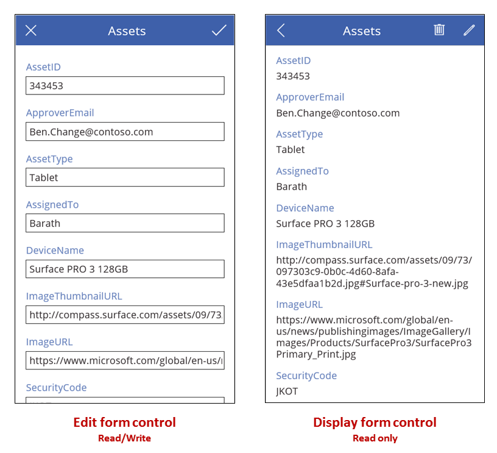

# <a name="edit-form-and-display-form-controls-in-powerapps"></a>PowerApps 中的编辑窗体和显示窗体控件
在数据源中显示、编辑和创建记录。

## <a name="description"></a>描述
如果添加“显示窗体”控件，则用户可以显示某个记录的所有字段，或者只显示你指定的字段。 如果添加“编辑窗体”控件，则用户可以编辑相应字段、创建记录，以及将所做的更改保存到数据源。



如果添加[库](control-gallery.md)控件，则可对其进行配置，以便显示数据源中的表，然后再配置窗体，以便显示用户在库中选择的具体记录。 也可添加一个或多个[按钮](control-button.md)控件，以便用户选择其来保存编辑内容、取消编辑内容以及创建记录。 将控件用在一起即可[创建完整的解决方案](../working-with-forms.md)。

### <a name="record-selection"></a>选择记录
不管哪一类型的窗体，均可将其“DataSource”属性设置为一个记录表，并可将窗体的“Item”属性设置为显示该表中的特定记录。 例如，可将窗体的“Item”属性设置为[库](control-gallery.md)控件的“SelectedItem”属性。 当用户选择库中的某个记录时，同样的记录就会显示在窗体中，只不过该窗体可以显示更多字段。 如果用户返回到库，然后选择另一记录，则库的“SelectedItem”属性会更改。 该更改会更新窗体的“Item”属性，然后窗体就会显示新选择的记录。

此外，你还可以使用下拉控件设置窗体的“Item”属性，如[显示、编辑或添加记录](../add-form.md)中所述，或者添加 Lookup 或 First 等函数。 例如，你可以将“Item”属性设置为这些公式中的任何一个，以在 Common Data Service for Apps 的“Accounts”实体中显示 Fabrikam 条目：

```First(Accounts)```

```Lookup(Accounts, "Fabrikam" in name)```

每个窗体控件包含一个或多个[卡片](control-card.md)控件。 设置卡片的 [DataField](control-card.md) 属性即可[指定该卡显示的字段以及其他详细信息](../add-form.md)。

### <a name="create-a-record"></a>创建记录
当“编辑窗体”控件处于“编辑”模式时，用户可以更新在窗体的“Item”属性中指定的记录。 “Mode”属性在被查看时会返回“编辑”。

但是，当“编辑窗体”控件处于“新建”模式时，将会忽略“Item”属性。 窗体不显示现有记录，而是显示数据源的默认值。每个字段中的值都是为窗体配置的默认值。 [NewForm](../functions/function-form.md) 函数可以让窗体切换到该模式。

例如，可以将按钮的 [Text](properties-core.md) 属性设置为显示“新建”，将其 [OnSelect](properties-core.md) 属性设置为一个公式，其中包括 [NewForm](../functions/function-form.md) 函数。 如果用户选择该按钮，则窗体会切换到“新建”模式，这样用户就可以创建以已知值开头的记录。

如果 [ResetForm](../functions/function-form.md) 函数或 [SubmitForm](../functions/function-form.md) 函数成功运行，窗体会切换回“编辑”模式。

* 可以将按钮的 [Text](properties-core.md) 属性设置为显示“取消”，将其 [OnSelect](properties-core.md) 属性设置为一个公式，其中包括 [ResetForm](../functions/function-form.md) 函数。 如果用户选择该按钮，则会丢弃任何正在进行的更改，窗体中的值再次显示为数据源的默认值。
* 可以将按钮的 [Text](properties-core.md) 属性设置为显示“保存更改”，将其 [OnSelect](properties-core.md) 属性设置为一个公式，其中包括 [SubmitForm](../functions/function-form.md) 函数。 如果用户选择该按钮并更新数据源，窗体中的值会重置为数据源的默认值。

### <a name="save-changes"></a>保存更改
如果按前一部分所述创建“保存更改”按钮，用户可以创建或更新一个记录，然后选择该按钮将所做的更改保存到数据源。 也可通过配置[图像](control-image.md)控件或某个其他的控件来执行相同的任务，只要使用 [SubmitForm](../functions/function-form.md) 函数配置该控件即可。 在任何情况下，“Error”、“ErrorKind”、“OnSuccess”和“OnFailure”属性都会提供对结果的反馈。

当 [SubmitForm](../functions/function-form.md) 函数运行时，会首先验证用户要提交的数据。 如果必填字段不包含某个值，或者另一个值不符合某个其他的约束条件，则会设置“ErrorKind”属性，同时会运行“OnFailure”公式。 可以将“保存更改”按钮或其他控件配置为仅当数据有效时（即仅当窗体的“Valid”属性为“true”时）才允许用户选择它。 请注意，若要重置“Error”和“ErrorKind”属性，用户不仅必须纠正问题，而且必须再次选择“保存更改”按钮（或者如此前所述，选择“取消”按钮丢弃所做的更改）。

如果数据通过验证，[SubmitForm](../functions/function-form.md) 会将其发送到数据源，这可能需要一段时间，具体取决于网络延迟情况。

* 如果提交成功，则会清除“Error”属性并将“ErrorKind”属性设置为“ErrorKind.None”，同时会运行“OnSuccess”公式。 如果用户创建了某个记录（即窗体以前为“新建”模式），则窗体会切换到“编辑”模式，以便用户能够编辑新创建的记录或其他记录。
* 如果提交失败，则“Error”属性会包含数据源提供的用户友好型错误消息，对问题进行说明。 “ErrorKind”属性会根据问题进行相应的设置，同时会运行“OnFailure”公式。

当两名人员尝试同时更新同一记录时，某些数据源可以检测到这种情况，并将“ErrorKind”设置为“ErrorKind.Conflict”，同时会采取补救措施，使用一个用户所做的更改刷新数据源，并重新应用该用户的更改。

> [!TIP]
> 如果在表单上提供“取消”按钮，以允许用户放弃正在进行的更改，请将 [ResetForm](../functions/function-form.md) 函数添加到按钮的 [OnSelect](properties-core.md) 属性，即使此属性也包含用于更改屏幕的 [Navigate](../functions/function-navigate.md) 函数，也不例外。 否则，该窗体将保留用户所做的更改。

### <a name="layout"></a>布局
默认情况下，数据卡被置于手机应用的一列和平板电脑应用的三列中。 可以在配置表单时指定表单列数以及数据卡是否应贴靠列。 这些设置不作为属性公开，因为它们仅用于设置数据卡的“X”、“Y”和“Width”属性。

有关详细信息，请参阅[了解数据表单布局](../working-with-form-layout.md)。

## <a name="key-properties"></a>关键属性
DataSource – 数据源，其中包含允许用户显示、编辑或创建的记录。

* 如果未设置此属性，则不允许用户显示、编辑或创建记录，也不提供任何其他的元数据或验证。

DefaultMode – 表单控件的初始模式。  有关可接受的值及其含义，请参阅下面的模式说明。 

DisplayMode – 用于表单控件内的数据卡和控件的模式。  

基于“Mode”属性进行衍生，不能独立设置：

| 模式 | DisplayMode | 描述 |
| --- | --- | --- |
| FormMode.Edit |DisplayMode.Edit |数据卡和控件是可编辑的，可以接受对记录的更改。 |
| FormMode.New |DisplayMode.Edit |数据卡和控件是可编辑的，可以接受对新记录的更改。 |
| FormMode.View |DisplayMode.View |数据卡和控件不可出于查看目的进行编辑和优化。 |

Error – 在 [SubmitForm](../functions/function-form.md) 函数失败时为此窗体显示的用户友好型错误消息。

* 此属性仅适用于“编辑窗体”控件。
* 此属性仅在 [SubmitForm](../functions/function-form.md)、EditForm 或 [ResetForm](../functions/function-form.md) 函数运行时更改。
* 如果未发生错误，则此属性为“空”，且“ErrorKind”会设置为“ErrorKind.None”。
* 可能情况下，返回的错误消息会采用用户的语言。 某些错误消息直接来自数据源，可能不采用用户的语言。

ErrorKind – 如果“SubmitForm”运行时发生错误，则此项为所发生错误的类型。

* 仅适用于“编辑窗体”控件。
* 此属性与 [Errors](../functions/function-errors.md) 函数具有相同的枚举。 “编辑窗体”控件可能返回以下值：

| ErrorKind | 描述 |
| --- | --- |
| ErrorKind.Conflict |另一用户更改了同一记录，导致更改冲突。 请执行 [Refresh](../functions/function-refresh.md) 函数以重新加载记录，并尝试再次进行更改。 |
| ErrorKind.None |错误为未知类型。 |
| ErrorKind.Sync |数据源报告了错误。 请查看“Error”属性以获取详细信息。 |
| ErrorKind.Validation |检测到一般性的验证问题。 |

Item – DataSource 中允许用户显示或编辑的记录。

LastSubmit – 上一次成功提交的记录，包括服务器生成的任何字段。

* 此属性仅适用于“编辑窗体”控件。
* 如果数据源自动生成或计算了任何字段，例如包含唯一数字的“ID”字段，则在“SubmitForm”成功运行以后，“LastSubmit”属性的值就会更改为此新值。
* 此属性的值在“OnSuccess”公式中提供。

Mode – 控件的模式为“编辑”或“新建”。

| 模式 | 描述 |
| --- | --- |
| FormMode.Edit |用户可以通过窗体编辑记录。 窗体卡片中的值是预先填充的现有记录，允许用户更改。 如果 [SubmitForm](../functions/function-form.md) 函数成功运行，则会修改现有记录。 |
| FormMode.New |用户可以通过窗体创建记录。 在窗体的控件中的值会预先填充的数据源的记录的默认值。 如果 [SubmitForm](../functions/function-form.md) 函数成功运行，则会创建记录。 |
| FormMode.View |用户可以通过窗体查看记录。 在窗体的控件中的值会预先填充的数据源的记录的默认值。 |

如果出现下述任何更改，则窗体会从“新建”模式切换为“编辑”模式：

* 已成功提交窗体并创建记录。 如果库已设置为自动将所选内容移到此新记录，则窗体会因为所创建的记录而变为“编辑”模式，以便用户能够进行更多的更改。
* [EditForm](../functions/function-form.md) 函数运行。
* [ResetForm](../functions/function-form.md) 函数运行。 例如，用户可能会选择“取消”按钮，该按钮已配置了此函数。

OnFailure – 在数据操作不成功的情况下，应用如何响应。

* 此属性仅适用于“编辑窗体”控件。

OnReset – 在“编辑窗体”控件重置的情况下，应用如何响应。

* 此属性仅适用于“编辑窗体”控件。

OnSuccess – 在数据操作成功的情况下，应用如何响应。

* 此属性仅适用于“编辑窗体”控件。

Unsaved – 如果“编辑窗体”控件包含尚未保存的用户更改，则此项为 True。

* 此属性仅适用于“编辑窗体”控件。
* 使用此属性警告用户会失去未保存的更改。  若要防止用户在保存对当前记录的更改之前选择[库](control-gallery.md)控件中的另一记录，请将库的 [Disabled](properties-core.md) 属性设置为“Form.Unsaved”，这同样可以禁用刷新操作。

Updates – 在窗体控件中加载的记录的值，用于写回到数据源。  

* 此属性仅适用于“编辑窗体”控件。
* 使用此属性从控件中的卡片提取字段值。  然后即可通过调用 [Patch](../functions/function-patch.md) 函数或通过某个连接所公开的其他方法，使用这些值来手动更新数据源。  如果使用的是 [SubmitForm](../functions/function-form.md) 函数，则不需使用此属性。
* 此属性返回值记录。  例如，如果窗体控件包含有关卡片控件**名称**并**Quantity**字段和的值**[更新](control-card.md)** 这些卡的属性会返回"小组件"和 10，则**更新**窗体控件的属性将返回 **{名称："小组件"，Quantity:10 }**.

Valid – [卡片](control-card.md)或“编辑窗体”控件是否包含可以提交到数据源的有效条目。

* 此属性仅适用于“编辑窗体”控件。
* “窗体”控件的“Valid”属性聚合该窗体中所有[卡片](control-card.md)控件的“Valid”属性。 仅当窗体中所有卡片的数据都有效时，该窗体的“Valid”属性才为“true”；其他情况下，该窗体的“Valid”属性为“false”。
* 若只允许按钮在窗体中的数据为有效数据且尚未提交的情况下保存所做的更改，请将按钮的 DisplayMode 属性设置为以下公式：
  
    **SubmitButton.DisplayMode = If(IsBlank( Form.Error ) || Form.Valid, DisplayMode.Edit, DisplayMode.Disabled)**

## <a name="additional-properties"></a>其他属性
**[BorderColor](properties-color-border.md)** – 控件边框的颜色。

**[BorderStyle](properties-color-border.md)** – 控件边框是“实线”、“虚线”、“点线”还是“无”。

**[BorderThickness](properties-color-border.md)** – 控件边框的粗细。

**[Fill](properties-color-border.md)** – 控件的背景色。

**[Height](properties-size-location.md)** – 控件上边缘和下边缘之间的距离。

**[Visible](properties-core.md)** – 控件显示还是隐藏。

**[Width](properties-size-location.md)** – 控件左边缘和右边缘之间的距离。

**[X](properties-size-location.md)** – 控件左边缘与其父容器（如果没有父容器，则为屏幕）左边缘之间的距离。

**[Y](properties-size-location.md)** – 控件上边缘与其父容器（如果没有父容器，则为屏幕）上边缘之间的距离。

## <a name="more-information"></a>详细信息
有关表单工作原理的完整概述，请参阅[了解数据表单](../working-with-forms.md)。

## <a name="accessibility-guidelines"></a>辅助功能准则
### <a name="screen-reader-support"></a>屏幕阅读器支持
* 请考虑使用 **[标签](control-text-box.md)** 将标题添加到窗体。
