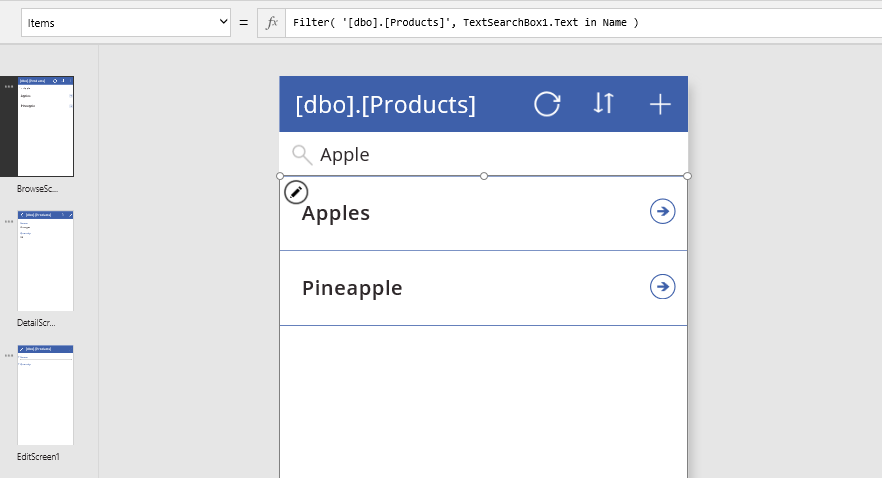

# <a name="understand-delegation-in-a-canvas-app"></a>了解画布应用中的委派
Power Apps 包含一组功能强大的功能，可用于在画布应用中筛选、排序和整理数据表： **[筛选](functions/function-filter-lookup.md)** 、 **[排序](functions/function-sort.md)** 和 **[AddColumns](functions/function-table-shaping.md)** 函数，只需对其进行命名即可。 可以使用这些函数，让用户重点访问其所需的信息。 对于具有数据库背景的用户来说，使用这些函数相当于编写数据库查询。

若要生成有效的应用，关键是尽量减少必须转到设备的数据量。 也许在成千上万条记录中，只需要少量记录；也许单个聚合值就可以代表数千条记录。 也许只有第一组记录可以检索，而其余记录是用户在需要更多记录的情况下通过笔势输入的。 进行重点访问可以大幅缩减应用所需的处理能力、内存和网络带宽，提高用户的响应速度，即使使用的是通过移动电话网络连接的手机。 

*委托*是指表现力的 Power Apps 公式满足需要，最大程度地减少通过网络移动的数据。 简而言之，电源应用会将数据处理委托给数据源，而不是将数据移动到应用进行本地处理。

这种情况变得很复杂，这篇文章的原因在于，不能将可在 Power Apps 公式中表示的所有内容委托给每个数据源。 Power Apps 语言模拟 Excel 的公式语言，它设计为对内存中完整工作簿的完整和即时访问，同时提供各种数字和文本操作函数。 因此，Power Apps 语言比大多数数据源可以支持的语言更丰富，包括功能强大的数据库引擎，如 SQL Server。

**处理大型数据集需要使用数据源和能够委派的公式。** 若要让应用始终运行良好，同时要确保用户能够访问所需的全部信息，这是唯一的方式。 请注意，标识不可能委派的位置的委派警告。 如果处理的是小型数据集（不到 500 条记录），则可使用任何数据源和公式，因为当不能委派公式时，应用可以在本地处理数据。 

> [!NOTE]
> 委托警告以前在 Power Apps 中标记为 "蓝色点" 建议，但委托建议已被重新分类为警告。 如果你的数据源中的数据超过500条记录并且无法委托某个函数，则 Power Apps 可能无法检索所有数据，并且你的应用程序可能会产生错误的结果。 委派警告可帮助管理应用，使其得到正确的结果。

## <a name="delegable-data-sources"></a>可委托的数据源
仅某些表格数据源支持委托。 如果数据源支持委托，其[连接器文档](https://docs.microsoft.com/connectors/)将概述该支持。 例如，这些表格数据源是最常用的，它们支持委托：

- [Common Data Service](https://docs.microsoft.com/connectors/commondataservice/) 
- [SharePoint](https://docs.microsoft.com/connectors/sharepointonline/) 
- [SQL Server](https://docs.microsoft.com/connectors/sql/) 

导入的 Excel 工作簿（使用 "**将静态数据添加到应用**数据源"）、集合和存储在上下文变量中的表不需要委托。 所有这些数据都已在内存中，可以应用完整的 Power Apps 语言。

## <a name="delegable-functions"></a>委派函数
下一步是仅使用那些可以委派的公式。 下面提供的是可以委派的公式元素。 但是，数据源各不相同，并非所有数据源都支持所有这些元素。 请在具体公式中查看委派警告。

这些列表会随时间而变化。 我们将努力为更多具有委派功能的函数和运算符提供支持。

### <a name="filter-functions"></a>Filter 函数
**[Filter](functions/function-filter-lookup.md)** 、 **[Search](functions/function-filter-lookup.md)** 和 **[LookUp](functions/function-filter-lookup.md)** 可以委派。  

在 Filter 和 LookUp 函数中，可以对表的列使用以下项来选择相应的记录：

* **[And](functions/function-logicals.md)** （包括 **[&&](functions/operators.md)** ）、 **[Or](functions/function-logicals.md)** （包括 **[||](functions/operators.md)** ）、 **[Not](functions/function-logicals.md)** （包括 **[!](functions/operators.md)** ）
* **[In](functions/operators.md)**
* **[=](functions/operators.md)** 、 **[<>](functions/operators.md)** 、 **[>=](functions/operators.md)** 、 **[<=](functions/operators.md)** 、 **[>](functions/operators.md)** 、 **[<](functions/operators.md)**
* **[+](functions/operators.md)** 、 **[-](functions/operators.md)**
* **[TrimEnds](functions/function-trim.md)**
* **[IsBlank](functions/function-isblank-isempty.md)**
* **[StartsWith](functions/function-startswith.md)** 、  **[EndsWith](functions/function-startswith.md)**
* 所有记录中均相同的常量值，如控件属性和[全局变量和上下文变量](working-with-variables.md)。

还可使用公式中对所有记录的求值结果都是一个常量值的某些部分。 例如， **Left （Language （），2）** ， **Date （2019，3，31）** ，并且**Today （）** 不依赖于记录的任何列，因此，为所有记录返回相同的值。 这些值可以作为常量发送到数据源，而不会阻止委托。 

以上列表不包括这些值得注意的项：

* **[If](functions/function-if.md)**
* **[*](functions/operators.md)** 、 **[/](functions/operators.md)** 、 **[Mod](functions/function-mod.md)**
* **[Concatenate](functions/function-concatenate.md)** （包括 **[&](functions/operators.md)** ）
* **[ExactIn](functions/operators.md)**
* 字符串操作函数： **[Lower](functions/function-lower-upper-proper.md)** 、 **[Upper](functions/function-lower-upper-proper.md)** 、 **[Left](functions/function-left-mid-right.md)** 、 **[Mid](functions/function-left-mid-right.md)** 、 **[Len](functions/function-left-mid-right.md)** ...
* 信号： **[Location](functions/signals.md)** 、 **[Acceleration](functions/signals.md)** 、 **[Compass](functions/signals.md)** ...
* Volatiles： **[Rand](functions/function-rand.md)** ，。
* [集合](working-with-variables.md)

### <a name="sorting-functions"></a>排序函数
**[Sort](functions/function-sort.md)** 和 **[SortByColumns](functions/function-sort.md)** 可以委派。

在 **Sort** 中，公式只能是单个列的名称，不能包括其他运算符或函数。

### <a name="aggregate-functions"></a>聚合函数
可以委派 [Sum](functions/function-aggregates.md)、[Average](functions/function-aggregates.md)、[Min](functions/function-aggregates.md) 和 [Max](functions/function-aggregates.md)。 目前仅有限数量的数据源支持此委派，请查看[委派列表](delegation-list.md)了解详细信息。

无法委派 [CountRows](functions/function-table-counts.md)、[CountA](functions/function-table-counts.md) 和 [Count](functions/function-table-counts.md) 等计数函数。

无法委派 [StdevP](functions/function-aggregates.md) 和 [VarP](functions/function-aggregates.md) 等其他聚合函数。

### <a name="table-shaping-functions"></a>表定形函数

**[AddColumns](functions/function-table-shaping.md)** 、 **[DropColumns](functions/function-table-shaping.md)** 、 **[RenameColumns](functions/function-table-shaping.md)** 和 **[ShowColumns](functions/function-table-shaping.md)** 部分支持委托。  可以委托参数中的公式。  但是，这些函数的输出受非委托记录限制的限制。

如本示例中所示，通常使用**AddColumns**和**LookUp**将一个表中的信息合并到另一个表（通常称为数据库行话中的联接）：

```powerapps-dot
AddColumns( Products, 
    "Supplier Name", 
    LookUp( Suppliers, Suppliers.ID = Product.SupplierID ).Name 
)
```

即使**产品**和**供应商**可能可委派数据源并且**查找**是可委派函数， **AddColumns**函数的输出也不会可委派。 整个公式的结果限制为 "**产品**" 数据源的第一个部分。 由于 LookUp 函数及其数据源可以委派，因此可能会在数据源的任何位置找到 Suppliers 的匹配项，即使该数据源很大。 

如果以这种方式使用**AddColumns** ，**则必须对** **产品**中的第一条记录进行单独的数据源调用，这会导致大量网络 chatter。 如果**供应商**足够小并且不经常更改，你可以在[**OnStart**](functions/signals.md)中调用**Collect**函数，以便在应用启动时在应用中缓存数据源。 作为替代方法，你可以重新构建你的应用程序，以便仅在用户请求时才请求相关记录。  
 
## <a name="non-delegable-functions"></a>非可委派函数
所有其他函数都不支持委派，包括以下重要函数：

* **[First](functions/function-first-last.md)** 、 **[FirstN](functions/function-first-last.md)** 、 **[Last](functions/function-first-last.md)** 、 **[LastN](functions/function-first-last.md)**
* **[Choices](functions/function-choices.md)**
* **[Concat](functions/function-concatenate.md)**
* **[Collect](functions/function-clear-collect-clearcollect.md)** 、 **[ClearCollect](functions/function-clear-collect-clearcollect.md)**
* **[CountIf](functions/function-table-counts.md)** 、 **[RemoveIf](functions/function-remove-removeif.md)** 、 **[UpdateIf](functions/function-update-updateif.md)**
* **[GroupBy](functions/function-groupby.md)** 、 **[Ungroup](functions/function-groupby.md)**

## <a name="non-delegable-limits"></a>不可委派限制
将在本地处理不可委派的公式。 这允许使用各种 Power Apps 公式语言。 但是也有代价：所有数据都必须先转到设备上，这可能需要通过网络检索大量的数据。 这可能需要一段时间，让人以为应用很慢或者可能已崩溃。

为避免出现这种情况，Power Apps 会对可在本地处理的数据量施加限制：默认情况下为500记录。  我们选择此数字是为了让你仍然能够对小型数据集进行完整的访问，同时让你虽然只能看到部分结果，也能练习对大型数据集的使用。

显然，使用此工具时必须小心，因为这可能会让用户感到困惑。 例如，假设有一个 Filter 函数，其选择公式不能委派，需要对有一百万条记录的数据源应用该函数。 由于本地进行筛选，因此仅扫描了前 500 条记录。 如果所需记录是第 501 或第 500,001 个记录，则 Filter 不会考虑或返回该记录。

聚合函数还可能会造成混淆。 对上述包含百万记录的数据源的一个列运行 Average 函数。 由于 Average 尚无法进行委派，因此只会对前 500 个记录进行平均。 如果不小心，可能会将应用用户基于部分数据得出的答案误认为是基于完整数据得出的答案。

## <a name="changing-the-limit"></a>更改限制
500 是默认的记录数，但可为整个应用更改此数字：

1. 在“文件”选项卡上，选择“应用设置”。
2. 在 "**高级设置**" 下，将 "**非可委派查询的数据行限制**" 设置从1更改为2000。

在某些情况下，你会发现 2,000（或者 1,000 或 1,500）即可满足方案的需求。 可以谨慎增大此数字以适应你的方案。 增大此数字，应用的性能可能会降低，特别是对于具有大量列的宽表。 尽管如此，仍是委派越多越好。

要确保应用可以扩展为大型数据集，请将此设置降低为 1。 现在，任何无法委派的内容将会返回一条记录，在测试应用时应该很容易被检测到。 这有助于在尝试将概念证明应用用于生产时防止意外发生。

## <a name="delegation-warnings"></a>委派警告
为了更轻松地了解哪些是和不被委派，当你创建一个包含无法委派的内容的公式时，电源应用会提供警告（黄色三角形）。

委派警告仅显示在针对可委派数据源进行运算的公式上。 如果没有看到警告，但你认为公式未进行适当的委派，请对照本主题前面部分的[可委派数据源](delegation-overview.md#delegable-data-sources)列表检查数据源的类型。

## <a name="examples"></a>示例
对于此示例，将基于名为 **[dbo].[Fruit]** 的 SQL Server 表自动生成一个三屏应用。 有关如何生成应用程序的信息，您可以在与 Common Data Service SQL Server 相关的[主题](data-platform-create-app.md)中应用类似的原则。


图库的 Items 属性设置为包含 SortByColumns 和 Search 函数的公式，这两个函数都可以委派。

在搜索框中，键入“Apple”。

当应用与 SQL Server 进行通信来处理搜索请求时，一串移动的点会短暂出现在屏幕顶部附近。 将显示符合搜索条件的所有记录，即使数据源包含数百万条记录。



搜索结果包括“Apples”、“Crab apples”和“Pineapple”，因为 Search 函数会查找文本列中的所有位置。 如果只想查找在水果名称的开头包含搜索词的记录，可以使用另一个可委派函数 Filter，并添加更复杂的搜索词。 （为简单起见，请删除 SortByColumns 调用。）


新的结果包括“Apples”，而不包括“Crab apples”或“Pineapple”。  但是，一个黄色的三角形将出现在图库旁边（如果左侧导航栏显示了缩略图，它还会出现在屏幕缩略图中），并且公式的一部分下方出现蓝色波浪线。 其中每个元素都表示一条警告。 如果将光标悬停在图库旁边的黄色三角形上，将显示此消息：


SQL Server 是可委派数据源，Filter 是可委派函数，但不能将 Mid 并 Len 委派到任何数据源。

但它确起作用了，不是吗？ 嗯，在某种程度上可以这么说。 因此显示了这个警告，而不是红色波浪线。

- 如果表包含 500 条以下的记录，该公式运算将会非常顺利。 所有记录都会转到设备，并在本地应用 Filter。
- 如果表包含超过 500 条记录，该公式不会返回第 501 条或以后的记录，即使它与条件匹配。
