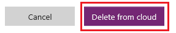

# 从 PowerApps 中删除应用
本文演示如何从 PowerApps 帐户及任何与应用共享的人的帐户中删除应用。

## 从帐户中删除应用
1. 打开 [powerapps.com](https://web.powerapps.com)，然后在左侧导航栏中单击或点击“应用”。
   
    
2. （可选）在左上角附近，筛选应用列表以仅显示拥有的应用或参与的应用。
   
    
   
    > [!NOTE]
> 如果看不到要删除的应用，请确保所处环境正确无误。
3. 在右边缘附近，单击或点击要删除的应用的信息图标。
   
    
4. 在右上角附近，单击或点击回收站图标，以删除应用。
   
    
   
    > [!NOTE]
> 必须拥有对应用的参与者权限，才能删除应用。
5. 在显示的对话框中，单击或点击“从云删除”。  
   
    > [!IMPORTANT]
> 这样操作不仅会从你的帐户中永久删除此应用，还会从与其共享此应用的所有用户帐户中删除它。
   
    

## 更多资源
[共享应用](share-app.md)  
[更改应用名称和磁贴](set-name-tile.md)  
[将应用还原到之前的版本](restore-an-app.md)  

