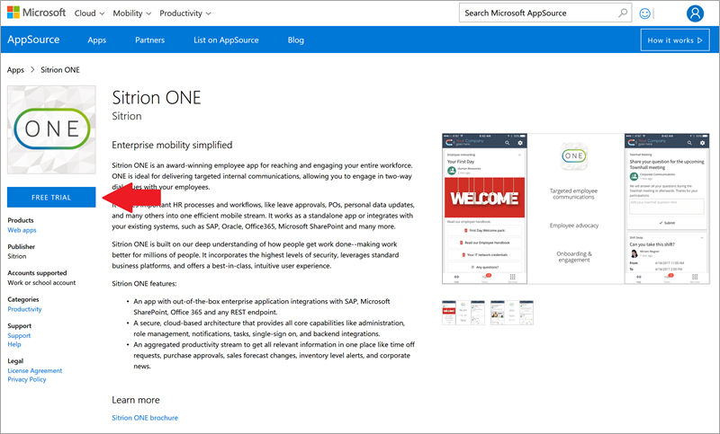

# <a name="let-customers-test-drive-your-apps-on-appsource"></a>让客户在 AppSource 上体验你的应用
是否热衷于在 PowerApps 中生成应用？ 是否有应用要与客户共享？ [AppSource.com](https://appsource.microsoft.com) 现在支持 PowerApps 体验版解决方案，以便你可以与客户共享应用，为你的企业带来新的潜在客户。

## <a name="what-is-a-test-drive-solution"></a>什么是体验版解决方案？
借助体验版解决方案，客户无需注册 PowerApps 计划或安装任何应用，即可试用实际应用。 客户只需使用 Azure Active Directory (AAD) 帐户登录 AppSource.com，即可在 Web 浏览器中运行应用。 如果没有体验版解决方案，客户就只能阅读应用相关信息或观看应用介绍视频。 借助体验版解决方案，客户可以更好地了解你的解决方案以及你的应用有哪些功能。 同时，还能获得应用的实际使用体验。 客户无法了解应用的内在工作原理，因此你的知识产权是受到保护的。 我们会收集并共享启动体验版应用的用户的潜在客户信息，从而帮助你拓展业务。

下面的示例展示了 AppSource.com 上的[应用列表](https://go.microsoft.com/fwlink/?linkid=848867)：



选择上面应用列表中的“免费试用”链接，用户可以直接在浏览器中启动相关的 PowerApps 体验版应用：


## <a name="how-do-i-build-a-test-drive-solution"></a>如何生成体验版解决方案？
生成用于体验版解决方案的应用与在 PowerApps 中生成其他任何应用类似，不同之处在于使用的是嵌入数据，而不是外部数据连接。 使用嵌入数据，可以减少将应用部署给客户时遇到的障碍，这样客户就能十分顺畅地试用应用。最终分发给客户的完整解决方案通常包括数据连接，而嵌入数据则非常适用于体验版解决方案。

PowerApps 为生成包含嵌入数据的应用提供本机支持，因此只需提供应用要使用的示例数据即可。 应在 Excel 文件中以一个或多个表的形式捕获此类数据。 然后，在 PowerApps 中，将 Excel 表中的数据拉取到应用中，并在应用中直接使用此类数据，而不用借助外部连接。 下面的三步流程展示了如何拉取数据并在应用中使用此类数据。

### <a name="step-1-import-data-into-the-app"></a>第 1 步：将数据导入应用
假定你有一个 Excel 文件，其中包含“SiteInspector”和“SitePhotos”这两个表。


使用“将静态数据添加到应用”选项，将这两个表导入 PowerApps。


此时，这两个表已成为应用中的数据源。


### <a name="step-2-handling-read-only-and-read-write-scenarios"></a>第 2 步：处理只读和读写情境
由于导入的是*静态*数据，因此数据为只读。 如果应用是只读的（即只向用户显示数据），请直接在应用中引用这两个表。 例如，如果要访问“SiteInspector”中“Title”字段，请在公式中使用“SiteInspector.Title”。

如果应用可读写，请先将每个表中的数据拉取到*集合*（即 PowerApps 中的表格数据结构）中。 然后，使用集合，而不是表。 若要将“SiteInspector”和“SitePhotos”表中的数据拉取到“SiteInspectorCollect”和“SitePhotosCollect”集合中，请编写以下公式：

```
ClearCollect(SiteInspectorCollect,SiteInspector); ClearCollect(SitePhotosCollect,SitePhotos)
```

此公式会清除这两个集合，然后将各个表中的数据收集到相应的集合中：

* 在应用中的某处调用此公式，从而加载数据。
* 依次转到“文件” > “集合”，即可查看应用中的所有集合。
* 有关详细信息，请参阅[创建和更新应用中的集合](../canvas-apps/create-update-collection.md)。

现在，如果要访问“Title”字段，请在公式中使用“SiteInspectorCollect.Title”。

### <a name="step-3-add-update-and-delete-data-in-your-app"></a>第 3 步：在应用中添加、更新和删除数据
至此，你已了解如何直接和通过集合读取数据；现在，我们将介绍如何在集合中添加、更新和删除数据：

**若要在集合中添加行**，请使用 [Collect( DataSource, Item, ... )](../canvas-apps/functions/function-clear-collect-clearcollect.md)：

```
Collect(SiteInspectorCollect,{ID:Value(Max(SiteInspectorCollect, ID)+1),
    Title:TitleText.Text,SubTitle:SubTitleText.Text,Description:DescriptionText.Text)
```

**若要更新集合中的行**，请使用 [UpdateIf( DataSource, Condition1, ChangeRecord1 [, Condition2, ChangeRecord2, ...] )](../canvas-apps/functions/function-update-updateif.md)：

```
UpdateIf(SiteInspectorCollect,ID=record.ID,
    {Title:TitleEditText.Text,SubTitle:SubTitleEditText.Text,Description:DescriptionEditText.Text)
```

**若要从集合中删除行**，请使用 [RemoveIf( DataSource, Condition [, ...] )](../canvas-apps/functions/function-remove-removeif.md)：

```
RemoveIf(SiteInspectorCollect,ID=record.ID)
```

> [!NOTE]
> 只有在应用运行时，集合才会保留数据；如果应用关闭，所有更改都会遭放弃。

总之，可以创建包含嵌入数据的应用版本，从而模拟连接外部数据的应用体验。 嵌入数据后，可以在 AppSource.com 上将此应用发布为体验版解决方案。

## <a name="how-do-i-list-my-test-drive-solution-on-appsourcecom"></a>如何在 AppSource.com 上列出我的体验版解决方案？
至此，你的应用已准备就绪，是时候将其发布到 AppSource.com 中了。在此流程中，请先在 PowerApps.com 上填写[申请表单](https://powerapps.microsoft.com/partners/get-listed/)。

申请后，你会收到一封电子邮件，其中介绍了如何提交要在 AppSource.com 上发布的应用。还可以单击[此处](https://go.microsoft.com/fwlink/?linkid=851031)，下载收录完整端到端流程的新手入门文档。

