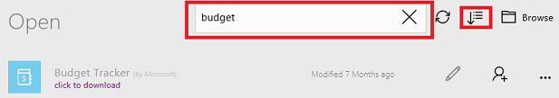

# 在 PowerApps 中编辑应用
编辑自己生成、拥有或拥有“可编辑”权限的任何应用。 可以在适用于 Web 的 PowerApps Studio 或适用于 Windows 的 PowerApps Studio 中编辑应用。 如果尝试编辑的应用已在别处打开以供编辑，将会看到一条消息，指明是你自己还是其他用户打开的。

## 验证权限
1. 登录 [PowerApps](https://web.powerapps.com)，再单击或点击左侧边缘“文件”菜单中的“应用”。
   
    
2. 打开应用类别选择器，再单击或点击“我拥有的应用”或“我参与的应用”。
   
    
   
    可以编辑随即显示的列表中的任何应用。 还可以在右上角附近的搜索框中键入一个或多个字符来搜索应用。
   
    > [!NOTE]
> 如果仍未看到要编辑的应用，请验证是否已在右上角附近选择正确的环境。
   
    

## 在适用于 Web 的 PowerApps Studio 中编辑应用
1. 按照上述过程中的步骤操作，找到要编辑的应用。
2. 单击或点击右侧边缘附近的应用信息图标。
   
    
3. 依次单击或点击右上角附近的“编辑”图标和“在 Web 上编辑”。
   
    

## 在适用于 Windows 的 PowerApps Studio 中编辑应用
1. 打开适用于 Windows 的 PowerApps Studio。
2. 在默认显示的页上，找到要编辑的应用。
   
    若要更轻松地找到应用，请单击或点击右上角附近的搜索图标，再键入应用名称中的一个或多个字符。 还可以按名称、最近修改日期或最近打开日期对列表进行排序。 如果仍未看到要编辑的应用，请确认是否位于正确的 PowerApps 环境中，如第一个过程所述。
   
    
3. 在右侧边缘附近，单击或点击要编辑的应用的铅笔图标。
   
    可以编辑铅笔图标为黑色（而非灰色）的任何应用。
   
    

## 针对应用展开协作
虽然对应用拥有“可编辑”权限的任何用户都可以进行编辑，但一次只能有一个人编辑应用。 如果尝试编辑其他人已在编辑的应用，则会看到以下消息。 只有当其他人关闭应用（或此人的会话超时），你才能继续编辑。

此外，如果已打开应用以供编辑，然后又尝试在另一台设备或其他浏览器窗口中打开应用，则会看到以下消息。 虽然可以替代上一会话，但可能会丢失尚未保存的所有更改。

## 后续步骤
详细了解如何添加[屏幕](add-screen-context-variables.md)、[控件](add-configure-controls.md)或[数据连接](add-data-connection.md)。

