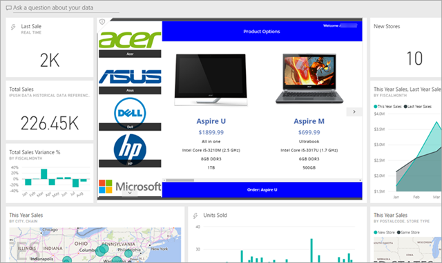
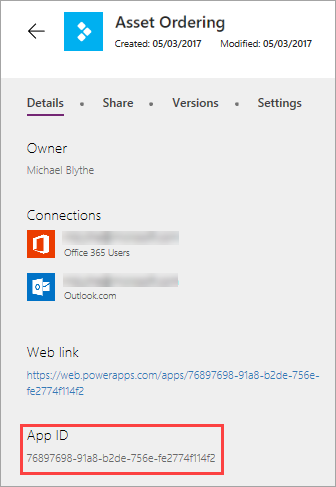

# <a name="integrate-canvas-apps-into-websites-and-other-services"></a>将画布应用集成到网站和其他服务中
如果你构建的应用程序可供用户进行工作，则这些应用程序通常最有用。 通过将画布应用嵌入 iframe，你可以将这些应用集成到网站和其他服务中，如 Power BI 或 SharePoint。

本主题先会介绍如何设置应用嵌入参数；然后，我们将会把资产订购应用嵌入网站。



请记住以下限制：

- 只有同一租户中的 PowerApps 用户，才能访问嵌入应用。
- 若要使用 Internet Explorer 11 访问 PowerApps，必须禁用兼容性视图。

你还可以将画布应用集成到 SharePoint Online 中，而无需使用 iframe。 详细信息：[使用 PowerApps web 部件](https://support.office.com/article/use-the-powerapps-web-part-6285f05e-e441-408a-99d7-aa688195cd1c)。

## <a name="set-uri-parameters-for-your-app"></a>设置应用 URI 参数
若有要嵌入的应用，第一步是设置统一资源标识符 (URI) 参数，以便 iframe 知道在何处查找应用。 URI 的格式如下：

```
https://apps.powerapps.com/play/[AppID]?source=iframe
```

> [!IMPORTANT]
> 截至2019年8月，URI 格式已从 https://web.powerapps.com/webplayer 更改为。 https://apps.powerapps.com/play 请更新任何嵌入的 iframe 以使用新的 URI 格式。 对以前格式的引用将重定向到新 URI 以确保兼容性。
>
> 先前格式：
> 
> https\://web.powerapps.com/webplayer/iframeapp？ source = iframe & appId =/providers/Microsoft.PowerApps/apps/[appId]

只需将 URI 中的 [AppID] 替换成应用 ID（包括 '[' & ']'）。 稍后，我们将介绍如何获取此值，而现在将先介绍 URI 中的所有参数：

* **[appID]** -它提供要运行的应用程序的 ID。
* **tenantid** -是支持来宾访问的可选参数，它确定要从哪个租户打开应用。 
* **screenColor** - 用于为用户提供更好的应用加载体验。 此参数的格式为 [RGBA (red value, green value, blue value, alpha)](../canvas-apps/functions/function-colors.md)，用于控制应用加载时的屏幕颜色。 最好将此参数设置为与应用图标的颜色相同。
* **source** - 虽然不影响应用，但建议添加描述性名称来指代嵌入来源。
* 最后，可以使用 [Param() 函数](../canvas-apps/functions/function-param.md)添加所需的任何自定义参数，并且这些值可供应用使用。 这些参数添加到 URI 的末尾，如 `[AppID]&amp;param1=value1`。 这些参数在应用程序启动过程中是只读的。 如果需要更改它们，则必须重新启动该应用。 请注意，只有 [appid] 后的第一项应具有 "？";此后，使用 "&"，如此处所示。 

### <a name="get-the-app-id"></a>获取应用 ID
可以在 powerapps.com 上获取应用 ID。 对于要嵌入的应用，请执行以下操作：

1. 在 [powerapps.com](https://powerapps.microsoft.com) 中，依次单击或点击“应用”选项卡上的省略号（“...” ）和“详细信息”。
   
    
1. 复制“应用 ID”。
   
    
1. 替换 URI 中的 `[AppID]` 值。 对于资产订购应用，URI 如下所示：
   
    ```
    https://apps.powerapps.com/play/76897698-91a8-b2de-756e-fe2774f114f2?source=iframe
    ```

## <a name="embed-your-app-in-a-website"></a>将应用嵌入网站
嵌入应用现在与向网站的 HTML 代码添加 iframe（或支持 iframe 的任何其他服务，如 Power BI 或 SharePoint）一样简单：

```html
<iframe width="[W]" height="[H]" src="https://apps.powerapps.com/play/[AppID]?source=website&screenColor=rgba(165,34,55,1)" allow="geolocation; microphone; camera"/>
```

指定 iframe 宽度和高度值，然后将 `[AppID]` 替换成应用 ID。

> [!NOTE]
> 在 iframe HTML 代码中包含 `allow="geolocation; microphone; camera"`，以允许应用在 Google Chrome 上使用这些功能。

下图展示了嵌入 Contoso 示例网站的资产订购应用。


对应用用户进行身份验证时，请注意以下几点：

- 如果网站使用 Azure Active Directory (AAD) 身份验证，用户无需额外登录。
- 如果网站使用其他任何登录机制或网站未经身份验证，用户将会在 iframe 上看到登录提示。 登录后，用户便可以运行应用，但前提是应用的作者已与其共享应用。

如你所见，嵌入应用不仅操作简单，而且还能提供非常强大的功能。 通过嵌入应用，可以将应用直接集成到你和客户工作时使用的工具（网站、Power BI 仪表板、SharePoint 页面等）。
