# 使用实体窗体控件
可以使用“实体窗体”控件以更快的速度创建应用，以添加 Common Data Service 实体的丰富窗体。

有关“实体窗体”控件的简介，请参阅此博客文章：[New entity form control (experimental feature) for Common Data Service](https://powerapps.microsoft.com/blog/new-entity-form-control-experimental-feature-for-common-data-service/)（Common Data Service 的新实体窗体控件（实验性功能））。

> [!IMPORTANT]
> 请注意“实体表单”控件是实验性控件（如博客文章所述），并在生产应用中谨慎使用“实体表单”控件（至少目前如此）。

## 关键属性
下面是“实体窗体”控件的关键属性。

**DataSource** – 指定包含想要显示的记录的数据源。   
> [!NOTE]
> 目前仅支持将 Common Data Service 中的实体用作“实体表单”控件的数据源。  

**Pattern** – 指定想要在“实体窗体”控件中显示的窗体样式。 可使用 **FormPattern** 枚举设置此属性。

* **FormPattern.List** – 显示记录的表格列表。
* **FormPattern.CardList** – 显示记录的卡片列表。
* **FormPattern.Details** – 显示一个窗体用于查看或编辑单条记录的详细信息。
* **FormPattern.None** – 未显式指定任何样式。 对于平板电脑应用，默认为 **List**；对于手机应用，默认为 **CardList**。

**Item** – 指定数据源中应该由“实体窗体”控件显示的记录。 仅当 **Pattern** 设置为 **FormPattern.Details** 时，才可使用此属性。

**Selected** – 获取当前选择的记录。  
示例：如果“实体窗体”控件显示销售订单记录的列表，**Selected** 属性将提供当前选择的记录。 还可以访问记录中的字段。 （例如，将所选记录的 **Account** 字段值指定为 **Selected.Account**。）

**SelectableFields** – 指定哪些字段应显示为链接。 使用以下语法设置此属性的值：  
**{Field1Name : true, Field2Name : true}**  
示例：如果希望 **SalesOrderId** 和 **Account** 字段在窗体中显示为链接，请将该窗体的 **SelectableFields** 属性设置为以下值：  
**{SalesOrderId : true, Account : true}**

**SelectedField** – 确定已单击或点击哪些字段。 此属性仅适用于指定为 **SelectableFields** 的字段。  
示例：如果将 **SelectableFields** 属性设置为 **{SalesOrderId : true, Account : true}**，而用户单击或点击了 **Account** 字段，则 **SelectedField.Account** 将设置为 true。

**OnFieldSelect** – 用户单击或点击字段时应用如何响应。 此属性仅适用于指定为 **SelectableFields** 的字段。

**Mode** – 确定窗体的模式。 若要更改模式，请使用 **ViewForm**、**EditForm** 或 **NewForm** 函数。 仅当 **Pattern** 属性设置为 **FormPattern.Details** 时，这些函数才能正常工作。 将 **Mode** 属性的值设置为 **FormMode** 枚举的值。

* **FormMode.View** – 允许用户查看但不允许编辑或添加记录。
* **FormMode.Edit** – 允许用户编辑记录。
* **FormMode.New** – 允许用户添加记录。

OnSuccess – 在数据操作成功的情况下，应用如何响应。

**OnFailure** – 在数据操作不成功的情况下，应用如何响应。

**Unsaved** – 确定用户正在编辑的记录是否存在未保存的更改。

## 相关函数
可以配合“实体窗体”控件或[编辑窗体控件](functions/function-form.md)使用以下共享函数。 仅当 **Pattern** 属性设置为 **FormPattern.Details** 时，才可配合“实体窗体”控件使用这些函数。

**ViewForm** – 将“实体窗体”控件的 **Mode** 属性设置为 **FormMode.View**。

**EditForm** – 将“实体窗体”控件的 **Mode** 属性设置为 **FormMode.Edit**。

**NewForm** – 将“实体窗体”控件的 **Mode** 属性设置为 **FormMode.New**。

**SubmitForm** – 保存用户在“实体窗体”控件中编辑记录时所做的更改。

**ResetForm** – 丢弃用户在“实体窗体”控件中编辑记录时未保存的更改。

了解各个属性和函数的概述后，接下来我们了解它们的工作方式。

> [!NOTE]
> 如果无权访问 Common Data Service 数据库，请先创建一个，再开始执行以下步骤。

## 显示记录列表
下面的五个过程提供一个端到端示例来演示如何使用“实体窗体”控件。 在此过程中，添加一个用于显示销售订单列表的窗体。  

1. 创建一个空白的平板电脑应用。
   
    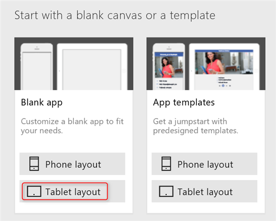
2. 将第一个屏幕重命名为 **SalesOrderListScreen**。
   
    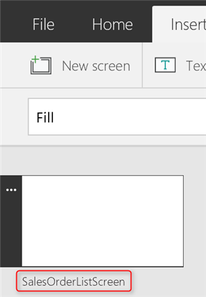
3. 在“插入”选项卡上，单击或点击“窗体”，然后单击或点击“实体窗体(实验性)”。  
   
    “实体窗体”控件随即添加到屏幕中。  
   
    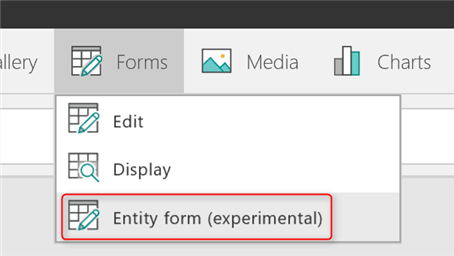
4. 将“实体窗体”控件重命名为 **SalesOrderListForm**，然后调整其大小以覆盖整个屏幕。
5. 在右窗格中，单击或点击文本“未选择任何数据源”旁边的数据库图标，然后单击或点击“添加数据源”。  
   
    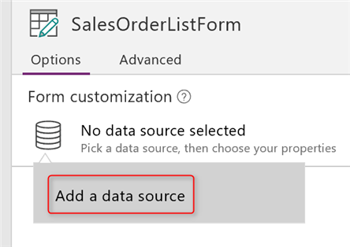
6. 在连接列表中，单击或点击数据库的连接。  
   
    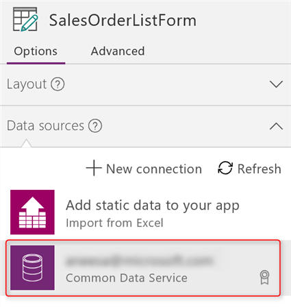
7. 在实体列表中，单击或点击“销售订单”，然后单击或点击“连接”。  
   
    随即将会创建“销售订单”实体的数据源，**SalesOrderListForm** 的 **DataSource** 属性设置为该数据源。
   
      
   
    “实体窗体”控件显示销售订单的列表。 使用“实体窗体”控件可以快速显示一个列表窗体，而无需手动构建该窗体。
   
    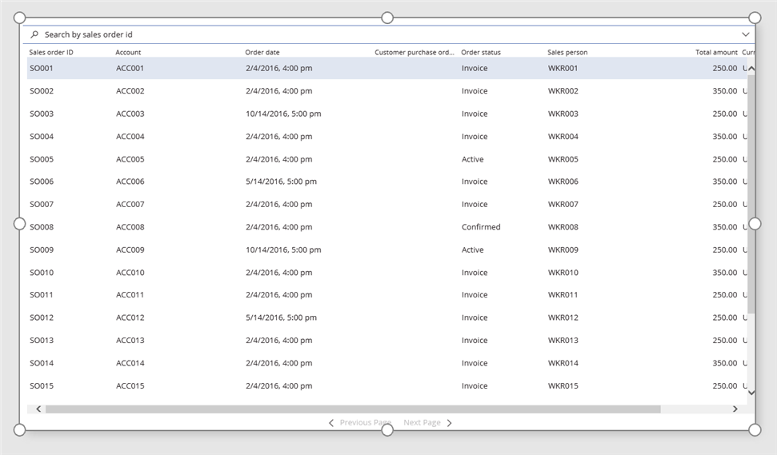  
   
    由于未设置“实体窗体”控件的 **Pattern** 属性，因此使用了默认的 **List** 模式。 此外，已使用“销售订单”实体的 **DefaultList** 字段组来显示列表窗体。 该窗体也是动态的，将自动在字段组中反映所有更改。

## 显示记录详细信息
我们添加另一个“实体窗体”控件来显示在前面创建的列表中选择的销售订单的详细信息。  

1. 调整 **SalesOrderListForm** 的大小以覆盖半个屏幕，然后添加另一个“实体窗体”控件来覆盖另外半个屏幕。  
    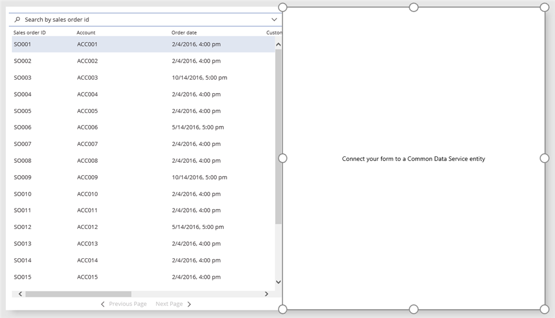
2. 将第二个“实体窗体”控件重命名为 **SalesOrderDetailsForm**，并将其连接到前面创建的“销售订单”数据源。  
    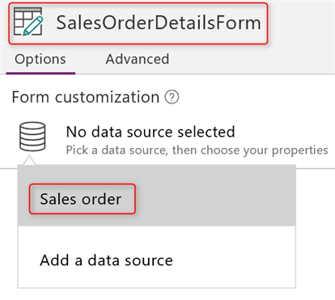
3. 将 **SalesOrderDetailsForm** 的 **Pattern** 属性设置为 **FormPattern.Details**。  
   
    **SalesOrderDetailsForm** 使用“销售订单”实体的 **DefaultDetails** 字段组来显示窗体。 与使用 **SalesOrderListForm** 时一样，可以快速显示记录详细信息，而无需手动构建窗体。  
   
    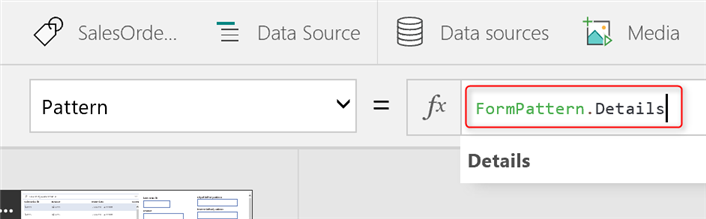
4. 将 **SalesOrderDetailsForm** 的 **Item** 属性设置为 **SalesOrderListForm.Selected**。
   
    **SalesOrderDetailsForm** 将显示用户在 **SalesOrderListForm** 中单击或点击的记录的详细信息。
   
    
5. 按 F5 预览应用，然后在左侧列表中单击或点击某个销售订单。  
   
    所选订单的详细信息将显示在右侧。  
   
      

## 配置一个字段用于导航到另一个屏幕
接下来，让我们在应用中添加更多屏幕，然后在“实体窗体”控件中配置字段，以便在用户单击或点击某个字段时，导航到应用中的另一个屏幕。  

1. 将另一个屏幕添加到应用，并将其重命名为 **SalesOrderDetailsScreen**。
2. 剪切 **SalesOrderDetailsForm** 并将其粘贴到 **SalesOrderDetailsScreen**，调整该窗体的大小，使其覆盖大部分屏幕，同时为顶部的图标留出足够的空间。
3. 在 **SalesOrderDetailsScreen** 的左上角附近添加一个后退箭头图标。
4. 将后退箭头图标的 **OnSelect** 属性设置为 [**Back**](functions/function-navigate.md) 函数。  
   
    
5. 在 **SalesOrderListScreen** 上，调整 **SalesOrderListForm** 的大小以覆盖整个屏幕。
6. 单击或点击“SalesOrderListForm”将其选中。
7. 在右窗格中的“字段”下，将 **SalesOrderId** 设置为导航到 **SalesOrderDetailsScreen**。  
   
    
   
    “实体窗体”控件将以链接形式显示 **SalesOrderId** 字段（列表中的第一列）中的值。
   
    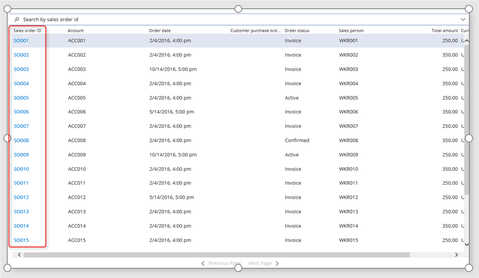  
8. 按 F5 预览应用，然后单击或点击销售订单列表中的某个链接。
   
      
   
    此时将打开第二个屏幕，其中显示指定的销售订单的详细信息。
   
    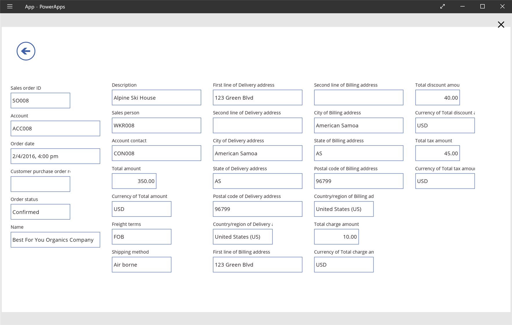  
   
    若要显示不同销售订单的详细信息，请单击或点击后退箭头导航回到列表，然后单击或点击想要显示其详细信息的订单的链接。

## 使用上下文变量导航
**SalesOrderDetailsForm** 的 **Item** 属性设置为 **SalesOrderListForm.Selected**，因此，**SalesOrderDetailsForm** 可显示用户在 **SalesOrderListForm** 中选择的记录的相关详细信息。 也可以使用 **NavigationContext** 上下文变量（使用窗体自定义窗格配置用于导航的字段时自动创建）来获取所选记录的上下文。  

1. 将 **SalesOrderDetailsForm** 的 **Item** 属性设置为 **NavigationContext**。
   
    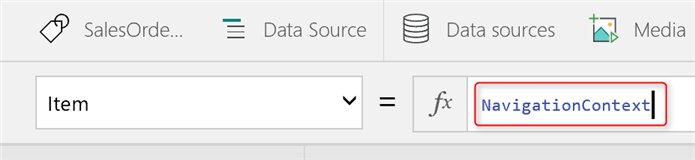
2. 按 F5 预览应用，然后单击或点击销售订单列表中的某个链接。
   
    应用将打开 **SalesOrderDetailsScreen** 并显示指定的销售订单的详细信息。

接下来，我们深入了解窗体自定义窗格如何设置导航与上下文。  

**SalesOrderListForm** 的 **SelectableFields** 属性将 **SalesOrderId** 指定为可选择的字段。

  

当我们使用窗体自定义窗格使 **SalesOrderId** 字段导航到 **SalesOrderDetailsScreen** 时，已自动进行这种设置。 因此，**SalesOrderId** 字段中的值显示为链接。

**SalesOrderListForm** 的 **OnFieldSelect** 属性设置为 [**If**](functions/function-if.md) 函数，该函数确定用户是否单击或点击了“销售订单 ID”字段：**SalesOrderListForm.SelectedField.SalesOrderId = true**。  

如果该函数求值为 true，则 **SalesOrderDetailsScreen** 将会打开并包含前面使用的名为 **NavigationContext** 的上下文变量。  

当我们使用窗体自定义窗格使 **SalesOrderId** 字段导航到 **SalesOrderDetailsScreen** 时，也已自动进行所有这种设置。  

因此，当用户单击或点击销售订单 ID 字段时，[**If**](functions/function-if.md) 函数将求值为 true，同时会结合相应的上下文调用 [**Navigate**](functions/function-navigate.md) 函数，从而打开详细信息屏幕。  

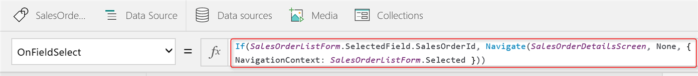  

> [!NOTE]
> 使用表单自定义窗格时，系统将会智能确定 NavigationContext。 当用户单击或点击 **SalesOrderId** 时，**NavigationContext** 将设置为 **SalesOrderListForm.Selected**，如前面的公式所示。 如果为导航指定 **Account** 字段，**NavigationContext** 将设置为 **SalesOrderListForm.Selected.Account**，确保传递正确的上下文。 但是，若要使用该上下文，需要一个与 Common Data Service 中的 **Account** 实体连接的“实体窗体”控件。

## 编辑和保存记录
最后，我们了解如何在“实体窗体”控件中编辑和保存记录。  

1. 在 **SalesOrderDetailsScreen** 上添加一个编辑图标，然后将其 **OnSelect** 属性设置为以下公式：  
   **EditForm(SalesOrderDetailsForm)**
   
    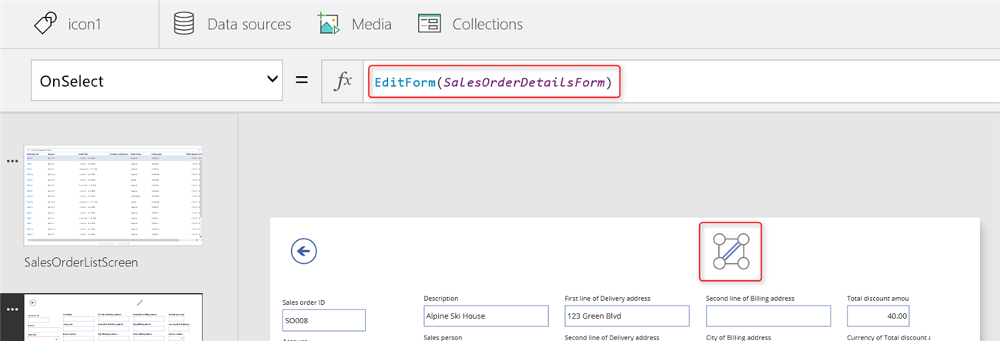
2. 在编辑图标的旁边添加一个复选标记图标，然后将复选标记图标的 **OnSelect** 属性设置为以下公式：  
   **SubmitForm(SalesOrderDetailsForm)**  
   
    
3. 按 F5 预览应用，单击或点击“销售订单 ID”链接查看销售订单的详细信息，然后单击或点击编辑图标。  
   
    “实体窗体”控件的 **Mode** 设置为**FormMode.Edit**，因此你可以编辑记录。
4. 将“订单状态”更新为“发票”。  
   
    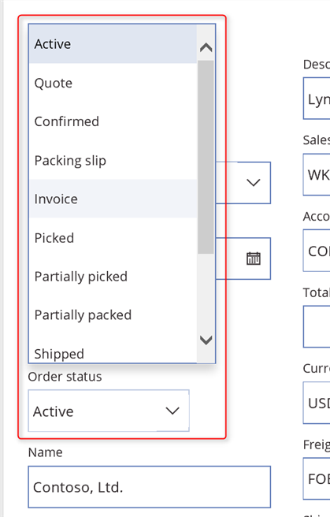
5. 将“销售员”更新为“WRK014”。
   
    为了帮助你选择“销售员”、“实体窗体”控件会自动呈现丰富的详细查找语句。 为了生成和显示此查找语句，该控件使用了 Common Data Service 中 **Worker** 实体的 **DefaultLookup** 字段组。 之所以使用 **Worker**，是因为“销售员”字段的类型为 **Worker**。
   
    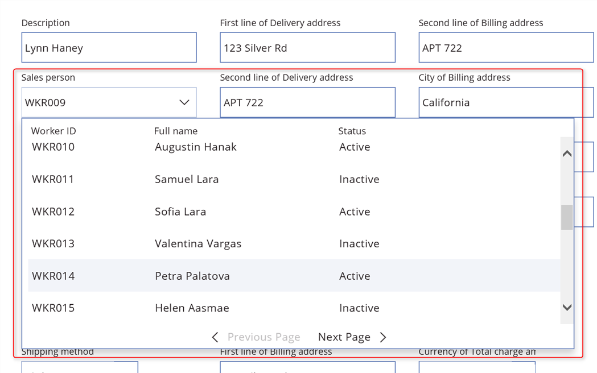
6. 单击或点击复选标记图标即可保存所做的更改。

这是本文介绍的有关如何在应用中使用“实体窗体”控件的最后一个步骤。 我们希望本文中的信息能够为你带来帮助，然后可以开始使用“实体窗体”控件。 我们期待你为“实体窗体”控件提供看法，并将持续努力，帮助你在应用中快速添加功能丰富的窗体。

