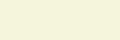
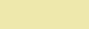
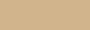
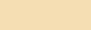

# PowerApps 中的 Color 枚举与 ColorFade、ColorValue 以及 RGBA 函数

使用内置颜色值，定义自定义颜色，并使用 alpha 通道。

## 描述

通过使用**颜色**枚举，你可以轻松地访问由 HTML 的级联样式表（CSS）定义的颜色。 例如， **red**返回纯红色。 可以在本主题末尾找到这些颜色的列表。

**ColorValue**函数基于 CSS 中的颜色字符串返回颜色。 该字符串可以采用以下任何形式：

- **CSS 颜色名称：** **"RoxyBrown"** 和 **"OliveDrab"** 。 这些名称不包括空格。 本主题稍后会显示支持的颜色的列表。
- **6 位十六进制值：** 例如， **"#ffd700"** 与 **"黄金"** 相同。 此字符串的格式为 "#*rrggbb*"，其中*rr*是两个十六进制数字中的红色部分， *gg*为绿色， *bb*为蓝色。
- **8 位十六进制值：** 例如， **"#ff7f5080"** 与具有 50% alpha 通道的 **"珊瑚"** 相同。 此字符串的格式为 "#*rrggbbaa*"，其中*rr*、 *gg*和*bb*与6位数字的格式相同。 Alpha 通道由*aa*： **00**表示完全透明，而**ff**表示完全不透明。

**RGBA**函数基于红色、绿色和蓝色分量返回颜色。 函数还包括一个 alpha 通道，用于混合彼此层叠的控件的颜色。 Alpha 通道的变化方式为0或0% （完全透明且不可见）到1或100% （这是完全不透明的，完全阻止控件后的任何层）。

**ColorFade** 函数返回更亮或更深的颜色版本。 淡化量的变化幅度为-1 （这会将颜色完全变暗为黑色）到0（这不会影响颜色）到1（这会将颜色完全变亮为白色）。

## Alpha 通道

在画布应用中，可以将控件彼此置于顶层，并为其后面的任何控件指定控件的透明度。 因此，颜色将与层混合。 例如，以下关系图显示了三种主要颜色如何混合为50%：

> [!div class="mx-imgBorder"]
> 

您还可以将图像混合为支持 alpha 通道的文件格式。 例如，你无法混合 jpeg 文件，但你可以混合 .png 文件。 下图显示了上一示例中相同的红色、绿色和蓝色颜色，但红色显示为 50% alpha 通道的 .png 文件中的波形曲线（而不是圆圈）：

> [!div class="mx-imgBorder"]
> 在蓝色和绿色圆圈的前面加上50% 的 alpha 设置 

如果指定了**颜色**枚举值，或者使用颜色名称或6位十六进制值生成**ColorValue**公式，则 alpha 设置为100%，这是完全不透明的。

## 语法

**Color**.*ColorName*

- *ColorName* - 必需。  级联样式表 (CSS) 颜色名称。 可能的枚举值列表显示在本主题的结尾。

**ColorValue**(*CSSColor*)

- *CSSColor* - 必需。  级联样式表 (CSS) 颜色定义。 可以指定名称（如**OliveDrab**）或十六进制值，例如 **#6b8e23**或 **#7fffd420**。 十六进制值可以采用 #*rrggbb*或 #*rrggbbaa*的形式。

**RGBA**(*Red*, *Green*, *Blue*, *Alpha*)

- *Red*、*Green*、*Blue* - 必需。  颜色分量值，范围从0（无饱和度）到255（完全饱和度）。
- *Alpha* - 必需。  Alpha 分量，范围为0（完全透明）到1（完全不透明）。 还可以使用百分比（0% 到 100%）。

**ColorFade**(*Color*, *FadeAmount*)

- *Color* - 必需。  颜色值（如 **Color.Red**），或者 **ColorValue** 或 **RGBA** 的输出。
- *FadeAmount* - 必需。  介于 -1 和 1 之间的数字。 -1 将颜色完全变暗为黑色，0不会影响颜色，1会将颜色完全变亮为白色。 还可以使用-100% 到100% 之间的百分比。

## 内置颜色

| Color 枚举 | ColorValue | RGBA | 颜色样本 |
| --- | --- | --- | --- |
| **Color.AliceBlue** |**ColorValue （"#f0f8ff" &nbsp;）** **ColorValue （"aliceblue" &nbsp;）** |**RGBA （&nbsp;240、&nbsp;248、&nbsp;255 &nbsp;1 &nbsp;）** | |
| **Color.AntiqueWhite** |**ColorValue （"#faebd7" &nbsp;）** **ColorValue （"AntiqueWhite" &nbsp;）** |**RGBA （&nbsp;250、&nbsp;235、&nbsp;215 &nbsp;1 &nbsp;）** | |
| **Color.Aqua** |**ColorValue （"#00ffff" &nbsp;）** **ColorValue （"水绿色" &nbsp;）** |**RGBA （&nbsp;0、&nbsp;255、&nbsp;255 &nbsp;1 &nbsp;）** | |
| **Color.Aquamarine** |**ColorValue （"#7fffd4" &nbsp;）** **ColorValue （"碧绿色" &nbsp;）** |**RGBA （&nbsp;127、&nbsp;255、&nbsp;212 &nbsp;1 &nbsp;）** | |
| **Color.Azure** |**ColorValue （"#f0ffff" &nbsp;）** **ColorValue （"azure" &nbsp;）** |**RGBA （&nbsp;240、&nbsp;255、&nbsp;255 &nbsp;1 &nbsp;）** | |
| **Color.Beige** |**ColorValue （"#f5f5dc" &nbsp;）** **ColorValue （"米色" &nbsp;）** |**RGBA （&nbsp;245、&nbsp;245、&nbsp;220 &nbsp;1 &nbsp;）** | |
| **Color.Bisque** |**ColorValue （"#ffe4c4" &nbsp;）** **ColorValue （"BISQUE" &nbsp;）** |**RGBA （&nbsp;255、&nbsp;228、&nbsp;196 &nbsp;1 &nbsp;）** | |
| **Color.Black** |**ColorValue （"#000000" &nbsp;）** **ColorValue （"黑色" &nbsp;）** |**RGBA （&nbsp;0、&nbsp;0、&nbsp;0 &nbsp;1 &nbsp;）** | |
| **Color.BlanchedAlmond** |**ColorValue （"#ffebcd" &nbsp;）** **ColorValue （"blanchedalmond" &nbsp;）** |**RGBA （&nbsp;255、&nbsp;235、&nbsp;205 &nbsp;1 &nbsp;）** | |
| **Color.Blue** |**ColorValue （"#0000ff" &nbsp;）** **ColorValue （"Blue" &nbsp;）** |**RGBA （&nbsp;0、&nbsp;0、&nbsp;255 &nbsp;1 &nbsp;）** | |
| **Color.BlueViolet** |**ColorValue （"#8a2be2" &nbsp;）** **ColorValue （"BLUEVIOLET" &nbsp;）** |**RGBA （&nbsp;138、&nbsp;43、&nbsp;226 &nbsp;1 &nbsp;）** | |
| **Color.Brown** |**ColorValue （"#a52a2a" &nbsp;）** **ColorValue （"棕色" &nbsp;）** |**RGBA （&nbsp;165、&nbsp;42、&nbsp;42 &nbsp;1 &nbsp;）** | |
| **Color.Burlywood** |**ColorValue （"#deb887" &nbsp;）** **ColorValue （"color.burlywood" &nbsp;）** |**RGBA （&nbsp;222、&nbsp;184、&nbsp;135 &nbsp;1 &nbsp;）** | |
| **Color.CadetBlue** |**ColorValue （"#5f9ea0" &nbsp;）** **ColorValue （"CadetBlue" &nbsp;）** |**RGBA （&nbsp;95、&nbsp;158、&nbsp;160 &nbsp;1 &nbsp;）** | |
| **Color.Chartreuse** |**ColorValue （"#7fff00" &nbsp;）** **ColorValue （"CHARTREUSE" &nbsp;）** |**RGBA （&nbsp;127、&nbsp;255、&nbsp;0 &nbsp;1 &nbsp;）** | |
| **Color.Chocolate** |**ColorValue （"#d2691e" &nbsp;）** **ColorValue （"巧克力" &nbsp;）** |**RGBA （&nbsp;210、&nbsp;105、&nbsp;30 &nbsp;1 &nbsp;）** | |
| **Color.Coral** |**ColorValue （"#ff7f50" &nbsp;）** **ColorValue （"珊瑚" &nbsp;）** |**RGBA （&nbsp;255、&nbsp;127、&nbsp;80 &nbsp;1 &nbsp;）** | |
| **Color.CornflowerBlue** |**ColorValue （"#6495ed" &nbsp;）** **ColorValue （"CornflowerBlue" &nbsp;）** |**RGBA （&nbsp;100、&nbsp;149、&nbsp;237 &nbsp;1 &nbsp;）** | |
| **Color.Cornsilk** |**ColorValue （"#fff8dc" &nbsp;）** **ColorValue （"CORNSILK" &nbsp;）** |**RGBA （&nbsp;255、&nbsp;248、&nbsp;220 &nbsp;1 &nbsp;）** | |
| **Color.Crimson** |**ColorValue （"#dc143c" &nbsp;）** **ColorValue （"Crimson" &nbsp;）** |**RGBA （&nbsp;220、&nbsp;20、&nbsp;60 &nbsp;1 &nbsp;）** | |
| **Color.Cyan** |**ColorValue （"#00ffff" &nbsp;）** **ColorValue （"青色" &nbsp;）** |**RGBA （&nbsp;0、&nbsp;255、&nbsp;255 &nbsp;1 &nbsp;）** | |
| **Color.DarkBlue** |**ColorValue （"#00008b" &nbsp;）** **ColorValue （"DarkBlue" &nbsp;）** |**RGBA （&nbsp;0、&nbsp;0、&nbsp;139 &nbsp;1 &nbsp;）** | |
| **Color.DarkCyan** |**ColorValue （"#008b8b" &nbsp;）** **ColorValue （"DARKCYAN" &nbsp;）** |**RGBA （&nbsp;0、&nbsp;139、&nbsp;139 &nbsp;1 &nbsp;）** | |
| **Color.DarkGoldenRod** |**ColorValue （"#b8860b" &nbsp;）** **ColorValue （"DarkGoldenRod" &nbsp;）** |**RGBA （&nbsp;184、&nbsp;134、&nbsp;11 &nbsp;1 &nbsp;）** | |
| **Color.DarkGray** |**ColorValue （"#a9a9a9" &nbsp;）** **ColorValue （"深灰" &nbsp;）** |**RGBA （&nbsp;169、&nbsp;169、&nbsp;169 &nbsp;1 &nbsp;）** | |
| **Color.DarkGreen** |**ColorValue （"#006400" &nbsp;）** **ColorValue （"DarkGreen" &nbsp;）** |**RGBA （&nbsp;0、&nbsp;100、&nbsp;0 &nbsp;1 &nbsp;）** | |
| **Color.DarkGrey** |**ColorValue （"#a9a9a9" &nbsp;）** **ColorValue （"DARKGREY" &nbsp;）** |**RGBA （&nbsp;169、&nbsp;169、&nbsp;169 &nbsp;1 &nbsp;）** | |
| **Color.DarkKhaki** |**ColorValue （"#bdb76b" &nbsp;）** **ColorValue （"DarkKhaki" &nbsp;）** |**RGBA （&nbsp;189、&nbsp;183、&nbsp;107 &nbsp;1 &nbsp;）** | |
| **Color.DarkMagenta** |**ColorValue （"#8b008b" &nbsp;）** **ColorValue （"darkmagenta" &nbsp;）** |**RGBA （&nbsp;139、&nbsp;0、&nbsp;139 &nbsp;1 &nbsp;）** | |
| **Color.DarkOliveGreen** |**ColorValue （"#556b2f" &nbsp;）** **ColorValue （"DarkOliveGreen" &nbsp;）** |**RGBA （&nbsp;85、&nbsp;107、&nbsp;47 &nbsp;1 &nbsp;）** | |
| **Color.DarkOrange** |**ColorValue （"#ff8c00" &nbsp;）** **ColorValue （"DARKORANGE" &nbsp;）** |**RGBA （&nbsp;255、&nbsp;140、&nbsp;0 &nbsp;1 &nbsp;）** | |
| **Color.DarkOrchid** |**ColorValue （"#9932cc" &nbsp;）** **ColorValue （"DarkOrchid" &nbsp;）** |**RGBA （&nbsp;153、&nbsp;50、&nbsp;204 &nbsp;1 &nbsp;）** | |
| **Color.DarkRed** |**ColorValue （"#8b0000" &nbsp;）** **ColorValue （"darkred" &nbsp;）** |**RGBA （&nbsp;139、&nbsp;0、&nbsp;0 &nbsp;1 &nbsp;）** | |
| **Color.DarkSalmon** |**ColorValue （"#e9967a" &nbsp;）** **ColorValue （"DarkSalmon" &nbsp;）** |**RGBA （&nbsp;233、&nbsp;150、&nbsp;122 &nbsp;1 &nbsp;）** | |
| **Color.DarkSeaGreen** |**ColorValue （"#8fbc8f" &nbsp;）** **ColorValue （"DARKSEAGREEN" &nbsp;）** |**RGBA （&nbsp;143、&nbsp;188、&nbsp;143 &nbsp;1 &nbsp;）** | |
| **Color.DarkSlateBlue** |**ColorValue （"#483d8b" &nbsp;）** **ColorValue （"DarkSlateBlue" &nbsp;）** |**RGBA （&nbsp;72、&nbsp;61、&nbsp;139 &nbsp;1 &nbsp;）** | |
| **Color.DarkSlateGray** |**ColorValue （"#2f4f4f" &nbsp;）** **ColorValue （"darkslategray" &nbsp;）** |**RGBA （&nbsp;47、&nbsp;79、&nbsp;79 &nbsp;1 &nbsp;）** | |
| **Color.DarkSlateGrey** |**ColorValue （"#2f4f4f" &nbsp;）** **ColorValue （"DarkSlateGrey" &nbsp;）** |**RGBA （&nbsp;47、&nbsp;79、&nbsp;79 &nbsp;1 &nbsp;）** | |
| **Color.DarkTurquoise** |**ColorValue （"#00ced1" &nbsp;）** **ColorValue （"DARKTURQUOISE" &nbsp;）** |**RGBA （&nbsp;0、&nbsp;206、&nbsp;209 &nbsp;1 &nbsp;）** | |
| **Color.DarkViolet** |**ColorValue （"#9400d3" &nbsp;）** **ColorValue （"DarkViolet" &nbsp;）** |**RGBA （&nbsp;148、&nbsp;0、&nbsp;211 &nbsp;1 &nbsp;）** | |
| **Color.DeepPink** |**ColorValue （"#ff1493" &nbsp;）** **ColorValue （"deeppink" &nbsp;）** |**RGBA （&nbsp;255、&nbsp;20、&nbsp;147 &nbsp;1 &nbsp;）** | |
| **Color.DeepSkyBlue** |**ColorValue （"#00bfff" &nbsp;）** **ColorValue （"DeepSkyBlue" &nbsp;）** |**RGBA （&nbsp;0、&nbsp;191、&nbsp;255 &nbsp;1 &nbsp;）** | |
| **Color.DimGray** |**ColorValue （"#696969" &nbsp;）** **ColorValue （"DIMGRAY" &nbsp;）** |**RGBA （&nbsp;105、&nbsp;105、&nbsp;105 &nbsp;1 &nbsp;）** | |
| **Color.DimGrey** |**ColorValue （"#696969" &nbsp;）** **ColorValue （"DimGrey" &nbsp;）** |**RGBA （&nbsp;105、&nbsp;105、&nbsp;105 &nbsp;1 &nbsp;）** | |
| **Color.DodgerBlue** |**ColorValue （"#1e90ff" &nbsp;）** **ColorValue （"dodgerblue" &nbsp;）** |**RGBA （&nbsp;30、&nbsp;144、&nbsp;255 &nbsp;1 &nbsp;）** | |
| **Color.FireBrick** |**ColorValue （"#b22222" &nbsp;）** **ColorValue （"FireBrick" &nbsp;）** |**RGBA （&nbsp;178、&nbsp;34、&nbsp;34 &nbsp;1 &nbsp;）** | |
| **Color.FloralWhite** |**ColorValue （"#fffaf0" &nbsp;）** **ColorValue （"FLORALWHITE" &nbsp;）** |**RGBA （&nbsp;255、&nbsp;250、&nbsp;240 &nbsp;1 &nbsp;）** | |
| **Color.ForestGreen** |**ColorValue （"#228b22" &nbsp;）** **ColorValue （"ForestGreen" &nbsp;）** |**RGBA （&nbsp;34、&nbsp;139、&nbsp;34 &nbsp;1 &nbsp;）** | |
| **Color.Fuchsia** |**ColorValue （"#ff00ff" &nbsp;）** **ColorValue （"fuchsia" &nbsp;）** |**RGBA （&nbsp;255、&nbsp;0、&nbsp;255 &nbsp;1 &nbsp;）** | |
| **Color.Gainsboro** |**ColorValue （"#dcdcdc" &nbsp;）** **ColorValue （"Gainsboro" &nbsp;）** |**RGBA （&nbsp;220、&nbsp;220、&nbsp;220 &nbsp;1 &nbsp;）** | |
| **Color.GhostWhite** |**ColorValue （"#f8f8ff" &nbsp;）** **ColorValue （"GHOSTWHITE" &nbsp;）** |**RGBA （&nbsp;248、&nbsp;248、&nbsp;255 &nbsp;1 &nbsp;）** | |
| **Color.Gold** |**ColorValue （"#ffd700" &nbsp;）** **ColorValue （"黄金" &nbsp;）** |**RGBA （&nbsp;255、&nbsp;215、&nbsp;0 &nbsp;1 &nbsp;）** | |
| **Color.GoldenRod** |**ColorValue （"#daa520" &nbsp;）** **ColorValue （"金黄色" &nbsp;）** |**RGBA （&nbsp;218、&nbsp;165、&nbsp;32 &nbsp;1 &nbsp;）** | |
| **Color.Gray** |**ColorValue （"#808080" &nbsp;）** **ColorValue （"灰色" &nbsp;）** |**RGBA （&nbsp;128、&nbsp;128、&nbsp;128 &nbsp;1 &nbsp;）** | |
| **Color.Green** |**ColorValue （"#008000" &nbsp;）** **ColorValue （"绿色" &nbsp;）** |**RGBA （&nbsp;0、&nbsp;128、&nbsp;0 &nbsp;1 &nbsp;）** | |
| **Color.GreenYellow** |**ColorValue （"#adff2f" &nbsp;）** **ColorValue （"GreenYellow" &nbsp;）** |**RGBA （&nbsp;173、&nbsp;255、&nbsp;47 &nbsp;1 &nbsp;）** | |
| **Color.Grey** |**ColorValue （"#808080" &nbsp;）** **ColorValue （"灰色" &nbsp;）** |**RGBA （&nbsp;128、&nbsp;128、&nbsp;128 &nbsp;1 &nbsp;）** | |
| **Color.Honeydew** |**ColorValue （"#f0fff0" &nbsp;）** **ColorValue （"甜瓜" &nbsp;）** |**RGBA （&nbsp;240、&nbsp;255、&nbsp;240 &nbsp;1 &nbsp;）** | |
| **Color.HotPink** |**ColorValue （"#ff69b4" &nbsp;）** **ColorValue （"HOTPINK" &nbsp;）** |**RGBA （&nbsp;255、&nbsp;105、&nbsp;180 &nbsp;1 &nbsp;）** | |
| **Color.IndianRed** |**ColorValue （"#cd5c5c" &nbsp;）** **ColorValue （"IndianRed" &nbsp;）** |**RGBA （&nbsp;205、&nbsp;92、&nbsp;92 &nbsp;1 &nbsp;）** | |
| **Color.Indigo** |**ColorValue （"#4b0082" &nbsp;）** **ColorValue （"靛蓝色" &nbsp;）** |**RGBA （&nbsp;75、&nbsp;0、&nbsp;130 &nbsp;1 &nbsp;）** | |
| **Color.Ivory** |**ColorValue （"#fffff0" &nbsp;）** **ColorValue （"象牙塔" &nbsp;）** |**RGBA （&nbsp;255、&nbsp;255、&nbsp;240 &nbsp;1 &nbsp;）** | |
| **Color.Khaki** |**ColorValue （"#f0e68c" &nbsp;）** **ColorValue （"深褐色" &nbsp;）** |**RGBA （&nbsp;240、&nbsp;230、&nbsp;140 &nbsp;1 &nbsp;）** | |
| **Color.Lavender** |**ColorValue （"#e6e6fa" &nbsp;）** **ColorValue （"紫色" &nbsp;）** |**RGBA （&nbsp;230、&nbsp;230、&nbsp;250 &nbsp;1 &nbsp;）** | |
| **Color.LavenderBlush** |**ColorValue （"#fff0f5" &nbsp;）** **ColorValue （"lavenderblush" &nbsp;）** |**RGBA （&nbsp;255、&nbsp;240、&nbsp;245 &nbsp;1 &nbsp;）** | |
| **Color.LawnGreen** |**ColorValue （"#7cfc00" &nbsp;）** **ColorValue （"LawnGreen" &nbsp;）** |**RGBA （&nbsp;124、&nbsp;252、&nbsp;0 &nbsp;1 &nbsp;）** | |
| **Color.LemonChiffon** |**ColorValue （"#fffacd" &nbsp;）** **ColorValue （"LEMONCHIFFON" &nbsp;）** |**RGBA （&nbsp;255、&nbsp;250、&nbsp;205 &nbsp;1 &nbsp;）** | |
| **Color.LightBlue** |**ColorValue （"#add8e6" &nbsp;）** **ColorValue （"LightBlue" &nbsp;）** |**RGBA （&nbsp;173、&nbsp;216、&nbsp;230 &nbsp;1 &nbsp;）** | |
| **Color.LightCoral** |**ColorValue （"#f08080" &nbsp;）** **ColorValue （"lightcoral" &nbsp;）** |**RGBA （&nbsp;240、&nbsp;128、&nbsp;128 &nbsp;1 &nbsp;）** | |
| **Color.LightCyan** |**ColorValue （"#e0ffff" &nbsp;）** **ColorValue （"LightCyan" &nbsp;）** |**RGBA （&nbsp;224、&nbsp;255、&nbsp;255 &nbsp;1 &nbsp;）** | |
| **Color.LightGoldenRodYellow** |**ColorValue （"#fafad2" &nbsp;）** **ColorValue （"lightgoldenrodyellow" &nbsp;）** |**RGBA （&nbsp;250、&nbsp;250、&nbsp;210 &nbsp;1 &nbsp;）** | |
| **Color.LightGray** |**ColorValue （"#d3d3d3" &nbsp;）** **ColorValue （"LightGray" &nbsp;）** |**RGBA （&nbsp;211、&nbsp;211、&nbsp;211 &nbsp;1 &nbsp;）** | |
| **Color.LightGreen** |**ColorValue （"#90ee90" &nbsp;）** **ColorValue （"lightgreen" &nbsp;）** |**RGBA （&nbsp;144、&nbsp;238、&nbsp;144 &nbsp;1 &nbsp;）** | |
| **Color.LightGrey** |**ColorValue （"#d3d3d3" &nbsp;）** **ColorValue （"LightGrey" &nbsp;）** |**RGBA （&nbsp;211、&nbsp;211、&nbsp;211 &nbsp;1 &nbsp;）** | |
| **Color.LightPink** |**ColorValue （"#ffb6c1" &nbsp;）** **ColorValue （"LIGHTPINK" &nbsp;）** |**RGBA （&nbsp;255、&nbsp;182、&nbsp;193 &nbsp;1 &nbsp;）** | |
| **Color.LightSalmon** |**ColorValue （"#ffa07a" &nbsp;）** **ColorValue （"LightSalmon" &nbsp;）** |**RGBA （&nbsp;255、&nbsp;160、&nbsp;122 &nbsp;1 &nbsp;）** | |
| **Color.LightSeaGreen** |**ColorValue （"#20b2aa" &nbsp;）** **ColorValue （"color.lightseagreen" &nbsp;）** |**RGBA （&nbsp;32、&nbsp;178、&nbsp;170 &nbsp;1 &nbsp;）** | |
| **Color.LightSkyBlue** |**ColorValue （"#87cefa" &nbsp;）** **ColorValue （"LightSkyBlue" &nbsp;）** |**RGBA （&nbsp;135、&nbsp;206、&nbsp;250 &nbsp;1 &nbsp;）** | |
| **Color.LightSlateGray** |**ColorValue （"#778899" &nbsp;）** **ColorValue （"LIGHTSLATEGRAY" &nbsp;）** |**RGBA （&nbsp;119、&nbsp;136、&nbsp;153 &nbsp;1 &nbsp;）** | |
| **Color.LightSlateGrey** |**ColorValue （"#778899" &nbsp;）** **ColorValue （"LightSlateGrey" &nbsp;）** |**RGBA （&nbsp;119、&nbsp;136、&nbsp;153 &nbsp;1 &nbsp;）** | |
| **Color.LightSteelBlue** |**ColorValue （"#b0c4de" &nbsp;）** **ColorValue （"lightsteelblue" &nbsp;）** |**RGBA （&nbsp;176、&nbsp;196、&nbsp;222 &nbsp;1 &nbsp;）** | |
| **Color.LightYellow** |**ColorValue （"#ffffe0" &nbsp;）** **ColorValue （"LightYellow" &nbsp;）** |**RGBA （&nbsp;255、&nbsp;255、&nbsp;224 &nbsp;1 &nbsp;）** | |
| **Color.Lime** |**ColorValue （"#00ff00" &nbsp;）** **ColorValue （"酸橙色" &nbsp;）** |**RGBA （&nbsp;0、&nbsp;255、&nbsp;0 &nbsp;1 &nbsp;）** | |
| **Color.LimeGreen** |**ColorValue （"#32cd32" &nbsp;）** **ColorValue （"LimeGreen" &nbsp;）** |**RGBA （&nbsp;50、&nbsp;205、&nbsp;50 &nbsp;1 &nbsp;）** | |
| **Color.Linen** |**ColorValue （"#faf0e6" &nbsp;）** **ColorValue （"linen" &nbsp;）** |**RGBA （&nbsp;250、&nbsp;240、&nbsp;230 &nbsp;1 &nbsp;）** | |
| **Color.Magenta** |**ColorValue （"#ff00ff" &nbsp;）** **ColorValue （"品红" &nbsp;）** |**RGBA （&nbsp;255、&nbsp;0、&nbsp;255 &nbsp;1 &nbsp;）** | |
| **Color.Maroon** |**ColorValue （"#800000" &nbsp;）** **ColorValue （"褐紫红色" &nbsp;）** |**RGBA （&nbsp;128、&nbsp;0、&nbsp;0 &nbsp;1 &nbsp;）** | |
| **Color.MediumAquamarine** |**ColorValue （"#66cdaa" &nbsp;）** **ColorValue （"MediumAquamarine" &nbsp;）** |**RGBA （&nbsp;102、&nbsp;205、&nbsp;170 &nbsp;1 &nbsp;）** | |
| **Color.MediumBlue** |**ColorValue （"#0000cd" &nbsp;）** **ColorValue （"mediumblue" &nbsp;）** |**RGBA （&nbsp;0、&nbsp;0、&nbsp;205 &nbsp;1 &nbsp;）** | |
| **Color.MediumOrchid** |**ColorValue （"#ba55d3" &nbsp;）** **ColorValue （"MediumOrchid" &nbsp;）** |**RGBA （&nbsp;186、&nbsp;85、&nbsp;211 &nbsp;1 &nbsp;）** | |
| **Color.MediumPurple** |**ColorValue （"#9370db" &nbsp;）** **ColorValue （"MEDIUMPURPLE" &nbsp;）** |**RGBA （&nbsp;147、&nbsp;112、&nbsp;219 &nbsp;1 &nbsp;）** | |
| **Color.MediumSeaGreen** |**ColorValue （"#3cb371" &nbsp;）** **ColorValue （"MediumSeaGreen" &nbsp;）** |**RGBA （&nbsp;60、&nbsp;179、&nbsp;113 &nbsp;1 &nbsp;）** | |
| **Color.MediumSlateBlue** |**ColorValue （"#7b68ee" &nbsp;）** **ColorValue （"mediumslateblue" &nbsp;）** |**RGBA （&nbsp;123、&nbsp;104、&nbsp;238 &nbsp;1 &nbsp;）** | |
| **Color.MediumSpringGreen** |**ColorValue （"#00fa9a" &nbsp;）** **ColorValue （"MediumSpringGreen" &nbsp;）** |**RGBA （&nbsp;0、&nbsp;250、&nbsp;154 &nbsp;1 &nbsp;）** | |
| **Color.MediumTurquoise** |**ColorValue （"#48d1cc" &nbsp;）** **ColorValue （"MEDIUMTURQUOISE" &nbsp;）** |**RGBA （&nbsp;72、&nbsp;209、&nbsp;204 &nbsp;1 &nbsp;）** | |
| **Color.MediumVioletRed** |**ColorValue （"#c71585" &nbsp;）** **ColorValue （"MediumVioletRed" &nbsp;）** |**RGBA （&nbsp;199、&nbsp;21、&nbsp;133 &nbsp;1 &nbsp;）** | |
| **Color.MidnightBlue** |**ColorValue （"#191970" &nbsp;）** **ColorValue （"midnightblue" &nbsp;）** |**RGBA （&nbsp;25、&nbsp;25、&nbsp;112 &nbsp;1 &nbsp;）** | |
| **Color.MintCream** |**ColorValue （"#f5fffa" &nbsp;）** **ColorValue （"MintCream" &nbsp;）** |**RGBA （&nbsp;245、&nbsp;255、&nbsp;250 &nbsp;1 &nbsp;）** | |
| **Color.MistyRose** |**ColorValue （"#ffe4e1" &nbsp;）** **ColorValue （"MISTYROSE" &nbsp;）** |**RGBA （&nbsp;255、&nbsp;228、&nbsp;225 &nbsp;1 &nbsp;）** | |
| **Color.Moccasin** |**ColorValue （"#ffe4b5" &nbsp;）** **ColorValue （"Moccasin" &nbsp;）** |**RGBA （&nbsp;255、&nbsp;228、&nbsp;181 &nbsp;1 &nbsp;）** | |
| **Color.NavajoWhite** |**ColorValue （"#ffdead" &nbsp;）** **ColorValue （"navajowhite" &nbsp;）** |**RGBA （&nbsp;255、&nbsp;222、&nbsp;173 &nbsp;1 &nbsp;）** | |
| **Color.Navy** |**ColorValue （"#000080" &nbsp;）** **ColorValue （"深蓝色" &nbsp;）** |**RGBA （&nbsp;0、&nbsp;0、&nbsp;128 &nbsp;1 &nbsp;）** | |
| **Color.OldLace** |**ColorValue （"#fdf5e6" &nbsp;）** **ColorValue （"OLDLACE" &nbsp;）** |**RGBA （&nbsp;253、&nbsp;245、&nbsp;230 &nbsp;1 &nbsp;）** | |
| **Color.Olive** |**ColorValue （"#808000" &nbsp;）** **ColorValue （"橄榄色" &nbsp;）** |**RGBA （&nbsp;128、&nbsp;128、&nbsp;0 &nbsp;1 &nbsp;）** | |
| **Color.OliveDrab** |**ColorValue （"#6b8e23" &nbsp;）** **ColorValue （"olivedrab" &nbsp;）** |**RGBA （&nbsp;107、&nbsp;142、&nbsp;35 &nbsp;1 &nbsp;）** | |
| **Color.Orange** |**ColorValue （"#ffa500" &nbsp;）** **ColorValue （"橙色" &nbsp;）** |**RGBA （&nbsp;255、&nbsp;165、&nbsp;0 &nbsp;1 &nbsp;）** | |
| **Color.OrangeRed** |**ColorValue （"#ff4500" &nbsp;）** **ColorValue （"ORANGERED" &nbsp;）** |**RGBA （&nbsp;255、&nbsp;69、&nbsp;0 &nbsp;1 &nbsp;）** | |
| **Color.Orchid** |**ColorValue （"#da70d6" &nbsp;）** **ColorValue （"兰花" &nbsp;）** |**RGBA （&nbsp;218、&nbsp;112、&nbsp;214 &nbsp;1 &nbsp;）** | |
| **Color.PaleGoldenRod** |**ColorValue （"#eee8aa" &nbsp;）** **ColorValue （"palegoldenrod" &nbsp;）** |**RGBA （&nbsp;238、&nbsp;232、&nbsp;170 &nbsp;1 &nbsp;）** | |
| **Color.PaleGreen** |**ColorValue （"#98fb98" &nbsp;）** **ColorValue （"PaleGreen" &nbsp;）** |**RGBA （&nbsp;152、&nbsp;251、&nbsp;152 &nbsp;1 &nbsp;）** | |
| **Color.PaleTurquoise** |**ColorValue （"#afeeee" &nbsp;）** **ColorValue （"PALETURQUOISE" &nbsp;）** |**RGBA （&nbsp;175、&nbsp;238、&nbsp;238 &nbsp;1 &nbsp;）** | |
| **Color.PaleVioletRed** |**ColorValue （"#db7093" &nbsp;）** **ColorValue （"PaleVioletRed" &nbsp;）** |**RGBA （&nbsp;219、&nbsp;112、&nbsp;147 &nbsp;1 &nbsp;）** | |
| **Color.PapayaWhip** |**ColorValue （"#ffefd5" &nbsp;）** **ColorValue （"papayawhip" &nbsp;）** |**RGBA （&nbsp;255、&nbsp;239、&nbsp;213 &nbsp;1 &nbsp;）** | |
| **Color.PeachPuff** |**ColorValue （"#ffdab9" &nbsp;）** **ColorValue （"PeachPuff" &nbsp;）** |**RGBA （&nbsp;255、&nbsp;218、&nbsp;185 &nbsp;1 &nbsp;）** | |
| **Color.Peru** |**ColorValue （"#cd853f" &nbsp;）** **ColorValue （"秘鲁" &nbsp;）** |**RGBA （&nbsp;205、&nbsp;133、&nbsp;63 &nbsp;1 &nbsp;）** | |
| **Color.Pink** |**ColorValue （"#ffc0cb" &nbsp;）** **ColorValue （"粉色" &nbsp;）** |**RGBA （&nbsp;255、&nbsp;192、&nbsp;203 &nbsp;1 &nbsp;）** | |
| **Color.Plum** |**ColorValue （"#dda0dd" &nbsp;）** **ColorValue （"plum" &nbsp;）** |**RGBA （&nbsp;221、&nbsp;160、&nbsp;221 &nbsp;1 &nbsp;）** | |
| **Color.PowderBlue** |**ColorValue （"#b0e0e6" &nbsp;）** **ColorValue （"PowderBlue" &nbsp;）** |**RGBA （&nbsp;176、&nbsp;224、&nbsp;230 &nbsp;1 &nbsp;）** | |
| **Color.Purple** |**ColorValue （"#800080" &nbsp;）** **ColorValue （"紫色" &nbsp;）** |**RGBA （&nbsp;128、&nbsp;0、&nbsp;128 &nbsp;1 &nbsp;）** | |
| **Color.Red** |**ColorValue （"#ff0000" &nbsp;）** **ColorValue （"Red" &nbsp;）** |**RGBA （&nbsp;255、&nbsp;0、&nbsp;0 &nbsp;1 &nbsp;）** | |
| **Color.RosyBrown** |**ColorValue （"#bc8f8f" &nbsp;）** **ColorValue （"rosybrown" &nbsp;）** |**RGBA （&nbsp;188、&nbsp;143、&nbsp;143 &nbsp;1 &nbsp;）** | |
| **Color.RoyalBlue** |**ColorValue （"#4169e1" &nbsp;）** **ColorValue （"RoyalBlue" &nbsp;）** |**RGBA （&nbsp;65、&nbsp;105、&nbsp;225 &nbsp;1 &nbsp;）** | |
| **Color.SaddleBrown** |**ColorValue （"#8b4513" &nbsp;）** **ColorValue （"SADDLEBROWN" &nbsp;）** |**RGBA （&nbsp;139、&nbsp;69、&nbsp;19 &nbsp;1 &nbsp;）** | |
| **Color.Salmon** |**ColorValue （"#fa8072" &nbsp;）** **ColorValue （"橙红" &nbsp;）** |**RGBA （&nbsp;250、&nbsp;128、&nbsp;114 &nbsp;1 &nbsp;）** | |
| **Color.SandyBrown** |**ColorValue （"#f4a460" &nbsp;）** **ColorValue （"sandybrown" &nbsp;）** |**RGBA （&nbsp;244、&nbsp;164、&nbsp;96 &nbsp;1 &nbsp;）** | |
| **Color.SeaGreen** |**ColorValue （"#2e8b57" &nbsp;）** **ColorValue （"SeaGreen" &nbsp;）** |**RGBA （&nbsp;46、&nbsp;139、&nbsp;87 &nbsp;1 &nbsp;）** | |
| **Color.SeaShell** |**ColorValue （"#fff5ee" &nbsp;）** **ColorValue （"SEASHELL" &nbsp;）** |**RGBA （&nbsp;255、&nbsp;245、&nbsp;238 &nbsp;1 &nbsp;）** | |
| **Color.Sienna** |**ColorValue （"#a0522d" &nbsp;）** **ColorValue （"Sienna" &nbsp;）** |**RGBA （&nbsp;160、&nbsp;82、&nbsp;45 &nbsp;1 &nbsp;）** | |
| **Color.Silver** |**ColorValue （"#c0c0c0" &nbsp;）** **ColorValue （"白银" &nbsp;）** |**RGBA （&nbsp;192、&nbsp;192、&nbsp;192 &nbsp;1 &nbsp;）** | |
| **Color.SkyBlue** |**ColorValue （"#87ceeb" &nbsp;）** **ColorValue （"SkyBlue" &nbsp;）** |**RGBA （&nbsp;135、&nbsp;206、&nbsp;235 &nbsp;1 &nbsp;）** | |
| **Color.SlateBlue** |**ColorValue （"#6a5acd" &nbsp;）** **ColorValue （"SLATEBLUE" &nbsp;）** |**RGBA （&nbsp;106、&nbsp;90、&nbsp;205 &nbsp;1 &nbsp;）** | |
| **Color.SlateGray** |**ColorValue （"#708090" &nbsp;）** **ColorValue （"石板灰" &nbsp;）** |**RGBA （&nbsp;112、&nbsp;128、&nbsp;144 &nbsp;1 &nbsp;）** | |
| **Color.SlateGrey** |**ColorValue （"#708090" &nbsp;）** **ColorValue （"slategrey" &nbsp;）** |**RGBA （&nbsp;112、&nbsp;128、&nbsp;144 &nbsp;1 &nbsp;）** | |
| **Color.Snow** |**ColorValue （"#fffafa" &nbsp;）** **ColorValue （"雪" &nbsp;）** |**RGBA （&nbsp;255、&nbsp;250、&nbsp;250 &nbsp;1 &nbsp;）** | |
| **Color.SpringGreen** |**ColorValue （"#00ff7f" &nbsp;）** **ColorValue （"SPRINGGREEN" &nbsp;）** |**RGBA （&nbsp;0、&nbsp;255、&nbsp;127 &nbsp;1 &nbsp;）** | |
| **Color.SteelBlue** |**ColorValue （"#4682b4" &nbsp;）** **ColorValue （"Color.steelblue" &nbsp;）** |**RGBA （&nbsp;70、&nbsp;130、&nbsp;180 &nbsp;1 &nbsp;）** | |
| **Color.Tan** |**ColorValue （"#d2b48c" &nbsp;）** **ColorValue （"tan" &nbsp;）** |**RGBA （&nbsp;210、&nbsp;180、&nbsp;140 &nbsp;1 &nbsp;）** | |
| **Color.Teal** |**ColorValue （"#008080" &nbsp;）** **ColorValue （"青色" &nbsp;）** |**RGBA （&nbsp;0、&nbsp;128、&nbsp;128 &nbsp;1 &nbsp;）** | |
| **Color.Thistle** |**ColorValue （"#d8bfd8" &nbsp;）** **ColorValue （"THISTLE" &nbsp;）** |**RGBA （&nbsp;216、&nbsp;191、&nbsp;216 &nbsp;1 &nbsp;）** | |
| **Color.Tomato** |**ColorValue （"#ff6347" &nbsp;）** **ColorValue （"番茄色" &nbsp;）** |**RGBA （&nbsp;255、&nbsp;99、&nbsp;71 &nbsp;1 &nbsp;）** | |
| **Color。透明** |**ColorValue （"#00000000" &nbsp;）** **ColorValue （"透明" &nbsp;）** |**RGBA （&nbsp;0、&nbsp;0、&nbsp;0 &nbsp;0 &nbsp;）** | |
| **Color.Turquoise** |**ColorValue （"#40e0d0" &nbsp;）** **ColorValue （"青绿色" &nbsp;）** |**RGBA （&nbsp;64、&nbsp;224、&nbsp;208 &nbsp;1 &nbsp;）** | |
| **Color.Violet** |**ColorValue （"#ee82ee" &nbsp;）** **ColorValue （"紫色" &nbsp;）** |**RGBA （&nbsp;238、&nbsp;130、&nbsp;238 &nbsp;1 &nbsp;）** | |
| **Color.Wheat** |**ColorValue （"#f5deb3" &nbsp;）** **ColorValue （"COLOR.WHEAT" &nbsp;）** |**RGBA （&nbsp;245、&nbsp;222、&nbsp;179 &nbsp;1 &nbsp;）** | |
| **Color.White** |**ColorValue （"#ffffff" &nbsp;）** **ColorValue （"白色" &nbsp;）** |**RGBA （&nbsp;255、&nbsp;255、&nbsp;255 &nbsp;1 &nbsp;）** | |
| **Color.WhiteSmoke** |**ColorValue （"#f5f5f5" &nbsp;）** **ColorValue （"烟白色" &nbsp;）** |**RGBA （&nbsp;245、&nbsp;245、&nbsp;245 &nbsp;1 &nbsp;）** | |
| **Color.Yellow** |**ColorValue （"#ffff00" &nbsp;）** **ColorValue （"黄色" &nbsp;）** |**RGBA （&nbsp;255、&nbsp;255、&nbsp;0 &nbsp;1 &nbsp;）** | |
| **Color.YellowGreen** |**ColorValue （"#9acd32" &nbsp;）** **ColorValue （"YELLOWGREEN" &nbsp;）** |**RGBA （&nbsp;154、&nbsp;205、&nbsp;50 &nbsp;1 &nbsp;）** | |
