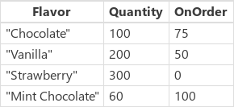

# PowerApps 中的 Filter、Search 和 LookUp 函数
查找[表](../working-with-tables.md)中的一个或多个[记录](../working-with-tables.md#records)。

## 说明
**Filter** 函数查找表中满足公式的记录。  使用 **Filter** 可查找匹配一个或多个条件的一组记录并丢弃不匹配的记录。

**LookUp** 函数查找表中满足公式的第一条记录。  使用 **LookUp** 可查找匹配一个或多个条件的单个记录。

对于这两者，系统都会针对表的每条记录计算公式。  结果为 *true* 的记录将包含在结果中。  除常规公式[运算符](operators.md)外，还可对子字符串匹配项使用 **[in](operators.md#in-and-exactin-operators)** 和 **[exactin](operators.md#in-and-exactin-operators)** 运算符。

[!INCLUDE [record-scope](../../../includes/record-scope.md)]

**Search** 函数在表中查找其某个列中包含某个字符串的记录。 字符串可能出现在列中的任何位置；例如，搜索“rob”或“bert”会在包含“Robert”的列中找到匹配项。 搜索不区分大小写。 与 **Filter** 和 **LookUp** 不同，**Search** 函数使用单个字符串而非公式进行匹配。

**Filter** 和 **Search** 返回包含与原始表相同的列的表和匹配条件的记录。 **LookUp** 用公式将记录归约为单个值后，仅返回找到的第一条记录。 如果未找到记录，**Filter** 和 **Search** 将返回[空](function-isblank-isempty.md)表，**LookUp** 将返回空白。  

[表](../working-with-tables.md)是 PowerApps 中的一个值，与字符串或数字类似。 可以向函数传递表，也可以从函数返回表。  **Filter**、**Search** 和 **LookUp** 不会修改表。 相反，它们将表作为参数，并从中返回表、记录或单个值。 请参阅[使用表](../working-with-tables.md)，了解更多详情。

[!INCLUDE [delegation](../../../includes/delegation.md)]

## 语法
**Filter**( *Table*, *Formula1* [, *Formula2*, ... ] )

* *Table* - 必需。 要搜索的表。
* *Formula(s)* - 必需。 计算表的每个记录时所依据的公式。 此函数返回计算结果为 **true** 的所有记录。 可以引用表中的列。 如果提供多个公式，则通过 **[And](function-logicals.md)** 函数将所有公式的结果合并。

**Search**( *Table*, *SearchString*, *Column1* [, *Column2*, ... ] )

* *Table* - 必需。 要搜索的表。
* *SearchString* - 必需。 要搜索的字符串。 如果为空白或者是空字符串，将返回所有记录。
* *Column(s)* - 必需。 要在*表*中搜索的列的名称。 要搜索的列必须包含文本。 列名称必须是用双引号括起来的字符串。 但是，列名称必须是静态的，并且不能使用公式计算。 如果在任意这些列的数据中找到了作为部分匹配项的 *SearchString* ，将返回完整记录。

> [!NOTE]
> 对于列名称带空格的 SharePoint 和 Excel 数据源，请将每个空格指定为“\_x0020\_”。 例如，将“Column Name”指定为“Column_x0020_Name”。

**LookUp**( *Table*, *Formula* [, *ReductionFormula* ] )

* *Table* - 必需。 要搜索的表。 在 UI 中，此语法显示为函数框上方的“源”。
* *Formula* - 必需。
  计算表的每个记录时所依据的公式。 此函数返回计算结果为 **true** 的第一条记录。 可以引用表中的列。 在 UI 中，此语法显示为函数框上方的“条件”。
* *ReductionFormula* - 可选。 此公式会对找到的记录进行计算，然后将记录缩减为一个值。 可以引用表中的列。 如果没有使用这个参数，此函数将返回表中的完整记录。 在 UI 中，此语法显示为函数框上方的“结果”。

## 示例
以下示例使用 **IceCream** [数据源](../working-with-data-sources.md)：

| 公式 | 说明 | 结果 |
| --- | --- | --- |
| **Filter( IceCream, OnOrder > 0 )** |返回 **OnOrder** 大于零的记录。 |  |
| **Filter( IceCream, Quantity + OnOrder > 225 )** |返回 **Quantity** 和 **OnOrder** 列的总和大于 225 的记录。 | |
| **Filter( IceCream, "chocolate" in Lower( Flavor ) )** |返回其 **Flavor** 名称中出现单词“chocolate”（不区分字母大小写）的记录。 | |
| **Filter( IceCream, Quantity < 10  && OnOrder < 20 )** |返回 **Quantity** 小于 10 且 **OnOrder** 小于 20 的记录。  没有符合这些条件的记录，因此将返回空表。 | |
| **Search( IceCream, "choc", "Flavor" )** |返回其 **Flavor** 名称中出现字符串“choc”（不区分字母大小写）的记录。 | |
| **Search( IceCream, "", "Flavor" )** |因为搜索词为空，所以将返回所有记录。 | |
| **LookUp( IceCream, Flavor = "Chocolate", Quantity )** |搜索 **Flavor** 等于“Chocolate”的记录，其中有一个此类记录。  对于找到的第一个记录，将返回该记录的 **Quantity**。 |100 |
| **LookUp( IceCream, Quantity > 150, Quantity + OnOrder )** |搜索 **Quantity** 大于 100 的记录，其中有多个此类记录。  对于找到的第一个 **Flavor** 为“Vanilla”的记录，将返回 **Quantity** 和 **OnOrder** 列的总和。 |250 |
| **LookUp( IceCream, Flavor = "Pistachio", OnOrder )** |搜索 **Flavor** 等于“Pistachio”的记录，其中不存在此类记录。  由于未找到匹配项，**Lookup** 将返回空白。 |空白 |
| **LookUp( IceCream, Flavor = "Vanilla" )** |搜索 **Flavor** 等于“Vanilla”的记录，其中有一个此类记录。  由于未提供归约公式，因此将返回完整记录。 |{ Flavor: "Vanilla", Quantity: 200, OnOrder: 75 } |

### 搜索用户体验
在许多应用中，你可在搜索框中键入一个或多个字符来对较大数据集中的记录列表进行筛选。 键入时，列表中仅显示与搜索条件匹配的记录。

本主题其余部分中的示例演示了搜索包含此数据的列表（名为 **Customers**）的结果：

若要将此数据源创建为集合，请创建一个 **[按钮](../controls/control-button.md)** 控件，并将其 **OnSelect** 属性设置为以下公式：

**ClearCollect( Customers, Table( { Name: "Fred Garcia", Company: "Northwind Traders" }, { Name: "Cole Miller", Company: "Contoso" }, { Name: "Glenda Johnson", Company: "Contoso" }, { Name: "Mike Collins", Company: "Adventure Works" }, { Name: "Colleen Jones", Company: "Adventure Works" } ) )**

如此示例中所示，可在屏幕底部的[**库控件**](../controls/control-gallery.md)中显示记录列表。 在靠近屏幕顶部的位置，可添加名为 **SearchInput** 的[**文本输入**](../controls/control-text-input.md)控件，以便用户能够指定对哪些记录感兴趣。

当用户在 **SearchInput** 中键入字符时，系统将自动筛选库中的结果。 在本例中，库被配置为显示客户名称（不是公司名称）以 **SearchInput** 中的字符序列开头的记录。 如果用户在搜索框中键入 **co**，库将显示以下结果：

若要基于 **Name** 列进行筛选，需将库控件的 **Items** 属性设置为以下公式之一：

| 公式 | 说明 | 结果 |
| --- | --- | --- |
| **Filter( Customers, StartsWith( Name, SearchInput.Text ) )** |筛选 **Customers** 数据源，查找搜索字符串出现在 **Name** 列开头的记录。 测试不区分大小写。 如果用户在搜索框中键入 **co**，库将显示 **Colleen Jones** 和 **Cole Miller**。 库不会显示 **Mike Collins**，因为该记录的 **Name** 列不以搜索字符串开头。 |  |
| **Filter( Customers, SearchInput.Text in Name )** |筛选 **Customers** 数据源，查找搜索字符串出现在 **Name** 列中任意位置的记录。 测试不区分大小写。 如果用户在搜索框中键入 **co**，库将显示 **Colleen Jones**、**Cole Miller** 和 **Mike Collins**，因为搜索字符串都出现在所有这些记录的 **Name** 列中的某个位置。 |  |
| **Search( Customers, SearchInput.Text, "Name" )** |与使用 **in** 运算符类似，**Search** 函数从每条记录的 **Name** 列中的任意位置搜索匹配项。 请注意，必须将列名称括在双引号内。 |  |

可以扩展搜索，使其包括 **Company** 列和 **Name** 列：

| 公式 | 说明 | 结果 |
| --- | --- | --- |
| **Filter( Customers, StartsWith( Name, SearchInput.Text ) &#124;&#124; StartsWith( Company, SearchInput.Text ) )** |筛选 **Customers** 数据源，查找 **Name** 列或 **Company** 列以搜索字符串（例如 **co**）开头的记录。  如果任一 **StartsWith** 函数为 *true*，则 [**&#124;&#124;** 运算符](operators.md) 为 *true*。 |  |
| **Filter( Customers, SearchInput.Text in Name &#124;&#124; SearchInput.Text in Company )** |筛选 **Customers** 数据源，查找 **Name** 列或 **Company** 列任意位置包含搜索字符串（例如 **co**）的记录。 |  |
| **Search( Customers, SearchInput.Text, "Name", "Company" )** |与使用 **in** 运算符类似，**Search** 函数筛选 **Customers** 数据源，查找 **Name** 列或 **Company** 列任意位置包含搜索字符串（例如 **co**）的记录。 如果希望指定多个列和多个 **in** 运算符，那么 **Search** 函数会比 **Filter** 更易于读取和写入。 请注意，必须将列的名称括在双引号内。 |  |

