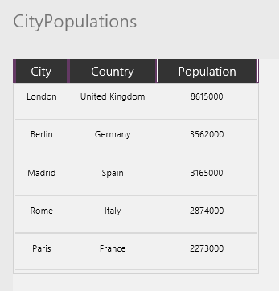
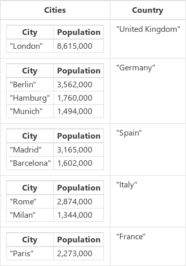
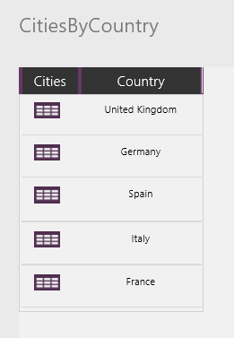
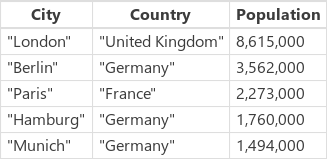
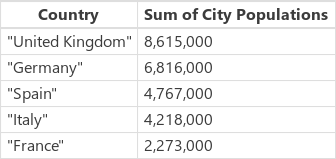

# <a name="groupby-and-ungroup-functions-in-powerapps"></a>PowerApps 中的 GroupBy 和 Ungroup 函数
对[表](../working-with-tables.md)[记录](../working-with-tables.md#records)进行分组和取消分组。

## <a name="description"></a>描述
**GroupBy** 函数返回一个表，其中包含根据一个或多个[列](../working-with-tables.md#columns)中的值归组的记录。 同组中的记录将置于单个记录中，同时添加一个列，用于保留一个嵌套的剩余列的表。   

**Ungroup** 函数逆向执行 **GroupBy** 过程。 此函数返回一个表，该表将组在一起的记录拆分成单个记录。

可以使用 **GroupBy** 对记录分组，修改返回的表，然后在修改后的表中使用 **Ungroup** 对记录取消分组。 例如，可以通过以下方法删除一组记录：

* 使用 **GroupBy** 函数。
* 使用 **[Filter](function-filter-lookup.md)** 函数来删除整组记录。
* 使用 **Ungroup** 函数。  

还可以根据分组来聚合结果：

* 使用 **GroupBy** 函数。
* 将 **[AddColumns](function-table-shaping.md)** 函数与 **[Sum](function-aggregates.md)** 、**[Average](function-aggregates.md)** 和其他聚合函数配合使用以添加一个新列，即组表的聚合。
* 使用 **[DropColumns](function-table-shaping.md)** 函数删除组表。

**Ungroup** 会尝试保留馈送至 **GroupBy** 的记录的初始顺序。  这并不总是可行（例如，当初始表包含 *空白* 记录时）。

表是 PowerApps 中的一个值，与字符串或数字类似。 可以指定一个表作为函数的自变量，然后函数可返回一个表。 **GroupBy** 和 **Ungroup** 并不修改表，而是将表视为自变量，然后返回另一个表。 请参阅[使用表](../working-with-tables.md)，了解更多详情。

## <a name="syntax"></a>语法
GroupBy( Table, ColumnName1 [, ColumnName2, ... ], GroupColumnName )

* *Table* - 必需。 要分组的表。
* *ColumnName(s)* - 必需。  作为记录分组依据的表中的列名称。  这些列将变为生成的表中的列。
* GroupColumnName - 必需。  ColumnName 中不包含的记录数据存储的列名称。
  
    > [!NOTE]
  > 对于列名称带空格的 SharePoint 和 Excel 数据源，请将每个空格指定为“\_x0020\_”。 例如，将“Column Name”指定为“Column_x0020_Name”。

Ungroup( Table, GroupColumnName )

* *Table* - 必需。 要取消分组的表。
* GroupColumnName - 必需。 包含使用 **GroupBy** 函数设置的记录数据的列。
  
    > [!NOTE]
  > 对于列名称带空格的 SharePoint 和 Excel 数据源，请将每个空格指定为“\_x0020\_”。 例如，将“Column Name”指定为“Column_x0020_Name”。

## <a name="examples"></a>示例
### <a name="create-a-collection"></a>创建集合
1. 添加一个按钮，然后设置其 **[Text](../controls/properties-core.md)** 属性，以使该按钮显示**初始**。
2. 将“初始”按钮的 **[OnSelect](../controls/properties-core.md)** 属性设置为下面的公式：

```powerapps-dot   
ClearCollect( CityPopulations, 
    { City: "London",    Country: "United Kingdom", Population: 8615000}, 
    { City: "Berlin",    Country: "Germany",        Population: 3562000}, 
    { City: "Madrid",    Country: "Spain",          Population: 3165000}, 
    { City: "Rome",      Country: "Italy",          Population: 2874000}, 
    { City: "Paris",     Country: "France",         Population: 2273000}, 
    { City: "Hamburg",   Country: "Germany",        Population: 1760000}, 
    { City: "Barcelona", Country: "Spain",          Population: 1602000}, 
    { City: "Munich",    Country: "Germany",        Population: 1494000}, 
    { City: "Milan",     Country: "Italy",          Population: 1344000}
)
```

3. 按住 Alt 键的同时，选择“原始”按钮。
   
    刚创建了名为 **CityPopulations** 的[集合](../working-with-data-sources.md#collections)，该集合包含此数据：
   
    
4. 若要显示此集合，请选择“文件”菜单中的“集合”，然后选择 **CityPopulations** 集合。  此时显示集合中的前五个记录：
   
    

### <a name="group-records"></a>分组记录
1. 添加另一个按钮，然后将其 **[Text](../controls/properties-core.md)** 属性设置为 **"Group"**。
2. 将此按钮的 **[OnSelect](../controls/properties-core.md)** 属性设为下面的公式：
   
    **ClearCollect( CitiesByCountry, GroupBy( CityPopulations, "Country", "Cities" ) )**
3. 按住 Alt 键的同时，选择“分组”按钮。
   
    刚创建了一个名为 **CitiesByCountry** 的集合，其中上一个集合的记录按“国家/地区”列进了分组。
   
    
4. 若要显示此集合中的前五条记录，请在“文件”菜单中选择“集合”。
   
    
5. 若要显示某个国家/地区内城市的人口，请选择该国家/地区（如德国）的“城市”列中的表图标：
   
    

### <a name="filter-and-ungroup-records"></a>对记录进行筛选和取消分组
1. 添加另一个按钮，然后设置其 **[Text](../controls/properties-core.md)** 属性，以使该按钮显示“筛选”。
2. 将此按钮的 **[OnSelect](../controls/properties-core.md)** 属性设为下面的公式：
   
    **ClearCollect( CitiesByCountryFiltered, Filter( CitiesByCountry, "e" in Country ) )**
3. 按住 Alt 键的同时，选择已添加的按钮。
   
    刚创建了第三个集合，名为 **CitiesByCountryFiltered**，其中仅含名称带“e”的国家/地区（即没有西班牙和意大利）。
   
    
4. 再添加一个按钮，然后设置其 **[Text](../controls/properties-core.md)** 属性，以使该按钮显示“取消分组”。
5. 将此按钮的 **[OnSelect](../controls/properties-core.md)** 属性设为下面的公式：
   
    **ClearCollect( CityPopulationsUngrouped, Ungroup( CitiesByCountryFiltered, "Cities" ) )**
   
    这将导致：
   
    

### <a name="aggregate-results"></a>聚合结果
可使用分组表执行的其他操作是聚合结果。  在本示例中，将对每个国家/地区的主要城市的人口求和。

1. 添加另一个按钮，然后设置其 **[Text](../controls/properties-core.md)** 属性，以便该按钮显示“总和”。
2. 将“总和”按钮的 **[OnSelect](../controls/properties-core.md)** 属性设置为下面的公式：
   
    **ClearCollect( CityPopulationsSum, AddColumns( CitiesByCountry, "Sum of City Populations", Sum( Cities, Population ) ) )**
   
    这将导致：
   
    
   
    **[AddColumns](function-table-shaping.md)** 以基本 **CitiesByCountry** 集合开始，并添加新的列“城市人口总和”。  此列的值将根据公式 **Sum( Cities, Population )** 逐行进行计算。  **AddColumns** 为每行提供**城市**列的值，而 **[Sum](function-aggregates.md)** 将此子表的每行的**人口**进行加总。

    现在，已得到所需的总和，可以使用 **[DropColumns](function-table-shaping.md)** 删除子表。
  
3. 添加另一个按钮，并设置它的“[Text](../controls/properties-core.md)”属性，以让按钮显示“仅总和”。
4. 将“仅总和”按钮的“[OnSelect](../controls/properties-core.md)”属性设置为以下公式：

    **ClearCollect( CityPopulationsSumOnly, DropColumns( CityPopulationsSum, "Cities" ) )**
   
    这将导致：
   
    
   
    请注意，无需对此表执行取消分组。

