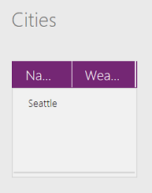

# PowerApps 中的 Blank、Coalesce、IsBlank 和 IsEmpty 函数
测试值是否为空白值，或测试[表](../working-with-tables.md)是否不包含任何[记录](../working-with-tables.md#records)，并能创建*空白*值。

## 概述
*Blank* 是“空值”或“未知值”的占位符。 如果用户没有输入任何字符，那么“[文本输入](../controls/control-text-input.md)”控件便是*空白*的。 当用户在文本输入框中输入一个字符后，该文本框的值就不再是 *blank* 值。  一些数据源可以存储和返回 NULL 值，此类值在 PowerApps 中表示为*空白*值。

> [!NOTE]
> 目前，只有本地集合支持存储空白值。 我们知道，多个数据源支持*空白* (NULL) 值，我们正在努力取消此限制。

任何属性的值或计算的值都可以是 *blank* 值。  例如，布尔型数据的值通常是：**true** 或 **false**。  但除了这两个值，它还可以是 *blank* 值。  这跟 Microsoft Excel 很相似。Excel 工作表的单元格一开始可能是空的，但是它可以包含 **TRUE** 或 **FALSE** 值等等。 你随时可以删除单元格中的内容，如果将其删除，单元格又会变成 *blank* 状态。

*Empty* 专门用于表示不包含任何记录的表。 即使表只包含[列](../working-with-tables.md#columns)名称，而不包含任何数据，它也是一个完整的表。 一个表刚开始可能是空表，但填入记录后，就不再是空表了；如果将其中的记录删除，那么它又会变成空表。

## 描述
**Blank** 函数返回*空白*值。 此函数可用于在支持 NULL 值的数据源中存储这些值，进而可以从字段中有效删除所有值。

**IsBlank** 函数用于测试 *blank* 值。 以下情况下会出现 *blank* 值：

* **Blank** 函数的返回值。
* 控件属性中没有填写公式。
* 没有在文本输入控件中键入任何值，或者没有在列表框中选择任何项。 如果字段是必填的，就可以使用 **IsBlank** 来提供反馈。
* 字符串不包含任何字符（**[Len](function-len.md)** 值为 0）。
* 函数出错。 通常，函数有一个参数无效。 如果参数的值是 *blank* 值，许多函数会返回 *blank*。
* 连接的[数据源](../working-with-data-sources.md)（例如 SQL Server）可能使用“Null”值。 在 PowerApps 中，这些值显示为 *blank* 值。
* 没有编写 **[If](function-if.md)** 函数的 *else* 部分，也就是所有条件的结果都是 **false**。
* 使用 **[Update](function-update-updateif.md)** 函数时没有指定所有列的值。 因此，不会在没有指定值的列中替换任何值。

Coalesce 函数按顺序评估其参数并返回第一个值（不是空值）。  可使用此函数将空值替换为其他值，但保留非空值不变。  如果所有参数均为空，则函数返回 blank。  Coalesce 的所有参数必须是同一种类型；例如，不能将数字和文本字符串混合在一起。  Coalesce( value1, value2 ) 是 If( Not( IsBlank( value1 ) ), value1, value2 ) 更为简洁的等效项，无需评估 value1 两次。  

**IsEmpty** 函数用于测试表是否包含记录。 这个函数跟使用 **[CountRows](function-table-counts.md)** 函数的效果相同，只不过它是检查表中的记录数是否为零。 可以结合使用 **IsEmpty** 和 **[Errors](function-errors.md)** 函数，从而检查数据源错误。

**IsBlank** 和 **IsEmpty** 的返回值都是布尔值 **true** 或 **false**。

## 语法
**Blank**()

**Coalesce**( *Value1* [, *Value2*, ... ] )

* *Value(s)* – 必需。 要测试的值。  按顺序评估各个值，直至找到非空值。  不再评估第一个非空值之后的值。  

**IsBlank**( *Value* )

* *Value* – 必需。 要测试的值。

**IsEmpty**( *Table* )

* *Table* - 必需。 要测试是否包含记录的表。

## 示例
### Blank
> [!NOTE]
> 下面的示例暂只适用于本地集合。  我们知道，多个数据源支持*空白* (NULL) 值，我们正在努力取消此限制。

1. 从头开始创建应用，然后添加一个“按钮”控件。
2. 将该按钮的 **[OnSelect](../controls/properties-core.md)** 属性设置为以下公式：

    **ClearCollect( Cities, { Name: "Seattle", Weather: "Rainy" } )**
3. 预览应用，单击或点击所添加的按钮，然后关闭预览。  
4. 在“文件”菜单上，单击或点击“集合”。

     此时，“Cities”集合显示，其中包含一条内容为“Seattle”和“Rainy”的记录：

    
5. 单击或点击后退箭头，返回到默认工作区。
6. 添加一个“标签”控件，然后将“Text”属性设置为以下公式：

    **IsBlank( First( Cities ).Weather )**

    此标签显示“false”，因为“Weather”字段包含值“Rainy”。
7. 添加第二个按钮，然后将“OnSelect”属性设置为以下公式：

    **Patch( Cities, First( Cities ), { Weather: Blank() } )**
8. 预览应用，单击或点击所添加的按钮，然后关闭预览。  

    “Cities”集合中第一条记录的“Weather”字段被替换成*空白*值，删除了之前使用的“Rainy”。

    

    此标签显示“true”，因为“Weather”字段不再包含值。

### Coalesce

| 公式 | 描述 | 结果 |
| --- | --- | --- |
| **Coalesce( Blank(), 1 )** |测试从 **Blank** 函数返回的值，此函数始终返回*空白*值。 由于第一个参数为空，因此继续评估下一个参数，直至找到非空值。 |**1** |
| **Coalesce( Blank(), Blank(), Blank(), Blank(), 2, 3 )** |Coalesce 从参数列表的开头开始并按顺序评估各个参数，直至找到非空值。  在本例中，前四个参数均返回 blank，因此继续评估第五个参数。 第五个参数为非空，因此在此处评估并停止。 将返回第五个参数的值，并且不再评估第六个参数。 |**2** |

### IsBlank
1. 从头开始创建应用，然后添加一个文本输入控件，并将其命名为“FirstName”。
2. 添加一个标签，然后将其 **[Text](../controls/properties-core.md)** 属性设置为以下公式：

    **If( IsBlank( FirstName.Text ), "First Name is a required field." )**

    文本输入控件的“[Text](../controls/properties-core.md)”属性默认设置为“Text input”。 因为此属性包含值，所以它不是空的，标签也不会显示任何消息。
3. 从文本输入控件中删除所有字符（包括空格）。

    由于“[Text](../controls/properties-core.md)”属性不再包含任何字符，因此它是*空白*的，“IsBlank( FirstName.Text )”的值为“true”。 现在就会显示“必填字段”这样的消息了。

若要了解如何使用其他工具执行验证，请参阅 **[Validate](function-validate.md)** 函数和[使用数据源](../working-with-data-sources.md)。  

其他示例：

| 公式 | 描述 | 结果 |
| --- | --- | --- |
| **IsBlank( Blank() )** |测试从 **Blank** 函数返回的值，此函数始终返回*空白*值。 |**true** |
| **IsBlank( "" )** |不包含任何字符的字符串。 |**true** |
| **IsBlank( "Hello" )** |包含一个或多个字符的字符串。 |**false** |
| **IsBlank( *AnyCollection* )** |由于存在[集合](../working-with-data-sources.md#collections)，所以即使不包含任何记录，它的值也不是空值。 要检查是不是空集合，请使用 **IsEmpty**。 |**false** |
| **IsBlank( Mid( "Hello", 17, 2 ) )** |**[Mid](function-left-mid-right.md)** 函数的起始字符超出了字符串的结束位置。  所以结果是空字符串。 |**true** |
| **IsBlank( If( false, false ) )** |**[If](function-if.md)** 函数没有 *ElseResult* 部分。  由于条件的结果始终是 **false**，所以 **[If](function-if.md)** 函数始终返回 *blank* 值。 |**true** |

### IsEmpty
1. 从头开始创建应用，然后添加一个“按钮”控件。
2. 将该按钮的 **[OnSelect](../controls/properties-core.md)** 属性设置为以下公式：

    **Collect( IceCream, { Flavor: "Strawberry", Quantity: 300 }, { Flavor: "Chocolate", Quantity: 100 } )**
3. 预览应用，单击或点击所添加的按钮，然后关闭预览。  

    创建“IceCream”集合，其中包含以下数据：

    

    其中有两条记录，所以它不是空集。 **IsEmpty( IceCream )** 返回 **false**，**CountRows( IceCream )** 返回 **2**。
4. 添加第二个按钮，然后将“[OnSelect](../controls/properties-core.md)”属性设置为以下公式：

    **Clear( IceCream )**
5. 预览应用，单击或点击第二个按钮，然后关闭预览。  

    这个集合现在变成了空集：

    

    **[Clear](function-clear-collect-clearcollect.md)** 函数可删除集合中的所有记录，导致集合变成空集。 **IsEmpty( IceCream )** 返回 **true**，**CountRows( IceCream )** 返回 **0**。

还可以使用 **IsEmpty** 测试一个计算的表是不是空表，请参阅以下示例：

| 公式 | 描述 | 结果 |
| --- | --- | --- |
| **IsEmpty( [&nbsp;1,&nbsp;2,&nbsp;3 ] )** |单列表包含三条记录，所以，它不是空表。 |**false** |
| **IsEmpty( [&nbsp;] )** |单列表不包含任何记录，所以它是空表。 |**true** |
| **IsEmpty( Filter( [&nbsp;1,&nbsp;2,&nbsp;3&nbsp;], Value > 5 ) )** |单列表不包含任何大于 5 的值。  筛选器没有筛选出任何记录，所以它是空表。 |**true** |

