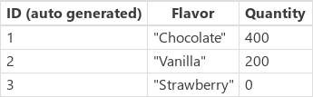

# Power Apps 中的修补程序函数
在[数据源](../working-with-tables.md#records)中修改或创建一条或多条[记录](../working-with-data-sources.md)，或者合并数据源外的记录。

使用 **Patch** 函数可以在复杂情况（如执行不需要用户交互的更新或使用跨多个屏幕的窗体）下修改记录。

在不太复杂的情况下，可以使用**编辑窗体**控件，更轻松地更新数据源中的记录。 添加**编辑窗体**控件时，可以向用户提供要填写的窗体，然后将更改保存到数据源中。 有关详细信息，请参阅[了解数据窗体](../working-with-forms.md)。

## 概述
使用 **Patch** 函数可修改数据源的一条或多条记录。  可以在不影响其他属性的情况下修改特定[字段](../working-with-tables.md#elements-of-a-table)的值。 例如，以下公式更改名为 Contoso 的客户的电话号码：

`Patch( Customers, First( Filter( Customers, Name = "Contoso" ) ), { Phone: “1-212-555-1234” } )`

结合使用 **Patch** 和 **[Defaults](function-defaults.md)** 函数可创建记录。 可以利用此行为生成[一个屏幕](../working-with-data-sources.md)，以供创建和编辑记录。 例如，以下公式为名为 Contoso 的客户创建记录：

`Patch( Customers, Defaults( Customers ), { Name: “Contoso” } )`

即使不需要使用数据源，也可以使用 **Patch** 来合并两条或多条记录。 例如，以下公式将两个记录合并成一个同时识别 Contoso 的电话号码和位置的记录：

`Patch( { Name: "Contoso", Phone: “1-212-555-1234” }, { Name: "Contoso", Location: “Midtown”  } )`

## 说明
### 在数据源中修改或创建记录
要在数据源中使用这个函数，请指定数据源，然后指定一条基本记录：

* 要修改记录，基本记录必须来自数据源。  基本记录可能来自一个库的 **[项](../controls/properties-core.md)** 属性（在[上下文变量](../working-with-variables.md#use-a-context-variable)中），也可能来自其他途径。 不管怎样，最终必须能够追溯到基本记录来自数据源。  这一点非常重要，因为记录中包含一些额外的信息，可以帮助你重新找到记录，以便进行修改。  
* 要创建记录，请使用 **[Defaults](function-defaults.md)** 函数创建一条包含默认值的基本记录。  

然后指定一条或多条更改记录，每条记录都包含用于替代基本记录中属性值的新属性值。 更改记录按照参数列表从头到尾的顺序进行处理，并且使用后者的属性值替换前者的属性值。

**Patch** 的返回值是要修改或创建的记录。  如果是创建记录，返回值可能包含数据源自动生成的属性。

更新数据源时，可能会产生一个或多个问题。 使用 **[Errors](function-errors.md)** 函数可识别和检查问题，如[使用数据源](../working-with-data-sources.md)所述。

相关函数包括 **[Update](function-update-updateif.md)** 函数，它可用于替换整条记录；另外还有 **[Collect](function-clear-collect-clearcollect.md)** 函数，它可用于创建记录。  通过使用 **[UpdateIf](function-update-updateif.md)** 函数，你可以根据条件来修改多条记录的特定属性。

### 在数据源中修改或创建一组记录
**Patch** 还可用于通过一次调用创建或修改多条记录。

它不是传递单条基本记录，而是在第二个参数中提供一个基本记录表。  更改记录也是通过表提供，并且与基本记录一一对应。  每个更改表中记录的数量必须与基本表中记录的数量完全相等。

如果以这种方式使用 **Patch** 函数，结果值也会是一个表，并且其中的记录与基本记录和更改记录也是一一对应的。

### 合并数据源外部的记录
指定一条或多条要合并的记录。 记录按照参数列表从头到尾的顺序进行处理，并且使用后者的属性值替换前者的属性值。

**Patch** 会返回合并的记录，并且不会修改它的参数或任何数据源中的记录。

## 语法
#### 在数据源中修改或创建记录
**Patch**( *DataSource*, *BaseRecord*, *ChangeRecord1* [, *ChangeRecord2*, … ])

* *DataSource* - 必需。 包含要修改的记录或用于包含要创建的记录的数据源。
* *BaseRecord* – 必需。 要修改或创建的记录。  如果记录来自数据源，则会找到记录并进行修改。 如果使用 **[Defaults](function-defaults.md)** 函数的结果，则会创建记录。
* *ChangeRecord(s)* – 必需。  一条或多条记录，其中包含要在 *BaseRecord* 中修改的属性。  更改记录按照参数列表从头到尾的顺序进行处理，并且使用后者的属性值替换前者的属性值。

#### 在数据源中修改或创建一组记录
**Patch**（ *DataSource*， *BaseRecordsTable*， *ChangeRecordTable1* [， *ChangeRecordTable2*，。 ] )

* *DataSource* - 必需。 包含要修改的记录或用于包含要创建的记录的数据源。
* *BaseRecordTable* – 必需。 要修改或创建的记录的表。  如果记录来自数据源，则会找到记录并进行修改。 如果使用 **[Defaults](function-defaults.md)** 函数的结果，则会创建记录。
* *ChangeRecordTable(s)* – 必需。  记录的一个或多个表，其中包含在 *BaseRecordTable* 中要修改的每条记录的属性。  更改记录按照参数列表从头到尾的顺序进行处理，并且使用后者的属性值替换前者的属性值。

#### 合并记录
**Patch**( *Record1*, *Record2* [, …] )

* *Record* - 必需。  至少要有两条要合并的记录。 记录按照参数列表从头到尾的顺序进行处理，并且使用后者的属性值替换前者的属性值。

## 示例
#### 在数据源中修改或创建记录
在这些示例中，你将在名为**IceCream**的数据源中修改或创建记录，其中包含此[表](../working-with-tables.md)中的数据，并自动生成**ID** [列](../working-with-tables.md#columns)中的值：

| 公式 | 说明 | 结果 |
| --- | --- | --- |
| **Patch(&nbsp;IceCream, First( Filter( IceCream, Flavor = "Chocolate" ) ), {&nbsp;Quantity:&nbsp;400&nbsp;} )** |修改 **IceCream** 数据源中的记录：<ul><li> 要修改的记录的 **ID** 列的值为 **1**。 （这个 ID 的记录为 **Chocolate**。）</li><li>将 **Quantity** 列的值更改为 **400**。 |{&nbsp;ID:&nbsp;1, Flavor:&nbsp;"Chocolate", Quantity:&nbsp;400 }  已修改 **IceCream** 数据源中的 **Chocolate** 条目。 |
| **Patch( IceCream, Defaults(&nbsp;IceCream ), {&nbsp;Flavor:&nbsp;“Strawberry”&nbsp;}&nbsp;)** |在 **IceCream** 数据源中创建一条记录。<ul><li>**ID** 列包含的值为 **3**，这是数据源自动生成的。</li><li>**Quantity** 列的值为 **0**，在 **IceCream** 数据源中，这是该列的默认值，由 **[Defaults](function-defaults.md)** 函数指定。<li>**Flavor** 列的值为 **Strawberry**。</li> |{ ID:&nbsp;3, Flavor:&nbsp;“Strawberry”, Quantity:&nbsp;0&nbsp;}  已在  **IceCream** 数据源中创建 **Strawberry** 条目。 |

对上面的公式进行计算后，数据源最终会产生以下值：

#### 合并数据源外的记录

| 公式 | 说明 | 结果 |
| --- | --- | --- |
| **Patch(&nbsp;{&nbsp;Name:&nbsp;"James",&nbsp;Score:&nbsp;90&nbsp;}, {&nbsp;Name:&nbsp;"Jim",&nbsp;Passed:&nbsp;true&nbsp;} )** |合并数据源外的两条记录： <ul><li>两条记录的 **Name** 列中的值不相同。 结果包含离参数列表的末尾更近的记录中的值 (**Jim**)，而不是离开头更近的记录中的值 (**James**)。</li><li>第一条记录包含第二条记录中不存在的一列 (**Score**)。 结果包含这一列及其值 (**90**)。</li><li>第二条记录包含第一条记录中不存在的一列 (**Passed**)。 结果包含这一列及其值 (**true**)。 |{&nbsp;Name:&nbsp;"Jim", Score:&nbsp;90, Passed:&nbsp;true&nbsp;} |

