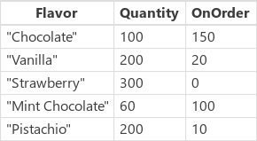
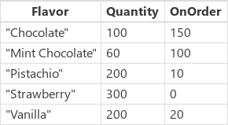
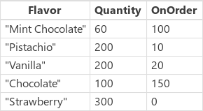
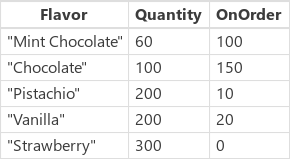
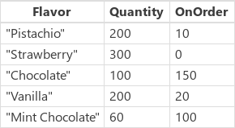

# PowerApps 中的 Sort 和 SortByColumns 函数
对[表](../working-with-tables.md)进行排序。

## 描述
**Sort** 函数根据公式对表进行排序。  

系统会针对表的每条[记录](../working-with-tables.md#records)计算公式，然后根据结果对表进行排序。  公式的计算结果必须是数字、字符串或布尔值；不得是表或记录。

[!INCLUDE [record-scope](../../../includes/record-scope.md)]

若要先按一列进行排序，然后再按另一列进行排序，请在 **Sort** 公式中嵌入另一个此公式。 例如，使用以下公式进行排序**联系人**表中第一次**LastName**列，然后按**FirstName**列：**Sort( Sort( Contacts, LastName ), FirstName )**

还可以使用 **SortByColumns** 函数根据一列或多列对表进行排序。

**SortByColumns** 的参数列表提供了作为排序依据的列的名称，以及每个列的排序方向。  系统按参数顺序执行排序（先按第一列排序，然后按第二列排序，依此类推）。  将列名称指定为字符串。如果直接在参数列表中添加列名称，必须用双引号括起来。  例如，**SortByColumns( CustomerTable, "LastName" )**。

可以将 **SortByColumns** 与**[下拉列表](../controls/control-drop-down.md)** 或**[列表框](../controls/control-list-box.md)** 控件结合使用，以便用户能够选择作为排序依据的列。

除了进行升序或降序排序之外，**SortByColumns** 还可以根据单列表值进行排序。  例如，可以提供 **[ "Monday", "Tuesday", "Wednesday", "Thursday", "Friday", "Saturday", "Sunday" ]** 作为排序顺序，从而根据星期几的名称对记录进行排序。  所有包含 **Monday"** 的记录会先显示，随后显示包含 **Tuesday** 的记录，依此类推。  与排序顺序表不匹配的记录被置于列表末尾显示。

[表](../working-with-tables.md)是 PowerApps 中的一个值，与字符串或数字类似。  可以向函数传递表，也可以从函数返回表。  **Sort** 和 **SortByColumn** 并不修改表，而是将表视为参数，然后返回排序后的新表。  请参阅[使用表](../working-with-tables.md)，了解更多详情。

[!INCLUDE [delegation](../../../includes/delegation.md)]

## 语法
**Sort**( *Table*, *Formula* [, *SortOrder* ] )

* *Table* - 必需。 要排序的表。
* *Formula* - 必需。 系统会针对表的每条记录计算此公式，然后根据结果对表进行排序。  可以引用表中的列。
* *SortOrder* - 可选。 指定 **SortOrder.Descending** 可对表进行降序排序。 **SortOrder.Ascending** 是默认值。

**SortByColumns**( *Table*, *ColumnName1* [, *SortOrder1*, *ColumnName2*, *SortOrder2*, ... ] )

* *Table* - 必需。 要排序的表。
* *ColumnName(s)* - 必需。 要排序的列名称（以字符串形式）。
* *SortOrder(s)* - 可选。  **SortOrder.Ascending** 或 **SortOrder.Descending**。  **SortOrder.Ascending** 是默认值。  如果提供了多个 *ColumnNames* ，则最后一列必须包括 *SortOrder* 。
  
    > [!NOTE]
  > 对于列名称带空格的 SharePoint 和 Excel 数据源，请将每个空格指定为“\_x0020\_”。 例如，将“Column Name”指定为“Column_x0020_Name”。

**SortByColumns**( *Table*, *ColumnName*, *SortOrderTable* )

* *Table* - 必需。 要排序的表。
* *ColumnName* - 必需。 要排序的列名称（以字符串形式）。
* *SortOrderTable* - 必需。  作为排序依据的单列表值。
  
    > [!NOTE]
  > 对于列名称带空格的 SharePoint 和 Excel 数据源，请将每个空格指定为“\_x0020\_”。 例如，将“Column Name”指定为“Column_x0020_Name”。

## 示例
在下面的示例中，我们将使用 **IceCream** [数据源](../working-with-data-sources.md)，其中包含下表中的数据：

| 公式 | 描述 | 结果 |
| --- | --- | --- |
| **Sort( IceCream, Flavor )**  **SortByColumns( IceCream, "Flavor" )** |按 **Flavor** 列对 **IceCream** 进行排序。 由于 **Flavor** 列包含字符串，因此该表按字母顺序进行排序。 默认情况下，排序顺序为升序。 |  |
| **Sort( IceCream, Quantity )**  **SortByColumns( IceCream, "Quantity" )** |按 **Quantity** 列对 **IceCream** 进行排序。  由于 **Quantity** 列包含数字，因此该表按数值大小进行排序。  默认情况下，排序顺序为升序。 | |
| **Sort( IceCream, Quantity, SortOrder.Descending )**  **SortByColumns( IceCream, "Quantity", SortOrder.Descending )** |按 **Quantity** 列对 **IceCream** 进行排序。  由于 **Quantity** 列包含数字，因此按数值大小进行排序。  排序顺序已指定为降序。 | |
| **Sort( IceCream, Quantity + OnOrder )** |分别对每条记录按 **Quantity** 和 **OnOrder** 列的总和对 **IceCream** 进行排序。 由于总和是数字，因此该表按数值大小进行排序。  默认情况下，排序顺序为升序。  由于我们按公式（而不是原始列值）进行排序，因此没有对等的 **SortByColumns** 排序。 | |
| **Sort( Sort( IceCream, OnOrder ), Quantity )**  **SortByColumns( IceCream, "OnOrder", Ascending, "Quantity", Ascending )** |先按 **OnOrder** 列对 **IceCream** 进行排序，然后再按 **Quantity** 列进行排序。  请注意，在按 **OnOrder** 进行第一次排序时，“Pistachio”的排序高于“Vanilla”。然后再按 **Quantity** 进行排序时，它们一同移到相应的位置上。 | |
| **SortByColumns( IceCream, "Flavor", [&nbsp;"Pistachio",&nbsp;"Strawberry"&nbsp;] )** |根据包含“Pistachio”和“Strawberry”的单列表，按 **Flavor** 列对 **IceCream** 进行排序。  结果中先显示包含“Pistachio”这种 **Flavor** 的记录，然后显示包含“Strawberry”的记录。  **Flavor** 列中不匹配的值（如“Vanilla”）将显示在匹配项的后面。 | |

### 分步操作
若要自行运行这些示例，请将 **IceCream** 数据源创建为[集合](../working-with-data-sources.md#collections)：

1. 添加一个按钮，然后将其 **[OnSelect](../controls/properties-core.md)** 属性设置为以下公式： **ClearCollect (IceCream，{风格："巧克力"，Quantity:100，OnOrder:150}，{风格："普通"，Quantity:200，OnOrder:20}，{风格："草莓"，Quantity:300，OnOrder:0}，{风格："Mint Chocolate"，Quantity:60，OnOrder:100}，{风格："Pistachio"，Quantity:200，OnOrder:10 } )**
2. 预览应用，选择按钮，然后按 Esc 返回到默认工作区。
3. 选择“**文件**”菜单上的“**集合**”，调出刚刚创建的集合，然后按 Esc 返回到默认工作区。

#### 排序
1. 添加另一个按钮，然后将其 **[OnSelect](../controls/properties-core.md)** 属性设置为以下公式： 
   **ClearCollect( SortByFlavor, Sort( IceCream, Flavor ) )**
   
     上一公式创建第二个集合（名为 **SortByFlavor**），其中包含与 **Ice Cream** 相同的数据。 不过，新集合中包含的是按 **Flavor** 列进行字母顺序升序排序的数据。
2. 按 F5，选择两个新按钮，然后按 Esc。
3. 选择“**文件**”菜单上的“**集合**”，调出这两个集合，然后按 Esc 返回到默认工作区。
4. 重复最后三步，不同之处在于更改要创建的集合的名称，然后将 **Sort** 公式替换为本部分前面示例表中的另一 **Sort** 公式。

#### SortByColumns
1. 添加另一个按钮，然后将其 **[OnSelect](../controls/properties-core.md)** 属性设置为以下公式： 
   **ClearCollect( SortByQuantity, SortByColumns( IceCream, "Quantity", Ascending, "Flavor", Descending ) )**
   
     上一公式创建第三个集合（名为 **SortByQuantity**），其中包含与 **Ice Cream** 相同的数据。 但是，新集合包含按排序的数据**Quantity**列按升序排列，然后按**风格**降序排序的列。
2. 按 F5，选择两个新按钮，然后按 Esc。
3. 选择“**文件**”菜单上的“**集合**”，调出所有三个集合，然后按 Esc 返回到默认工作区。
4. 重复最后三步，不同之处在于更改要创建的集合的名称，然后将 **SortByColumns** 公式替换为本部分前面示例表中的另一 **SortByColumns** 公式。

