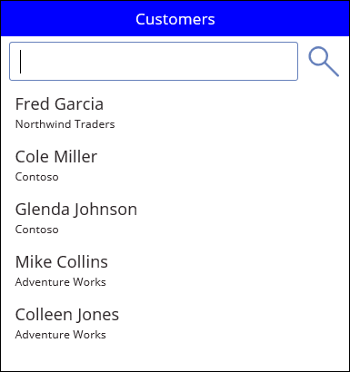

# PowerApps 中的 EndsWith 和 StartsWith 函数
测试文本字符串是否以另一个文本字符串开头或结尾。

## 描述
EndsWith 函数测试某个文本字符串是否以其他文本字符串结尾。

**StartsWith** 函数测试一个文本字符串是否以另一个文本字符串开头。    

这两个函数的测试均不区分大小写。  两个函数的返回值均为布尔值 true 或 false。  

将 EndsWith 和 StartsWith 与 **[Filter](function-filter-lookup.md)** 函数一起使用，可以在应用中搜索数据。 还可使用 **[in](operators.md#in-and-exactin-operators)** 运算符或 **[Search](function-filter-lookup.md)** 函数在文本字符串的任意位置进行查找，不局限于开头或结尾位置。  函数的选择取决于应用需求和针对特定数据源可以[委托](../delegation-overview.md)函数类型。  如果这些函数中有一个无法被委托，则会在创作时显示一个委派警告，用以提醒此限制。

## 语法
**EndsWith**( *Text*, *EndText* )

* *Text* – 必需。  要测试的文本。
* *EndText* – 必需。  在文本结尾处要搜索的文本。  如果 EndText 是空字符串，则 EndsWith 返回 true。

**StartsWith**( *Text*, *StartText* )

* *Text* – 必需。  要测试的文本。
* *StartText* – 必需。  在文本开头处要搜索的文本。  如果 *StartText* 是空字符串，则 **StartsWith** 将返回 *true*。

## 示例

| 公式 | 描述 | 结果 |
| --- | --- | --- |
| **EndsWith( "Hello World", "world" )** |测试“Hello World”是否以“world”结尾。  测试不区分大小写。 |**true** |
| **EndsWith( "Good bye", "good" )** |测试“Good bye”是否以“good”结尾。  EndText 参数（“good”）出现在文本中，但不是结尾处。 |**false** |
| **EndsWith( "Always say hello", "hello" )** |测试“Always say hello”是否以“hello”结尾。 |**true** |
| **Endswith( "Bye bye", "" )** |测试“Bye bye”是否以空文本字符串结尾（Len 返回 0）。  为便于在 Filter 表达式中使用它，在本示例中将 EndsWith 定义为返回 true。 |**true** |

| 公式 | 描述 | 结果 |
| --- | --- | --- |
| **StartsWith( "Hello World", "hello" )** |测试 **"Hello World"** 是否以 **"hello"** 开头。  测试不区分大小写。 |**true** |
| **StartsWith( "Good bye", "hello" )** |测试 **"Good bye"** 是否以 **"hello"** 开头。 |**false** |
| **StartsWith( "Always say hello", "hello" )** |测试 **"Always say hello"** 是否以 **"hello"** 开头。  尽管 **"hello"** 出现在文本中，但它不会显示在文本开头。 |**false** |
| **StartsWith( "Bye bye", "" )** |测试“Bye bye”是否以空文本字符串开头（Len 返回 0）。  为便于在 Filter 表达式中使用它，在本示例中将 StartsWith 定义为返回 true。 |**true** |

### 搜索用户体验
在许多应用中，你可在搜索框中键入一个或多个字符来对较大数据集中的记录列表进行筛选。 键入时，列表中仅显示与搜索条件匹配的记录。

此主题其余部分中的示例演示搜索包含此数据的 **Customers** 列表的结果：

若要将此数据源创建为集合，请创建一个**[按钮](../controls/control-button.md)** 控件，并将其 **OnSelect** 属性设置为以下公式：

**ClearCollect( Customers, Table( { Name: "Fred Garcia", Company: "Northwind Traders" }, { Name: "Cole Miller", Company: "Contoso" }, { Name: "Glenda Johnson", Company: "Contoso" }, { Name: "Mike Collins", Company: "Adventure Works" }, { Name: "Colleen Jones", Company: "Adventure Works" } ) )**

如此示例中所示，可在屏幕底部的[**库控件**](../controls/control-gallery.md)中显示记录列表。 在靠近屏幕顶部的位置，可添加名为 **SearchInput** 的[**文本输入**](../controls/control-text-input.md)控件，以便用户能够指定对哪些记录感兴趣。

当用户在 **SearchInput** 中键入字符时，系统将自动筛选库中的结果。 在本例中，库被配置为显示客户名称（不是公司名称）以 **SearchInput** 中的字符序列开头的记录。如果用户在搜索框中键入 **co**，库将显示如下结果：

若要基于 **Name** 列进行筛选，需将库控件的 **Items** 属性设置为以下公式之一：

| 公式 | 描述 | 结果 |
| --- | --- | --- |
| **Filter( Customers, StartsWith( Name, SearchInput.Text ) )** |筛选 **Customers** 数据源，查找搜索字符串出现在 **Name** 列开头的记录。 测试不区分大小写。 如果用户在搜索框中键入 **co**，库将显示 **Colleen Jones** 和 **Cole Miller**。 库不会显示 **Mike Collins**，因为该记录的 **Name** 列不以搜索字符串开头。 |  |
| **Filter( Customers, SearchInput.Text in Name )** |筛选 **Customers** 数据源，查找搜索字符串出现在 **Name** 列中任意位置的记录。 测试不区分大小写。 如果用户在搜索框中键入 **co**，库将显示 **Colleen Jones**、**Cole Miller** 和 **Mike Collins**，因为搜索字符串都出现在所有这些记录的 **Name** 列中的某个位置。 |  |
| **Search( Customers, SearchInput.Text, "Name" )** |与使用 **in** 运算符类似，**Search** 函数从每条记录的 **Name** 列中的任意位置搜索匹配项。 请注意，必须将列名称括在双引号内。 |  |

可以扩展搜索，使其包括 **Company** 列和 **Name** 列：

| 公式 | 描述 | 结果 |
| --- | --- | --- |
| **Filter( Customers, StartsWith( Name, SearchInput.Text ) &#124;&#124; StartsWith( Company, SearchInput.Text ) )** |筛选 **Customers** 数据源，查找 **Name** 列或 **Company** 列以搜索字符串（例如 **co**）开头的记录。  如果任一 **StartsWith** 函数为 *true*，则 [**&#124;&#124;** 运算符](operators.md) 为 *true*。 |  |
| **Filter( Customers, SearchInput.Text in Name &#124;&#124; SearchInput.Text in Company )** |筛选 **Customers** 数据源，查找 **Name** 列或 **Company** 列任意位置包含搜索字符串（例如 **co**）的记录。 |  |
| **Search( Customers, SearchInput.Text, "Name", "Company" )** |与使用 **in** 运算符类似，**Search** 函数筛选 **Customers** 数据源，查找 **Name** 列或 **Company** 列任意位置包含搜索字符串（例如 **co**）的记录。 如果希望指定多个列和多个 **in** 运算符，那么 **Search** 函数会比 **Filter** 更易于读取和写入。 请注意，必须将列的名称括在双引号内。 |  |

