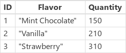
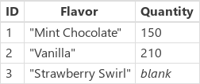

# PowerApps 中的 Update 和 UpdateIf 函数
更新[数据源](../working-with-data-sources.md)中的[记录](../working-with-tables.md#records)。

## 描述
### Update 函数
使用 **Update** 函数可替换数据源中的整个记录， 而使用 **UpdateIf** 和 **[Patch](function-patch.md)** 函数则可修改记录中的一个或多个值，对其他值不作处理。

对于[集合](../working-with-data-sources.md#collections)来说，整个记录必须匹配。 集合允许重复记录，因此可能会匹配多个记录。 可以使用 **All** 参数更新某个记录的所有副本；否则只会更新记录的一个副本。

如果数据源自动生成列的值，则该[列](../working-with-tables.md#columns)的值必须再次进行确认。

### UpdateIf 函数
使用 **UpdateIf** 函数可以在一个或多个记录中修改一个或多个值，而这些记录则与一个或多个条件匹配。 条件可以是其结果为 **true** 或 **false** 的任意公式，并且可以通过名称引用数据源的列。 函数会评估每个记录的条件，并修改结果为 **true** 的任何记录。  

若要指定某个修改，请使用包含新的属性值的更改记录。 如果使用大括号以内联方式提供此更改记录，则属性公式可以引用要修改的记录的属性。 可以通过此行为根据公式修改记录。

就像使用 **UpdateIf** 一样，也可使用 **[Patch](function-patch.md)** 函数更改记录的特定列，而不影响其他列。

**Update** 和 **UpdateIf** 都以[表](../working-with-tables.md)的形式返回修改的数据源。 必须在[行为公式](../working-with-formulas-in-depth.md)中使用任一函数。

### 委派
[!INCLUDE [delegation-no](../../../includes/delegation-no.md)]

## 语法
**Update**( *DataSource*, *OldRecord*, *NewRecord* [, **All** ] )

* *DataSource* – 必需。 数据源，其中包含要替换的记录。
* *OldRecord* - 必需。 要替换的记录。
* *NewRecord* - 必需。 替换记录。 这不是更改记录。 将替换整个记录，缺失的属性将包含“空”。
* **All** - 可选。 在集合中，同一记录可能出现多次。 指定 **All** 参数即可删除记录的所有副本。

**UpdateIf**( *DataSource*, *Condition1*, *ChangeRecord1* [, *Condition2*, *ChangeRecord2*, ... ] )

* *DataSource* – 必需。 数据源，其中包含要修改的一个或多个记录。
* *Condition(s)* - 必需。 一个公式，对于一个或多个需修改的记录，该公式的求值结果为 **true**。  可以在公式中使用 *DataSource* 的列名。  
* *ChangeRecord(s)* - 必需。  对于每个相应的条件，将对符合条件的 *DataSource* 记录应用新属性值的更改记录。 如果使用大括号以内联方式提供记录，则可在属性公式中使用现有记录的属性值。

## 示例
在以下示例中，你将替换或修改某个数据源中的记录。该数据源名为 **IceCream** 且以下表中的数据开头：

| 公式 | 描述 | 结果 |
| --- | --- | --- |
| **Update(&nbsp;IceCream, First(&nbsp;Filter(&nbsp;IceCream,&nbsp;Flavor="Chocolate"&nbsp;)&nbsp;), {&nbsp;ID:&nbsp;1,&nbsp;Flavor:&nbsp;"Mint&nbsp;Chocolate",&nbsp;Quantity:150&nbsp;} )** |替换数据源中的某条记录。 |   修改了 **IceCream** 数据源。 |
| **UpdateIf(&nbsp;IceCream, Quantity > 175, {&nbsp;Quantity:&nbsp;Quantity&nbsp;+&nbsp;10&nbsp;} )** |修改其 **Quantity** 大于 **150** 的记录。  **Quantity** 字段按 10 递增，其他字段不进行修改。 |  修改了 **IceCream** 数据源。 |
| **Update(&nbsp;IceCream, First(&nbsp;Filter(&nbsp;IceCream, Flavor="Strawberry"&nbsp;)&nbsp;), {&nbsp;ID:&nbsp;3, Flavor:&nbsp;"Strawberry Swirl"} )** |替换数据源中的某条记录。 替换记录中未提供 **Quantity** 属性，因此在结果中该属性将为“空”。 |  修改了 **IceCream** 数据源。 |
| **UpdateIf(&nbsp;IceCream, true, {&nbsp;Quantity:&nbsp;0&nbsp;} )** |将数据源中所有记录的 **Quantity** 属性的值设置为 0。 |   修改了 **IceCream** 数据源。 |

### 分步操作
1. 导入或创建名为 **Inventory** 的集合，让其显示在库中，如[在库中显示数据](../show-images-text-gallery-sort-filter.md)所述。
2. 将库命名为 **ProductGallery**。
3. 添加名为 **UnitsSold** 的滑块，将其 **Max** 属性设置为以下表达式： **ProductGallery.Selected.UnitsInStock**
4. 添加一个按钮，然后将其 **[OnSelect](../controls/properties-core.md)** 属性设置为以下公式： **UpdateIf(Inventory, ProductName = ProductGallery.Selected.ProductName, {UnitsInStock:UnitsInStock-UnitsSold.Value})**
5. 按 F5，在库中选择一个产品，使用滑块指定一个值，然后选择该按钮。
   
    所指定产品的库存单元数下降指定的数量。

