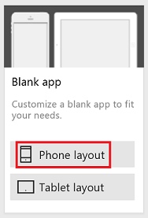
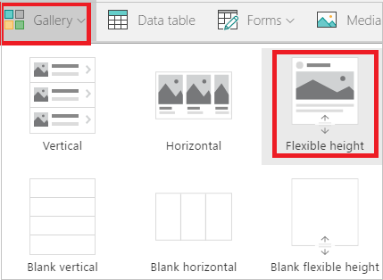
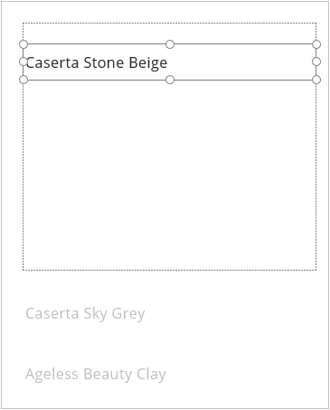
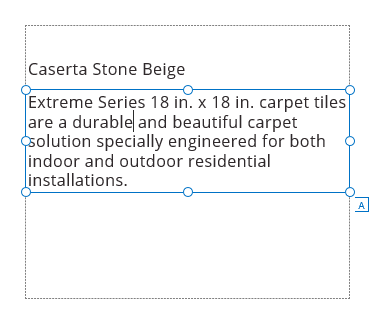
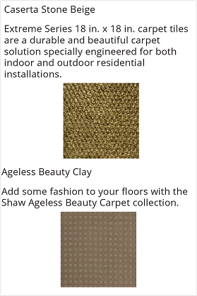

# 显示电源应用库中具有不同高度的项目
如果数据集中的不同项目在同一字段中包含的数据量不同，则可完全显示出包含更多数据的项目，而无需在包含较少数据的项目后面添加空格。 添加或配置**可变高度**库控件，以便可以：

* 将“标签”控件配置为根据内容量进行缩放。
* 放置每个控件，以便自动在其上方的控件下出现。

在本教程中，将在“可变高度”库控件中显示地板产品的相关数据。 无论概述是包含 5 行文本还是 2 行文本，每个产品的图像均以 5 个像素的大小在概述下方显示。

**推荐的阅读内容**

如果从未向库添加过控件，请先按照[显示项目列表](add-gallery.md)中的步骤操作，然后再查看此主题。

## 向空白应用添加数据
1. 下载[此 Excel 文件](https://az787822.vo.msecnd.net/documentation/get-started-from-data/FlooringEstimates.xlsx)，其中包含地板产品的名称、概述和图片链接。

    

2. 将 Excel 文件上传到云存储帐户（如 OneDrive、Dropbox 或 Google Drive）中。

3. 在 Power Apps Studio 中，单击或点击 "**文件**" 菜单上的 "**新建**"。

4. 在“空白应用”磁贴上，单击或点击“手机布局”。

    

5. 添加连接，建立与 Excel 文件中 **FlooringEstimates** 表的连接。

    有关详细信息，请参阅[添加连接](add-data-connection.md)。

## 向库添加数据
1. 在“插入”选项卡上，依次单击或点击“库”和“高度可调”。

    
2. 调整库的大小，以占据整个屏幕。

3. 将库的 **[Items](controls/properties-core.md)** 属性设置为 **FlooringEstimates**。

## 显示产品名称
1. 在库的左上角，单击或点击铅笔图标选择库模板。

    

2. 选择库模板后，向其中添加“[标签](controls/control-text-box.md)”控件。

3. 将“标签”控件的“Text”属性设置为以下表达式： 
   **ThisItem.Name**

    

## 显示产品概述
1. 选择库模板后，添加另一个“标签”控件，然后将它移到第一个“标签”控件下方。  

2. 将第二个“标签”控件的“Text”属性设置为以下表达式：  **ThisItem.Overview**

3. 选择第二个“标签”控件后，单击或点击“内容”选项卡上的名称标记图标，然后将控件重命名为“OverviewText”。

    

4. 将 **OverviewText** 框的 **AutoHeight** 属性设置为 **true**。

    此步骤可以确保该框将进行扩大或缩小来适应其内容的大小。

      

## 显示产品图像
1. 调整模板的大小，将其高度增加一倍。

    生成应用时可以更加轻松地向模板添加控件，此更改不会影响应用运行时的外观。

2. 选择库模板后，添加 **[图像](controls/control-image.md)** 控件，并将其移到 **OverviewText** 框的下方。

3. 确保将“图像”控件的 **Image** 属性设置为以下表达式： 
    ThisItem.Image

4. 根据 **OverviewText** 框的位置和大小将“图像”控件的 **[Y](controls/properties-core.md)** 属性设置为以下表达式：
    **OverviewText.Y + OverviewText.Height + 5**

    

如果要添加更多控件，请应用相同的概念：基于其上方控件的 **Y** 和 **Height** 属性设置各个控件的 **Y** 属性。

## 后续步骤
详细了解如何使用[库](working-with-forms.md)控件和[公式](working-with-formulas.md)。
