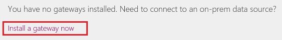

# 在 PowerApps 中管理本地数据网关
安装本地数据网关，以便在 PowerApps 中构建的画布应用和不在云中的数据源（如本地 SQL Server 数据库或本地 SharePoint 网站）之间快速、安全地传输数据。 查看拥有管理权限的所有网关，并管理这些网关的权限和连接。

借助网关，可以通过这些连接来连接到本地数据：

* SharePoint
* SQL Server
* Oracle
* Informix
* Filesystem
* DB2

## 先决条件
* [注册](../signup-for-powerapps.md) PowerApps 时使用的用户名和密码。
* 网关的管理权限。 （对于安装的每个网关，默认拥有这些权限；其他网关的管理员可以授予相应网关的这些权限。）
* 支持使用本地网关访问本地数据的许可证。 有关详细信息，请参阅[定价页](https://powerapps.microsoft.com/pricing/)的“连接性”部分。
* 只能在用户的[默认环境](working-with-environments.md)中创建和使用网关和本地连接。

## 安装网关
1. 在 [powerapps.com](https://web.powerapps.com?utm_source=padocs&utm_medium=linkinadoc&utm_campaign=referralsfromdoc) 的左侧导航栏中，单击或点击“**网关**”。

    

2. 如果没有网关的管理权限，请单击或点击“[立即安装网关](http://go.microsoft.com/fwlink/?LinkID=820931)”（或右上角的“**新建网关**”），然后按照显示的向导中的提示进行操作。

    

    若要详细了解如何安装网关，请参阅[了解本地数据网关](gateway-reference.md)。

## 查看和管理网关权限
1. 在 [powerapps.com](https://web.powerapps.com?utm_source=padocs&utm_medium=linkinadoc&utm_campaign=referralsfromdoc) 的左侧导航栏中，依次单击或点击“**网关**”和一个网关。

2. 通过单击或点击“**用户**”，指定用户或组，然后指定权限级别来将用户添加到网关：

   * **可使用**：可以在网关上创建用于应用和流的连接，但不能共享网关的用户。 对运行应用但不共享应用的用户使用此权限。
   * **可以使用 + 共享**：用户可以在网关上创建用于应用和流的连接，并在共享应用时自动共享网关。 对需要与其他用户或组织共享应用的用户使用此权限。
   * **管理员**：对网关具有完全控制权限的管理员，包括添加用户、设置权限、创建到所有可用数据源的连接以及删除网关。

对于“可使用”和“可使用和共享”权限级别，请选择用户可以通过网关连接的数据源。

## 查看和管理网关连接
1. 在 [powerapps.com](https://web.powerapps.com?utm_source=padocs&utm_medium=linkinadoc&utm_campaign=referralsfromdoc) 的左侧导航栏中，依次单击或点击“**网关**”和一个网关。

2. 依次单击或点击“连接”和一个连接，查看连接的详细信息、编辑设置或删除连接。

3. 要共享连接，请单击或点击“**共享**”，然后添加或删除用户。

    > [!NOTE]
   > 可以仅共享某些类型的连接（如 SQL Server）。 有关详细信息，请参阅 [共享应用资源](share-app-resources.md)。

若要详细了解如何管理连接，请参阅[管理连接](add-manage-connections.md)。

## 疑难解答和高级配置
若要详细了解如何排查网关问题或配置网络网关服务，请参阅[了解本地数据网关](gateway-reference.md)。

## 后续步骤
* 创建连接到本地数据源的应用，例如 [SQL Server](connections/connection-azure-sqldatabase.md) 或 [SharePoint](connections/connection-sharepoint-online.md)。
* [共享连接到本地数据源的应用](share-app.md)。
