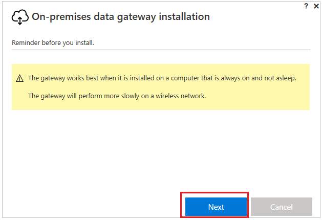
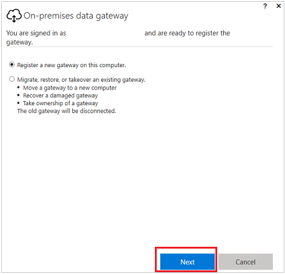
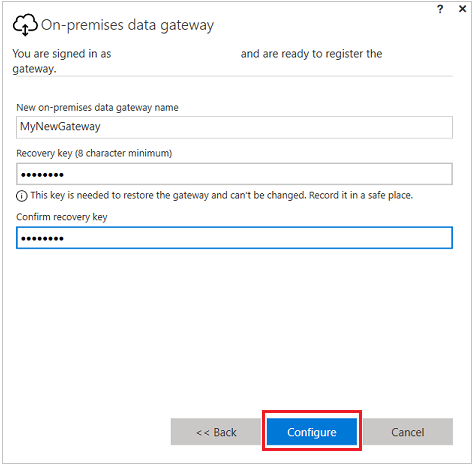
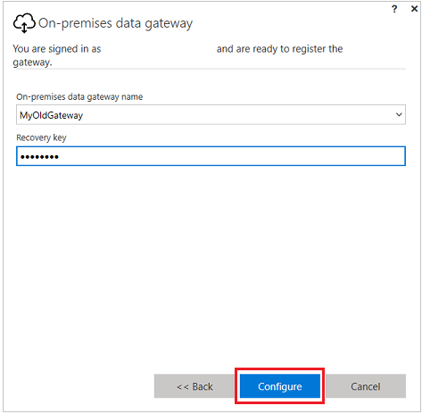
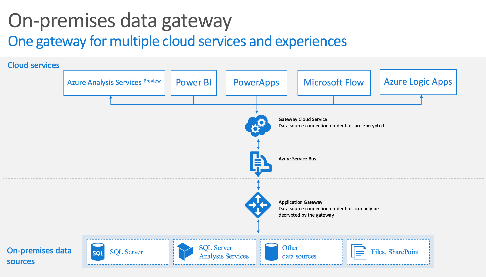

# 了解画布应用的本地数据网关
## 安装和配置
**先决条件**

最低要求：

* .NET 4.5 Framework
* Windows 7 或 Windows Server 2008 R2（或更高版本）64 位版本

建议：
* 8 核 CPU
* 8 GB 内存
* Windows 2012 R2（或更高版本）64 位版本

相关注意事项：

* 不能在域控制器上安装网关。
* 不应在可能会关闭、休眠或未连接到 Internet 的计算机（例如笔记本电脑）上安装网关，因为网关在这种情况下无法运行。 此外，在通过无线网络工作时，网关性能可能会下降。

**安装网关**

1. [下载安装程序](http://go.microsoft.com/fwlink/?LinkID=820931)，然后运行该程序。

    

2. 在安装向导的第一个屏幕上，单击或点击“下一步”确认有关在笔记本电脑上安装网关的提醒。

    

3. 指定网关的安装位置，选中接受使用条款和隐私声明的复选框，然后单击或点击“安装”。

4. 在“用户帐户控制”对话框中，单击或点击“是”继续安装。

5. 在向导的下一个屏幕上，单击或点击“登录”，然后提供用于登录到 PowerApps 的相同凭据。

    

6. 单击或点击用于注册新网关或者迁移、还原或接管现有网关的选项，然后单击或点击“下一步”。

    

   * 若要配置某个网关，请键入该网关的**名称**和**恢复密钥**，单击或点击“配置”，然后单击或点击“关闭”。

       

       指定至少包含八个字符的恢复密钥并将其保存在安全位置。 如果想要迁移、还原或接管网关，需要使用此密钥。

   * 若要迁移、还原或接管现有的网关，请提供该网关的名称和恢复密钥，单击或点击“配置”，然后遵照任何附加的提示操作。

       

**重新启动网关**

网关以 Windows 服务的形式运行，因此可通过多种方式将它启动和停止。 例如，可以在运行网关的计算机上使用提升的权限打开命令提示符，然后，运行以下命令之一：

* 若要停止该服务，请运行以下命令： 
  **net stop PBIEgwService**

* 若要启动该服务，请运行以下命令： 
  **net start PBIEgwService**

**配置防火墙或代理**

若要了解如何提供网关的代理信息，请参阅[配置代理设置](https://docs.microsoft.com/power-bi/service-gateway-proxy)。

在 PowerShell 提示符下运行以下命令可以验证防火墙或代理是否可能阻止了连接。 此命令将测试与 Azure 服务总线之间的连接。 此命令只是测试网络连接，不会与云服务器服务或网关有任何交互。 此测试有助于确定计算机是否可以真正连接到 Internet。

**Test-NetConnection -ComputerName watchdog.servicebus.windows.net -Port 9350**

结果应类似于以下示例。 如果 **TcpTestSucceeded** 不为 **True**，可能是防火墙阻止了连接。

    ComputerName           : watchdog.servicebus.windows.net
    RemoteAddress          : 70.37.104.240
    RemotePort             : 5672
    InterfaceAlias         : vEthernet (Broadcom NetXtreme Gigabit Ethernet - Virtual Switch)
    SourceAddress          : 10.120.60.105
    PingSucceeded          : False
    PingReplyDetails (RTT) : 0 ms
    TcpTestSucceeded       : True

如需详尽信息，请将 **ComputerName** 和 **Port** 值替换为本主题稍后**配置端口**部分中列出的值。

防火墙可能也会阻止 Azure 服务总线向 Azure 数据中心发起的连接。 如果是这样，请将所在区域中数据中心的 IP 地址加入允许列表（取消阻止）。 可以在[此处](https://www.microsoft.com/download/details.aspx?id=41653)获取 Azure IP 地址列表。

**配置端口**

网关与 Azure 服务总线建立出站连接。 它在出站端口上通信：TCP 443 （默认）、 5671、 5672、 9350 到 9354。 网关不需要入站端口。

了解有关[混合解决方案](https://azure.microsoft.com/documentation/articles/service-bus-fundamentals-hybrid-solutions/)的详细信息。

建议在防火墙中将数据区域的 IP 地址加入允许列表。 可以下载每周更新的 [Microsoft Azure 数据中心 IP 列表](https://www.microsoft.com/download/details.aspx?id=41653)。

> [!NOTE]
> 在 Azure 数据中心 IP 列表中，地址以 [CIDR 表示法](http://whatismyipaddress.com/cidr)列出。 例如，10.0.0.0/24 并不表示 10.0.0.0 到 10.0.0.24。

下面是网关使用的完全限定域名列表。

| 域名 | 出站端口 | 描述 |
| --- | --- | --- |
| *.analysis.windows.net |443 |HTTPS |
| *.login.windows.net |443 |HTTPS |
| *.servicebus.windows.net |5671-5672 |高级消息队列协议 (AMQP) |
| *.servicebus.windows.net |443、9350-9354 |基于 TCP 的服务总线中继上的侦听器（需要使用 443 获取访问控制令牌） |
| *.frontend.clouddatahub.net |443 |HTTPS |
| *.core.windows.net |443 |HTTPS |
| *login.microsoftonline.com |443 |HTTPS |
| *.msftncsi.com |443 |在 Power BI 服务无法访问网关时用于测试 Internet 连接。 |

**登录帐户**

用户将使用工作或学校帐户登录。 这种帐户属于组织帐户。 如果你注册了 Office 365 产品/服务，但没有提供实际的工作电子邮件，则可能类似于 nancy@contoso.onmicrosoft.com。 云服务中的帐户存储在 Azure Active Directory (AAD) 中的租户内。 大多数情况下，AAD 帐户的 UPN 与电子邮件地址匹配。

**Windows 服务帐户**

本地数据网关配置为将 *NT SERVICE\PBIEgwService* 用作 Windows 服务登录凭据。 默认情况下，网关拥有“作为服务登录”的权限。 这种权限在安装网关的计算机上下文中有效。

此帐户不是用于连接到本地数据源的帐户，也不是用于登录到云服务的工作或学校帐户。

如果代理服务器由于身份验证而发生问题，可以根据[代理配置](https://docs.microsoft.com/power-bi/service-gateway-proxy#changing-the-gateway-service-account-to-a-domain-user)中所述，将 Windows 服务帐户更改为域用户帐户或托管服务帐户。

## 租户级别管理 

目前没有一个单一的位置，可让租户管理员管理其他用户安装并配置的所有网关。  如果你是租户管理员，建议你让你组织中的用户都将你作为管理员添加到他们安装的每个网关。 这样你就可通过网关设置页或 [PowerShell 命令](https://docs.microsoft.com/power-bi/service-gateway-high-availability-clusters#powershell-support-for-gateway-clusters)来管理组织中的所有网关。

## 常见问题
#### 常规
**问：** 网关支持哪些数据源？  
**答案：** 截至本文撰写之时：

* SQL Server
* SharePoint
* Oracle
* Informix
* Filesystem
* DB2

**问：** 是否在云中，例如 SQL Azure 中的数据源需要一个网关？  
**答案：** 不。 网关只连接到本地数据源。

**问：** 什么是 Windows 服务的实际名称？  
**答案：** 在服务中，网关被称为**Power BI Enterprise Gateway Service**。

**问：** 是否有任何入站的连接到网关从云中？  
**答案：** 不。 网关使用与 Azure 服务总线之间的出站连接。

**问：** 如果我阻止出站连接？ 需要打开什么？  
**答案：** 请参阅端口和主机网关使用上面的列表。

**问：** 网关是否需要安装在与数据源相同的计算机上？  
**答案：** 不。 网关使用提供的连接信息连接到数据源。 从这种意义上讲，可将网关视为客户端应用程序。 网关只需能够连接到提供的服务器名称即可。

**问：** 从网关运行对数据源的查询的延迟是什么？ 最佳体系结构是什么？  
**答案：** 若要减少网络延迟，安装尽可能靠近数据源的位置作为网关。 如果可以在实际数据源上安装网关，这种距离可最大程度降低造成的延迟。 还需考虑数据中心。 例如，如果服务使用美国西部的数据中心，而你在 Azure VM 中托管了 SQL Server，则 Azure VM 也应该位于美国西部。 这种距离可最大程度降低延迟并避免 Azure VM 产生传出费用。

**问：** 是否有任何要求的网络带宽？  
**答案：** 建议以较高的吞吐量为网络连接。 每个环境是不同的，所发送的数据量会影响效果。 使用 ExpressRoute 可以帮助保证本地与 Azure 数据中心之间的吞吐量级别。

可以借助第三方工具 [Azure Speed Test 应用](http://azurespeedtest.azurewebsites.net/)来测量吞吐量。

**问：** 可以使用 Azure Active Directory 帐户运行网关 Windows 服务？  
**答案：** 不。 该 Windows 服务必须具有有效的 Windows 帐户。 默认情况下，服务使用服务 SID *NT SERVICE\PBIEgwService* 来运行。

**问：** 如何将结果发送回云？  
**答案：** 这是通过 Azure 服务总线的方式。 有关详细信息，请参阅[工作原理](gateway-reference.md#how-the-gateway-works)。

**问：** 我的凭据存储在何处？  
**答案：** 加密网关云服务中存储为数据源输入的凭据。 凭据在本地网关中解密。

**问：** 可以将网关放在外围网络 （也称为 DMZ、 外围安全区域和外围子网）？  
**答案：** 网关需要连接到数据源。 如果数据源不在外围网络中，网关可能无法与它建立连接。 例如，运行 SQL Server 的计算机可能不在外围网络中，因此你无法从外围网络连接到该计算机。 如果将网关放置在外围网络中，网关将无法访问运行 SQL Server 的计算机。

#### 高可用性/灾难恢复
**问：** 是否有使用网关实现高可用性方案的计划？  
**答案：** 通过加入到同一个群集的 2 个或多个网关启用高可用性。  高可用性网关群集要求对本地数据网关应用 2017 年 11 月更新或更高版本。  请参阅[博客文章公告](https://powerapps.microsoft.com/en-us/blog/gateway-high-availability-for-powerapps-and-flow)了解更多详细信息。

**问：** 可用于灾难恢复哪些选项？  
**答案：** 可以使用恢复密钥还原或移动网关。 安装网关时，请指定恢复密钥。

**问：** 恢复密钥的好处是什么？  
**答案：** 它提供了一种方法来迁移或在发生灾难后恢复网关设置。

#### 故障排除
**问：** 网关日志在哪里？  
**答案：** 请参阅[工具](gateway-reference.md#tools)本主题中更高版本。

**问：** 如何查看查询正在发送到的本地数据源？  
**答案：** 您可以启用查询跟踪，将包含要发送的查询。 请记得在完成故障排除后将查询跟踪改回原始值。 一直保持启用查询跟踪会创建大量的日志。

你也可以查看数据源用来跟踪查询的工具。 例如，可以使用 SQL Server 的扩展事件或 SQL 事件探查器以及 Analysis Services。

## 网关工作原理

当用户与连接到本地数据源的元素交互时：  

1. 云服务创建一个查询以及用于数据源的加密凭据，然后将该查询发送到队列供网关处理。

2. 网关云服务将分析该查询，并将请求推送到 [Azure 服务总线](https://azure.microsoft.com/documentation/services/service-bus/)。

3. 本地数据网关在 Azure 服务总线中轮询挂起的请求。

4. 网关获取该查询，解密凭据，然后使用这些凭据连接到数据源。

5. 网关将查询发送到数据源以便执行。

6. 结果将从数据源发回到网关，然后发送到云服务。 服务随后使用结果。

## 故障排除
#### 更新到最新版本
如果网关版本过时，可能会出现很多问题。  良好的常规做法是确保使用最新版本。  如果有一个月或更长时间未更新网关，可能要考虑安装最新版本的网关，并确定是否可以重现问题。

#### 错误：无法将用户添加到组。  (-2147463168   PBIEgwService   Performance Log Users   )
如果尝试在不受支持的域控制器上安装网关，可能会收到此错误。 需将网关部署在不是域控制器的计算机上。

## 工具
#### 从网关配置器收集日志
可以收集网关的多个日志。 请始终从日志开始！

**安装程序日志**

%localappdata%\Temp\On-premises_data_gateway_*.log

**配置日志**

%localappdata%\Microsoft\on-premises data gateway\GatewayConfigurator*.log

**企业网关服务日志**

C:\Users\PBIEgwService\AppData\Local\Microsoft\on-premises data gateway\Gateway*.log

**事件日志**

可在“应用程序和服务日志”下找到“本地数据网关服务”事件日志。

#### Fiddler 跟踪
[Fiddler](http://www.telerik.com/fiddler) 是 Telerik 提供的一个免费工具，可以监视 HTTP 流量。  可在客户端计算机中查看 Power BI 服务前前后后的活动。 此工具可显示错误和其他相关信息。
