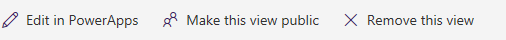

# 使用 PowerApps 从 SharePoint 中生成应用

在 PowerApps 中自动生成应用，以便用户管理自定义 SharePoint Online 列表中的项。 应用将有三个屏幕，用户可以在其中执行以下操作：

* 浏览列表中的所有记录 (**BrowseScreen1**)
* 查看特定记录的所有字段 (**DetailsScreen1**)
* 创建或编辑记录 (**EditScreen1**)

如果从 SharePoint Online 命令栏创建自定义列表的应用，则应用会显示为该列表的视图。 除了 Web 浏览器，也可在 iOS 或 Android 设备上运行应用。

> [!IMPORTANT]
> PowerApps 并不支持所有类型的 SharePoint 数据。 有关详细信息，请参阅 [已知问题](connections/connection-sharepoint-online.md#known-issues)。

## 生成应用
1. 在 SharePoint Online 中打开自定义列表，单击或点击命令栏中的“PowerApps”，然后单击或点击“创建应用”。

    

2. 在显示的面板中，键入应用的名称，然后单击或点击“创建”。

    

    此时会在 Web 浏览器中出现一个新的选项卡，其中显示根据你的 SharePoint 列表自动生成的应用。 应用出现在 PowerApps Studio 中，可以在其中进行自定义。

      
3. 单击或点击 SharePoint 列表的浏览器选项卡，然后单击或点击“打开”。

> [!NOTE]
> 可能需要先刷新浏览器窗口（例如，按 F5 刷新），然后应用才会打开。

将在单独的浏览器选项卡中打开应用。

## 管理应用

* 如果单击或点击“在 PowerApps 中编辑”，应用会在单独的浏览器选项卡中打开，你可以在 PowerApps Studio 中更新应用。

* 如果单击或点击“将此视图公开”，组织中的其他人员就可以查看它。 默认情况下，只有你可以看到你创建的视图。 若要允许他人编辑你的应用，则需[与之共享该应用](share-app.md)，然后授予其“可编辑”权限。

* 如果单击或点击“删除此视图”，会将此视图从 SharePoint 中删除，但应用仍会留在 PowerApps 中，除非[删除它](delete-app.md)。

## 后续步骤
* 自定义默认[库](customize-layout-sharepoint.md)、[窗体](customize-forms-sharepoint.md)和[卡](customize-card.md)。
