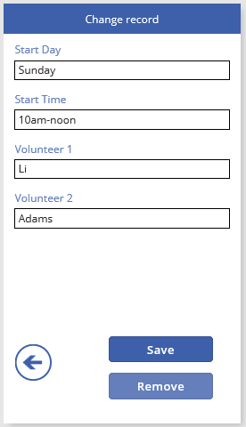
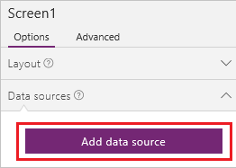
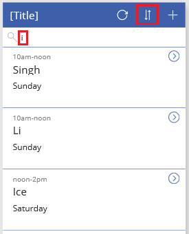
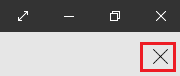

# 从头开始创建应用
使用多种数据源中的任意一种从头开始创建自己的应用，之后如果需要，还可添加更多资源。 指定每个 UI 元素的外观和行为，这样就可以优化具体目标和工作流的结果。 与[自动生成应用](get-started-create-from-data.md)相比，此方法耗费的时间要多得多，但有经验的应用创作者可以根据需要生成最佳应用。

> [!NOTE]
> 本主题针对 Windows 版 PowerApps Studio 编写，但[在浏览器中打开 PowerApps](create-app-browser.md) 的步骤是类似的。

按照本教程中的步骤进行操作，可以创建包含两个屏幕的应用。 在一个屏幕上，用户可以浏览一组记录：

在另一个屏幕上，用户可以创建记录、更新记录中的一个或多个字段，或删除整条记录：

## 先决条件
你可以查看本教程，了解一些基本概念，也可以严格按照以下步骤完成操作。

1. 复制此数据，并将其粘贴到 Excel 文件中。

   | 开始日期 | 开始时间 | 志愿者 1 | 志愿者 2 |
   | --- | --- | --- | --- |
   | 星期六 |上午 10:00-中午 |Vasquez |Kumashiro |
   | 星期六 |中午-下午 2:00 |Ice |Singhal |
   | 星期六 |下午 2:00-4:00 |Myk |Mueller |
   | 星期日 |上午 10:00-中午 |Li |Adams |
   | 星期日 |上午 10:00-中午 |Singh |Morgan |
   | 星期日 |上午 10:00-中午 |Batye |Nguyen |

2. 将该数据格式化为名为 **Schedule** 的表，以便 PowerApps 能够分析信息。

    有关详细信息，请参阅 [Create an Excel table in a worksheet](https://support.office.com/article/Create-an-Excel-table-in-a-worksheet-E81AA349-B006-4F8A-9806-5AF9DF0AC664)（在工作表中创建 Excel 表）。

3. 将文件以 **eventsignup.xls** 名称保存，然后将其上载到[云存储帐户](connections/cloud-storage-blob-connections.md)，例如 OneDrive。

4. 如果你是 PowerApps 的新用户：

   * 了解如何 [添加控件并设置其属性](add-configure-controls.md)，这将确定控件的显示方式和行为方式。
   * 了解如何 [添加和重命名屏幕](add-screen-context-variables.md)。

## 创建空白应用并连接到数据
1. 在 PowerApps Studio 中，单击或点击“文件”菜单（屏幕左边缘附近）上的“新建”。

    

2. 在“空白应用”磁贴上，单击或点击“手机布局”。

    

3. 如果系统提示，获取此简介教程，了解 PowerApps 的主要部分（也可以单击或点击“**跳过**”）。

    

    稍后可通过单击或点击屏幕左上角附近的问号图标，然后单击或点击“**简介教程**”，随时获取此教程。

4. 在左侧导航栏中，单击或点击右上角的图标，切换到缩略图视图。

    

5. 单击或点击右侧窗格中的“添加数据源”。

    

6. 执行以下任一步骤：

   * 如果已具有到云存储帐户的连接，请单击或点击该连接。
   * 如果还没有到云存储帐户的连接，请单击或点击“**添加连接**”，然后单击或点击帐户类型，接着单击或点击“**连接**”，随后（如果出现系统提示）提供你的凭据。

7. 在“**选择 Excel 文件**”下，浏览到“**eventsignup.xlsx**”，然后单击或点击该文件。

    

8. 在“**选择表**”下，选择“**计划**”复选框，然后单击或点击“**连接**”。

    

    右侧窗格的“**数据源**”选项卡显示已添加到应用的数据源。

    

    本教程仅需要一个数据源，但稍后可以添加更多的数据源。

## 显示数据
1. 在“开始”选项卡中，依次单击或点击“新屏幕”和“列表屏幕”。

    

    包含多个默认控件（如搜索框和“[库](controls/control-gallery.md)”控件）的屏幕已添加。 库覆盖搜索框下的整个屏幕。

2. 单击或点击库中的任意位置（箭头除外），如搜索框的正下方。

    

3. 在右侧窗格中，打开“布局”列表，再单击或点击显示标题、副标题和正文的选项。

    

4. 在属性列表中，单击或点击 **[Items](controls/properties-core.md)**，复制此公式，并将其粘贴到编辑栏：

    **SortByColumns(Search(Schedule, TextSearchBox1.Text, "Volunteer_x0020_1"), "Volunteer_x0020_1", If(SortDescending1, SortOrder.Descending, SortOrder.Ascending))**

    如果不确定属性列表的位置，请参阅[添加和配置控件](add-configure-controls.md)。

    > [!NOTE]
> 对于列名称带空格的 Excel 或 SharePoint 数据源，PowerApps 会将空格替换为“\_x0020\_”。 在此示例中，“Volunteer 1”列在公式中显示为“Volunteer_x0020_1”。

    此库显示来自“**Schedule**”表的数据。

    

    搜索框中可以根据用户键入的文本来筛选库。 如果用户在搜索框中键入至少一个字母，则库将仅显示**志愿者 1** 字段中包含用户键入文本的那些记录。

    排序按钮可以根据**志愿者 1** 列中的数据中对记录进行排序。 如果用户单击或点击该按钮，则排序顺序在升序和降序之间切换。

    该公式包含 **Sort**、**If**、**IsBlank**、**Filter** 和 **Text** 函数。 有关这些函数和其他函数的详细信息，请参阅[公式参考](formula-reference.md)

5. 在搜索框中键入 **i**，然后单击或点击排序图标一次（或奇数次）。

    库将显示以下结果。

    

    有关 **[Sort](functions/function-sort.md)**、**[Filter](functions/function-filter-lookup.md)** 和 [其他函数](formula-reference.md) 的详细信息

6. 单击或点击屏幕顶部的“[标签](controls/control-text-box.md)”控件以选择它。

    

7. 在属性列表中，单击或点击“**[文本](controls/properties-core.md)**”，复制此文本，然后将其粘贴到编辑栏。 
   **“查看记录”**

    

## 创建 ChangeScreen 及其横幅
1. 删除“Screen1”，并将“Screen2”重命名为“ViewScreen”。

    

2. 添加一个屏幕，并将其重命名为 **ChangeScreen**。

    

3. 在“插入”选项卡上，依次单击或点击“文本”和“[标签](controls/control-text-box.md)”。

4. 配置刚刚添加的“标签”控件：

   * 将其 **Text** 属性设置为以下公式：
      **“更改记录”**

   * 将其 **Fill** 属性设置为以下公式：
      **RGBA(62, 96, 170, 1)**。

   * 将其 **Color** 属性设置为以下公式：
      **RGBA(255, 255, 255, 1)**

   * 将其 **Align** 属性设置为 **Center**。
   * 将其 **X** 属性设置为 **0**。

   * 将其 **Width** 属性设置为 **640**。
     此时，“标签”控件会反映出你所作的更改。

     

## 添加并配置窗体
1. 在“插入”选项卡上，单击或点击“窗体”，然后单击或点击“编辑”。

2. 移动并调整窗体大小以覆盖大部分屏幕。

    

    默认情况下将此窗体命名为 **Form1**，除非已添加并删除一个窗体。 在这种情况下，将窗体重命名为 **Form1**。

3. 将 **Form1** 的 **[DataSource](controls/control-form-detail.md)** 属性设置为 **Schedule**。

4. 将 **Form1** 的 **Item** 属性设置为以下表达式：
    **BrowseGallery1.Selected**

5. 在右侧窗格中，单击或点击选中每个字段对应的复选框，以便显示相应字段。

    

6. 在窗体底部附近，单击或点击“添加自定义卡片”。

    

7. 在新卡片中添加“[标签](controls/control-text-box.md)”控件。

8. 将新控件的 **[AutoHeight](controls/control-text-box.md)** 属性设置为 **true**，并将其 **[Text](controls/properties-core.md)** 属性设置为以下公式：
    **Form1.Error**

    此时，标签会显示窗体中的所有错误。

9. 在左侧导航栏中，单击或点击对应于 **ChangeScreen** 的缩略图将其选中。

10. 在“插入”选项卡上，单击或点击“图标”，然后单击或点击添加“上一步箭头”的选项，再将该箭头移至屏幕左下角。

11. 将该箭头的 **[OnSelect](controls/properties-core.md)** 属性设置为以下公式：

     **ResetForm(Form1);Navigate(ViewScreen,ScreenTransition.None)**

      用户单击或点击此箭头时，**[Navigate](functions/function-navigate.md)** 函数将打开 **ViewScreen**。

12. 在此窗体下添加 **[按钮](controls/control-button.md)** 控件，并将该按钮的 **[Text](controls/properties-core.md)** 属性设置为 **"保存"**。

     

13. 将此按钮的 **[OnSelect](controls/properties-core.md)** 属性设置为此公式：

    **SubmitForm(Form1); If(Form1.ErrorKind = ErrorKind.None, Navigate(ViewScreen, ScreenTransition.None))**

    用户单击或点击此按钮时，**[SubmitForm](functions/function-form.md)** 函数将所有更改都保存到数据源，并且 **ViewScreen** 会重新显示。

14. 在此屏幕的底部，添加另一个按钮，将其 **[Text](controls/properties-core.md)** 属性设置为 **"删除"**，并将其 **[OnSelect](controls/properties-core.md)** 属性设置为此公式：

    **Remove(Schedule,BrowseGallery1.Selected); If(IsEmpty(Errors(Schedule)),Navigate(ViewScreen,ScreenTransition.None))**

    用户单击或点击此按钮时，**[Remove](functions/function-remove-removeif.md)** 函数将删除记录，并且 **ViewScreen** 会重新显示。

15. 将“**删除**”按钮的 **[Visible](controls/properties-core.md)** 属性设置为此公式：
     **Form1.Mode=FormMode.Edit**

    在用户创建记录时，此步骤将隐藏“**删除**”按钮。

    **ChangeScreen** 匹配此示例：

    

## 从 ViewScreen 设置导航
1. 在左侧导航栏中，单击或点击对应于 **ViewScreen** 的缩略图。

    

2. 单击或点击“下一步”箭头，获取库中的第一个记录。

    

3. 将该箭头的 **[OnSelect](controls/properties-core.md)** 属性设置为此公式：

    **Navigate(ChangeScreen,ScreenTransition.None)**

4. 在右上角单击或点击加号图标。

    

5. 将所选图标的 **[OnSelect](controls/properties-core.md)** 属性设置为此公式：

    **NewForm(Form1);Navigate(ChangeScreen,ScreenTransition.None)**`

     用户单击或点击此图标时，将显示 **ChangeScreen** 且每个字段均为空，这样用户可以更轻松地创建记录。

## 运行应用
自定义应用时，通过以预览模式运行应用，可测试所做的更改，具体如本节中的步骤所述。

1. 在左侧导航栏中，单击或点击顶部的缩略图以选择 **ViewScreen**。

    

2. 按 F5（或者单击或点击右上角附近的“**预览**”图标）打开预览模式。

    

3. 单击或点击某个记录的“下一步”箭头可显示该记录的详细信息。

4. 在 **ChangeScreen** 上，更改一个或多个字段中的信息，然后单击或点击“保存”以保存所做的更改，或单击或点击“删除”以删除记录。

5. 按 Esc（或者单击或点击标题栏下方的关闭图标）关闭预览模式。

    

## 后续步骤
* 按 Ctrl-S 在云中保存应用，以便从其他设备运行该应用。
* [共享应用](share-app.md)，便于其他人运行该应用。
* 详细了解 [库](add-gallery.md)、[窗体](add-form.md) 和 [公式](working-with-formulas.md)。
