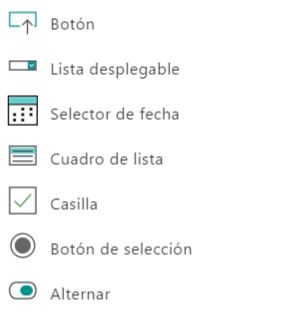
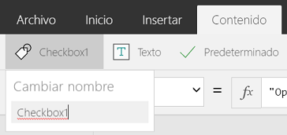

# 为画布应用构建全球支持
PowerApps 是全球性的产品。 你可以在许多不同的语言和区域中构建和使用画布应用。

生成和运行应用时，PowerApps 显示的文本已翻译成各种不同的语言。  你将看到以本地语言显示的菜单项、对话框、功能区选项卡和其他文本。  键入和显示日期与数字时也会针对你的特定语言和区域而调整。  例如，世界上的某些地区使用 **。** （圆点或句点）作为小数分隔符，而其他使用 **，** 则为（逗号）。  

你创建的应用也可以全球闻名。  使用 **[Language](functions/function-language.md)** 、 **[Text](functions/function-text.md)** 、 **[Value](functions/function-value.md)** 、 **[DateValue](functions/function-datevalue-timevalue.md)** 及其他函数可改动作为不同语言的输入而显示和使用的内容。   

## 语言设置
使用本机工作室或本机播放器时，所使用的语言由主机操作系统提供。  对于 Windows，可以在“所有设置”下的“时间和语言”设置中控制此项。  Windows 还允许你指定要用作小数分隔符的字符以覆盖语言设置。  

使用 Web 体验时，所使用的语言由浏览器提供。  大多数浏览器默认为使用主机操作系统的设置，某些浏览器还提供了手动设置语言的方式。

## 创作环境
创作环境会适应作者的语言设置。  应用本身以与语言无关的方式存储，以便使用不同语言的作者可以编辑同一应用。

### 公式中的名称
公式中的大多数元素始终用英文表示：

* 函数名称：**如果**、**导航**、**收集**。
* 控件属性名称：**Screen**、 **OnSelect**、 **Textbox、Font**。
* 枚举名称：**彩色浅绿色**， **DataSourceInfo**， **FontWeight**。
* 信号记录：**罗盘标题**，**Location。纬度**、**App.ActiveScreen**...
* 运算符**Parent**， **in**， **exactIn**，。

当创作体验已本地化时，控件及其他对象名称将以作者的本地语言显示。  西班牙语版的某些控件名称显示为：

将其中一个控件插入到应用时，其名称将默认为英语。  这样做是为了让控件属性名称与公式的其余部分保持一致。  例如，上面列出的 **Casilla** 将插入为 **Checkbox1**。  

插入控件后，可以将其名称更改为你所需的任何内容。  选中控件时，“内容”功能区的最左侧将显示控件的名称。  选择此名称会下拉出文本框，你可以在其中编辑名称：

如果你愿意，在此处可以将该控件重命名为 **Casilla1**。  在本例中，浏览器之所以显示红色波浪线是因为该名称不是西班牙语单词且不相关。

可以对以下各项使用你所需的任何名称：

* 控件名称
* 集合名称
* 上下文变量名称

### 公式分隔符和链接运算符
某些[分隔符和运算符](functions/operators.md)将基于作者的语言小数分隔符进行变换：

| 作者的语言小数分隔符 | PowerApps 小数分隔符 | PowerApps 列表分隔符 | PowerApps 链接运算符 |
| --- | --- | --- | --- |
| **.** （圆点或句点） |**.** （圆点或句点） |**,** （逗号） |**;** （分号） |
| **,** （逗号） |**,** （逗号） |**;** （分号） |**;;** （双分号） |

PowerApps 列表分隔符中的更改与 Excel 列表分隔符发生的更改一致。  它影响以下项：

* 函数调用中的参数。
* [记录](working-with-tables.md#elements-of-a-table)中的字段。
* [表](working-with-tables.md#inline-value-tables)中的记录。

例如，请考虑下面的公式，该公式使用点或句点作为小数点分隔符，如日本或英国：

现在，在用逗号作为小数点分隔符的语言和区域中查看此相同公式，如法国或西班牙：

突出显示显示两个版本之间的更改运算符。  请注意，属性选择运算符 **.** 无论小数点分隔符是什么， **slider1.value**中的（圆点或句点）始终相同。

在内部，公式不会更改，所有的更改都与作者如何显示和编辑它相关。  使用两种不同语言的两个不同的作者可以查看和编辑同一公式，每个作者都会看到相应于其语言的分隔符和运算符。

## 创建全球性的应用
你创建的应用可以适应不同语言，从而为全球的用户提供卓越的用户体验。

### Language 函数
**[Language](functions/function-language.md)** 函数可返回当前用户的语言标记。  例如，此函数对英国用户返回“en-GB”，对德国用户返回“de-DE”。  

此外，还可以使用 **Language** 为用户显示已翻译的文本。  你的应用可以包含应用中已翻译值的表：

然后可以使用如下所示的公式从该表中提取已翻译的字符串：

**LookUp( Table1, TextID = "Hello" && (LanguageTag = Left( Language(), 2 ) || IsBlank( LanguageTag ))).LocalizedText**  

请注意，将字符串翻译成其他语言后比你的语言长得多。  在很多情况下，要将在用户界面中显示字符串的标签和其他元素设计得稍宽一些，以便容纳较长的语言版本。

有关详细信息，请参阅 **[Language](functions/function-language.md)** 函数的文档。

### 设置数字、日期和时间的格式
数字、日期和时间以世界各地的不同格式编写。  逗号、小数的含义以及月、日和年的顺序因位置而异。   

**[Text](functions/function-text.md)** 函数使用用户的语言设置来设置数字和日期的格式。

**Text** 需要通过格式字符串来知道你希望如何设置数字或日期的格式。  此格式字符串可以采用以下两种形式之一：

* **全球知晓的枚举。**  例如，**Text(Now(), DateTimeFormat.LongDate)** 。  此公式将使用语言相应的格式设置当前日期的格式。  这是用于指定格式字符串的首选方法。
* **自定义格式字符串。**  例如，**Text( Now(), "[$-en-US]dddd, mmmm dd, yyyy" )** 在以语言“en-US”使用时将显示与枚举相同的文本。  自定义格式字符串的优点是，你可以确切地指定所需的格式。

自定义格式字符串前面的 "[$-en-US]" 告知 **Text** 用哪种语言解释该自定义格式字符串。  这会被插入并默认为你的创作语言。  通常不需要更改它。  在使用不同语言的作者编辑同一应用时，它将十分有用。

**Text** 的第三个参数指定要将哪种语言用于函数的结果。  默认值为当前用户的语言设置。

有关详细信息，请参阅 **[Text](functions/function-text.md)** 函数的文档。      

### 读取数字、日期和时间
有四个函数可用于读取用户提供的数字、日期和时间：

* **[值](functions/function-value.md)** ：将文本字符串中的数字转换为数字值。
* **[DateValue](functions/function-datevalue-timevalue.md)** ：将文本字符串中的日期值转换为日期/时间值。  文本字符串中指定的任何时间都将被忽略。
* **[TimeValue](functions/function-datevalue-timevalue.md)** ：将文本字符串中的时间值转换为日期/时间值。  文本字符串中指定的任何日期都将被忽略。
* **[DateTimeValue](functions/function-datevalue-timevalue.md)** ：将文本字符串中的日期和时间值转换为日期/时间值。  

如果使用了 Excel，所有这些函数均已组合到单个 **Value** 函数中。  此处将它们细分是因为 PowerApps 中的日期/时间值和数字有单独的类型。

所有这些函数都具有相同的参数：

* *String，必需*：用户的字符串。 例如，键入到“文本输入”控件中并使用 **Text** 属性从该控件中读取的字符串。
* *语言，可选*：用于解释*字符串*的语言。  默认情况下为用户的语言设置。

例如：

* 位于将“en-US”作为用户语言的地点时，**Value( "12,345.678", "en-US" )** 或 **Value( "12,345.678" )** 返回数值 **12345.678**，以用于计算。
* 位于将“es-ES”作为用户语言的地点时，**DateValue( "1/2/01", "es-ES" )** 或 **DateValue( "1/2/01" )** 返回日期/时间值 **February 1, 2001 at midnight**。
* 位于将“fr-FR”作为用户语言的地点时，**TimeValue( "11:43:02", "fr-FR" )** 或 **DateValue( "11:43:02" )** 返回日期/时间值 **January 1, 1970 at 11:43:02**。
* 位于将“de-DE”作为用户语言的地点时，**TimeDateValue( "11:43:02 1/2/01", "de-DE" )** 或 **DateValue( "11:43:02" )** 返回日期/时间值 **February 1, 2001 at 11:43:02**。

有关详细信息，请参阅有关 **[Value](functions/function-value.md)** 、 **[DateValue、TimeValue 和 DateTimeValue](functions/function-datevalue-timevalue.md)** 函数及[使用日期和时间](show-text-dates-times.md)的文档。

### 日历和时钟信息
**[Calendar](functions/function-clock-calendar.md)** 和 **[Clock](functions/function-clock-calendar.md)** 函数提供适用于用户当前语言的日历和时钟信息。  

此外，使用这些函数可为“下拉列表”控件提供选项列表。  

有关详细信息，请参阅 **[Calendar](functions/function-clock-calendar.md)** 和 **[Clock](functions/function-clock-calendar.md)** 函数的文档。
