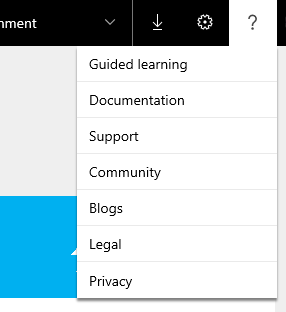
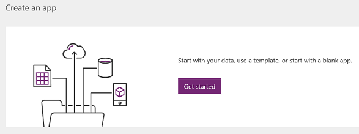
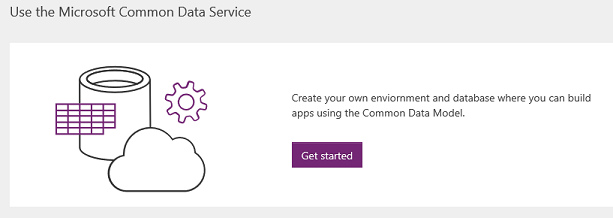
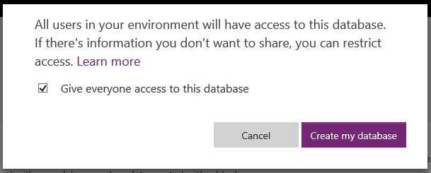
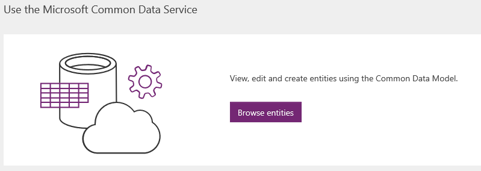
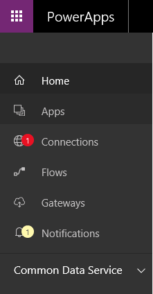
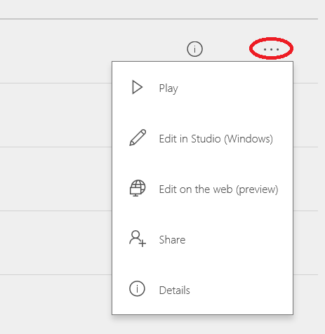

# powerapps.com 简介
PowerApps 团队将会重新引入 [powerapps.com](http://web.powerapps.com) 作为应用创建者的新门户。 我们已将页面重新设计为主站点，让创建者轻松着手创建应用，使用 Microsoft Common Data Service，以及在一个位置管理他们的应用。 本文逐步讲解以下内容：

* 标题
* 主页
* “应用”页

## 标题
注册后首次登录到 powerapps.com 时，可以看到该站点的新标题。 标题左边缘的附近是 Office 堆积圆点图标。 可通过此图标快速访问其他所有 Office 产品，例如 PowerPoint、OneNote 和 Word，以及 Microsoft Flow 和 Dynamics 365。

在标题右边缘的附近，首先看到的是环境下拉菜单，可在其中快速切换环境。 默认情况下，可能已选中“默认环境”。 [详细了解环境](../../administrator/environments-overview.md)。

在环境下拉菜单的旁边，可以看到一个下载图标。 单击或点击此图标会显示一个对话框，其中包含用于下载 PowerApps Mobile（适用于 iOS 或 Android 设备）的链接。

在下载图标的旁边，可以看到一个齿轮图标（设置）。 单击或点击此图标会显示连接、网关和管理中心的链接。

在设置的旁边，可以看到一个问号图标（帮助）。 单击或点击此图标会显示引导式学习、文档、支持、社区、博客以及法律和隐私声明的链接。

## 主页
登录 [powerapps.com](http://web.powerapps.com) 后，默认会登陆到主页。 我们已更改主页的布局，帮助你快速开始操作，不管你是要创建应用还是要探索 Common Data Service。

如果你以前已登录到 PowerApps 并且运行或创建了一些应用，主页的第一个部分将显示“最近使用的应用”列表。 应用已按照最近打开的日期排序。

在右上角的附近有一个标有“应用”的箭头，单击该箭头会直接链接到“应用”页，方便你查看所有应用。

如果你以前从未登录、创建应用或运行应用，则看到的不是“最近使用的应用”部分， 而是横幅“创建应用”。

单击或点击此横幅中的“开始”会显示用于通过“PowerApps Studio”创建应用的选项。

在“开始”的旁边，可以看到教程视频的链接，其中演示了如何基于数据快速创建应用（在 SharePoint 或 PowerApps 中），然后共享该应用。 单击“了解详情”箭头链接可转到有关如何基于现有数据创建应用的主题。

“创建应用”横幅的下面是“使用 Microsoft Common Data Service”横幅。

“Common Data Service”下面根据你的许可证或权限显示不同的按钮。

* 如果显示“开始试用”按钮，则表示你没有 PowerApps P2 许可证，而 Common Data Service 需要该许可证。 单击或点击此按钮会打开一个页面，可在其中注册此许可证的 90 天免费试用版。 [详细了解 PowerApps 许可证](../signup-for-powerapps.md)。
* 如果显示“开始”按钮，则表示你所在的环境没有 Common Data Service 数据库，或者你无权访问该数据库。 单击或点击此按钮可立即创建环境和数据库，以便可以开始将 Common Data Service 用于你的应用。 [详细了解如何创建环境](../../administrator/environments-administration.md)。
  
    
  
    如果你不想要创建环境，始终可以切换到有权访问的环境。
* 如果显示“创建数据库”按钮，则表示你所在的环境没有 Common Data Service 数据库，但你有权创建一个数据库。
  
    
  
    单击或点击此按钮将为此环境预配数据库。
  
    
* 如果显示“浏览实体”按钮，则表示你所在的环境中已预配了一个 Common Data Service 数据库，并且你有权访问该数据库。 单击或点击该按钮会打开“实体”页。
  
    

在“使用 Microsoft Common Data Service”横幅的下面，可以看到一组示例应用，以及我们创建供你使用的连接的示例应用。

* **示例应用** - 示例应用是针对采用手机或平板电脑布局的不同业务方案构建的。 单击某个应用可以快速查看该应用的用途说明、该应用适用的布局，以及该应用展示的功能，例如相机、GPS 或收音机。 新用户可以通过示例应用快速了解 PowerApps 的功能。可以使用模板在 PowerApps Studio 中创建相同的应用。
  
    
* **连接的示例应用** - 这些应用将通过数据连接（如 Office 365、Salesforce、Trello 和 Wunderlist）连接到你的数据。 这一组应用不同于上面所述的示例应用。 单击或点击某个连接的示例应用时，实际上会预配该应用的新实例（可将它视为模板）。 系统将提示你输入凭据来连接数据。 连接的示例应用带来的便利是现成地预配了一个实例，可以在 PowerApps Studio 中打开该实例，了解相应应用的构建方式。 缺点是可能需要花费相当长的时间（最多一分钟）来创建该实例。 因此，单击或点击连接的示例应用后，请耐心等待浏览器打开。
  
    

## “新建应用”页
可以通过 [powerapps.com](http://web.powerapps.com) 上的左侧导航栏访问“应用”页。

以前，“应用”页允许在磁贴视图与列表视图之间切换。 但在 2016 年 10 月 26 日后，它仅支持列表视图。

请注意，列表视图仅显示选定环境中的应用。 若要查看某个不同环境中的应用，请使用标题中的环境切换器切换到该环境。 [详细了解如何切换环境](working-with-environments.md)。

## 新功能

* 单击或点击某个应用会立即在 PowerApps Studio 的新标签页中打开该应用。
* 默认情况下，“应用”页显示你有权编辑的所有应用。 若要查看“所有应用”（包括你只能使用的应用），请选择“所有应用”筛选器。
  
   

该页面还包含：

* **我可以使用的应用**：列出与你共享的、提供“用户”权限的所有应用（只能运行这些应用）。 请注意，也可以在 [Dynamics 365](http://home.dynamics.com) 中获取这些应用。
* **我拥有的应用**：列出你创作的所有应用。
* **我参与的应用**：列出与你共享的、提供“参与者”权限的所有应用。
* **示例应用**：列出所有示例应用（未连接的示例应用）。

如果单击或点击信息圆圈，将打开应用详细信息页。

如果单击应用旁边的省略号，将显示“播放”、“编辑”、“共享”和“详细信息”等选项。

这就是 powerapps.com 上专门为应用创作者设计的主要新功能。 希望这些功能为你带来帮助。 请留言告诉我们你喜欢哪些功能，以及希望增加哪些功能。 我们很乐意倾听你的反馈！

