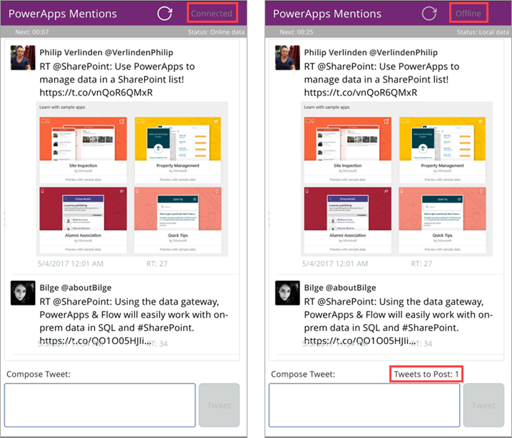

# <a name="develop-offline-capable-apps-with-powerapps"></a>使用 PowerApps 开发可脱机运行的应用
作为移动应用开发者，最常遇到的情境之一是，让用户能够在联网受限或根本无法联网的情况下高效工作。 PowerApps 提供了一系列功能和行为，有助于开发可脱机运行的应用。 你可以：

* 在脱机时启动 PowerApps 移动应用。
* 在脱机时运行你开发的应用。
* 使用 [Connection](../canvas-apps/functions/signals.md#connection) 信号对象确定应用何时处于脱机、联机或按流量计费的连接状态中。
* 在脱机时使用[集合](../canvas-apps/create-update-collection.md)或利用 [LoadData 和 SaveData](../canvas-apps/functions/function-savedata-loaddata.md) 等函数进行基本数据存储。

## <a name="how-to-build-offline-capable-apps"></a>如何生成可脱机运行的应用
在脱机情境中，首先需要考虑的是应用如何处理数据。 PowerApps 中的应用主要通过平台提供的一组[连接器](../canvas-apps/connections-list.md)（如 SharePoint、Office 365 和 Common Data Service）访问数据。 还可以生成自定义连接器，让应用能够访问任何提供 RESTful 终结点的服务。 这可以是 Web API 或 Azure Functions 等服务。 所有这些连接器都通过 Internet 使用 HTTPS。也就是说，用户必须联机，才能访问数据，并使用服务提供的其他任何功能。


### <a name="handling-offline-data"></a>处理脱机数据
PowerApps 最有趣的方面之一是，它提供一系列功能和公式，以便你可以一致地筛选、搜索、排序、聚合和管理数据，无论数据源如何。 数据源包括应用内的内存中集合、SharePoint 列表、SQL 数据库和 Common Data Service。 借助这种一致性，可以轻松地将应用重新定位为使用不同的后端。 更重要的是，还可以使用本地集合进行数据管理，几乎不用更改应用的逻辑。 实际上，本地集合是用于处理脱机数据的主要机制。

## <a name="building-an-offline-twitter-app"></a>生成脱机 Twitter 应用
为了突出应用开发的脱机方面，我们将展示简单的 Twitter 方案。 我们将生成一个应用，方便你在脱机时阅读 Twitter 帖子并提交推文。 处于联机状态时，此应用会发布推文并重新加载本地数据。

粗略来看，此应用执行以下操作：

1. 当此应用启动时（以第一屏幕的“OnVisible”属性为依据）：

   * 如果设备处于联机状态，我们会直接访问 Twitter 连接器来提取数据，然后在集合中填充这些数据。
   * 如果设备处于脱机状态，我们会使用 [LoadData](../canvas-apps/functions/function-savedata-loaddata.md) 从本地缓存文件加载数据。
   * 我们允许用户提交推文 - 在联机状态下，我们会将推文直接发布到 Twitter，并刷新本地缓存。
2. 在联机状态下，我们每 5 分钟会执行一次以下操作：

   * 发布我们在本地缓存中存储的所有推文。
   * 刷新本地缓存，并使用 [SaveData](../canvas-apps/functions/function-savedata-loaddata.md) 进行保存。

### <a name="step-1-create-a-new-phone-app"></a>第 1 步：新建手机应用
1. 打开 PowerApps Studio。
2. 依次单击或点击“新建” > “空白应用” > “手机布局”。

    

### <a name="step-2-add-a-twitter-connection"></a>第 2 步：添加 Twitter 连接

1. 依次单击或点击“内容” > “数据源”，然后选择“数据源”面板上的“添加数据源”。

2. 单击或点击“新建连接”，选择“Twitter”，然后单击或点击“创建”。

3. 输入凭据，然后创建连接。

    

### <a name="step-3-load-tweets-into-a-localtweets-collection-on-app-startup"></a>第 3 步：在此应用启动时将推文加载到“LocalTweets”集合中
选择此应用中“Screen1”的“OnVisible”属性，然后复制以下公式：

```
If(Connection.Connected,

    ClearCollect(LocalTweets, Twitter.SearchTweet("PowerApps", {maxResults: 100}));

    UpdateContext({statusText: "Online data"})

    ,

    LoadData(LocalTweets, "Tweets", true);

    UpdateContext({statusText: "Local data"})

);

LoadData(LocalTweetsToPost, "LocalTweets", true);

SaveData(LocalTweets, "Tweets")
```


此公式会检查设备是否处于联机状态：

* 如果设备处于联机状态，则会将最多 100 篇搜索词为“PowerApps”的推文加载到“LocalTweets”集合中。
* 如果设备处于脱机状态，则会从“Tweets”文件（若有）加载本地缓存。

### <a name="step-4-add-a-gallery-and-bind-it-to-the-localtweets-collection"></a>第 4 步：添加并将库绑定到“LocalTweets”集合

1. 插入一个高度可调的新库：依次单击或点击“插入” > “库” > “高度可调的空白库”。

2. 将“Items”属性设置为“LocalTweets”。

3. 添加四个“标签”控件来显示每篇推文的数据，然后将“Text”属性设置为：
   * **ThisItem.TweetText**
   * **ThisItem.UserDetails.FullName & " @" & ThisItem.UserDetails.UserName**
   * **"RT: " & ThisItem.RetweetCount**
   * **Text(DateTimeValue(ThisItem.CreatedAtIso), DateTimeFormat.ShortDateTime)**
4. 添加一个“图像”控件，然后将“Image”属性设置为“ThisItem.UserDetails.ProfileImageUrl”。

### <a name="step-5-add-a-connection-status-label"></a>第 5 步：添加连接状态标签
插入一个新“标签”控件，然后将“Text”属性设置为以下公式：

```
If (Connection.Connected, "Connected", "Offline")
```

此公式检查设备是否处于联机状态。 如果处于联机状态，标签文本显示“已连接”；否则，显示“脱机”。

### <a name="step-6-add-a-text-input-to-compose-new-tweets"></a>第 6 步：添加用于撰写新推文的文本输入控件

1. 插入一个名为“NewTweetTextInput”的新“文本输入”控件。

2. 将文本输入控件的“Reset”属性设置为“resetNewTweet”。

### <a name="step-7-add-a-button-to-post-the-tweet"></a>第 7 步：添加用于发布推文的按钮
1. 添加一个“按钮”控件，然后将“Text”属性设置为“Tweet”。
2. 将“OnSelect”属性设置为以下公式：

    ```
    If (Connection.Connected,

        Twitter.Tweet("", {tweetText: NewTweetTextInput.Text}),

        Collect(LocalTweetsToPost, {tweetText: NewTweetTextInput.Text});

        SaveData(LocalTweetsToPost, "LocalTweetsToPost")

    );

    UpdateContext({resetNewTweet: true});

    UpdateContext({resetNewTweet: false})
    ```  

此公式会检查设备是否处于联机状态：

* 如果设备处于联机状态，则会立即发布推文。
* 如果设备处于脱机状态，则会将推文捕获到“LocalTweetsToPost”集合中，并将其保存到此应用中。

然后，此公式会重置文本框中的文本。

### <a name="step-8-add-a-timer-to-check-for-tweets-every-five-minutes"></a>第 8 步：添加每五分钟检查一次推文的计时器
添加一个新“计时器”控件：

* 将“Duration”属性设置为“300000”。

* 将“AutoStart”属性设置为“true”。

* 将“OnTimerEnd”设置为以下公式：

    ```
    If(Connection.Connected,

        ForAll(LocalTweetsToPost, Twitter.Tweet("", {tweetText: tweetText}));

        Clear(LocalTweetsToPost);

        Collect(LocalTweetsToPost, {tweetText: NewTweetTextInput.Text});

        SaveData(LocalTweetsToPost, "LocalTweetsToPost");

        UpdateContext({statusText: "Online data"})
    )
    ```

此公式检查设备是否处于联机状态。 如果处于联机状态，此应用会发布“LocalTweetsToPost”集合中的所有推文。 然后，它会清除集合。

至此，此应用已经创建完，让我们先来预览一下，然后再进行测试。 左侧的此应用处于联机状态；右侧的此应用处于脱机状态，有一篇待重新联机时发布的推文。



## <a name="testing-the-app"></a>测试应用
请按照以下步骤操作，测试此应用：

1. 在处于联机状态的移动设备上运行 PowerApps。 至少必须在处于联机状态下运行一次应用，才能将应用下载到设备上。
2. 启动 Twitter 应用。
3. 你会发现，推文已加载，且状态显示为“已连接”。
4. 完全关闭 PowerApps。
5. 为了确保设备处于脱机状态，将设备设置为飞行模式。
6. 运行 PowerApps。 现在可以脱机运行 Twitter 应用，并能访问以前联机时在此设备上运行过的其他任何应用（即，PowerApps 会隐藏尚未下载到设备中的所有应用）。
7. 再次运行此应用。
8. 你会发现，此应用可以正确反映连接状态，状态显示为“脱机”。
9. 撰写新推文。 它会存储在“LocalTweetsToPost”本地集合中。
10. 退出飞行模式。 当计时器触发后，此应用发布这篇推文。

我们希望这篇文章能够帮助你了解 PowerApps 提供的用于生成脱机应用的功能。 和以往一样，请在我们的[论坛](https://powerusers.microsoft.com/t5/PowerApps-Forum/bd-p/PowerAppsForum1)中提供反馈，并在 [PowerApps 社区博客](https://powerusers.microsoft.com/t5/PowerApps-Community-Blog/bg-p/PowerAppsBlog)中分享你的脱机应用示例。

