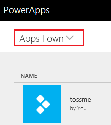
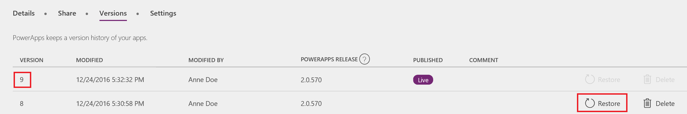

# 将应用还原到之前的版本
本文介绍了如何从 PowerApps 帐户将应用还原到保存在云中的上一版本。

## 从帐户中还原应用
1. 打开 [powerapps.com](https://web.powerapps.com)，然后在左侧导航栏中单击或点击“应用”。

    

2. （可选）在左上角附近，筛选应用列表以仅显示拥有的应用或参与的应用。

    

    > [!NOTE]
> 如果看不到要还原的应用，请确保所处环境正确无误。

3. 在右边缘附近，单击或点击要还原的应用的信息图标。

    

4. 单击或点击“版本”选项卡，然后针对要还原的版本单击或点击“还原”。

    

5. 在确认对话框中，单击或点击“还原”。  

    新版本随即添加到列表中。

    

## 更多资源
[共享应用](share-app.md)  
[更改应用名称和磁贴](set-name-tile.md)  
[删除应用](delete-app.md)
