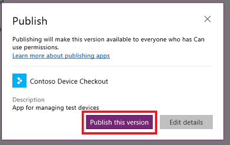

# 在 PowerApps 中保存并发布应用
每当保存应用更改时，都只会对你自己和有权编辑此应用的其他所有人自动发布更改。 完成更改后，必须显式发布更改，以便应用的所有共享对象都能使用。

若要了解如何共享应用，请参阅[共享应用](share-app.md)。

## 保存应用更改
在 PowerApps Studio 中，单击或点击左侧边缘上“文件”菜单中的“保存”，再根据需要按照下列任一步骤操作：

* 如果之前从未保存过应用，请输入应用名称，再单击或点击“保存”。

    
* 如果之前保存过应用，请单击或点击“保存”。  

    

PowerApps 也可以每 2 分钟定期保存一次应用。 如果已保存一次应用，那么 PowerApps 会继续定期保存应用的版本，用户无需点按“保存操作”。 作者可以在“帐户”选项卡上的“文件”菜单中，启用或禁用“自动保存”设置。

## 发布应用
1. 在 PowerApps Studio 中，依次单击或点击左侧边缘上“文件”菜单中的“保存”和“发布此版本”。

    
2. 在“发布”对话框中，点击或单击“发布此版本”，向所有作为应用共享对象的用户发布应用。

   

   > [!NOTE]
   > 建议在自上一次发布应用后的六个月内更新和/或重新发布应用，让它与最新版 PowerApps 保持同步。 如果未在六个月内更新和/或重新发布应用，应用可能会停止运行，而不显示任何警告。

## 确定实时版本
在 [powerapps.com](https://web.powerapps.com) 中，依次单击或点击左侧边缘上“文件”菜单中的“应用”、应用详细信息图标和“版本”选项卡。

“实时”版本会向所有作为应用共享对象的用户发布。 任何应用的最新版本都只会向拥有编辑权限的用户发布。

若要发布最新版本，请依次单击或点击“发布此版本”和“发布”对话框中的“发布此版本”。

## 后续步骤
* 在 powerapps.com 中[重命名应用](set-name-tile.md)。
* [还原应用](restore-an-app.md)（如果有多版应用的话）。
