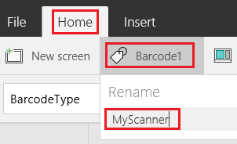
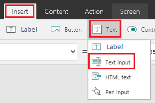
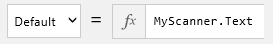
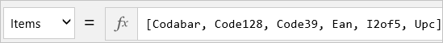

# 在 PowerApps 中扫描条形码
通过创建应用并在具有摄像头的设备（如手机）上运行应用，可扫描多种类型的条形码。 条形码的等效数字显示在“标签”控件中，可以将此数据上载到各种[数据源](connections-list.md)中。

如果不熟悉 PowerApps，请参阅[入门](getting-started.md)。

## 已知的限制
* 条形码应至少 1 英寸（2.5 厘米）高、1.5 英寸（4 厘米）宽。
* 若要使用手机扫描条形码，请纵向拿着手机，慢慢将手机移动到距离条形码 7 英寸（18 厘米）到 10 英寸（25 厘米）的位置。
* 长条形码类型（如包含 15 个或更多字符的 I2of5）可能会提供截断或其他不正确的结果，尤其是在条形码打印不清晰的情况下。
* 对于 iPhone 和 Android 设备，可指定**条形码**控件的 **Height** 属性，但固定的纵横比决定其宽度。
* 可能需要将**条形码**控件的 **Scanrate** 属性设置为 **35** 或更低。
* 若要延迟耗尽运行 iOS 的设备上的内存，请将**条形码**控件的 **Height** 属性设置为 **700**（或更低），将 **Scanrate** 属性设置为 **30**。
* 如果设备耗尽内存且应用冻结，请重启应用。

## 创建空白应用
1. [注册 PowerApps](../signup-for-powerapps.md)，然后执行下列操作*之一*：

   * 在具有摄像头的设备上的浏览器中[打开 PowerApps](https://create.powerapps.com/api/start)。
   * 在具有摄像头的设备上从 Windows 应用商店[安装 PowerApps](http://aka.ms/powerappsinstall)。 打开 PowerApps、登录，然后单击或点击“**文件**”菜单（沿左边缘）上的“**新建**”。

2. 在“从空白画布或模板开始”下方，单击或点击“空白应用”磁贴中的“手机布局”。

    

3. 如果尚未使用过 PowerApps，可通过查看简介教程来熟悉此应用的关键部分（也可以单击或点击“跳过”）。

    

    > [!NOTE]
> 稍后可以通过单击或点击右上角附近的问号图标，然后单击或点击“**获取简介教程**”，随时获取教程。

## 添加条形码控件
1. 在“插入”选项卡上，单击或点击“媒体”，然后单击或点击“条形码”。

    

2. 确保选中**条形码**控件，方法是确认选择框（具有调整控件大小的图柄）将其环绕。

    

3. 在“开始”选项卡上，单击或点击 **Barcode1**，然后在“重命名”下键入或粘贴 **MyScanner**。

    > [!TIP]
> 添加的首个“条形码”控件默认命名为“Barcode1”。 如果将其删除并添加另一个**条形码**控件，此控件默认命名为 **Barcode2**。 通过手动重命名控件，可确保公式通过正确的名称引用该控件。

    

## 添加文本输入控件
1. 在“插入”选项卡上，单击或点击“文本”，然后单击或点击“文本输入”。

    如果“插入”选项卡未显示，请最大化 PowerApps 窗口。

    

2. 向下拖动**文本输入**控件周围的选择框（而非调整图柄大小），直到它在 **MyScanner** 下显示。

    

3. 使**文本输入**控件仍处于选中状态，确保 **Default** 出现在属性列表中，然后在编辑栏中键入或粘贴 **MyScanner.Text**。

    

## 更改条形码类型
1. 在“插入”选项卡上，单击或点击“控件”，然后单击或点击“下拉列表”。

    

2. 移动**下拉列表**控件，使其显示在屏幕上其他控件的下方。

    

3. 使**下拉列表**控件仍处于选中状态，确保属性列表显示 **Items**，然后在编辑栏中键入或粘贴此文本字符串： 
    [Codabar, Code128, Code39, Ean, I2of5, Upc]

    

4. 在“开始”选项卡上，将**下拉列表**控件重命名为 **ChooseType**。

    

5. 单击或点击 **MyScanner** 将其选中，确保属性列表显示 **BarcodeType**，然后在编辑栏中键入或粘贴此文本字符串： 
    ChooseType.Selected.Value

## 测试应用程序
1. 按 F5（或者单击或点击靠近右上角的播放按钮）即可打开预览模式。

    

2. 将条形码靠近设备上的摄像头，直至条形码的数字部分显示在“标签”控件中。

    如果未显示数字部分，请尝试使用 **BarcodeType** 列表中的其他选项。 如果仍未显示正确的数据，请在**输入文本**控件中键入正确的数字。

## 后续步骤
* [将应用连接到数据源](add-data-connection.md)并配置 **[Patch](functions/function-patch.md)** 函数，使用户可以保存结果。
* 添加**[下拉列表](controls/control-drop-down.md)** 控件并进行配置，使用户可以选择想要扫描的条形码类型。
* 添加**[滑块](controls/control-slider.md)** 控件并进行配置，使用户可调整扫描速率或**条形码**控件的高度。
