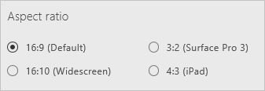

# 在 PowerApps 中更改画布应用的屏幕大小和方向
通过更改画布应用的屏幕大小和方向来自定义画布应用。

## 先决条件
1. 创建应用或打开应用进行编辑。

2. 在“**文件**”菜单上，单击或点击“**应用设置**”。

## 更改屏幕的大小和方向
1. 在“应用设置”下，单击或点击“屏幕大小和方向”。

    

2. 在“方向”列表中，单击或点击“纵向”或“横向”。

3. （仅适用于平板电脑应用）在“纵横比”下，单击或点击匹配此应用的目标设备的比率。

    

4. 在“**锁定纵横比**”下，指定“**开**”或“**关**”。

    如果锁定纵横比，应用将保持适合手机的纵横比。 如果该应用在另一种设备上运行，将无法正确显示，并可能会显示意想不到的效果。 如果解锁纵横比，应用将在其运行的设备上调整到该设备的纵横比。

5. 在“**锁定方向**”下，指定“**开**”或“**关**”。

    如果锁定应用的方向，应用将保持所指定的方向。 如果应用在具有不同屏幕方向的设备上运行，将无法正确显示，并可能会显示意想不到的效果。 如果解锁应用的方向，应用方向会调整为其运行的设备的屏幕方向。

6. 选择“**应用**”，保存所做的更改。

## 下一步
在“**文件**”菜单上，选择“**保存**”，重新发布使用新设置的应用。
