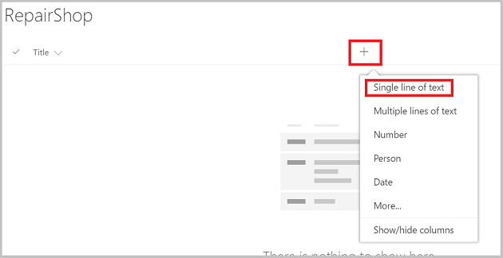
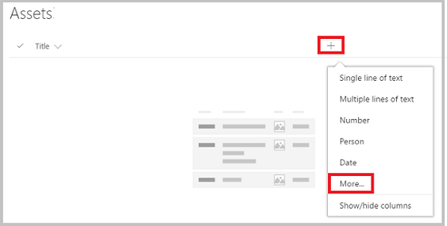
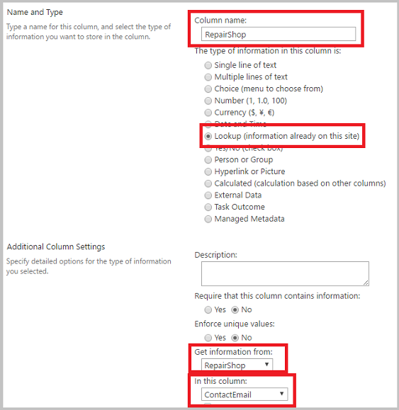
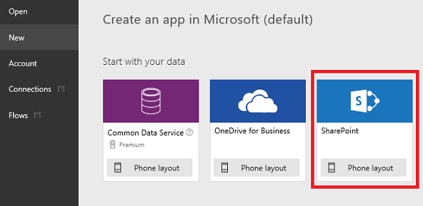
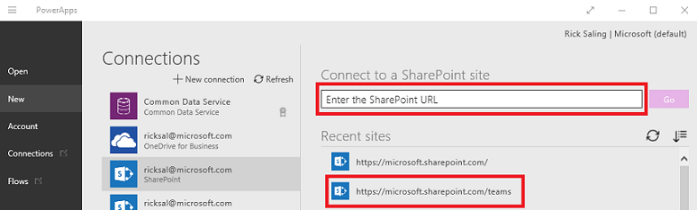
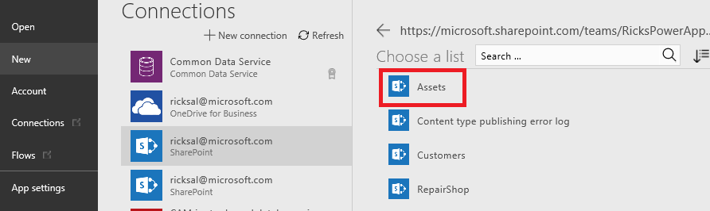
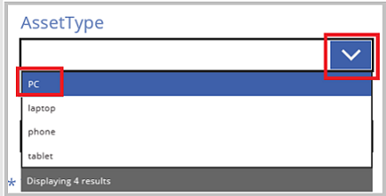
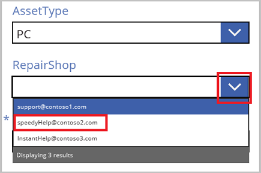

# 如何使用查阅字段链接 SharePoint 列表
本教程演示如何使用查阅字段连接两个 SharePoint 列表。

## 概述
SharePoint 提供两种查阅字段：

* **查阅**：链接到另一个列表：例如，*Orders* 列表可能有一个查阅字段，该字段链接到 *Customer* 列表中的客户；
* **选项**：单击或点击该字段会显示一个包含多个项的小菜单，你可以从中进行选择。

在本教程中，将生成一个使用这些类型的查阅字段的应用。

### “查阅”字段用于哪些场合？
企业中的数据不仅庞大，而且复杂。 一个 SharePoint 列表中的数据通常与另一个列表中的数据相关。 “查阅”字段是将此类业务数据汇集在一起的主要方式。

例如，你可能有一个包含“查阅”字段的 **Orders** 列表，该字段链接到 **Customers** 列表，以显示哪些客户已经下单。 利用 **Orders** 列表中的“查阅”字段，还可以从 **Customers** 列表中获取其他数据。 还可以使用“查阅”字段将 **Orders** 列表连接到 **Product** 列表，引入所需的已订购产品相关信息，例如产品图片、规格、制造商详细信息等等。

### “选项”字段用于哪些场合？
“选项”字段用于非常短的列表，使用此字段时，不会真的创建一个单独的列表，而是将列表值包含在一个小菜单中，当你单击或点击“选项”字段时会显示此菜单，你可以从此菜单中选择一个值。

示例包括客户状态代码、产品供货状态、省/市/自治区代码等数据，以及基本上所有较短的固定列表。 此类数据事实上可以作为单独的列表来实现，然后你可以使用“查阅”字段链接到它们，但一般来说，将其作为“选项”字段实现起来更加快捷。

## 在 SharePoint 中创建列表
在本教程中，将 **Assets** 和 **RepairShop** 两个 SharePoint 自定义列表链接在一起。 **Assets** 列表用于跟踪团队的硬件设备。 由于硬件经常损坏，因此我们使用 **RepairShop** 列表来跟踪可以修复硬件的本地商店。

### 此示例中使用的查阅字段
**RepairShop** 列表使用 *ContactEmail* 字段来标识商店。 先定义此列表，以便 **Assets** 列表中的每一行都有可以指向的内容。

**Assets** 列表具有两个查阅字段：

* 一个字段名为“RepairShop”，类型为“查阅”，它使用电子邮件地址指向 **RepairShop** 列表中的条目；
* 另一个字段名为“AssetType”，类型为“选项”，它列出此资产可能所属的硬件类型。

你极有可能会根据需要跟踪的信息定义一些附加字段。

### 定义 RepairShop 列表和添加数据
先执行此操作，以便在向 **Assets** 列表添加数据时，可从 *Assets.RepairShop* 查阅字段中选择 **RepairShop** 条目。

1. 在 SharePoint 站点上，创建一个新的 **RepairShop** 列表。

    

2. 添加“单行文本”类型的 *ContactEmail* 字段。

    

3. 添加所需的任何其他字段。

4. 单击或点击“+ 新建”向列表中输入示例数据，至少输入 3 行，每行包含不同的 *ContactEmail* 值。 当资产需要修复时，从中选择一个。

    

### 定义 Assets 列表
1. 在 SharePoint 站点上，创建一个新的 **Assets** 列表。

2. 单击或点击加号，然后选择“更多”。

    

3. 添加一个“选项”类型的 *AssetType* 字段，然后在“分行键入每个选项”文本框中，填写要在选项菜单中显示的值。 然后单击或点击“确定”。

    

4. 开始添加另一个字段，过程与步骤 2 一样：单击或点击加号，然后选择“更多”。

5. 添加一个“查阅”类型的 *RepairShop* 字段，然后从“信息来源”文本框中选择“RepairShop”，从“在此列中”文本框中选择“ContactEmail”。 然后单击或点击“确定”。

    

6. 添加所需的任何其他字段。

## 根据 Assets 列表创建应用
使用此应用向 **Assets** 列表添加数据。

1. [登录到 PowerApps Studio](http://web.powerapps.com?utm_source=padocs&utm_medium=linkinadoc&utm_campaign=referralsfromdoc)。 如果你是 PowerApps 新用户，可使用组织的电子邮件地址[免费注册](https://powerapps.microsoft.com)。

2. 在“文件”菜单中（沿左边缘），单击或点击“新建”，然后单击或点击“SharePoint”。

    

1. 从“最近访问过的站点”列表中选择 SharePoint 站点，或直接在文本框中输入站点 URL。 单击或点击“转到”。

    

1. 从 SharePoint 站点中选择主列表，此例中为 **Assets**。 单击或点击右下角的“连接”按钮。

    

## 向 Assets 列表添加数据
现在可以运行应用，查看查阅字段的“查看详细信息”屏幕的外观。

1. 按 F5，或选择“预览”(  )。

2. 单击或点击右上角的 **+** 符号以添加条目。

3. 为此资产输入“标题”。

4. 单击或点击 **AssetType** 向下箭头。 显示的值是创建此字段时输入的值。 选择其中一个条目。

    

5. 单击或点击 **RepairShop** 向下箭头。 选择其中一个条目。

    

6. 在右上角单击或点击复选标记以保存新条目。

7. （可选）重复此过程，以便向列表中添加所需数量的项。

8. 按 Esc 返回默认工作区。

## 有关
* [引入对查阅的支持以及一个新的示例应用](https://powerapps.microsoft.com/blog/support-for-lookups/)
* [性能、刷新按钮、ForAll 和多字段查阅](https://powerapps.microsoft.com/blog/performance-refresh-forall-multiple-field-lookups-531/)
* [使用 Common Data Service 数据库生成应用](data-platform-create-app.md)
* [使用 Common Data Service 数据库从头开始创建应用](data-platform-create-app-scratch.md)
