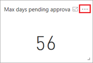
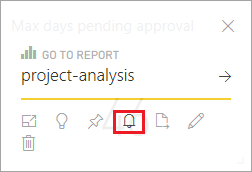
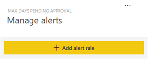
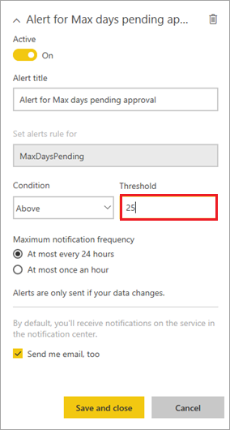
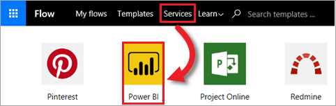
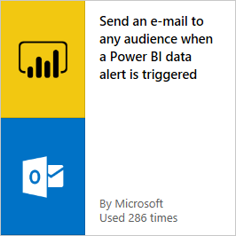
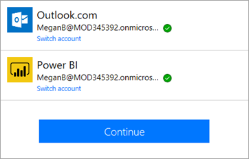
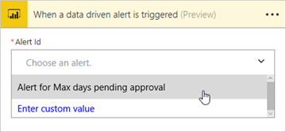
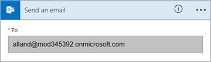
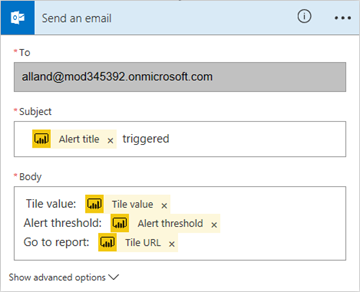

# 创建 Power BI 仪表板的数据警报
> [!NOTE]
> 本文属于介绍如何将 PowerApps、Microsoft Flow 和 Power BI 与 SharePoint Online 结合使用的系列教程。 请确保已阅读[系列介绍](sharepoint-scenario-intro.md)，了解总体情况以及相关下载内容。

在此任务中，我们将在 Power BI 中添加警报，以便了解待审批项目的等待时间是否过长，并添加用于响应触发的警报的流。 有关警报的详细信息，请参阅 [Power BI 服务中的数据警报](https://docs.microsoft.com/power-bi/service-set-data-alerts)。

## 第 1 步：创建警报
1. 在 Power BI 服务中，打开在上一任务中创建的仪表板。
2. 在显示一个数字的数据卡上，单击或点击省略号 (...)。
   
    
3. 单击或点击右上角的 。
   
    
4. 在右侧窗格中，单击或点击“添加警报规则”。
   
    
5. 查看可设置的警报选项，如警报应采用的运行频率。 在“阈值”中输入值“25”，再单击或点击“保存并关闭”。
   
    

即使 56 高于阀值 25，也不会立即触发警报。 警报将在数据更新时触发，我们将在[对此方案进行端到端演练](sharepoint-scenario-summary.md)中介绍具体情况。

警报触发后，Power BI 会向警报创建者发送电子邮件，下一步将介绍如何使用 Microsoft Flow 发送其他邮件。

## 第 2 步：创建用于响应警报的流
1. 登录 flow.microsoft.com，依次单击或点击“服务”和“Power BI”。
   
    
2. 单击或点击“在触发 Power BI 数据警报时，向任何受众发送电子邮件”。
   
    
3. 单击或点击“使用此模板”。
4. 如果尚未登录，请先登录 Outlook 和 Power BI，再单击或点击“继续”。
   
    
5. 在“警报 ID”下拉列表中，选择“最长待审批天数的警报”。
   
    
6. 在“收件人”框中，输入有效的电子邮件地址。
   
    
7. 单击或点击“编辑”，看看可以更新其他哪些字段。
   
    
8. 在屏幕的右上角，依次单击“创建流”和“完成”。
   
    

我们将在[对此方案进行端到端演练](sharepoint-scenario-summary.md)中介绍此流的运行情况。 现在，我们将继续执行此方案的最后一项任务，即将 Power BI 报表嵌入 SharePoint。

## 后续步骤
本系列教程的下一步是[将 Power BI 项目报表嵌入 SharePoint Online](sharepoint-scenario-embed-report.md)。

