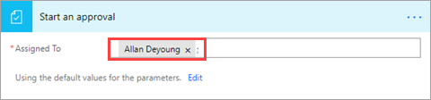
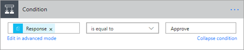
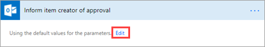
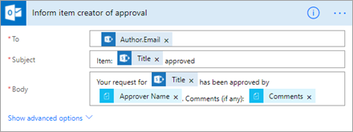
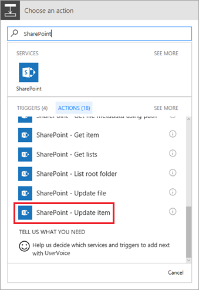
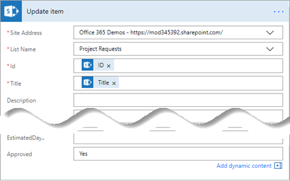
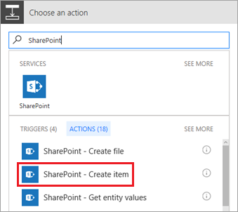
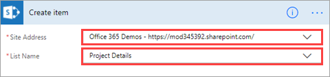
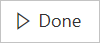
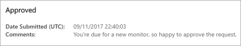

# 创建用于管理项目审批的流
> [!NOTE]
> 本文属于介绍如何将 PowerApps、Microsoft Flow 和 Power BI 与 SharePoint Online 结合使用的系列教程。 请确保已阅读[系列介绍](sharepoint-scenario-intro.md)，了解总体情况以及相关下载内容。

在此任务中，我们将创建用于驱动项目审批流程的流。 由于 Microsoft Flow 已与 SharePoint 集成，因此可以很容易地直接通过列表创建流。 当“项目申请”列表添加有新项时，将会触发我们创建的流。 此流会向项目审批者发送电子邮件，以便其可以直接在电子邮件中批准或拒绝申请。 然后，此流会向项目申请者发送批准或拒绝电子邮件，并相应地更新 SharePoint 列表。

## 步骤 1:配置流模板
1. 在“项目申请”列表中，依次单击或点击“流”和“创建流”。
   
    
2. 在右侧窗格中，单击或点击“添加新项后开始审批”。
   
    
3. 如果尚未登录，请先登录 SharePoint 和 Outlook，再单击或点击“继续”。
   
    
   
    此时，可以看到此流的模板，随时可以填写。 此流中的框表示步骤。 这些步骤需要使用前面步骤中的输入，以及你提供的输入。 然后，每个步骤便可以向后续步骤提供输出。
   
    
4. 在“分配到”框中，输入租户中的有效名称。
   
    
   
    在流中的下一个框响应项目审批者的决定，并将此流路由到一个两个*分支*:**如果是**或**如果不是**。
   
    

## 步骤 2:创建用于批准操作 = yes
默认情况下，此分支将批准电子邮件发送给申请者。 我们还会更新“项目申请”列表，并将项添加到“项目详细信息”列表中，因为此项目已获准。

1. 在“If yes”分支中，依次单击或点击“通知项创建者已获准”和“编辑”，调出发送给申请者的电子邮件的默认选项。
   
    
2. 默认情况下，将会向列表项创建者发送电子邮件，主题行和消息正文与你看到的一样。 可以根据需要更新这些内容。
   
    
3. 单击或点击“添加操作”。
   
    
4. 在“选择操作”下，搜索“SharePoint”，再单击或点击“SharePoint - 更新项”。
   
    
5. 输入 SharePoint 网站 URL 和列表名称。
   
    
6. 选择“ID”框，再单击或点击“动态内容”对话框中的“ID”。
   
    
   
    根据前面的步骤，动态内容在整个流中都可用。 在此示例中，SharePoint 列表信息可用。因此，我们可以将其用于所创建的操作。
7. 选择“Title”框，在“动态内容”对话框中搜索“Title”，再单击或点击“Title”。
   
    
8. 在“已批准”框中，输入“是”。 此时，这部分流应如下图所示。
   
    
9. 再次单击或点击“添加操作”。 这次我们将向已获准项目的“项目详细信息”列表添加一项。
   
    
10. 在“选择操作”下，搜索“SharePoint”，再选择“SharePoint - 创建项”。
    
    
11. 输入 SharePoint 网站 URL 和列表名称。
    
    
12. 选择“Title”框，在“动态内容”对话框中搜索“Title”，再单击或点击“Title”。
    
    
13. 选择“RequestId”框，再单击或点击“动态内容”对话框中的“ID”。
    
    
14. 在“PMAssigned”框中，输入“Unassigned”。 此时，这部分流应如下图所示。
    
    

## 步骤 3:查看批准的操作 = 否
默认情况下，此分支将拒绝电子邮件发送给申请者。 我们还会更新“项目申请”列表。 此项目不会有任何进展，因此我们不会将项添加到“项目详细信息”列表中。

1. 在“If no”分支中，依次单击或点击“通知项创建者已遭拒”和“编辑”，调出发送给申请者的电子邮件的默认选项。
   
    
2. 默认情况下，将会向列表项创建者发送电子邮件，主题行和消息正文与你看到的一样。 可以根据需要更新这些内容。
   
    
3. 单击或点击“添加操作”。
   
    
4. 在“选择操作”下，搜索“SharePoint”，再单击或点击“SharePoint - 更新项”。
   
    
5. 输入 SharePoint 网站 URL 和列表名称。
   
    
6. 选择“ID”框，再单击或点击“动态内容”对话框中的“ID”。
   
    
7. 选择“Title”框，在“动态内容”对话框中搜索“Title”，再单击或点击“Title”。
   
    
8. 在“已批准”框中，输入“否”。 此时，这部分流应如下图所示。
   
    
9. 单击或点击屏幕右上角的“创建流”。
   
    此时，流已创建完成。如果将框折叠起来，应如下图所示。
   
    

10. 单击或点击屏幕右上角的“完成”。
   
    

## 步骤 4：运行审批流
1. 在“项目申请”列表中，单击“快速编辑”，并添加一项，如下所示：
   
   * “Title”的值为“New monitor for Megan”

   * “Description”的值为“Megan needs a 24" monitor”

   * “ProjectType”的值为“New hardware”

   * “RequestDate”的值为“02/03/2017”

   * “Requestor”的值为“Megan Bowen”

   * “EstimatedDays”的值为“1”

   * “Approved”的值为“Pending”

     
2. 完成后，单击网页顶部的“完成”。
   
    
3. 检查审批者的电子邮件帐户的收件箱。 应收到如下电子邮件。
   
    
4. 单击“批准”或“拒绝”后，此流将运行另一进程，并直接在电子邮件中生成如下反馈。
   
    
5. 此流向 Megan 发送包含 Allan 回复的电子邮件，如下图所示。 这封电子邮件的发件人是 Megan，因为她拥有此流。
   
    

## 后续步骤
本系列教程的下一步是[创建用于管理项目的应用](sharepoint-scenario-build-app.md)。

