# 创建用于管理项目的应用
> [!NOTE]
> 本文属于介绍如何将 PowerApps、Microsoft Flow 和 Power BI 与 SharePoint Online 结合使用的系列教程。 请确保已阅读[系列介绍](sharepoint-scenario-intro.md)，了解总体情况以及相关下载内容。

在此任务中，我们将从头开始生成应用。 使用此应用，用户可以分配项目经理并更新项目详细信息。 将看到第一个应用中的一些相同控件和公式，但这次更多的是自己生成应用。 虽然此过程更加复杂，但将能学到更多知识，所以我们认为这样的取舍很公平。

> [!TIP]
> 这个方案的[下载包](https://aka.ms/o4ia0f)包含此应用的最终版本 (project-details-app.msapp)。

## 快速回顾 PowerApps Studio
PowerApps Studio 有三个窗格和一个功能区，可以在其中创建应用，就像在 PowerPoint 中创建幻灯片一样：

1. 左侧导航栏：可以显示所有应用屏幕和控件的分层视图，也可以显示屏幕缩略图
2. 中间窗格：包含正在处理的应用屏幕
3. 右侧窗格：可用于设置布局和数据源等选项
4. “属性”下拉列表：可用于选择向其应用公式的属性
5. 编辑栏：可用于添加公式来定义应用行为（就像在 Excel 中一样）
6. 功能区：可用于添加控件和自定义设计元素

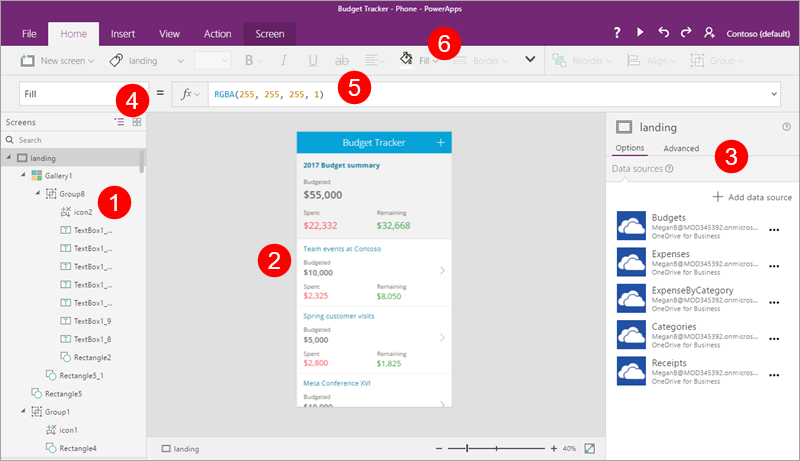

## 第 1 步：创建屏幕
在进行上面的回顾后，我们将开始生成应用。

### 创建并保存应用
1. 在 PowerApps Studio 中，依次单击或点击“新建”和“空白应用”下的“手机布局”。
   
    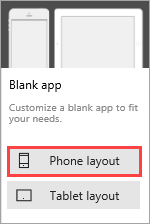
2. 单击或点击“文件”，打开“应用设置”选项卡。输入名称“项目管理应用”。
   
    
3. 单击或点击“另存为”，确认应用是否将保存到云中，再单击右下角的“保存”。
   
    

4. 单击或点击右上角的  ，返回到应用。

### 向应用添加四个屏幕
在这一步中，我们将为应用创建四个空白屏幕。 我们将使用不同的屏幕布局，具体视屏幕的用途而定。 稍后，我们将添加下面这些屏幕。

| **屏幕** | **用途** |
| --- | --- |
| **SelectTask** |起始屏幕；可转到其他屏幕 |
| **AssignManager** |向已获准的项目分配经理 |
| **ViewProjects** |查看包含摘要信息的项目列表 |
| **UpdateDetails** |查看和更新项目的详细信息 |

1. 在“开始”选项卡上，依次单击或点击“新建屏幕”和“可滚动屏幕”。
   
    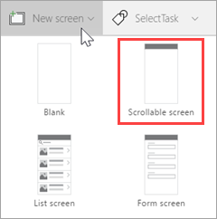
2. 将屏幕重命名为“SelectTask”。
   
    
3. 创建和重命名其他屏幕：
   
   1. 依次单击或点击“新建屏幕”和“可滚动屏幕”。 将屏幕重命名为“AssignManager”。
   2. 依次单击或点击“新建屏幕”和“列表屏幕”。 将屏幕重命名为“ViewProjects”。
   3. 依次单击或点击“新建屏幕”和“表单屏幕”。 将屏幕重命名为“UpdateDetails”。
4. 选择“Screen1”旁边的省略号 (...)，再单击或点击“删除”。
   
    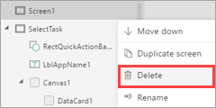

此时，应用应如下图所示。

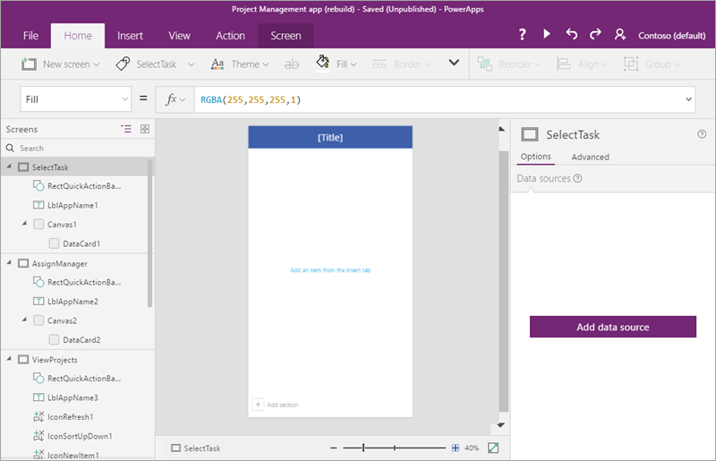

## 第 2 步：连接 SharePoint Online 列表
在这一步中，我们将连接“项目详细信息”SharePoint 列表。 虽然我们在此应用中只使用一个列表，但可以很容易地连接两个列表（若要扩展应用的话）。

1. 在左侧导航栏中，单击或点击“SelectTask”屏幕。
2. 在右侧窗格中，单击或点击“添加数据源”。
   
    
3. 单击或点击“新建连接”。
   
    
4. 单击或点击“SharePoint”。
   
    
5. 选择“直接连接(云服务)”，再单击或点击“创建”。
   
    
6. 输入 SharePoint URL，再单击或点击“前往”。
   
    
7. 选择“项目详细信息”列表，再单击或点击“连接”。
   
    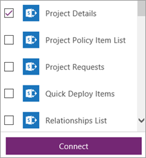
   
    此时，右侧窗格中的“数据源”选项卡显示已创建的连接。
   
    

## 第 3 步：生成“SelectTask”屏幕
在这一步中，我们将使用 PowerApps 提供的一些控件、公式和格式化选项，提供一种可转到应用中其他屏幕的途径。

### 更新标题并插入介绍性文字
1. 在左侧导航栏中，选择“SelectTask”屏幕。
2. 在中间窗格中，选择默认“[标题]”，再在编辑栏中将“Text”属性更新为“"Contoso Project Management"”。
   
    
3. 在“插入”选项卡上，单击或点击“标签”，再将标签向下拖到顶部横幅下方。
   
    
4. 在编辑栏中，为此标签设置下列属性：
   
   * “Color”属性的值为“DarkGray”

   * “Size”属性的值为“18”

   * “Text”属性的值为“"Click or tap a task to continue..."”
     
     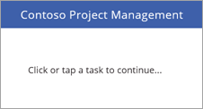

### 添加两个导航按钮
1. 在“插入”选项卡上，单击或点击“按钮”，再将按钮拖到标签下方。
   
    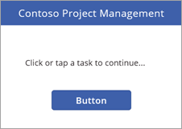
2. 在编辑栏中，为此按钮设置下列属性：
   
   * “OnSelect”属性的值为“Navigate(AssignManager, Fade)”。 运行应用并单击此按钮时，将转到应用中的第二个屏幕，并在切换屏幕时采用淡化效果。

   * “Text”属性的值为“"Assign Manager"”

3. 重设按钮大小以容纳文本。
   
    
4. 插入另一个按钮，属性如下：
   
   * “OnSelect”属性的值为“Navigate(ViewProjects, Fade)”。

   * “Text”属性的值为“"Update Details"”
     
     
     
     > [!NOTE]
     > 虽然此按钮的标签为“更新详细信息”，但会先转到“ViewProjects”屏幕，以选择要更新的项目。

### 运行应用
虽然应用尚不能执行许多操作，但可以根据需要运行应用：

1. 单击或点击“SelectTask”屏幕（应用始终以 PowerApps Studio 预览模式中的选定屏幕为起始屏幕）。

2. 单击或点击右上角的  ，运行应用。

3. 单击或点击一个按钮，转到其他屏幕。

4. 单击或点击右上角的  ，关闭应用。

## 第 4 步：生成“AssignManager”屏幕
在这一步中，我们将使用库来显示所有已获准但尚未分配有经理的项目。 我们将添加其他控件，以便用户可以分配经理。

> [!NOTE]
>  虽然稍后将在应用中生成支持编辑项目的所有字段（包括经理字段）的页面，但生成这样的屏幕也很棒。

1. 保存到目前为止所做的更改。

2. 在左侧导航栏中，单击或点击“AssignManager”屏幕。

### 更新标题并插入介绍性文字

1. 将“[标题]”更改为“分配经理”。

2. 添加具有以下属性的标签：
   
   * “Color”属性的值为“DarkGray”

   * “Size”属性的值为“18”

   * “Text”属性的值为“"Select a project, then assign a manager"”
     
     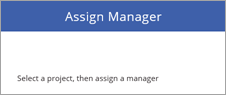

### 添加用于返回到“SelectTask”屏幕的后退箭头

1. 单击或点击屏幕顶部附近的蓝色条。

2. 在“插入”选项卡上，依次单击或点击“图标”和“向左”。
   
    

3. 将此箭头移到蓝色条的左侧，并设置下列属性：
   
   * “Color”属性的值为“White”

   * “Height”属性的值为“40”

   * “OnSelect”属性的值为“Navigate(SelectTask, Fade)”

   * “Width”属性的值为“40”
     
     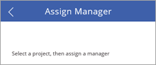

### 添加和修改库

1. 在“插入”选项卡上，依次单击或点击“库”和“垂直”。
   
    

2. 从右侧窗格的“布局”菜单中选择“标题、副标题和正文”。 
   
    
   
    此时，库拥有正确的布局，但仍显示默认示例文本。 接下来，我们将解决此问题。
   
    

3. 为此库设置下列属性：
   
   * “BorderThickness”属性的值为“1”

   * “BorderStyle”属性的值为“Dotted”

   * “Items”属性的值为“Filter('Project Details', PMAssigned="Unassigned")”。 库中仅包含没有分配经理的项目。
     
     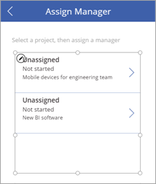

4. 在右侧窗格中，将字段更新为与以下列表一致：
   
   * **ApprovedDate**

   * **Status**

   * **Title**
     
     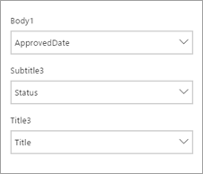

5. 适当重设库中标签大小，并从库中首项中删除箭头（无需从此库转到任何位置）。
   
    
   
    此时，屏幕应如下图所示。
   
    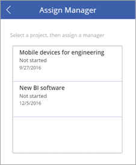

### 更改选定项的颜色

1. 选择库，并将“TemplateFill”属性设置为“If (ThisItem.IsSelected=true, Orange, White)”。

2. 在库中选择一项。 此时，屏幕应如下图所示。
   
    

### 添加用于提交项目经理分配的标签、文本输入框和“确定”按钮

1. 单击或点击一直在处理的库外部。

2. 在“插入”选项卡上，单击或点击“标签”。 将此标签拖到库下面的左侧位置上。 为此标签设置下列属性：
   
   * “Size”属性的值为“20”

   * “Text”属性的值为“"Manager:"”
   
   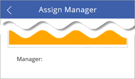

3. 在“插入”选项卡上，依次单击或点击“文本”和“文本输入”。 将此文本输入框拖到库下面的中心位置上。 为此下拉框设置下列属性：
   
   * “Default”属性的值为“""”

   * “Height”属性的值为“60”

   * “Size”属性的值为“20”

   * “Width”属性的值为“250”
   
   

4. 在“插入”选项卡上，单击或点击“按钮”。 将此按钮拖到库下面的右侧位置上。 为此按钮设置下列属性：
   
   * “Height”属性的值为“60”

   * “OnSelect”属性的值为“Patch('Project Details', LookUp('Project Details', ID = Gallery1.Selected.ID), {PMAssigned: TextInput1.Text})”。 有关详细信息，请参阅[公式详解](#formula-deep-dive)。

   * 此公式用于更新“项目详细信息”列表，同时设置“PMAssigned”字段值。

   * “Size”属性的值为“20”

   * “Text”属性的值为“"OK"”

   * “Width”属性的值为“80”
   
   

此时，完成的屏幕应如下图所示。

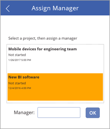

## 第 5 步：生成“ViewProjects”屏幕
在这一步中，我们将更改“ViewProjects”屏幕上库的属性。 此库显示“项目详细信息”列表中的项。 先在此屏幕上选择一项，再在“UpdateDetails”屏幕上编辑详细信息。

1. 在左侧导航栏中，单击或点击“ViewProjects”屏幕。

2. 将“[标题]”更改为“查看项目”。

3. 在左侧导航栏中，单击或点击“ViewProjects”下的“BrowserGallery1”。

4. 从右侧窗格的“布局”菜单中选择“标题、副标题和正文”。 
   
    
   
    此时，库拥有正确的布局，但仍显示默认示例文本。
   
    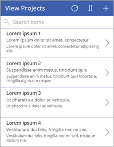

5. 选择“刷新”按钮 ，并将“OnSelect”属性设置为“Refresh('Project Details')”。

6. 选择“新建项”按钮 ，并将“OnSelect”属性设置为“NewForm(EditForm1); Navigate(UpdateDetails, ScreenTransition.None)”。

### 添加用于返回到“SelectTask”屏幕的后退箭头

1. 在左侧导航栏中，单击或点击“AssignManager”屏幕。

2. 选择并复制在此屏幕中添加的后退箭头。

3. 将箭头粘贴到“ViewProjects”屏幕中，再将它放置在“刷新”按钮的左侧。 
   
    
   
    后退箭头的所有属性都会随之转移，包括“Navigate(SelectTask, Fade)”的“OnSelect”属性。

### 更改“BrowseGallery1”库的数据源

1. 选择“BrowseGallery1”库，并将库的“Items”属性设置为“SortByColumns(Filter('Project Details', StartsWith(Title, TextSearchBox1.Text)), "Title", If(SortDescending1, Descending, Ascending))”。
   
    这会将库的数据源设置为“项目详细信息”列表，并按“Title”字段进行搜索和排序。

2. 选择库中首项的 ，并将“OnSelect”属性设置为“Navigate(UpdateDetails, None)”。
   
    

3. 在右侧窗格中，将字段更新为与以下列表一致：
   
   * **Status**

   * **PMAssigned**

   * **Title**
     
     
     
     此时，完成的屏幕应如下图所示。
     
     

## 第 6 步：生成“UpdateDetails”屏幕
在这一步中，我们将把“UpdateDetails”屏幕上的编辑表单与我们的数据源相连，并更改一些属性和字段。 在此屏幕上，可以编辑在“ViewProjects”屏幕上选择的项目的详细信息。

1. 在左侧导航栏中，单击或点击“UpdateDetails”屏幕。

2. 将“[标题]”更改为“更新详细信息”。

3. 在左侧导航栏中，单击或点击“UpdateDetails”下的“EditForm1”。

4. 为此表单设置下列属性：
   
   * “DataSource”属性的值为“Project Details”

   * “Item”属性的值为“BrowseGallery1.Selected”

5. 在仍选择此表单的情况下，在右侧窗格中单击或点击选中以下字段的复选框，顺序如下：
   
   * **Title**

   * **PMAssigned**

   * **Status**

   * **ProjectedStartDate**

   * **ProjectedEndDate**

   * **ProjectedDays**

   * **ActualDays**
     
     
6. 选择“取消”按钮 ，并将“OnSelect”属性设置为“ResetForm(EditForm1); Back()”。

7. 选择“保存”按钮 ，并检查“OnSelect”公式是否为“SubmitForm(EditForm1)”。 由于我们使用的是“编辑表单”控件，因此可以使用“Submit()”，而不是我们之前使用的“Patch()”。

此时，完成的屏幕应如下图所示（如果字段为空白，请务必在“ViewProjects”屏幕上选择一项）。

## 第 7 步：运行应用
至此，应用已创建完成。我们将运行应用，看看它能否正常运行。 我们将在 SharePoint 网站上添加应用链接。 虽然可以在浏览器中运行应用，但可能必须先共享应用，然后其他人才能运行。 有关详细信息，请参阅[共享应用](https://powerapps.microsoft.com/guided-learning/learning-manage-share-apps)。

### 添加应用链接
1. 在 Office 365 应用启动器中，单击或点击“PowerApps”。
   
    

2. 在 PowerApps 中，依次单击或点击“项目管理应用”旁边的省略号 (...) 和“打开”。
   
    

3. 复制浏览器中的应用地址 (URL)。
   
    

4. 在 SharePoint 中，单击或点击“编辑链接”。
   
    

5. 单击或点击“(+)链接”。
   
    

6. 输入“项目管理应用”，再粘贴应用地址。
   
    

7. 依次单击或点击“确定”和“保存”。
   
    

### 向项目分配经理
至此，应用已位于 SharePoint 网站中。我们将担任项目审批者的角色，查找任何没有分配经理的项目，并向其中一个项目分配经理。 然后，我们将担任项目经理的角色，添加一些有关已分配给我们的项目的信息。

1. 首先，我们将查看 SharePoint 中的“项目详细信息”列表。 两个项目的“PMAssigned”列的值为“Unassigned”。 我们将在应用中查看这两个项目。
   
    

2. 单击或点击已创建的应用链接。

3. 在第一屏上，单击或点击“分配经理”。
   
    

4. 在“分配经理”屏幕上，可以看到列表中的两个未分配项目。 选择“新建 BI 软件”项目。
   
    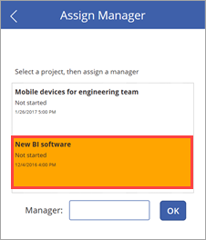

5. 在“经理”文本输入框中，输入“Joni Sherman”，再单击“确定”。
   
    此更改已应用于列表，并且库会进行刷新，因此只会显示剩余未分配的项目。
   
    

6. 返回到 SharePoint 列表，并刷新页面。 可以看到，项目条目现已更新为包含项目经理姓名。
   
    

### 更新项目详细信息

1. 单击或点击 ，返回到第一屏，再单击或点击“更新详细信息”。
   
   

2. 在“查看项目”屏幕上的搜索框中输入“新建”。
   
   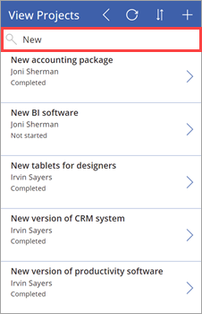

3. 单击“新建 BI 软件”项的 。
   
   

4. 在“更新详细信息”屏幕上，设置以下值：
   
   * “ProjectedStartDate”字段的值为“3/6/2017”

   * “ProjectedEndDate”字段的值为“3/24/2017”

   * “ProjectedDays”字段的值为“15”
   
   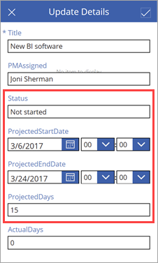

5. 单击或点击右上角的  ，将更改应用于 SharePoint 列表。

6. 关闭应用，再返回到列表。 可以看到，项目条目现已更新为包含更改后的日期和天数。
   
    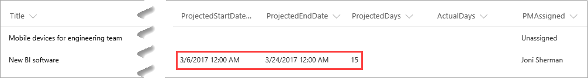

## 公式详解
这是第二个有关 PowerApps 公式的选读部分。 在第一个公式详解部分中，我们探究了 PowerApps 为三屏应用中的浏览库生成的公式之一。 在本次详解中，我们将探究对第二个应用的“AssignManager”屏幕使用的公式。 公式如下：

**Patch ( 'Project Details', LookUp ( 'Project Details', ID = Gallery1.Selected.ID ), {PMAssigned: TextInput1.Text} )**

此公式有何用途？ 在库中选择一项并单击“确定”按钮后，此公式便会更新“项目详细信息”列表，将“PMAssigned”列设置为在文本输入框中指定的值。 此公式使用以下函数来实现用途：

* [Patch 函数](functions/function-patch.md)：用于修改数据源中的一条或多条记录。

* [LookUp 函数](functions/function-filter-lookup.md)：用于查找表中首条满足公式的记录。

在此公式中结合使用这些函数后的情况如下：

1. 单击“确定”按钮后，将调用“Patch”函数来更新“项目详细信息”列表。

2. 在“Patch”函数中，“LookUp”函数标识要更新“项目详细信息”列表中的哪一行。 为此，它会比较选定库项的 ID 与列表中的 ID。 例如，ID 为 12 表示应更新“新建 BI 软件”的条目。

3. 至此，“Patch”函数包含正确的 ID，可以将“PMAssigned”字段更新为“TextInput1.Text”中的值。

## 后续步骤
本系列教程的下一步是[创建用于分析项目的 Power BI 报表](sharepoint-scenario-build-report.md)。

