# <a name="create-a-power-bi-report-to-analyze-projects"></a>创建用于分析项目的 Power BI 报表
> [!NOTE]
> 本文是有关将 Power Apps、Power 自动功能和 Power BI 与 SharePoint Online 结合使用的系列教程的一部分。 请确保已阅读[系列介绍](sharepoint-scenario-intro.md)，了解总体情况以及相关下载内容。

在此任务中，我们将创建以两个 SharePoint 列表为依据的 Power BI 报表。 我们将把列表数据导入 Power BI Desktop 并稍作清理，再进行一些基本数据建模，并创建一组可提供数据信息的视觉对象。

> [!TIP]
> 这个方案的[下载包](https://aka.ms/o4ia0f)包含此报表的最终版本 (project-analysis.pbix)。

## <a name="quick-review-of-power-bi-desktop"></a>快速回顾 Power BI Desktop
在我们深入介绍如何创建报表之前，让我们先来回顾一下 Power BI Desktop。 这是一款功能非常强大的工具，具有许多功能。那么，我们将重点概述此任务将用到的工作区。 Power BI Desktop 有以下三个主要工作区或视图：“报表”视图、“数据”视图和“关系”视图。 Power BI Desktop 还包括在单独窗口中打开的“查询编辑器”。

下面的屏幕展示了 Power BI Desktop 左侧的三个视图图标，从上到下分别为“报表”、“数据”和“关系”。 左侧的黄色条表示当前视图；在此示例中，显示的是“报表”视图。 选择这三个图标中的任何一个即可更改视图。

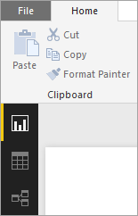

“报表”视图有五个主要区域：

1. 功能区：显示与报表和可视化效果相关联的常见任务。
2. “报表”视图或画布：可用于创建和排列可视化效果。
3. “报表页”选项卡区域：位于底部，可用于选择或添加报表页。
4. “可视化效果”窗格：可用于更改可视化效果、自定义颜色或轴、应用筛选器、拖移字段等。
5. “字段”窗格：可用于将查询元素和筛选器拖到“报表”视图上，或拖到“可视化效果”窗格的“筛选器”区域中。

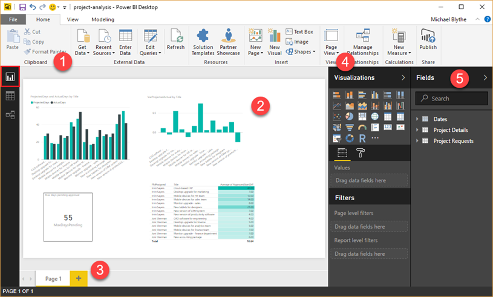

“数据”视图有三个主要区域：

1. 功能区：下面的屏幕已选择“建模”选项卡。 在此选项卡上，可以创建计算表和计算列，并对数据模型进行其他更改。
2. 中心窗格：显示选定表的数据。
3. “字段”窗格：可用于控制字段在报表中的显示方式。


我们在此任务中不会用到“关系”视图，但可以先将列表数据导入 Power BI Desktop，日后再一探究竟。

在“查询编辑器”中，生成查询并转换数据，再将优化后的数据模型加载到 Power BI Desktop 中。 “查询编辑器”有四个主要区域：

1. 功能区：包含许多选项，可便于塑造和转换所导入的数据。
2. 左窗格：其中列出了可供选择、查看和塑造的查询。
3. 中心窗格：显示选定查询的数据，可供塑造。
4. “查询设置”窗口：其中列出了查询属性和已应用的数据转换步骤。


## <a name="step-1-get-data-into-power-bi-desktop"></a>第 1 步：将数据导入 Power BI Desktop
在这一步中，我们将先连接两个列表。 然后，我们将删除对数据分析无用的列，从而清理数据。 我们还将更改剩余一些列的数据类型，以便可以正确进行计算。 若要详细了解如何获取和清理 Power BI Desktop 中的数据，请参阅我们引导学习课程中的[获取数据](https://powerbi.microsoft.com/guided-learning/powerbi-learning-1-1-overview-of-power-bi-desktop)部分。

### <a name="connect-to-sharepoint-lists"></a>连接 SharePoint 列表
1. 在 Power BI Desktop 中的“开始”选项卡上，依次单击或点击“获取数据”和“更多...”
   
    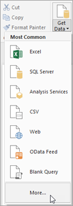
2. 在“获取数据”对话框中，依次单击或点击“SharePoint Online 列表”和“连接”。
   
    
3. 输入 SharePoint 网站的 URL，再单击或点击“确定”。
   
    
4. 如果看到以下对话框，请确保登录凭据正确，再单击或点击“连接”。
   
    
5. 选中“项目详细信息”和“项目申请”，再单击或点击“编辑”。
   
    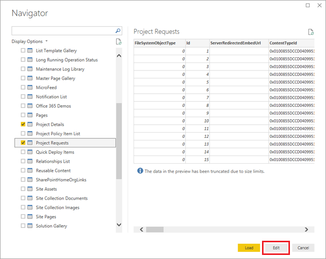
   
    此时，列表在查询编辑器中显示为表。
   
    

### <a name="remove-unnecessary-columns-from-the-tables"></a>从表中删除不必要的列
1. 在左侧导航窗格中，单击或点击“项目详细信息”。
2. 在中间窗格中，选择“FileSystemObjectType”列，再单击或点击“删除列”。
   
    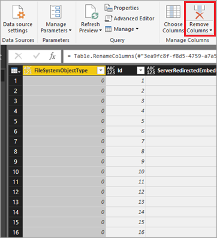
3. 删除“Id”列后的两列，即“ServerRedirectedEmbedURL”和“ContentTypeId”列。 
   > [!TIP]
   > 按 Shift 键选择这两列，再单击或点击“删除列”。
4. 删除“PMAssigned”列右侧的所有列（共 22 列）。 表应与下图一致：
   
    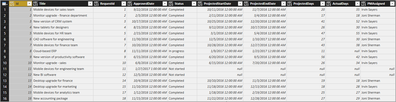
5. 重复执行刚才的过程，现在对于“项目请求”，删除 FileSystemObjectType、ServerRedirectedEmbedURL、ContentTypeId，并删除“已批准”列右侧的所有列（共 22 列）。 表应与下图一致：
   
    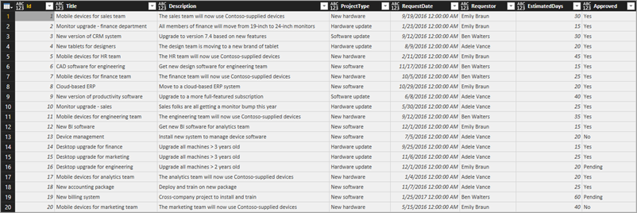

### <a name="change-the-data-type-on-project-details-columns"></a>更改“项目详细信息”表中列的数据类型
1. 选择“ProjectedDays”列，依次单击或点击“数据类型:任意”和“整数”。
   
    
2. 对“ActualDays”列重复执行上一步。
3. 选择“ApprovedDate”列，依次单击或点击“数据类型:任意”和“日期”。
   
    

4. 对“ProjectedStartDate”和“ProjectedEndDate”列重复执行上一步。

### <a name="change-the-data-type-on-project-requests-columns"></a>更改“项目申请”表中列的数据类型

1. 选择“EstimatedDays”列，依次单击或点击“数据类型:任意”和“整数”。

2. 选择“RequestDate”列，依次单击或点击“数据类型:任意”和“日期”。

### <a name="apply-and-save-changes"></a>应用并保存更改

1. 在“开始”选项卡上，单击“关闭并应用”关闭查询编辑器，再返回到 Power BI Desktop 主窗口。
   
    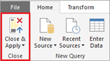

2. 依次单击或点击“文件”和“保存”，保存为 project-analysis.pbix。

## <a name="step-2-improve-the-data-model"></a>第 2 步：改进数据模型
至此，我们已将 SharePoint 列表中的数据拉取到 Power BI Desktop 中。我们将继续进行数据建模。 数据建模流程可能非常耗时，但可以执行我们将简要介绍的一些有意义操作，以便在 Power BI Desktop 中更深入地挖掘列表数据：

* 更改两个表相互关联的方式
* 添加日期表，以便我们可以根据工作日进行计算
* 添加计算列，以计算项目里程碑之间的时间跨度
* 添加度量值，以计算项目预计天数与实际天数的差异

完成这些步骤后，我们可以生成可视化效果来利用我们改进的模型。 若要详细了解如何在 Power BI Desktop 中进行数据建模，请参阅我们引导学习课程中的[建模](https://powerbi.microsoft.com/guided-learning/powerbi-learning-2-1-intro-modeling-data)部分。

### <a name="change-table-relationships"></a>更改表关系
导入列表后，Power BI Desktop 会根据两个表中的“Id”列创建表关系。 表关系实际上应该就是“项目申请”表中的“Id”列和“项目详细信息”表中的“RequestId”列之间的关系。 让我们来解决此问题：

1. 单击或点击“数据”视图图标。
   
    

2. 在“建模”选项卡上，单击或点击“管理关系”。 我们将留在“数据”视图中的这个选项卡上，继续执行所有数据建模步骤。
   
    

3. 确保已选择现有关系，依次单击或点击“删除”和“删除”进行确认。
   
    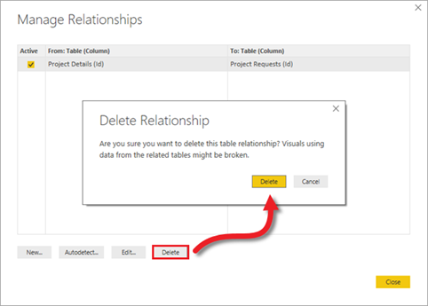

4. 单击“新建”创建其他关系。

5. 在“创建关系”对话框中：
   
   1. 对于第一个表，依次选择“项目申请”和“Id”列。
   
   2. 对于第二个表，依次选择“项目详细信息”和“RequestId”列。
   
   3. 屏幕应如下图所示。 准备就绪后，依次单击或点击“确定”和“关闭”。
      
       

### <a name="add-a-date-table-to-make-date-based-calculations-easier"></a>添加日期表，以简化基于日期的计算
1. 单击或点击“新建表”。
   
    
2. 在编辑栏中键入下面的公式：Dates = CALENDARAUTO()。
   
    
   
    此公式将创建名为“日期”的表，其中包含一个日期列。 此表涵盖了其他表中的所有日期，并会在添加其他日期（即刷新数据）时自动更新。
   
    此公式以及本部分中的其他公式使用数据分析表达式 (DAX)，这是一种适用于 Power BI 和其他技术的公式语言。 有关详细信息，请参阅 [Power BI Desktop 中的 DAX 基本概念](https://docs.microsoft.com/power-bi/desktop-quickstart-learn-dax-basics)。
3. 按 Enter，创建“日期”表。
   
    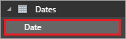

### <a name="add-a-calculated-column-to-the-dates-table"></a>向“日期”表添加计算列
1. 继续留在“日期”表，单击或点击“新建列”。
   
    
2. 在编辑栏中键入下面的公式：IsWeekDay = SWITCH(WEEKDAY(Dates[Date]), 1,0,7,0,1)。
   
    此公式用于确定“Date”列中的日期是否为工作日。 如果日期是工作日，“IsWeekDay”列的值为 1；否则，值为 0。
3. 按 Enter，将“IsWeekDay”列添加到“日期”表中。
   
    

### <a name="add-a-calculated-column-to-the-project-details-table"></a>向“项目详细信息”表添加计算列
1. 依次单击或点击右侧窗格中的“项目详细信息”表和“新建列”。
   
    
2. 在编辑栏中键入下面的公式：
   
    ```dax
    ApprovedStartDiff = CALCULATE(SUM(Dates[IsWeekday]),
       DATESBETWEEN(Dates[Date],
          'Project Details'[ApprovedDate],
          'Project Details'[ProjectedStartDate]
      )
    )
    ```
   
    此公式用于计算项目获准时间与预计开始时间的时间跨度（以天为单位）。 由于使用的是“日期”表中的“IsWeekday”列，因此只计算工作日。
3. 按 Enter，将“ApprovedStartDiff”列添加到“项目详细信息”表中。
   
    

### <a name="add-a-calculated-column-to-the-project-requests-table"></a>向“项目申请”表添加计算列
1. 依次单击或点击右侧窗格中的“项目申请”表和“新建列”。
   
    
2. 在编辑栏中键入下面的公式：
   
    ```dax
    RequestDateAge = CALCULATE(SUM(Dates[IsWeekday]),
       DATESBETWEEN(Dates[Date],
          'Project Requests'[RequestDate],
          NOW()
       )
    )
    ```
   
    此公式用于计算项目申请时间和当天日期 (NOW()) 的时间跨度（以天为单位）。 同样，此公式也只计算工作日。 此列用于查找待审批时间最长的项目。
3. 按 Enter，将“RequestDateAge”列添加到“项目申请”表中。
   
    

### <a name="add-a-measure-to-the-project-details-table"></a>向“项目详细信息”表添加度量值
1. 依次单击或点击右侧窗格中的“项目详细信息”表和“新建度量值”。
   
    
2. 在编辑栏中键入下面的公式：
   
    ```dax
    VarProjectedActual = DIVIDE(
        SUM('Project Details'[ActualDays]) - SUM('Project Details'[ProjectedDays]),
        SUM('Project Details'[ProjectedDays])
    )
    ```
   
    此公式用于计算项目实际天数与预计天数的差异。 我们添加的是度量值，而不是计算列。因此，无论如何筛选或聚合报表中的数据，系统都会返回正确的结果。
3. 按 Enter，将“VarProjectedActual”度量值添加到“项目详细信息”表中。
   
    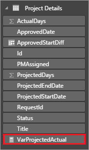

### <a name="add-a-measure-to-the-project-requests-table"></a>向“项目申请”表添加度量值
1. 依次单击或点击右侧窗格中的“项目申请”表和“新建度量值”。
   
    
2. 在编辑栏中键入下面的公式：
   
    ```dax
    MaxDaysPending = MAXX(
        FILTER('Project Requests', 'Project Requests'[Approved]="Pending"),
        'Project Requests'[RequestDateAge]
    )
    ```
   
    此公式根据我们之前定义的计算列查找待审批时间最长的项目。
3. 按 Enter，将“MaxDaysPending”度量值添加到“项目申请”表中。
   
    

## <a name="step-3-create-report-visualizations"></a>第 3 步：创建报表可视化效果
现在要执行的这一步，许多人在想到数据分析时都会想起它：即创建可视化效果，以便我们可以发现数据模式。 在这一步中，我们将创建四个可视化效果：

* 显示项目预计天数与实际天数的柱形图
* 显示每个项目的差异的柱形图
* 显示待审批时间最长的项目的数据卡
* 显示项目获准日期与预计开始日期的时间跨度的表

在 Power BI Desktop 中创建这些报表可视化效果后，我们将会把数据和报表发布到 Power BI 服务，以便可以创建和共享仪表板。 若要详细了解如何在 Power BI Desktop 中创建报表，请参阅我们引导学习课程中的[可视化效果](https://powerbi.microsoft.com/guided-learning/powerbi-learning-3-1-intro-visualizations)部分。

### <a name="create-a-bar-chart-to-show-projected-versus-actual"></a>创建显示预计天数与实际天数的条形图
1. 单击或点击“报表”视图图标。 在 Power BI Desktop 中执行操作的剩余时间内，我们将继续留在此视图中。
   
    
2. 在右侧的“可视化效果”窗格中，单击或点击“簇状柱形图”。
   
    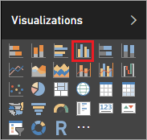
3. 将“字段”窗格内“项目详细信息”中的“PMAssigned”和“Title”拖到“可视化效果”窗格内的“轴”中。
   
    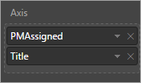
4. 将“字段”窗格内“项目详细信息”中的“ActualDays”和“ProjectedDays”拖到“可视化效果”窗格内的“值”中。
   
    
5. 此时，可视化效果应如下图所示。
   
    
6. 将“字段”窗格内“项目详细信息”中的“Status”拖到“可视化效果”窗格内的“筛选器”区域中，再选中“已完成”复选框。
   
   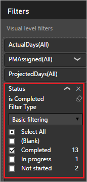
   
   此时，已在图表中筛选出已完成的项目，这样做是有意义的，因为我们在比较预计天数与实际天数。
7. 单击图表左上角的箭头可以在项目管理器和项目的层次结构中上下移动。 下图展示了如何向下钻取项目。
   
   

### <a name="create-a-bar-chart-to-show-variance-from-projected"></a>创建显示实际天数与预计天数差异的条形图
1. 在刚创建的可视化效果外，单击或点击画布。
2. 在右侧的“可视化效果”窗格中，单击或点击“簇状柱形图”。
   
    
3. 将“字段”窗格内“项目详细信息”中的“PMAssigned”和“Title”拖到“可视化效果”窗格内的“轴”中。
   
    
4. 将“字段”窗格内“项目详细信息”中的“VarProjectedActual”拖到“可视化效果”窗格内的“值”中。
   
    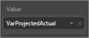
5. 将“字段”窗格内“项目详细信息”中的“Status”拖到“可视化效果”窗格内的“筛选器”区域中，再选中“已完成”复选框。
   
    
   
    此时，可视化效果应如下图所示。
   
    
   
    从此图表中可以看出，Irvin Sayers 所负责项目的实际天数与预计天数差异比 Joni Sherman 多得多。 向下钻取可以按项目显示差异，并确定预计天数是多于还是少于实际天数。
   
    
6. 创建其他可视化效果前，先移动并重设已创建可视化效果的大小，让它们适应并排显示。
   
    

### <a name="create-a-card-that-shows-the-longest-pending-project"></a>创建显示待审批时间最长的项目的数据卡
1. 在刚创建的可视化效果外，单击或点击画布。
2. 在右侧的“可视化效果”窗格中，单击或点击“数据卡”。
   
    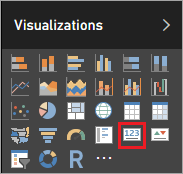
3. 将“字段”窗格内“项目申请”中的“MaxDaysPending”拖到“可视化效果”窗格内的“字段”中。
   
    
4. 单击或点击“格式”（滚动油漆刷），再将“边框”设置为“开”。
   
    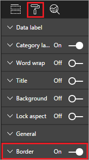
5. 将“标题”设置为“开”，再添加标题“最长待审批天数”。
   
    
   
    此时，可视化效果应如下图所示。
   
    
   
    发布此报表后，如果待审批项目的最长待审批天数达到特定阈值，我们将使用此磁贴触发警报。

### <a name="create-a-table-that-shows-the-time-between-project-approval-and-projected-start-date"></a>创建显示项目获准日期与预计开始日期的时间跨度的表
1. 在刚创建的可视化效果外，单击或点击画布。
2. 在右侧的“可视化效果”窗格中，单击或点击“表”。
   
    
3. 将“字段”窗格内“项目详细信息”中的“PMAssigned”、“Title”和“ApprovedStartDiff”拖到“可视化效果”窗格内的“值”中。
   
    
4. 将“字段”窗格内“项目详细信息”中的“ProjectedStartDate”拖到“可视化效果”窗格内的“筛选器”区域中，再选中除“(空白)”之外的所有日期。
   
    
5. 重设表列大小，以便能够看到所有数据，并按 ApprovedStartDiff 降序排序数据。 此时，可视化效果应如下图所示。
   
    
6. 在“值”区域中，依次单击或点击“ApprovedStartDiff”的向下箭头和“平均值”。 现在，可以看到从项目审批到计划开始日期的平均持续时间。
   
    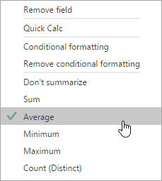
7. 再依次单击或点击“ApprovedStartDiff”的向下箭头、“条件格式”和“背景色阶”。
   
   
8. 按如下所示，设置“最小值”和“最大值”字段的颜色，再单击或点击“确定”。
   
   
   
   此时，可视化效果应如下图所示。
   
   
   
   可以看出，Irvin Sayers 负责的项目在获准后很久才启动。 虽然除了分配的经理这一因素之外，可能还有其他因素，但这是值得研究的。

报表部分到此结束，现在应生成以下列数据为依据的完整报表：从 SharePoint 导入并在 Power BI Desktop 中进行清理和建模的数据。 如果一切按计划进行，报表应如下图所示。

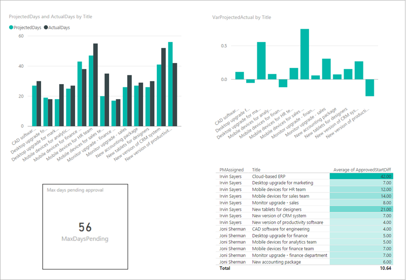

## <a name="next-steps"></a>后续步骤
本系列教程的下一步是[发布 Power BI 项目报表并创建仪表板](sharepoint-scenario-publish-report.md)。

