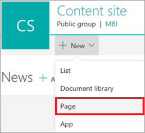
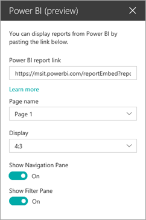
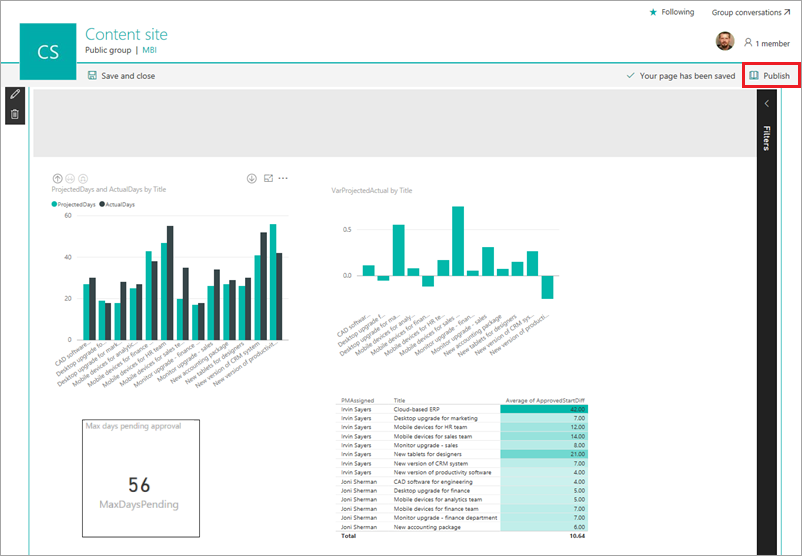

# 将 Power BI 项目报表嵌入 SharePoint Online
> [!NOTE]
> 本文属于介绍如何将 PowerApps、Microsoft Flow 和 Power BI 与 SharePoint Online 结合使用的系列教程。 请确保已阅读[系列介绍](sharepoint-scenario-intro.md)，了解总体情况以及相关下载内容。

现在，我们将把 Power BI 报表嵌入托管我们两个列表的相同 SharePoint Online 网站。 Power BI 支持多种嵌入方法，包括可将 Web 和移动视图直接集成到 SharePoint 网页的功能。

使用这种嵌入类型，Power BI 可以将报表作为 Web 部件嵌入，为用户提供适当的访问权限，并且你可以单击嵌入的报表转到 powerbi.com 上的报表。 首先，我们将在 Power BI 中生成嵌入链接，然后在我们创建的网页中使用此链接。 若要详细了解如何嵌入，请参阅[使用报表 Web 部件在 SharePoint Online 中嵌入报表](https://docs.microsoft.com/power-bi/service-embed-report-spo)。

## 第 1 步：生成嵌入链接
1. 登录 Power BI，再单击或点击左侧导航窗格中的报表名称。
   
    
2. 依次单击或点击“文件”和“在 SharePoint Online 中嵌入”。
   
    
3. 将对话框中的嵌入链接复制到文件中，再单击或点击“关闭”。 我们将在创建 SharePoint 网页后使用此链接。
   
    

## 第 2 步：嵌入报表
1. 登录 SharePoint，再单击或点击“网站内容”。
   
    
2. 虽然可以直接在团队主页上嵌入报表，但我们也将介绍如何为报表创建单独的网页。 依次单击或点击“新建”和“网页”。
   
    
3. 输入网页名称（如“项目分析”）。
4. 依次单击或点击  和“Power BI”。
   
    
5. 单击或点击“添加报表”。
   
    
6. 在右侧窗格中，将嵌入 URL 复制到“Power BI 报表链接”框中。 将“显示筛选器窗格”和“显示导航窗格”都设置为“开”。
   
    
7. 此时，报表已嵌入网页。 单击“发布”，以供所有有权访问基础报表的人员访问。
   
    

## 第 3 步：授予报表访问权限。
如果根据我们的建议使用 Office 365 组，请确保需要获取访问权限的用户是 Power BI 服务内组工作区的成员。 这样可确保用户能够查看相应组的内容。 有关详细信息，请参阅[在 Power BI 应用工作区中展开协作](https://docs.microsoft.com/power-bi/service-collaborate-power-bi-workspace)。

此方案在 Power BI 中的操作部分到此结束。 我们先是将 SharePoint 列表中的数据提取到 Power BI 中，而现在整整转了一圈，又将 Power BI 报表重新嵌入 SharePoint 中。

## 后续步骤
本系列教程的下一步是[对我们已创建的工作流进行端到端演练](sharepoint-scenario-summary.md)。

