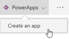
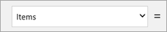
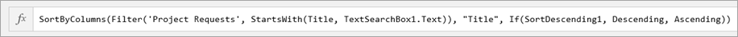
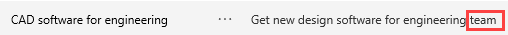

# 生成用于处理项目请求的画布应用
> [!NOTE]
> 本文是有关将 Power Apps、Power 自动功能和 Power BI 与 SharePoint Online 结合使用的系列教程的一部分。 请确保已阅读[系列介绍](sharepoint-scenario-intro.md)，了解总体情况以及相关下载内容。

至此，SharePoint 列表已创建完成，我们可以生成和自定义第一个应用了。 Power Apps 与 SharePoint 集成，因此可以轻松地直接从列表生成基本的*三屏幕应用*。 使用此应用，可以查看每个列表项的摘要和详细信息、更新现有列表项，并能新建列表项。 直接通过列表创建的应用显示为相应列表的视图。 然后，可以在浏览器和移动电话上运行此应用。

> [!TIP]
> 这个方案的[下载包](https://aka.ms/o4ia0f)包含此应用的最终版本 (project-requests-app.msapp)。

## 第 1 步：生成以 SharePoint 列表为依据的应用

1. 在已创建的“项目申请”列表中，依次单击或点击“PowerApps”和“创建应用”。
   
    

2. 命名应用（如“项目申请应用”），再单击或点击“创建”。 应用就绪后，它将在 Power Apps Studio 中打开。
   
    

## 步骤2：在 Power Apps Studio 中查看应用

1. 在 Power Apps Studio 中，左侧导航栏默认显示应用中的屏幕和控件的分层视图。
   
    

2. 单击或点击缩略图图标可以切换视图。
   
    

3. 单击或点击每个屏幕可以在中间窗格内进行查看。 此应用有三屏：
   
    (a). 浏览屏幕：可用于浏览、排序和筛选从列表中拉取的数据。
    
    (b). 详细信息屏幕：可用于查看项的详细信息。
    
    (c). 编辑/创建屏幕：可用于编辑现有项或新建项。
      
      

## 第 3 步：自定义应用的浏览屏幕

1. 单击或点击应用的浏览屏幕。
   
    此屏幕的布局包含显示列表项的库，以及其他控件（如搜索栏和排序按钮）。

2. 单击或点击除第一条之外的任意记录，选择“BrowseGallery1”控件。
   
    

3. 在右侧窗格中的“属性”下，单击或点击“项目请求”。 

4. 将字段更新为与以下列表一致：
   
   * **RequestDate**

   * **Requestor**

   * **Title**

     

5. 在仍选择“BrowseGallery1”的情况下，选择“Items”属性。
   
    

6. 将公式更改为“SortByColumns(Filter('Project Requests', StartsWith(Title, TextSearchBox1.Text)), "Title", If(SortDescending1, Descending, Ascending))”。
   
    
   
    这样，你就可以按 "**标题**" 字段进行排序和搜索，而不是选择 Power Apps 的默认值。 有关详细信息，请参阅[公式详解](#formula-deep-dive)。

6. 依次单击或点击“文件”和“保存”。 单击或点击 ，返回到应用。

## 第 4 步：查看应用的详细信息屏幕和编辑屏幕
1. 单击或点击应用的详细信息屏幕。
   
    此屏幕的布局不同，包含用于显示库中选定项的详细信息的显示表单。 它包含用于编辑和删除项的控件，以及用于返回到浏览屏幕的控件。
   
    

4. 单击或点击编辑屏幕。
   
    此屏幕包含用于编辑选定项或新建项（如果是直接从浏览屏幕转到此处的话）的编辑表单。 它包含用于保存或放弃更改的控件。

    

## 第 5 步：通过列表运行应用

1. 在“项目申请”列表中，依次单击或点击“所有项”和“项目申请应用”。
   
    
2. 单击“打开”，在新的浏览器标签页中打开应用。
   
    

3. 在应用中，单击或点击浏览库中首项的  。
   
    

4. 单击或点击右上角的  ，以编辑项。

5. 更新“Description”字段（即将最后一个词从“group”更改为“team”），再单击或点击 
   
   

6. 关闭浏览器标签页。

7. 返回到“项目申请”列表，依次单击或点击“项目申请应用”和“所有项”。
   
   
8. 验证在应用中所做的更改。
   
    

虽然这个应用非常简单，我们只进行了几项基本的自定义操作，但可以发现，很快就能生成十分有趣的内容。 我们将继续执行下一项任务，但你可以根据需要再多研究一下此应用，了解控件和公式是如何相互配合来驱动应用行为的。

## 公式详解
本部分虽为选读内容，但将有助于深入了解公式的工作原理。 在此任务的第 3 步中，我们修改了“BrowseGallery1”的“Items”属性的公式。 具体而言，我们更改了排序和搜索，以使用 "**标题**" 字段，而不是 Power Apps 选取的字段。 下面是修改后的公式：

**SortByColumns ( Filter ( 'Project Requests', StartsWith ( Title, TextSearchBox1.Text ) ), "Title", If ( SortDescending1, Descending, Ascending ) )**

但此公式有何用途？ 它用于确定库中显示的数据的来源，根据搜索框中输入的任意文本筛选数据，并根据应用中的排序按钮对结果进行排序。 此公式使用函数来实现用途。 函数需要使用参数（即输入）来执行操作（如筛选）并返回值（即输出）：

* [SortByColumns 函数](functions/function-sort.md)：根据一列或多列对表进行排序。
* [Filter 函数](functions/function-filter-lookup.md)：查找表中满足指定公式的记录。
* [StartsWith 函数](functions/function-startswith.md)：测试文本字符串是否以其他文本字符串开头。
* [If 函数](functions/function-if.md)：在条件为 true 时返回一个值，在条件为 false 时返回另一个值。

在此公式中结合使用这些函数后的情况如下：

1. 如果在搜索框中输入文本，StartsWith 函数会将此本文与列表中“Title”列内每个字符串的开头文本进行比较。
   
    **StartsWith ( Title, TextSearchBox1.Text )**
   
    例如，如果在搜索框中输入“de”，则会看到四个结果，包括以“Desktop”和“Device”开头的项。 但不会看到任何“Mobile devices”项，因为它们都不是以“de”开头。

2. Filter 函数返回“项目申请”表中的行。 如果搜索框中没有要比较的文本，Filter 函数返回所有行。
   
    **Filter ( 'Project Requests', StartsWith ( Title, TextSearchBox1.Text )**

3. If函数确定变量 SortDescending1 设置为 true 还是 false（由应用中的排序按钮进行设置）。 然后，此函数返回“Descending”或“Ascending”值。
   
    **If ( SortDescending1, Descending, Ascending )**

4. 此时，SortByColumns 函数可以对库进行排序。 在此示例中，这个函数是按“Title”字段（但可能不同于搜索所依据的字段）进行排序。

如果你坚持看到这里，我们由衷希望你能够更好地了解此公式的工作原理，以及如何将函数和其他元素结合使用来驱动所需的应用行为。 有关详细信息，请参阅 [PowerApps 的公式参考](formula-reference.md)。

## 后续步骤
本系列教程的下一步是[创建用于管理项目审批的流](sharepoint-scenario-approval-flow.md)。

