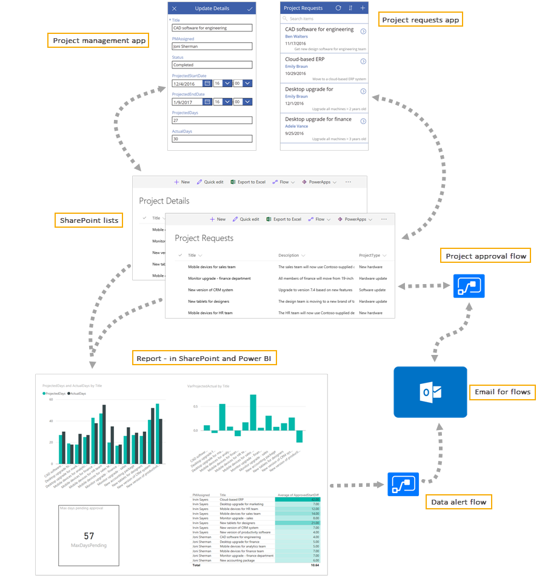

# 将 Power Apps、Power 自动功能和 Power BI 与 SharePoint Online 集成
是否在使用 SharePoint Online，并希望更好地自动执行和简化业务流程？ 你是否曾经使用过电源应用、电源自动化或 Power BI，但不确定如何将它们与 SharePoint Online 一起使用？ 你来对地方了！ 这一系列教程探讨了如何基于 SharePoint 列表和三个与 SharePoint Online 集成的关键技术来生成用于项目管理的基本画布应用：电源应用、电源自动化和 Power BI。 这些技术相互配合，以便用户可以轻松衡量业务、针对结果采取措施并自动执行工作流。 完成本系列教程后，将生成如下精彩方案：

## 业务方案
在本系列教程中，公司 Contoso 在 SharePoint Online 网站上管理项目的生命周期，包括申请、审批、开发和最后评审。 项目申请者（如部门主管）通过在 SharePoint 列表中添加项来申请 IT 项目。 项目审批者（如 IT 经理）负责审查项目，然后决定是批准还是拒绝。 如果获准，项目会分配给项目经理，并通过同一应用将其他详细信息添加到第二个列表中。 业务分析师使用 SharePoint 中嵌入的 Power BI 报表审查当前项目和已完成项目。  电源自动功能用于发送审批电子邮件并响应 Power BI 警报。

## 快速入门
相比完全成熟的项目管理和分析应用，我们在本系列教程中生成的方案非常简单，但仍需要花一些时间才能完成所有任务。 如果只是想要快速了解如何在 SharePoint 中使用 Power Apps、Power 自动功能和 Power BI，请参阅以下文章：

* **PowerApps**：[使用 Power Apps 从 sharepoint 中生成应用程序](app-from-sharepoint.md#generate-an-app-from-within-sharepoint-online)，并[生成用于管理 SharePoint 列表中的数据的应用程序](app-from-sharepoint.md)
* **电源自动**执行：[等待批准以自动执行](https://docs.microsoft.com/flow/wait-for-approvals)
* **Power BI**：[使用报表 Web 部件在 SharePoint Online 中嵌入报表](https://docs.microsoft.com/power-bi/service-embed-report-spo)

完成后，建议返回查看此完整方案。

即使在此方案中，仍可以重点关注感兴趣的任务，并在有时间时完成任务。 在任务 1 中创建 SharePoint 列表后，可以按任意顺序执行任务 2-5，然后依序执行任务 6-8。 最后，我们在此方案的[下载包](https://aka.ms/o4ia0f)中添加了两个已完成的应用和一个 Power BI Desktop 报表。 可以查看这些内容并通过示例进行学习，即使并没有完成每个任务中的所有步骤。

## 必备组件
若要完成此方案，必须有以下订阅和桌面工具。 Office 365 商业高级版订阅包括电源应用和电源自动化。

| **订阅或工具** | **链接** |
| --- | --- |
| Office 365 商业高级版订阅 |[试用订阅](https://signup.microsoft.com/Signup?OfferId=467eab54-127b-42d3-b046-3844b860bebf&dl=O365_BUSINESS_PREMIUM&ali=1) |
| Power BI Pro 订阅 |[试用订阅](https://powerbi.microsoft.com/get-started/)（单击“免费试用”） |
| Power BI Desktop |[免费下载](https://powerbi.microsoft.com/get-started/)（单击“免费下载”） |

理想情况下，你已基本熟悉每种技术。不过，即使是刚开始接触其中一些技术，也仍可以完成此方案。 若要快速入门，请参阅以下内容：

* [SharePoint 入门](https://support.office.com/article/Get-started-with-SharePoint-909ec2f0-05c8-4e92-8ad3-3f8b0b6cf261)
* [Power Apps 引导式学习](../../guided-learning/index.md)
* [功能自动化引导式学习](https://docs.microsoft.com/flow/guided-learning/)
* [Power BI 引导学习](https://docs.microsoft.com/power-bi/guided-learning/)

## 后续步骤
本系列教程的下一步是[创建 SharePoint Online 列表](sharepoint-scenario-setup.md)，以便我们在整个系列教程中使用。

