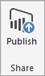
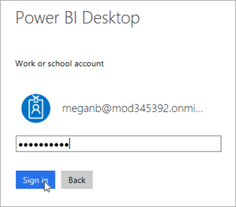
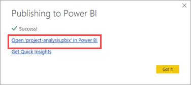
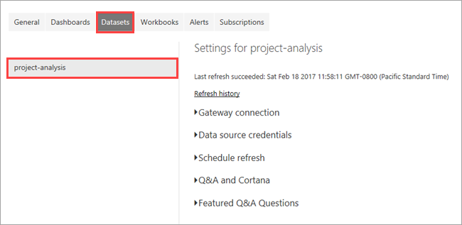
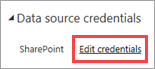
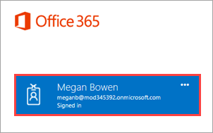
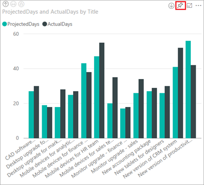
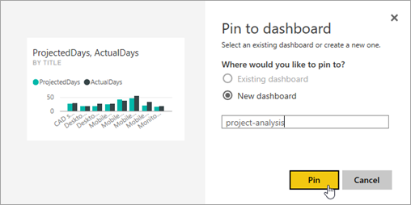
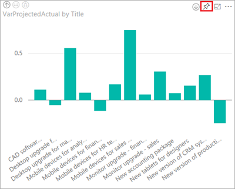
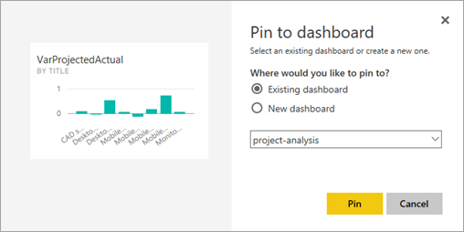

# 发布 Power BI 项目报表并创建仪表板
> [!NOTE]
> 本文属于介绍如何将 PowerApps、Microsoft Flow 和 Power BI 与 SharePoint Online 结合使用的系列教程。 请确保已阅读[系列介绍](sharepoint-scenario-intro.md)，了解总体情况以及相关下载内容。

在此任务中，我们将把数据集和报表发布到 Power BI 服务中，然后再根据报表创建仪表板。 在许多情况下，报表包含大量可视化效果，但只有一小部分用于仪表板。 在此示例中，我们将向仪表板添加全部四个可视化效果。

## 第 1 步：发布数据集和报表
1. 在 Power BI Desktop 中的“开始”选项卡上，单击或点击“发布”。
   
    
2. 如果尚未登录 Power BI 服务，请输入帐户，再单击或点击“登录”。
   
    
3. 输入密码，再单击或点击“登录”。
   
    
4. 选择报表的目标位置，再单击或点击“选择”。 建议发布到组工作区，以简化对 SharePoint 中报表的访问。 在此示例中，我们要发布到“项目管理”组工作区。 有关详细信息，请参阅[在 Power BI 应用工作区中展开协作](https://docs.microsoft.com/power-bi/service-collaborate-power-bi-workspace)。
   
    
5. 发布完成后，单击或点击“在 Power BI 中打开‘project-analysis.pbx’”。
   
    
6. Power BI 服务在浏览器中加载此报表。 如果左侧导航窗格未展开，请单击或点击左上角“(a)”处的菜单来将其展开。
   
    
   
    可以发现，在我们发布报表后，Power BI Desktop 上传了数据集 (d) 和报表 (c)。 将在 Power BI 服务（而不是 Power BI Desktop）中创建仪表板，此工作区中还没有任何仪表板 (b)。 我们快速创建一个仪表板。

## 第 2 步：配置凭据以进行刷新
1. 在 Power BI 服务中，依次单击或点击右上角的  和“设置”。
2. 依次单击或点击“数据集”和“project-analysis”。
   
    
3. 展开“数据源凭据”，再单击或点击“编辑凭据”。
   
    
4. 选择“OAuth2”身份验证方法，再单击或点击“登录”。
   
    
5. 选择或登录有权访问 SharePoint 列表的帐户。
   
    
   
    当此过程完成时，将在 Power BI 服务中看到以下消息。
   
    

## 第 3 步：创建仪表板

1. 若要返回到报表，请在“报表”下，单击或点击“项目分析”。

1. 依次单击或点击左上角的图表和 。
   
    
2. 输入要固定到的仪表板的名称，再单击或点击“固定”。
   
    
3. 依次单击或点击右上角的图表和 。
   
    
4. 选择现有仪表板，再单击或点击“固定”。
   
    

5. 对其他两个视觉对象重复执行固定流程。

6. 在左侧导航窗格中，单击或点击仪表板名称。
   
    

7. 查看仪表板。 如果单击磁贴，将返回到报表。
   
    

Power BI 中的大部分操作到此为止。 如果你是首次创建报表和仪表板，恭喜！ 如果你已是专业人士，我们希望你能够快速完成本教程。 现在，我们将添加警报，以确定是否需要关注仪表板。

## 后续步骤
本系列教程的下一步是[创建 Power BI 项目报表的数据警报](sharepoint-scenario-alerts-flow.md)。

