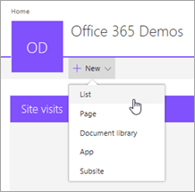
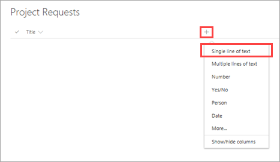
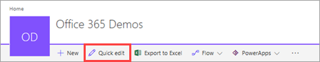
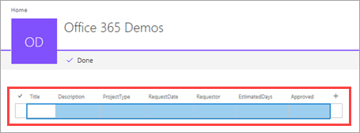
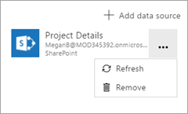
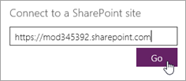
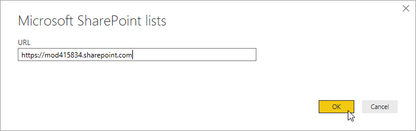

# 创建列表以便将 SharePoint Online 与 PowerApps、Microsoft Flow 和 Power BI 集成
> [!NOTE]
> 本文属于介绍如何将 PowerApps、Microsoft Flow 和 Power BI 与 SharePoint Online 结合使用的系列教程。 请确保已阅读[系列介绍](sharepoint-scenario-intro.md)，了解总体情况以及相关下载内容。

SharePoint 具有大量共享和协作功能，但我们将专注于此方案的一项功能：[SharePoint 列表](https://support.office.com/article/Introduction-to-lists-0A1C3ACE-DEF0-44AF-B225-CFA8D92C52D7)。 列表就是一系列可以与团队成员和其他网站用户共享的数据。 我们将回顾一下用于此方案的列表，以便你可以在自己的 SharePoint Online 网站中创建列表。

## 步骤 1:了解列表
第一个列表是便于项目申请者添加申请的“项目申请”列表。 然后，项目审批者可以审查申请，并决定是批准还是拒绝。

| **列表列** | **数据类型** | **备注** |
| --- | --- | --- |
| 标题 |单行文本 |默认列，用于项目名称 |
| 描述 |单行文本 | |
| ProjectType |单行文本 |值：new hardware、upgraded hardware、new software、upgraded software |
| RequestDate |Date | |
| Requestor |单行文本 | |
| EstimatedDays |Number |将申请者的预计天数与项目经理的预计天数以及实际天数进行比较 |
| Approved |单行文本 |值：pending、yes、no |

> [!NOTE]
> 还使用由 SharePoint 生成且默认隐藏的“ID”列。 为简单起见，我们使用基本的数据类型，但实际应用可能会使用更为复杂的类型，如“Requestor”列的“Person or Group”类型。 若要了解 PowerApps 支持的数据类型，请参阅[从 Microsoft PowerApps 到 SharePoint 的连接](connections/connection-sharepoint-online.md#known-issues)。

第二个列表是“项目详细信息”列表，用于跟踪所有已获准项目的详细信息，如已分配的项目经理。

| **列表列** | **数据类型** | **备注** |
| --- | --- | --- |
| 标题 |单行文本 |默认列，用于项目名称 |
| RequestID |Number |与“项目申请”列表中“ID”列的值一致 |
| ApprovedDate |Date | |
| 状态 |单行文本 |值：not started、in progress、completed |
| ProjectedStartDate |Date |项目经理预计的项目开始时间 |
| ProjectedEndDate |Date |项目经理预计的项目结束时间 |
| ProjectedDays |Number |工作天数；通常会进行计算，但此方案例外 |
| ActualDays |Number |对于已完成的项目 |
| PMAssigned |单行文本 |项目经理 |

## 步骤 2:创建并检查列表
若要继续完成此方案，需要创建两个 SharePoint 列表，并在其中填充示例数据。 为此，我们将介绍如何创建列表，并在其中粘贴示例数据。 请确保已从[下载包](https://aka.ms/o4ia0f)获取 Excel 文件。

> [!NOTE]
> 在这一步中，使用 Internet Explorer。

### 创建列表

1. 在 Internet Explorer 中，依次单击或点击 SharePoint 网站上的“新建”和“列表”。
   
    

2. 输入名称“项目申请”，再单击或点击“创建”。
   
    
   
    此时，将创建“项目申请”列表，其中包含默认“Title”字段。
   
    

### 向列表添加列

1. 依次单击或点击  和“单行文本”。
   
    

2. 输入名称“Description”，再单击或点击“保存”。
   
3. 对列表中的其他列重复执行第 1 步 和第 2 步 ：
   
   1. “Single line of text”>“ProjectType”
   2. “Date”>“RequestDate”
   3. “Single line of text”>“Requestor”
   4. “Number”>“EstimatedDays”
   5. “Single line of text”>“Approved”

### 将数据复制到列表中
1. 单击或点击“快速编辑”。
   
    
2. 选择网格中的单元格。
   
    
3. 打开 project-requests.xlsx 工作簿，并选择所有数据（不含标题）。
   
    
4. 将数据复制并粘贴到 SharePoint 内的网格中，再单击或点击“完成”。
   
    
5. 使用 project-details.xlsx 工作簿，对“项目详细信息”列表重复执行列表创建和复制过程。 请参阅中的项目详细信息表[步骤 1:了解列表](#step-1-understand-the-lists)列名称和数据类型。

## 步骤 3:更新连接到示例-可选
正如本系列教程简介部分中所述，我们在[下载包](https://aka.ms/o4ia0f)中添加了两个示例应用和一个报表。 可以在不使用这些示例的情况下完成此方案，但若要使用示例，必须更新与 SharePoint 列表的连接。 更新为使用你自己的列表（而不是我们的列表）作为数据源。

### 为示例应用更新连接

1. 在[PowerApps Studio](https://create.powerapps.com/studio/)，单击或点击**打开**的左窗格中。 

2. 单击或点击“浏览”，再打开下载的“project-management-app.msapp”文件。

3. 单击或点击“允许”，以便 PowerApps 可以使用 SharePoint。

4. 在功能区中的“视图”选项卡上，单击或点击“数据源”。

    
5. 在“数据”面板中，依次单击或点击“项目详细信息”旁边的省略号 (...) 和“删除”。
   
    
6. 单击或点击“添加数据源”。
   
    

7. 接下来，将介绍两种连接到列表的方式，具体取决于 PowerApps 是否已建立 SharePoint 连接： 

    * 如果已看到 SharePoint 连接，请单击或点击此连接。

        

    * 如果看不到 SharePoint 连接，请单击或点击“新建连接”。

        

        然后，依次单击或点击“SharePoint”和“创建”。
   
        

8. 输入包含你创建的列表的 SharePoint Online 网站 URL，再单击或点击“前往”。
   
    
9. 选择“项目详细信息”列表，再单击或点击“连接”。
   
    
   
    此时，“数据”面板显示所创建的连接。
   
    

10. 依次单击或点击“项目详细信息”旁边的省略号 (...) 和“刷新”。
    
    

11. 单击右上角的   以运行应用，并确保连接有效。

12. 单击或点击“文件”，再将应用保存到云中。 

12. 使用“项目申请”列表，对“project-requests-app.msapp”重复执行此部分中的步骤。

### 为示例报表更新连接
1. 在 Power BI Desktop 中打开“project-analysis.pbix”。

2. 在功能区的“开始”选项卡上，依次单击或点击“编辑查询”和“数据源设置”。
   
    

3. 单击或点击“更改源”。
   
    

4. 输入 SharePoint Online 网站 URL，再依次单击或点击“确定”和“关闭”。
   
    

5. 此时，Power BI Desktop 在功能区下显示横幅，以便可以应用更改并导入新源中的数据。 单击或点击“应用更改”。
   
    

6. 使用 Microsoft 帐户（用于访问 SharePoint Online 的帐户）登录，再单击或点击“连接”。
   
    

## 后续步骤
本系列教程的下一步是[生成用于处理项目申请的应用](sharepoint-scenario-generate-app.md)。

