# 对完成的 SharePoint Online 集成方案进行端到端演练
> [!NOTE]
> 本文属于介绍如何将 PowerApps、Microsoft Flow 和 Power BI 与 SharePoint Online 结合使用的系列教程。 请确保已阅读[系列介绍](sharepoint-scenario-intro.md)，了解总体情况以及相关下载内容。

本系列教程涉及大量基础知识，包括生成画布应用和流、创建报表并将其嵌入 SharePoint 中等。 我们由衷希望你已学到很多知识，并且充分了解如何综合运用这些技术，以便可以根据自己的需求将画布应用、流和报表集成到 SharePoint 中。 最后，我们希望对此方案进行端到端演练，以展示各方面的工作是如何完美配合的。

## 第 1 步：向“项目申请”列表添加项目
1. 在“项目申请”列表中，依次单击或点击“所有项”和“项目申请应用”。
   
    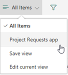
2. 单击“打开”，在新的浏览器标签页中打开应用。
   
    
3. 在应用中，单击或点击   ，创建新项。
4. 在表单中填写以下值：
   
   * “Title”的值为“Mobile devices for design team”

   * “Approved”的值为“Pending”

   * “Description”的值为“The design team will now use Contoso-supplied devices”

   * “EstimatedDays”的值为“30”

   * “ProjectType”的值为“New hardware”

   * “RequestDate”的值为“03/01/2017”

   * “Requestor”的值为“Emily Braun”
     
     
5. 单击或点击右上角的 ，再关闭浏览器标签页。
6. 返回到“项目申请”列表，依次单击或点击“项目申请应用”和“所有项”。
   
    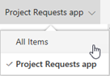
7. 验证列表中的新条目。
   
    

## 第 2 步：审批项目
1. 在第 1 步中添加项后，流应该会运行，并发出审批邮件。 检查审批者的电子邮件帐户的收件箱。
   
    
2. 单击“批准”。 流运行另一进程，并直接在电子邮件中生成如下反馈。
   
    
3. 检查申请者的电子邮件帐户的收件箱，应该会看到批准电子邮件。
   
    
4. 验证列表中更新的条目。
   
    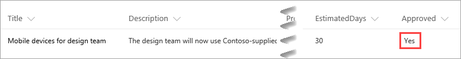

## 第 3 步：向项目分配经理
1. 首先，我们将查看 SharePoint 中的“项目详细信息”列表。 新项目的“PMAssigned”列的值为“Unassigned”。
   
    
2. 在 SharePoint 网站的左侧导航窗格中，单击或点击“项目管理应用”。
3. 在第一屏上，单击或点击“分配经理”。
   
    
4. 在“分配经理”屏幕上，可以看到列表中的两个未分配项目。 选择“设计团队适用的移动设备”项目。
   
    
5. 在“经理”文本输入框中，输入“Joni Sherman”，再单击“确定”。
   
    此更改已应用于列表，并且库会进行刷新，因此只会显示剩余未分配的项目。
   
    
6. 关闭应用，再返回到 SharePoint 列表。 可以看到，项目条目现已更新为包含项目经理姓名。
   
    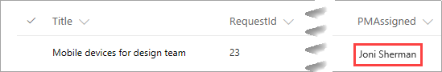

## 第 4 步：添加项目估计时间
1. 单击或点击 ，返回到第一屏，再单击或点击“更新详细信息”。
   
    
2. 在“查看项目”屏幕上的搜索框中输入“移动”。
   
    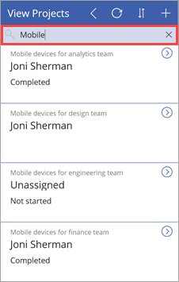
3. 单击“设计团队适用的移动设备”项的 。
   
    
4. 在“更新详细信息”屏幕上，设置以下值：
   
   * “Status”字段的值为“Not started”

   * “ProjectedStartDate”字段的值为“3/6/2017”

   * “ProjectedEndDate”字段的值为“3/24/2017”

   * “ProjectedDays”字段的值为“15”
     
     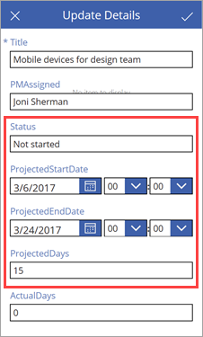
5. 单击或点击右上角的  ，将更改应用于 SharePoint 列表。
6. 关闭应用，再返回到列表。 可以看到，项目条目现已更新为包含更改后的日期和天数。
   
   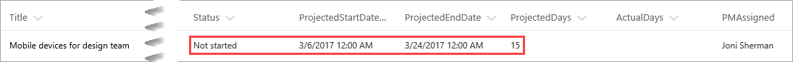

## 第 5 步：查看现有项目的报表数据
1. 在 SharePoint Online 中，依次单击或点击“网站内容”和“网页”。
2. 打开我们之前创建的“项目分析”页。
   
    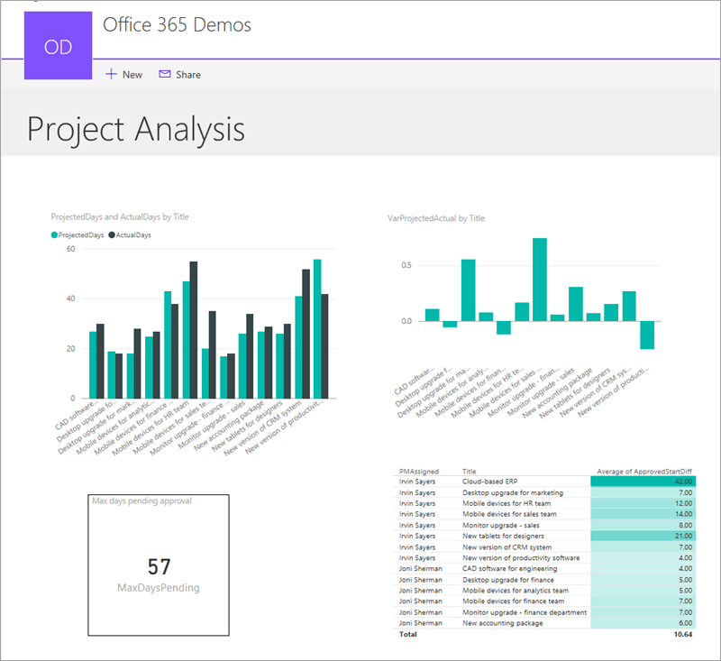
3. 查看显示差异的可视化效果。
   
    
   
    正如我们在创建此可视化效果时所指出的一样，Irvin Sayers 所负责项目的实际天数与预计天数差异比 Joni Sherman 多得多。
4. 向下钻取此可视化效果，可以看出，差异主要来自实际天数比预计多得多的两个项目。
   
    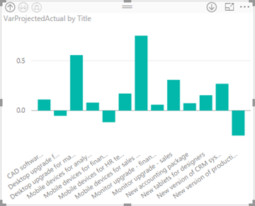
5. 查看显示项目获准日期与预计开始日期的时间跨度的表。
   
    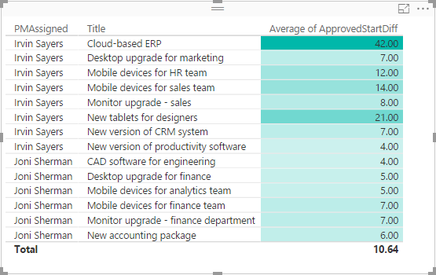
   
    正如我们在创建此可视化效果时所指出的一样，分配给 Irvin Sayers 的项目会延期启动，其中两个项目的延期启动时间跨度要比其他项目长得多。

## 第 6 步：响应待审批项目延迟
1. 在 Power BI 服务中，依次单击或点击“project-analysis”数据集和“立即刷新”。 刷新操作会触发我们为待审批项目创建的警报。
   
    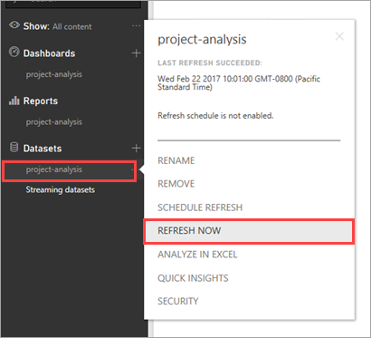
2. 刷新完成后，右上角的“通知中心”会显示“新通知”图标。
   
    
   
    此图标可能需要一段时间才能显示。因此，如果没有立马看到它，请过一段时间再回来看看。
3. 打开“通知中心”，查看所触发警报的详细信息。
   
    
4. 检查警报创建者（在此示例中，为 Megan Bowen）的收件箱。
   
    
5. 检查在数据警报流中添加的人员（在此示例中，为 Allan DeYoung）的收件箱。
   
    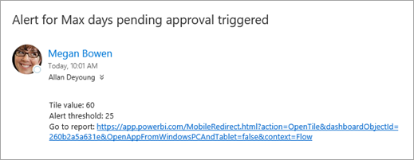
6. 至此，已获取待审批项目的相关信息，可以返回并审批所有待审批事项。

我们的端到端演练和本系列教程到此结束。 建议继续访问以下网站：

* [PowerApps](http://www.powerapps.com/)
* [Microsoft Flow](http://flow.microsoft.com)
* [Power BI](http://www.powerbi.com)
* [Power User 社区](https://powerusers.microsoft.com/)
* [SharePoint](http://sharepoint.microsoft.com)
* [Microsoft 技术社区](https://techcommunity.microsoft.com/)

若对本系列教程有任何反馈、补充内容建议，或希望了解其他内容以便使用我们介绍的技术，请通过评论的形式告知我们。

