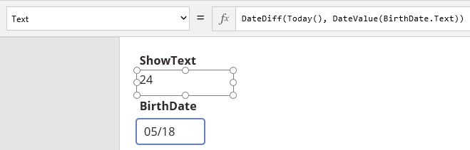
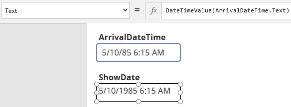
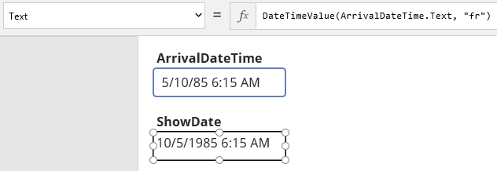
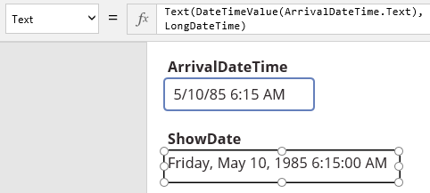
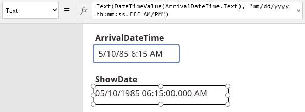
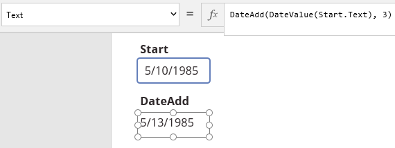
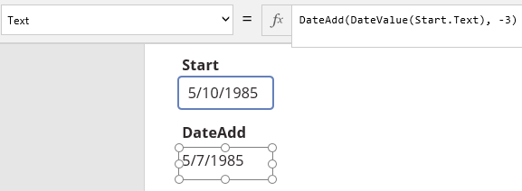

# 在 PowerApps 中显示文本以及设置日期和时间格式
添加日期和时间，然后设置其格式，以便显示正确级别的详细信息，或者让其反映你的区域设置。 计算两个日期相差多少时间，或者计算一个日期，该日期比指定的日期早或晚一定的时间。 将日期转换成按年、月、日表示的不同值（或者反过来），以及将时间转换成按小时、分钟、秒表示的不同值（或者反过来）。

例如，添加用户提供的有关股票交易或客户会议的数据、添加外部源提供的数据，或者添加在 PowerApps 中创建的另一应用提供的数据。 如果该数据包含的时间为毫秒级，则为了简单起见，可将其舍入为最接近的分钟。 计算还有多少天会发生重大事件。 如果需要每隔五天安排一次客户会议，可自动计算相关日期。 如果“1985 年 5 月 10 日”是按年、月、日存储在不同的字段中，可将其合并为一个值。 也可反过来将每个日期拆分成不同的值（如果应用是对其分别进行管理的）。

## 先决条件

* [注册](../signup-for-powerapps.md) PowerApps，然后使用注册所用的同一凭据[登录](https://web.powerapps.com)。
* 在 PowerApps 中创建一个应用，或打开一个现有应用。
* 了解如何在 PowerApps 中 [配置控件](add-configure-controls.md)。

## 在“标签”控件中显示文本
在“[标签](controls/control-text-box.md)”控件中显示文本，方法是设置“[Text](controls/properties-core.md)”属性值。 设置此属性时，既可直接在控件中键入，也可在公式栏中键入表达式。

* 如果直接在控件中键入，则完全按输入显示。
* 如果在公式栏中键入表达式，则控件会显示表达式的结果。

下面是一些示例。

1. 添加一个名为“ShowText”的“[标签](controls/control-text-box.md)”控件，然后将“[Text](controls/properties-core.md)”属性设置为以下公式：
    **Now()**
   
    如果计算机的区域设置设置为“en-us”，则当前日期和时间按以下格式显示：  *mm/dd/yyyy hh:mm AM/PM*
   
    如果计算机的区域设置设置为“fr-fr”之类的格式，则当前日期和时间按以下格式显示：  *dd/mm/yyyy hh:mm AM/PM*
2. 将 **ShowText** 的 **[Text](controls/properties-core.md)** 属性设置为以下公式：
    **DateDiff(Today(), DateValue("01/01/2020"))**
   
    
   
    此控件显示今天到 2020 年 1 月 1 日还有多少天，使用以下函数：
   
   * **DateDiff**：计算两个日期之间的天数、季度数或年数。
   * **Today**：计算当天的日期，以单个值表示。
   * **DateValue**：将双引号引起来的字符串转换为一个可以进行计算的值。
3. 添加名为 **BirthDate** 的**[文本输入](controls/control-text-input.md)** 控件，将其移至 **ShowText** 下。

4. 在 **BirthDate** 中键入你的出生月和日（例如 **05/18**）。

5. 将 **ShowText** 的 **[Text](controls/properties-core.md)** 属性设置为以下公式：
    **DateDiff(Today(), DateValue(BirthDate.Text))**
   
    
   
    **ShowText** 显示今天到你在 **BirthDate** 中键入的某个日期还有多少天。 如果你的生日今年已过，**ShowText** 会显示负值。

## 使用 DateTimeValue 设置日期和时间的格式
将日期和时间从文本字符串转换为值，以便采用多种方式将其格式化并将其用在计算中。 使用内置的自定义选项指定格式。

> [!NOTE]
> **[DateTimeValue](functions/function-datevalue-timevalue.md)** 和 **[DateValue](functions/function-datevalue-timevalue.md)** 函数可以将采用下述格式之一的日期转换为值：  
> 
> * MM/DD/YYYY  
> * DD/MM/YYYY  
> * DD Mon YYYY  
> * Month DD, YYYY  
> 
> 

1. 添加名为 **ArrivalDateTime** 的**[文本输入](controls/control-text-input.md)** 控件，然后按以下格式键入日期和时间：
    **5/10/85 6:15 AM**
2. 添加一个名为“ShowDate”的“[标签](controls/control-text-box.md)”控件，然后将“[Text](controls/properties-core.md)”属性设置为以下公式：
    **DateTimeValue(ArrivalDateTime.Text)**
   
    
   
    **ShowDate** 显示的信息与你键入的相同，但已从文本转换为值，采用了不同的格式。 例如，年份显示为四位数，而不是两位数。
3. 将 **ShowDate** 的 **[Text](controls/properties-core.md)** 属性更改为以下公式：
    **DateTimeValue(ArrivalDateTime.Text, "fr")**
   
    
   
    **ShowDate** 按法国用户的习惯将日显示在月之前。
   
   > [!TIP]
   > 若要在 Intellisense 中显示其他区域设置的列表，请从公式中删除右引号和 **fr**，但保留左引号：
   > 
   > 
   > 
   > 
4. 若要使用多个内置格式之一，请将 **ShowDate** 的 **[Text](controls/properties-core.md)** 属性更改为以下公式：
    **Text(DateTimeValue(ArrivalDateTime.Text), DateTimeFormat.LongDateTime)**
   
    
   
    **ShowDate** 显示星期几、日期和时间。
   
   > [!TIP]
   > **DateTimeFormat** 参数支持多个其他的内置格式。 若要显示该列表，请从公式中删除 **LongDateTime**。
   > 
   > 
5. 若要使用自定义格式，请将 **ShowDate** 的 **[Text](controls/properties-core.md)** 属性更改为以下公式：
    **Text(DateTimeValue(ArrivalDateTime.Text), "mm/dd/yyyy hh:mm:ss.fff AM/PM")**
   
    
   
    **ShowDate** 按指定格式显示日期/时间值，包括毫秒。
   
   > [!TIP]
   > 若要将时间舍入为秒的十分位或百分位值，请在公式中指定 **hh:mm:ss.f** 或 **hh:mm:ss.ff**。
   > 
   > 

## 使用 DateValue 设置日期格式

1. 添加名为 **ArrivalDate** 的**[文本输入](controls/control-text-input.md)** 控件，然后在其中键入日期（例如 **5/10/85**）。

2. 添加一个名为“FormatDate”的“[标签](controls/control-text-box.md)”控件，然后将“[Text](controls/properties-core.md)”属性设置为以下公式：
    **DateValue(ArrivalDate.Text)**
   
    **FormatDate** 显示你所键入的日期，只是年份显示为四位数。
3. 将 **FormatDate** 的 **[Text](controls/properties-core.md)** 属性设置为以下公式：
    **DateValue(ArrivalDate.Text, "fr")**
   
    **FormatDate** 按法国用户的习惯将日显示在月之前。
4. 若要使用多个内置格式之一，请将 **FormatDate** 的 **[Text](controls/properties-core.md)** 属性设置为以下公式：
    **Text(DateValue(ArrivalDate.Text), DateTimeFormat.LongDate)**
   
    **FormatDate** 显示星期几、月、日、年。
5. 若要使用自定义格式，请将 **FormatDate** 的 **[Text](controls/properties-core.md)** 属性设置为以下公式：
    **Text(DateValue(ArrivalDate.Text), "yy/mm/dd")**
   
    **FormatDate** 按指定格式显示日期。

## 使用 DateTimeValue 设置时间格式

1. 添加名为 **ArrivalTime** 的**[文本输入](controls/control-text-input.md)** 控件，然后在其中键入 **6:15 AM**。

2. 添加一个名为“ShowTime”的“[标签](controls/control-text-box.md)”控件。

3. 若要使用多个内置格式之一，请将 **ShowTime** 的 **[Text](controls/properties-core.md)** 属性设置为以下公式：
    **Text(DateTimeValue(ArrivalTime.Text), DateTimeFormat.LongTime)**
   
    **ShowTime** 显示指定的时间，包括秒。
4. 若要使用自定义格式，请将 **ShowTime** 的 **[Text](controls/properties-core.md)** 属性设置为以下公式：
    **Text(DateTimeValue(ArrivalTime.Text), "hh:mm:ss.fff AM/PM")**
   
    **ShowTime** 显示指定的时间，包括秒和毫秒。
   
   > [!TIP]
   > 若要将时间舍入为秒的十分位或百分位值，请在公式中输入 **hh:mm:ss.f** 或 **hh:mm:ss.ff**。
   > 
   > 

## 显示两个日期之间有多少时间

1. 添加两个**[文本输入](controls/control-text-input.md)** 控件，分别名为 **Start** 和 **End**。

2. 将 **4/1/2015** 键入到 **Start** 中，将 **1/1/2016** 键入到 **End** 中。

3. 添加一个名为“DateDiff”的“[标签](controls/control-text-box.md)”控件，然后将“[Text](controls/properties-core.md)”属性设置为以下公式：
    **DateDiff(DateValue(Start.Text), DateValue(End.Text))**
   
    
   
    **DateDiff** 显示 **275**，表示 2015 年 4 月 1 日到 2016 年 1 月 1 日相差多少天。
4. 将 **DateDiff** 的 **[Text](controls/properties-core.md)** 属性设置为以下公式：   **DateDiff(DateValue(Start.Text), DateValue(End.Text), Months)**
   
    **DateDiff** 显示 **9**，表示 2015 年 4 月 1 日到 2016 年 1 月 1 日相差多少月。 将 **Months** 替换为 **Quarters** 或 **Years** 即可显示相应单位的时间。

## 确定一个日期之前或之后的另一个日期

1. 添加名为 **Start** 的**[文本输入](controls/control-text-input.md)** 控件，然后在其中键入 **5/10/1985**。

2. 添加一个名为“DateAdd”的“[标签](controls/control-text-box.md)”控件，然后将“[Text](controls/properties-core.md)”属性设置为以下公式：
    **DateAdd(DateValue(Start.Text), 3)**
   
    
   
    **DateAdd** 显示 **5/13/1985**，此日期晚于 **Start** 中的日期三天。
3. 将 **DateAdd** 的 **[Text](controls/properties-core.md)** 属性设置为以下公式：
    **DateAdd(DateValue(Start.Text), -3)**
   
    
   
    **DateAdd** 显示 **5/7/1985**，此日期早于 **Start** 中的日期三天。
4. 将 **DateAdd** 的 **[Text](controls/properties-core.md)** 属性更改为以下公式：
    **DateAdd(DateValue(Start.Text), 3, Months)**
   
    
   
    标签显示 **8/10/1985**，此日期晚于 **Start** 中的日期三月。 将 **Months** 替换为 **Quarters** 或 **Years** 即可确定一个早于或晚于 **Start** 中的日期指定季度数或年数的日期。

## 根据年、月、日计算日期

1. 添加三个**[下拉](controls/control-drop-down.md)** 控件，分别名为 **Year**、**Month** 和 **Day**。

2. 将 **Year** 的 **[Items](controls/properties-core.md)** 属性设置为以下公式：
    **Table({Year:"2014"}, {Year:"2015"}, {Year:"2016"})**

3. 将 **Month** 的 **[Items](controls/properties-core.md)** 属性设置为以下公式：
    **Table({Month:"1"}, {Month:"2"}, {Month:"3"}, {Month:"4"}, {Month:"5"}, {Month:"6"}, {Month:"7"}, {Month:"8"}, {Month:"9"}, {Month:"10"}, {Month:"11"}, {Month:"12"})**

4. 将 **Day** 的 **[Items](controls/properties-core.md)** 属性设置为以下公式：
    **Table({Day:"1"}, {Day:"2"}, {Day:"3"}, {Day:"4"}, {Day:"5"}, {Day:"6"}, {Day:"7"}, {Day:"8"}, {Day:"9"}, {Day:"10"}, {Day:"11"}, {Day:"12"}, {Day:"13"}, {Day:"14"}, {Day:"15"}, {Day:"16"}, {Day:"17"}, {Day:"18"}, {Day:"19"}, {Day:"20"}, {Day:"21"}, {Day:"22"}, {Day:"23"}, {Day:"24"}, {Day:"25"}, {Day:"26"}, {Day:"27"}, {Day:"28"}, {Day:"29"}, {Day:"30"}, {Day:"31"})**

5. 添加一个“[标签](controls/control-text-box.md)”控件，然后将“[Text](controls/properties-core.md)”属性设置为以下公式：
    **Text(Date(Value(Year.Selected.Value), Value(Month.Selected.Value), Value(Day.Selected.Value)), DateTimeFormat.LongDate)**
   
    默认情况下将列出 **Wednesday, January 1, 2014**。 在“[下拉列表](controls/control-drop-down.md)”控件中选择不同的值，以更改“[标签](controls/control-text-box.md)”控件中的日期。

可能需要对不正常的数据进行转换。 如果添加了**[文本输入](controls/control-text-input.md)** 控件而不是**[下拉](controls/control-drop-down.md)** 控件，则用户可能会输入不正确的日期，例如 May 45。 **[Date](functions/function-date-time.md)** 函数按以下方式处理异常数据：

* 如果年份值介于 0 到 1899（含）之间，则函数将该值添加到 1900，以计算年份。
* 如果年份值介于 1900 到 9999（含）之间，则函数使用该值作为年份。
* 如果年份值小于 0 或者大于或等于 10000，则函数返回一个错误值。
* 如果月份值大于 12，则函数会向指定年份的第一个月添加相应的月数。
* 如果月份值小于 1，则函数会从指定年份的第一个月减去相应的月数，然后再加 1。
* 如果日值大于指定月的天数，函数将从该月的第一天加上该天数，并返回次月对应的日期。
* 如果日值小于 1，函数将从指定月份的第一天减去该天数，再加 1。

## 根据小时、分钟和秒计算时间

1. 添加两个**下拉**列表，分别名为 **Hour** 和 **Minute**。

2. 将 **Hour** 的 **[Items](controls/properties-core.md)** 属性设置为以下公式：
    **Table({Hour:"9"}, {Hour:"10"}, {Hour:"11"}, {Hour:"12"}, {Hour:"13"}, {Hour:"14"}, {Hour:"15"}, {Hour:"16"}, {Hour:"17"})**

3. 将 **Minute** 的 **[Items](controls/properties-core.md)** 属性设置为以下公式：
    **Table({Minute:"0"}, {Minute:"15"}, {Minute:"30"}, {Minute:"45"})**

4. 添加一个“[标签](controls/control-text-box.md)”控件，然后将“[Text](controls/properties-core.md)”属性设置为以下公式：  
    **Text(Time(Value(Hour.Selected.Value), Value(Minute.Selected.Value), 0), DateTimeFormat.ShortTime)**

5. 在 **Hour** 中选择 **15**，在 **Minute** 中选择 **45**。
   
    此时，“[标签](controls/control-text-box.md)”控件显示“3:45 PM”。
   
    可以向 **Hour** 和 **Minute** 添加条目，以便用户能够在更大范围内选择小时数，以更精确的方式选择分钟数。 也可添加第三个**[下拉](controls/control-drop-down.md)** 控件，允许用户指定秒。 如果添加第三个列表，请将“[标签](controls/control-text-box.md)”控件的“[Text](controls/properties-core.md)”属性设置为以下表达式： **Text(Time(Value(Hour.Selected.Value), Value(Minute.Selected.Value), Value(Second.Selected.Value)), DateTimeFormat.LongTime)**

