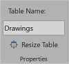
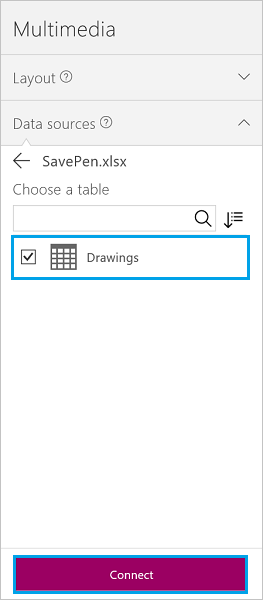
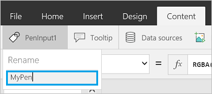

# 如何在 Excel 文件中保存图像，并将其添加到你的应用

在本教程中，我们将：

* 创建一个 Excel 文件，并将其格式设置为表格
* 创建一个到 OneDrive for Business 的连接。 所有云存储帐户都将工作。 在本演练中，将使用 OneDrive for Business。
* 使用笔输入控件创建应用
* 将笔输入控件所创建的图像保存到 Excel 文件
* 在应用中显示来自 Excel 文件的图像

[!INCLUDE [app-customization-requirements](../../includes/app-customization-requirements.md)]
* 了解如何[添加数据源](add-data-connection.md)

## 将 Excel 文件创建为表格

1. 在空白的 Excel 文件中，将列命名为“图像 [image]”。
2. 按以下步骤创建表格：    
   
   1. 在任意行和任意列中选择任意的数据片段。 例如，选择“图像”。
   2. 在“插入”功能区中，选择“表格”。
   3. 在对话框窗口中，选择“表包含标题”，然后选择“确定”。
      
      现在，Excel 文件将为表格格式。 [将数据格式设置为表格](https://support.office.com/article/Format-an-Excel-table-6789619F-C889-495C-99C2-2F971C0E2370)提供了关于在 Excel 中设置表格式的其他详细信息。
   4. 将表格命名为“绘图”：  
      
      
3. 将 Excel 文件命名为 **SavePen.xlsx**，然后将文件保存到云存储帐户（OneDrive for Business、Dropbox 等）。

## 使用笔控件创建应用
1. 在 PowerApps 中，创建一个[空白应用](get-started-create-from-blank.md)。
2. 在你的应用中，添加云存储帐户作为[数据源](add-data-connection.md)。 在添加为数据源后，添加 **SavePen.xlsx** 作为连接，然后选择“绘图”表格：  
     
   
   现在，“绘图”表格作为数据源列出。
3. 在“插入”菜单上，选择“文本”，然后选择“笔输入”。 将其重命名为 **MyPen**：  
   
   
4. 添加“按钮”控件（“插入”菜单），并将其**选择时**属性设置为以下公式：  
   `Patch(Drawings, Defaults(Drawings), {Image:MyPen.Image})`
5. 添加“图像库”控件（“插入”菜单 >“库”），然后将**项**属性设置为 `Drawings`。 库控件的**图像**属性将自动设置为 `ThisItem.Image`。
   
   你的屏幕应与下图类似：  
   
     
6. 按 F5，或选择“预览”()。 使用 MyPen 绘图，并选择按钮。 库控件中显示的第一张图像是你刚刚所画内容。 在绘图中添加其他一些内容，并选择按钮。 库控件中显示的第二张图像是你刚刚所画内容。
   
   关闭预览窗口。
7. 转到你的云存储帐户。 新增了一个自动创建的 **SavePen_images** 文件夹。 可能需要刷新才能查看新文件夹。 该文件夹包含你所保存的图像，其中 ID 代表它们的文件名。
   
    打开 SavePen.xlsx。 “图像”列包含访问这些新图像的路径。

## 将 Excel 文件中的图像添加到应用
在另一个示例中，你可以将图像保存至云存储帐户，然后使用 Excel 表格在应用中显示这些图像。

在本示例中，我们使用包含一些 .jpeg 文件的 [CreateFirstApp.zip](http://pwrappssamples.blob.core.windows.net/samples/CreateFirstApp.zip)。

> [!NOTE]
> 显示 Excel 文件中的图像时，这些图像的路径必须使用正斜线。 当 PowerApps 将图像保存到 Excel 表格时（如上述步骤所述），路径将使用反斜杠。 因此，还可以使用前面示例中的 **SavePen_images**。 如果这样做，请将 Excel 表格中路径的反斜杠改为正斜杠。 否则将不会显示图像。  

1. 下载 [CreateFirstApp.zip](http://pwrappssamples.blob.core.windows.net/samples/CreateFirstApp.zip)，并将 **Assets** 文件夹提取到云存储帐户。
2. 在 Excel 电子表格中创建一个与下表类似的表格：
   
    
3. 将表格命名为 **Jackets**。 将 Excel 文件命名为 **Assets.xlsx**。 也可将 **Assets** 文件夹重命名为 **Assets_images**。
4. 在应用中添加 **Jackets** 表格作为数据源。  
5. 添加“仅图像”控件（“插入”菜单 >“库”），然后将**项**属性设置为 `Jackets`：  
   
    
   
    库将自动更新图像：  
   
    

在设置项属性时，Excel 表格会自动更新，添加一个名为 **PowerAppsId** 的新列。

在 Excel 表格中，图像路径可以是到图像的 URL。 下载 [Flooring Estimates](http://pwrappssamples.blob.core.windows.net/samples/FlooringEstimates.xlsx) 示例文件到你的云存储帐户，在应用中添加 `FlooringEstimates` 表格作为数据源，然后将库控件设置为 `FlooringEstimates`。 库将自动更新图像。

## 了解更多
[添加图像、视频或声音](add-images-pictures-audio-video.md)  
[在应用中显示线形图、饼形图或条形图中的数据](use-line-pie-bar-chart.md)  
[了解 PowerApp 中的表格和记录](working-with-tables.md)

