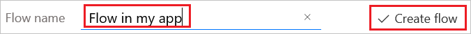

# 启动应用中的流
可以使用 Microsoft Flow 来创建逻辑，以便在应用中发生某个事件时执行一个或多个任务。 例如，配置一个按钮，以便用户选择它时在 SharePoint 列表中创建一个项、发送电子邮件或会议请求、将文件添加到云，或执行所有上述操作。 可以在应用中配置任何用于启动流的控件，该控件在关闭 PowerApps 的情况下仍会继续运行。

## 先决条件

* [注册](../signup-for-powerapps.md) PowerApps。
* 了解如何[配置控件](add-configure-controls.md)。

## 创建流
1. 登录 [powerapps.com](http://web.powerapps.com?utm_source=padocs&utm_medium=linkinadoc&utm_campaign=referralsfromdoc)，再选择左侧导航栏中的“流”。

2. 在“我的流”页上，选择“从空白创建”。

    

    “PowerApps”被添加为默认触发器。

    

3. 选择“新建步骤”，然后选择“添加操作”。

    

4. 在“搜索所有服务和操作”框中，指定流操作，如以下示例所示：

   1. 在框中键入“SharePoint”，再选择“操作”下列表中的“SharePoint - 创建项”。

       

   2. 如果系统提示，请提供用于连接到 SharePoint 的凭据。

   3. 在“网站地址”框中，键入或粘贴包含列表的 SharePoint Online 网站的 URL。

       > [!NOTE]
      > 请指定不含列表的网站 URL。

   4. 在“列表名称”框中，选择要使用的列表。

   5. 单击或点击“标题”框，再选择“添加动态内容”。

       

   6. 在参数列表中，选择“在 PowerApps 中询问”。

       

5. （可选）指定一个或多个其他操作，如将审批邮件发送到指定的地址，或创建其他数据源中的相关条目。

6. 在屏幕顶部附近，键入或粘贴流的名称，然后选择“创建流”。

    

## 向应用添加流
1. 在 PowerApps 中，选择“文件”菜单中的“新建”。

2. 在“空白应用”磁贴上，选择“手机布局”。

3. 添加**[文本输入](controls/control-text-input.md)** 控件，将其命名为 **RecordTitle**。

4. 添加**[按钮](controls/control-button.md)** 控件，将其移至 **RecordTitle** 下。

5. 选择**[按钮](controls/control-button.md)** 控件后，在“操作”选项卡上选择“流”。

    

6. 在显示的窗格中，选择在前面的过程中创建的流。

    > [!NOTE]
   > 如果创建的流不可用，请确认是否已将 PowerApps 设置为在其中创建了流的环境。

    

7. 在公式栏中，在已自动添加的公式末尾键入或粘贴 **RecordTitle.Text)**。

    

## 测试流
1. 按 F5（或选择右上角附近的箭头）打开“预览”。

    

2. 在“RecordTitle”中键入或粘贴文本，再单击或点击“[按钮](controls/control-button.md)”控件。

    此时会在指定的列表中创建一个 SharePoint 项，其标题为指定的文本。 如果列表在流运行时处于打开状态，可能需要刷新浏览器窗口，才能显示这些更改。
