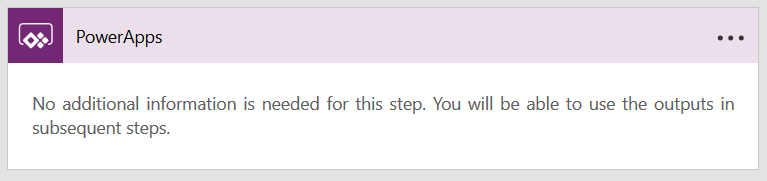
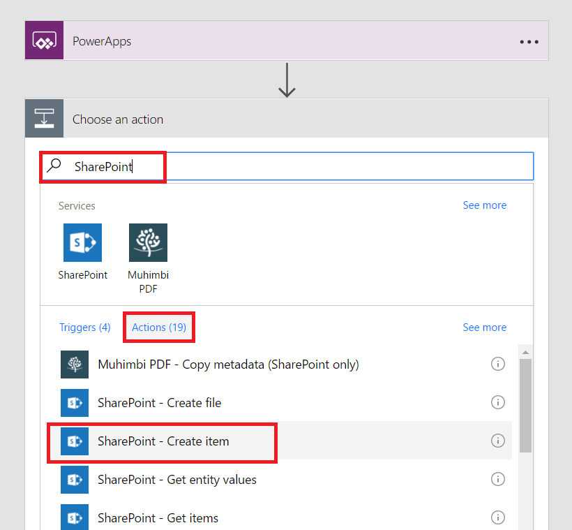
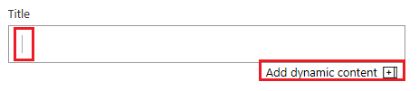

# 启动画布应用中的流

在画布应用中发生事件时，可以使用 "电源自动化" 创建执行一项或多项任务的逻辑。 例如，配置一个按钮，以便用户选择它时在 SharePoint 列表中创建一个项、发送电子邮件或会议请求、将文件添加到云，或执行所有上述操作。 您可以在应用程序中配置任何控件以启动流，即使关闭了 Power Apps，也可以继续运行。

> [!NOTE]
> 当用户在应用内运行流时，该用户必须具有执行流中指定的任务的权限。 否则，流将失败。

## 必备组件

- [注册](../signup-for-powerapps.md)Power Apps。
- 了解如何[配置控件](add-configure-controls.md)。

## 创建流

1. 登录到[Power Apps](https://make.powerapps.com?utm_source=padocs&utm_medium=linkinadoc&utm_campaign=referralsfromdoc)。

1. 在左侧导航栏中，选择 "**业务逻辑**"，然后选择 "**流**"。

1. 在 "**我的流**" 页的左上角，选择 "**新建**"，然后选择 "**从空白创建**"。

    

1. 在显示的页面底部附近，选择 "**搜索数百个连接和触发器**"。

1. 在 "搜索" 框中，键入**powerapps**，然后选择**powerapps**图标。

    
    
1. 在下一页上，再次选择 "电源应用" 图标，然后选择 "**新建步骤**"。

1. 在显示 "**搜索连接器和操作**" 的框中，为流指定操作，如以下示例中所示：

   1. 在框中键入 " **SharePoint** "，然后在 "**操作**" 下的列表中选择 "**创建项**"。

       

   1. 如果系统提示，请提供用于连接到 SharePoint 的凭据。

   1. 在“网站地址”框中，键入或粘贴包含列表的 SharePoint Online 网站的 URL。

       > [!NOTE]
       > 不要将列表的名称追加到 URL。

   1. 在 "**列表名称**" 框中，指定要使用的列表。
   
       

   1. 在列表中选择字段的 "输入" 框（例如**标题**），在 "动态内容" 窗格中选择 "**查看更多**"，然后选择 "**在 Power Apps 中询问**"。 

       

1. 可有可无指定一个或多个附加步骤，如将审批邮件发送到指定的地址，或在另一个数据源中创建相关条目。

1. 在左上角附近，为流键入或粘贴名称，然后选择右上角附近的 "**保存**"。

## 向应用添加流
1. 在左侧导航栏中，选择 "**创建**"。

1. 将鼠标悬停在 "空白" 磁贴上的**画布应用**上，然后选择 "**生成此应用**"。

1. 添加 **[文本输入](controls/control-text-input.md)** 控件，将其命名为 **RecordTitle**。

1. 添加 **[按钮](controls/control-button.md)** 控件，将其移至 **RecordTitle** 下。

1. 选择 **[按钮](controls/control-button.md)** 控件后，在“操作”选项卡上选择“流”。

    

1. 在显示的窗格中，选择在前面的过程中创建的流。

    > [!NOTE]
   > 如果创建的流不可用，请确认是否已将电源应用设置为在其中创建了流的环境。

    

1. 在公式栏中，在已自动添加的公式末尾键入或粘贴 **RecordTitle.Text)** 。

    

## 测试流
1. 双击 "**文本输入**" 控件，然后在其中键入或粘贴一些文本。

1. 按住 Alt 键的同时选择 " **[Button](controls/control-button.md)** " 控件。

    将在你使用指定为标题的文本指定的列表中创建一个 SharePoint 项。 如果列表在流运行时处于打开状态，可能需要刷新浏览器窗口，才能显示这些更改。
