# 了解 PowerApps 中的数据卡

[卡](controls/control-card.md)控件是画布应用中[编辑窗体](controls/control-form-detail.md)和[显示窗体](controls/control-form-detail.md)控件的构建基块********。 表单表示整条记录，每个卡表示该记录的单个字段。

在设计工作区中选择表单控件后即可在右窗格中与卡轻松地进行交互。 在该窗格中，可以选择要显示哪些字段、每个字段的显示方式，以及按何种顺序进行显示。 此示例显示了从名为“资产”的 SharePoint 列表生成的应用中的“编辑表单”控件。

若要开始使用卡，请参阅[添加表单](add-form.md)和[了解数据表单](working-with-forms.md)。 本主题的剩余内容将更详细地介绍卡的工作方式以及你可以如何自定义卡甚至创建自己的卡。

## 预定义的卡

PowerApps 为字符串、数字和其他数据类型提供了一组预定义的卡。 在右侧窗格中，你可以看到可用的变体，并可更改用于某个字段的卡：

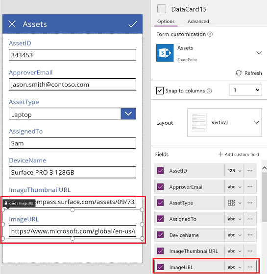

在本例中，选择了一个单行文本卡，但 URL 的文本的长度超出了可以在单行中显示的长度。 让我们将此卡更改为一个多行文本卡，以便为我们的用户提供更多的空间进行编辑：

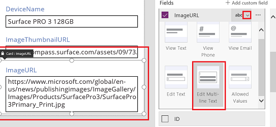

此数据源的多个字段均不会显示，但是可以通过选择字段的复选框来显示或隐藏它。 此示例演示了如何显示 **SecurityCode** 字段。

## 自定义卡片
卡还包含其他控件。 在“编辑表单”控件中，用户在你从“插入”选项卡添加的标准**[文本输入](controls/control-text-input.md)** 控件中输入数据。  

下面，让我们举例说明如何通过操作其中的控件来更改卡的外观。

1. 首先，让我们返回到最近为 **SecurityCode** 字段插入的卡。 通过单击或点击一次来选择此卡：
   
    
2. 选择该卡内的**[文本输入](controls/control-text-input.md)** 控件（通过单击或点击输入控件本身）。
   
    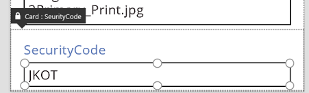
3. 通过拖动选择框在卡内移动此控件，通过沿选择框的边缘拖动手柄来调整控件大小：
   
    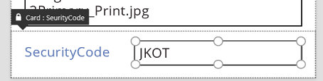  

你可以调整卡中控件的大小、移动控件或者对其进行其他修改，但在不先解锁控件的情况下无法将其删除。

## 解锁卡
除了可以包含控件之外，卡本身也是控件，与任何其他控件一样，它们也具有属性和公式。 当你选择在表单上显示某个字段时，右侧的窗格会自动为你创建卡并生成所需的公式。  可以在右窗格的“高级”选项卡中看到这些公式：

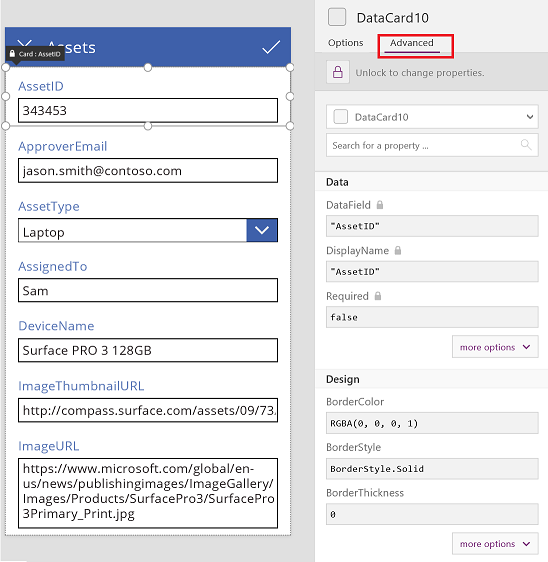

我们会立即看到卡的最重要属性之一：**[DataField](controls/control-card.md)** 属性。 此属性指示用户在此卡中可以看到和编辑数据源的哪个字段。  

在“高级”选项卡上，顶部的横幅指示此卡的属性处于锁定状态。 在 **[DataField](controls/control-card.md)**、**[DisplayName](controls/control-card.md)** 和 **[Required](controls/control-card.md)** 属性旁边还会显示一个锁图标。 右侧窗格创建了这些公式，锁可以防止意外更改这些属性。

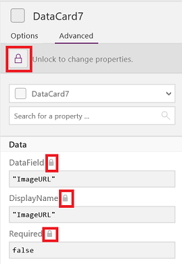

单击或点击顶部的横幅可以解锁卡以便修改这些属性：

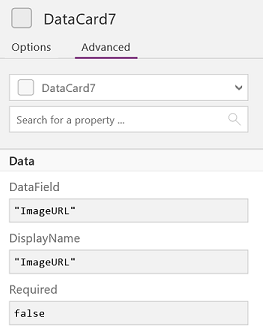

让我们来修改 **[DisplayName](controls/control-card.md)**，在 **Asset** 和 **ID** 之间放置一个空格。 通过执行此更改，我们更改了为我们生成的内容。  在右侧窗格中，此卡有一个不同的标签：

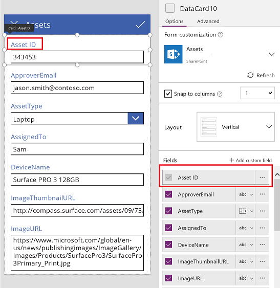

现在，我们已经取得了此卡的控制权，可以进一步修改它来满足我们的需求。 但是，我们已无法像之前那样将卡从一种表示形式更改为另一种表示形式，例如，从单行文本更改为多行文本。 我们已经将此预定义的卡转变为现在由我们控制的一个“自定义卡”。  

> [!IMPORTANT]
> 无法重新锁定已解锁的卡片。 要想将卡恢复为锁定状态，需要先将其删除，然后在右侧窗格中将其重新插入。

可以使用很多方法来更改已解锁卡的外观和行为，例如添加和删除其中的控件。 例如，可以从“插入”选项卡上的“图标”菜单中添加星形。

此星形现在已成为卡的一部分，并且将随它一起移动，例如当你在表单内重新排列卡时。

再如，将 **ImageURL** 卡解锁，然后从“插入”选项卡将“图像”控件添加到其中：

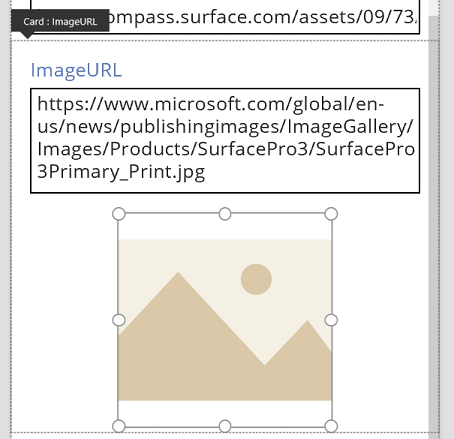

在编辑栏中，将此控件的 **Image** 属性设置为 *TextBox*.**Text**，其中 *TextBox* 是保存 URL 的“文本输入”控件的名称：

> [!TIP]
> 按 Alt 键可以显示每个控件的名称。

现在，我们可以看到图像并编辑其 URL 了。 注意，我们也可以使用 **Parent.Default** 作为 **Image** 属性，但当用户更改 URL 时它不会更新。

我们可以在此应用的第二个屏幕上执行同样的操作，其中，我们将使用“显示表单”控件来显示记录的详细信息。 此时，我们不妨隐藏标签（将标签（而不是卡）的 **Visible** 属性设置为 **false**），因为用户不会在此屏幕上编辑 URL：

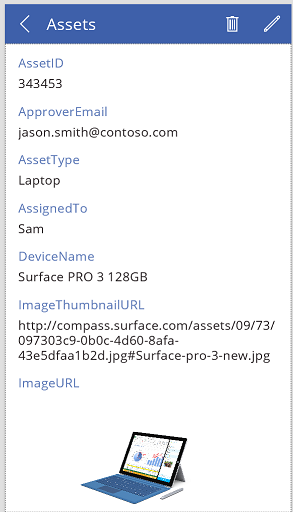

## 与表单进行交互
在解锁卡后，你可以更改它与包含它的表单进行交互的方式。

下面是有关控件应当如何与其卡配合使用以及卡应当如何与表单配合使用的一些指导原则。 它们只是指导原则。 对于 PowerApps 中的任何控件，你可以创建引用 PowerApps 中的任何其他控件的公式，对于卡和卡中的控件也是如此。 要有创造性：你可以通过许多方式创建应用。  

### DataField 属性
卡上最重要的属性是 **[DataField](controls/control-card.md)** 属性。  此属性驱动着验证、要更新的字段以及卡的其他方面。

### 流入的信息
作为容器，表单向其内的所有卡提供了 **ThisItem**。 此记录包含所关注的当前记录的所有字段。  

每个卡的 **[Default](controls/properties-core.md)** 属性都应当设置为 **ThisItem**. *FieldName* 。  某些情况下，你可能希望在来途中转变此值。 例如，你可能希望设置字符串的格式或者将值从一种语言翻译为另一种语言。

卡内的每个控件都应当引用 **Parent.Default** 来获取字段的值。 此策略为卡提供了一定程度的封装，以便卡的 **[Default](controls/properties-core.md)** 属性可以在不更改卡的内部公式的情况下进行更改。

默认情况下，**DefaultValue** 和 **[Required](controls/control-card.md)** 属性是基于 **[DataField](controls/control-card.md)** 属性从数据源的元数据获取的。 你可以使用自己的逻辑替代这些公式，通过使用 **[DataSourceInfo](functions/function-datasourceinfo.md)** 函数集成数据源的元数据。

### 流出的信息
在用户使用卡中的控件修改记录后，**[SubmitForm](functions/function-form.md)** 函数会将这些更改保存到数据源。 当该函数运行时，表单控件将读取每个卡的 **[DataField](controls/control-card.md)** 属性的值来了解要更改哪个字段。  

表单控件还会读取每个卡的 **[Update](controls/control-card.md)** 属性的值。 此值将存储在此字段的数据源中。 这是要应用另一个转换的地方，也许要反转在卡的 **[Default](controls/properties-core.md)** 公式中应用的转换。

**Valid** 属性是基于 **[DataField](controls/control-card.md)** 属性从数据源的元数据驱动的。 它还取决于 **[Required](controls/control-card.md)** 属性以及 **[Update](controls/control-card.md)** 属性是否包含值。 如果 **[Update](controls/control-card.md)** 属性上的值无效，则 **Error** 属性会提供一条用户友好错误消息。

如果某个卡的 **[DataField](controls/control-card.md)** 属性为 *空* ，则说明该卡只是控件的容器。 其 **Valid** 和 **[Update](controls/control-card.md)** 属性在提交表单时不会参与。

## 剖析示例
让我们看一下构成基本的数据输入卡的控件。 可以增大控件之间的空间以便更清晰地显示每个控件：

按下 Alt 键来显示构成此卡的控件的名称：

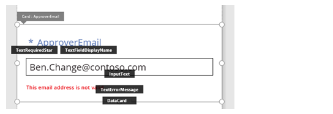

四个控件使得此卡可以工作：

| 名称 | 类型 | 描述 |
| --- | --- | --- |
| **TextRequiredStar** |“[标签](controls/control-text-box.md)”控件 |显示一个星号，这通常在数据输入表单上用来指示某个字段是必填的。 |
| **TextFieldDisplayName** |“[标签](controls/control-text-box.md)”控件 |显示此字段的用户友好名称。 此名称可以不同于数据源的架构中的名称。 |
| **InputText** |**输入文本**控件 |显示字段的初始值并允许用户更改该值。 |
| **TextErrorMessage** |“[标签](controls/control-text-box.md)”控件 |如果验证时出现问题，则向用户显示一条用户友好错误消息。 如果字段为必填字段，还可以确保字段具有值。 |

若要为这些控件填充数据，可以通过以下关键公式从卡的属性驱动其属性。 注意，这些公式中没有一个引用特定的字段。 相反，所有信息都来自卡。

| 控件属性 | 公式 | 描述 |
| --- | --- | --- |
| **TextRequiredStar.Visible** |**Parent.Required** |只有当字段为必填字段时，星星才会显示。 Required 是由你或数据源的元数据驱动的一个公式。 |
| **TextFieldDisplayName.Text** |**Parent.DisplayName** |此文本框控件显示用户友好名称，这是由你或数据源的元数据提供的，并且是在卡的 **[DisplayName](controls/control-card.md)** 属性中设置的。 |
| **InputText.Default** |**Parent.Default** |此文本输入控件最初显示来自数据源的由卡的默认值提供的字段值。 |
| **TextErrorMessage.Text** |**Parent.Error** |如果发生验证问题，则卡的 **Error** 属性会提供一条合适的错误消息。 |

为了从这些控件中提取信息并将其推送回数据源，我们提供了以下关键公式：

| 控件名称 | 公式 | 描述 |
| --- | --- | --- |
| **DataCard.DataField** |**"ApproverEmail"** |用户可以在此卡中显示和编辑的字段的名称。 |
| **DataCard.Update** |**InputText.Text** |在 **[SubmitForm](functions/function-form.md)** 运行时要验证并推送回数据源的值。 |

