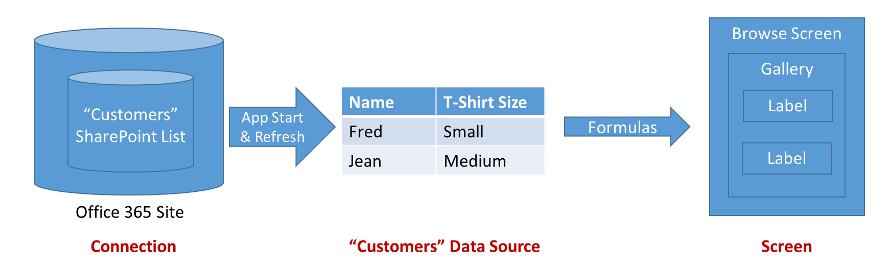
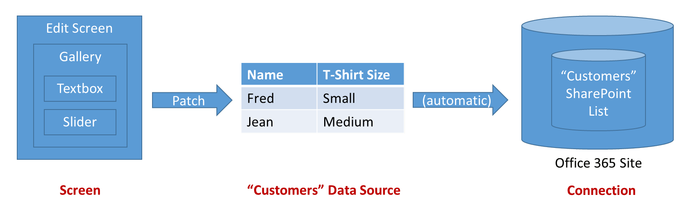

# 了解 PowerApps 中画布应用的数据源

在 PowerApps 中，大多数画布应用使用云服务中存储的外部信息（称为“数据源”）。 常见的例子是，OneDrive for Business 中存储的 Excel 文件中的表。 应用使用**连接**访问这些数据源。

本文介绍不同类型的数据源，以及如何使用表数据源。

我们可以轻松创建一个向数据源执行基本读取和写入的应用。 但有时，我们希望能够以更大的力度控制数据流入和流出应用的方式。  本文介绍如何使用 **[Patch](functions/function-patch.md)**、**[DataSourceInfo](functions/function-datasourceinfo.md)**、**[Validate](functions/function-validate.md)** 和 **[Errors](functions/function-errors.md)** 函数来提供更高的控制度。

## 数据源的类型

数据源可连接到云服务，或者，可以位于应用本地。

### 连接的数据源

最常见的数据源是可用于检索和存储信息的表。 可以使用与数据源建立的连接，在 Microsoft Excel 工作簿、SharePoint 列表、SQL 表和其他许多格式数据源中读取和写入数据，这些数据源可以存储在 OneDrive for Business、DropBox、SQL Server 等云服务中。

除表以外的其他数据源包括电子邮件、日历、Twitter 和通知，但本文并不介绍其他这些类型的数据源。

### 本地数据源

使用 **[库](controls/control-gallery.md)** 、 **[显示窗体](controls/control-form-detail.md)** 和 **[编辑窗体](controls/control-form-detail.md)** 控件可以轻松创建一个可在数据源中读取和写入数据的应用。  若要开始操作，请阅读[了解数据窗体](working-with-forms.md)一文。  

如果想要让 PowerApps 基于数据创建应用，需使用这些控件。 在幕后，应用使用内部表来存储和处理来自数据源的数据。

一种特殊的数据源是[集合](working-with-data-sources.md#collections)，它位于应用本地，而不是基于与云中服务建立的连接，因此，无法在同一用户的设备之间或者在不同的用户之间共享信息。 可在本地加载和保存集合。

### 表的类型

PowerApps 应用内部的表为固定值，就如同数字或字符串是值一样。 内部表不会存储在任何位置，而只存在于应用的内存中。 无法直接修改表的结构和数据。 替代做法是通过公式创建一个新表：使用该公式创建原始表的修改副本。

外部表存储在数据源中，供日后检索和共享。  PowerApps 提供用于读取和写入存储数据的“连接”。  在一个连接中可以访问多个信息表。  可以选择要在应用中使用哪些表，每个表将成为独立的 *数据源* 。  

若要了解详细信息，请参阅[使用表](working-with-tables.md)，其中更详细介绍了内部表，但该文章同样适用于驻留在云服务中的外部表。

## 使用表
可以像使用内部 PowerApps 表一样使用表数据源。  与内部表一样，每个数据源具有可在公式中使用的[记录](working-with-tables.md#records)、[列](working-with-tables.md#columns)和属性。 此外：

* 数据源包含的列名称和数据类型与连接中的基础表相同。
  
    > [!NOTE]
  > 对于列名称带空格的 SharePoint 和 Excel 数据源，PowerApps 会将空格替换为“\_x0020\_”。 例如，如果 SharePoint 或 Excel 中的“Column Name”在数据布局中显示或用于公式，它将在 PowerApps 中显示为“Column_x0020_Name”。
* 加载应用时，将自动从服务中加载数据源。  可以 **[Refresh](functions/function-refresh.md)** 函数强制刷新数据。
* 用户运行某个应用时，可以创建、修改和删除记录，然后将这些更改推回到服务中的基础表。
  * 可以使用 **[Patch](functions/function-patch.md)** 和 **[Collect](functions/function-clear-collect-clearcollect.md)** 函数创建记录。  
  * 可以使用 **[Patch](functions/function-patch.md)**、**[Update](functions/function-update-updateif.md)** 和 **[UpdateIf](functions/function-update-updateif.md)** 函数修改记录。
  * 可以使用 **[Remove](functions/function-remove-removeif.md)** 和 **[RemoveIf](functions/function-remove-removeif.md)** 函数删除记录。
  * 可通过 **[Errors](functions/function-errors.md)** 函数显示使用数据源时出现的错误。
* **[DataSourceInfo](functions/function-datasourceinfo.md)**、**[Defaults](functions/function-defaults.md)** 和 **[Validate](functions/function-validate.md)** 函数提供有关数据源的、可用于优化用户体验的信息。

### 创建数据源
无法使用 PowerApps 创建连接的数据源或修改此类数据源的结构；数据源必须已在服务的某个位置存在。 例如，若要在 OneDrive 上存储的 Excel 工作簿中创建表，首先应使用 OneDrive 上的 Excel Online 创建一个工作簿。 接下来，可通过应用与该工作簿建立连接。  

但是， *可以* 在应用内部创建和修改集合数据源，不过，这种数据源只是临时性的。

### 显示一个或多个记录
 上图显示了应用读取数据源中的信息时的信息流

* 信息通过存储服务（在本例中为 Office 365 站点的 SharePoint 列表）存储和共享。
* 可以通过连接来向应用提供此信息。  该连接负责对访问信息的用户进行身份验证。
* 启动应用或者调用 **[Refresh](functions/function-refresh.md)** 函数时，信息将从连接抽取到应用中的数据源供本地使用。
* 可以使用公式读取信息，并在用户可见的控件中公开这些信息。 可以通过在屏幕和绑定上使用库中显示数据源的记录 **[项](controls/properties-core.md)** 到数据源的属性：**Gallery.Items = DataSource**。  使用控件的 **[Default](controls/properties-core.md)** 属性将库中的控件连接到该库。  
* 数据源也是一个表。  因此，在使用整个数据源之前，可以使用 **[Filter](functions/function-filter-lookup.md)**、**[Sort](functions/function-sort.md)**、**[AddColumns](functions/function-table-shaping.md)** 和其他函数来对它进行优化和补充。  还可以使用 **[Lookup](functions/function-filter-lookup.md)**、**[First](functions/function-first-last.md)**、**[Last](functions/function-first-last.md)** 和其他函数来处理单条记录。

### 修改记录
在上一部分中，您将看到如何读取数据源。  请注意，上图中的箭头是单向的。  对数据源所做的更改不是通过用于检索数据的同一个公式推回的，  而是使用新的公式。  通常，用于编辑记录与浏览记录的屏幕是不同的，尤其是在移动设备上。

请注意，若要修改某个数据源的某个现有记录，该记录最初必须来自该数据源。  记录可能已遍历某个库、某个[上下文变量](working-with-variables.md#use-a-context-variable)和任意数量的公式，但其来源应可追溯到该数据源。  这一点非常重要，因为其他信息会连同唯一标识它们的记录一起遍历，确保修改正确的记录。    

 上图显示了更新数据源时的信息流：

* “[编辑窗体](controls/control-form-detail.md)”控件提供了输入卡片的容器。输入卡片由文本输入控件或滑块等用户输入控件构成。  **[DataSource](controls/control-form-detail.md)** 和 **[Item](controls/control-form-detail.md)** 属性用于标识要编辑的记录。
* 每个输入卡片具有一个 **[Default](controls/properties-core.md)** 属性，该属性通常设置为窗体的 **ThisItem** 记录字段。  然后，输入卡片中的控件将从 **[Default](controls/properties-core.md)** 取输入值。  通常不需要修改此属性。
* 每个输入卡片公开一个 **[Update](controls/control-card.md)** 属性。  此属性将用户的输入映射到记录的特定字段，以便写回到数据源。  通常不需要修改此属性。
* 用户可以使用屏幕上的按钮或图像控件来保存对记录所做的更改。  控件的 **[OnSelect](controls/properties-core.md)** 公式调用 **[SubmitForm](functions/function-form.md)** 函数来执行此操作。  **[SubmitForm](functions/function-form.md)** 读取卡片的所有 **[Update](controls/control-card.md)** 属性，并使用此信息写回到数据源。
* 有时会出现问题。  网络连接可能会出现故障，或者服务会执行应用所不知道的验证检查。  窗体控件的 **Error** 和 **[ErrorKind](controls/control-form-detail.md)** 属性可提供此信息，让你向用户显示。  

若要对整个过程进行更精细的控制，还可以使用 **[Patch](functions/function-patch.md)** 和 **[Errors](functions/function-errors.md)** 函数。  **[编辑窗体](controls/control-form-detail.md)** 控件公开一个 **[Updates](controls/control-form-detail.md)** 属性，用于读取窗体中字段的值。  还可以使用此属性对连接调用自定义连接器，从而完全绕过 **Patch** 和 **SubmitForm** 函数。

### 验证
在对记录进行更改之前，应用应该尽力确保该项更改被接受。  原因有两点：

* *可立即向用户反馈* 。  解决问题的最佳时机就是在发生问题的那一刻，用户还没有忘记前因时。  例如，当用户每次触屏或击键时，出现一段红色文本来提醒用户输入有问题。
* *降低网络流量和用户延迟* 。  在应用中检测到的问题越多，就意味着可用于通过网络检测和解决问题的对话更少。  每次对话都需要占用一定的时间，而用户必须等待这段时间才能继续操作。

PowerApps 提供两个验证工具：

* 数据源可以提供有关哪些内容有效、哪些内容无效的信息。  例如，数字可能包括最小值和最大值，并且需要提供一个或多个输入项。  可以使用 **[DataSourceInfo](functions/function-datasourceinfo.md)** 函数访问此信息。  
* **[Validate](functions/function-validate.md)** 函数使用相同的信息来检查单个列或整条记录的值。

### 错误处理
很好，我们已验证了记录。  接下来介绍如何使用 **[Patch](functions/function-patch.md)** 更新该记录！

啊，但还有一个问题。  应用可能会遇到网络故障、服务验证失败、用户没有适当的权限，或者其他一些可能的错误。  它需要对错误状况做出适当的响应，向用户提供反馈，并让他们通过某种方式纠正问题。  

如果数据源出错，应用会自动记录错误信息，并通过 **[Errors](functions/function-errors.md)** 函数显示这些信息。  错误与出现问题的记录相关联。  如果该问题可由用户解决（例如验证问题），则用户可以重新提交记录，这样即可清除错误。

如果使用 **[Patch](functions/function-patch.md)** 或 **[Collect](functions/function-clear-collect-clearcollect.md)** 创建记录时出错，则没有任何错误与任何记录相关联。  在此情况下，**[Patch](functions/function-patch.md)** 将返回 *blank* ，可将此值用作  **[Errors](functions/function-errors.md)** 的记录参数。  使用以下操作可清除创建错误。

**[Errors](functions/function-errors.md)** 函数返回错误信息表。  如果错误归因于特定的列，则此信息可能包括列信息。  可以在编辑屏幕上与列所在位置靠近的标签控件中使用列级错误消息。  如果错误表中的 **列** 为 *空白* ，则可以在靠近整个记录的“保存”按钮的位置使用记录级错误消息。  

### 使用大型数据源
从大型数据源（可能包括数百万条记录）创建报告时，最好是尽量减少网络流量。 假设你要报告纽约市 StatusCode 为“Platinum”的所有客户， 而“客户”表包含数百万条记录。

你**不**想要将数百万条客户记录导入应用，然后选择所需的记录。 你希望在表所存储到的云服务中完成这种选择，然后通过网络发送选择的记录。

可用于选择记录的许多（但并非全部）函数可以 *委派* ，这意味着，它们将在云服务中运行。 若要了解如何执行此操作，请参阅[委派](delegation-overview.md)。

## 集合
集合是一种特殊的数据源。  它们位于应用本地，而不是基于与云中服务建立的连接，因此，无法在同一用户的设备之间或者在不同的用户之间共享信息。  它们的工作方式与其他任何数据源类似，但有几项差别：

* 可以使用 **[Collect](functions/function-clear-collect-clearcollect.md)** 函数动态创建集合。  它们不需要提前建立，而基于连接的数据源则需要提前建立。
* 随时可以使用 **[Collect](functions/function-clear-collect-clearcollect.md)** 函数修改集合的列。
* 集合允许重复记录。  一个集合中可以存在同一记录的多个副本。  除非提供了 **All** 参数，否则 **[Remove](functions/function-remove-removeif.md)** 等函数将针对它们找到的第一个匹配项运行。
* 可以使用 **[SaveData](functions/function-savedata-loaddata.md)** 和 **[LoadData](functions/function-savedata-loaddata.md)** 函数来保存和重新加载集合的副本。  信息存储在其他用户、应用或设备无法访问的专用位置。
* 可以使用 **[导出](controls/control-export-import.md)** 和 **[导入](controls/control-export-import.md)** 控件将集合的副本保存和重新加载到用户可交互的文件中。  

有关使用集合作为数据源的详细信息，请参阅[创建和更新集合](create-update-collection.md)。

集合通常用于保存应用的全局状态。  请参阅[使用变量](working-with-variables.md)，了解可用于管理状态的选项。

