# 了解 Microsoft PowerApps 中的数据表单布局
在 PowerApps 中，可以轻松创建具有吸引力且高效使用的表单。 例如，假设记录销售订单的基本表单如下：

本教程中，我们将逐步介绍如何创建此表单。 另外，我们还将介绍一些高级主题，如动态调整字段大小以填充可用空间。

## 开始之前
如果你是初次接触 PowerApps（或者仅自动生成过应用），则在深入了解此主题前请[从头开始生成一个应用](get-started-create-from-blank.md)。 通过从头开始生成一个应用，会让你熟悉本主题中提及但未加说明的必备概念，例如添加数据源和控件。

## 添加库
1. 从头开始创建平板电脑应用。
   
    本主题中介绍的所有内容同样也适用于手机布局，不同之处在于，手机应用通常只有一个垂直列。
2. 在 [Common Data Service](../common-data-service/data-platform-intro.md) 中添加“销售订单”实体，作为应用的数据源。
   
    在本教程之外，可以使用任意数据源，包括 SharePoint 列表和 Excel 表。
3. 添加垂直的“库”控件，并将其 **Items**属性设置为 **'Sales order'**。
   
    （可选）若要与本教程中的示例一致，请将库的“布局”设置为仅显示“标题和副标题”。
   
    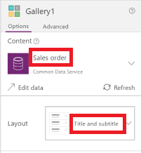
4. 在库中，单击或点击 **SO004**。
   
    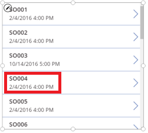
   
    此记录将显示在你按照本主题后续步骤生成的表单中。

## 添加标题栏
1. 添加一个放置窗体的空白屏幕。
   
    在本教程之外，可以将“库”和“**[编辑表单](controls/control-form-detail.md)**”控件放置在同一个屏幕上，但将其放在单独屏幕上时可使用的空间会更多。
2. 在新屏幕的顶部，添加一个**[标签控件](controls/control-text-box.md)**，将其 **Text** 属性设置为此表达式：
    **"Sales Order " & Gallery1.Selected.SalesOrderId**
   
    该标签将显示你在库中选择的记录的销售订单号。
3. （可选）将该标签的格式设置如下：
   
   1. 将其 **Align** 属性设置为 **Center**。
   
   2. 将其 **Size** 属性设置为 **20**。
   
   3. 将其 **Fill** 属性设置为 **Navy**。
   
   4. 将其 **Color** 属性设置为 **White**。
   
   5. 将其 **Width** 属性设置为 **Parent.Width**。
   
   6. 将其 **X** 和 **Y** 属性设置为 **0**。
      
      

## 添加表单
1. 添加一个“编辑表单”控件，然后移动并调整控件大小，以使其填充标签下方的屏幕。
   
    在后续步骤中，通过使用右窗格（而非编辑栏）将窗体控件连接到“销售订单”数据源。 如果使用编辑栏，该窗体将默认不显示任何字段。 始终可以通过在右窗格中选择一个或多个复选框来显示所需的任意字段。
2. 在右侧窗格中，依次单击或点击“未选定数据源”旁边的向下箭头和“销售订单”。
   
    “销售订单”数据源中的默认字段集将以简洁的三列布局显示。 但是许多为空，可能需要一些时间才能到达其最终位置。  
3. 将该窗体的 **Item** 属性设置为 **Gallery1.Selected**。
   
    此窗体会显示你在库中所选的记录，但是默认的字段集可能与你在最终产品中所需的内容不一致。
4. 在右窗格中，通过取消选中其复选框隐藏以下各个字段：
   
   * **销售订单 ID**
   * **帐户**
   * **销售人员**
   * **客户联系人**
5. 通过将“订单状态”字段拖到左侧，然后将其拖到“客户采购订单参考”字段的另一侧来移动它。
   
    屏幕应类似于下面的示例：
   
    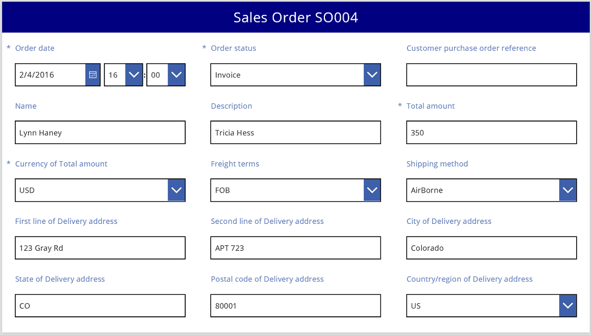

## 选择一个数据卡
显示的每个字段都在表单上有对应的数据卡。 此卡包含一组字段标题控件、一个输入框、一个星号（在字段为必填项时显示）和一个验证错误消息。

还可以直接在表单上选择数据卡。 在选中一个卡时，其上方将显示黑色标题。

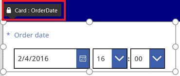

> [!NOTE]
> 若要删除卡片（而不仅仅是隐藏它），请选择卡片，再按“删除”。

## 排列列中的卡
默认情况下，平板电脑应用中的表单包含 3 列，手机应用中的表单包含 1 列。 你不仅可以指定窗体包含的列数，还可以指定所有卡是否要适应列边框内部的大小。

在此图中，选中“对齐到列”复选框后，窗格中的列数从三列更改为四列。 窗体中的卡自动进行排列以适应新布局的大小。

## 跨多个列调整卡大小
根据各个卡中的数据，可能需要让某些卡适应单个列的大小，让其他卡跨越多个列。 如果卡包含的数据多于想要在单个列中显示的内容，可以将卡选中，然后拖动其选择框左或右边框处的握柄来将卡加宽。 拖动握柄时，卡将“对齐”到列边界。

若要使设计更为灵活但保留某些结构，可以将列数增加到 12。 进行此更改后，可以轻松地将各个卡配置为跨越整个表单、半个表单、三分之一表单、四分之一表单、六分之一表单等。 我们来看一下实际操作。

1. 在右窗格中，将表单中的列数设置为 **12**。
   
    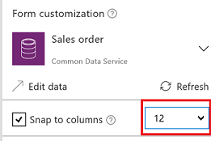
   
    表单没有发生明显变化，但是当拖动左或右握柄时对齐点会变多。
2. 通过将右侧对齐点上的握柄向右侧拖来增加“订单日期”数据卡的宽度。
   
    该卡跨越了表单的 12 列中的四个（或表单的 1/3），而非仅跨越表单的 12 列中的三个（或表单的 1/4）。 当通过一个对齐点来增加卡的宽度时，卡将多跨越一个 1/12 的表单空间。
   
    
3. 对“订单状态”和“客户采购订单参考”卡重复执行上述步骤。
   
    

4. 调整“名称”和“说明”卡的大小，使其占据表单的六列（或 1/2）。

5. 让“交货地址”的前两行完全横跨整个表单：

大功告成！ 我们已生成所需表单，让各行的列数不同：

## 操纵卡中的控件
交货地址包含多条信息，建议将这些信息组合在一起，以方便用户查看。 虽然每个字段都留在自己的数据卡中，但我们可以在数据卡中控制控件，使它们更完美地组合在一起。

1. 选择“交货地址的第一行”卡，选择该卡内的标签，然后删除文本中的前三个字词。
   
    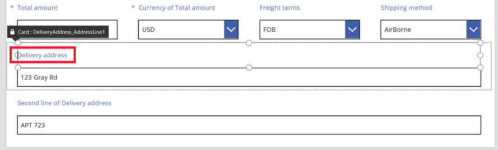
2. 选择“交货地址的第二行”卡，选择该卡内的标签，然后删除其中的所有文本。
   
    很容易就会直接删除“标签”控件，尽管在很多情况下都可以这样做。 但公式可能会依赖当前控件。 更安全的方法是，删除文本或将此控件的 **Visible** 属性设置为 **false**。
   
    
3. 在同一个卡中，将文本输入框移到标签之上，以减少第一行和第二行地址之间的空间。
   
    卡内容占据的空间减少后卡的高度将缩减。
   
    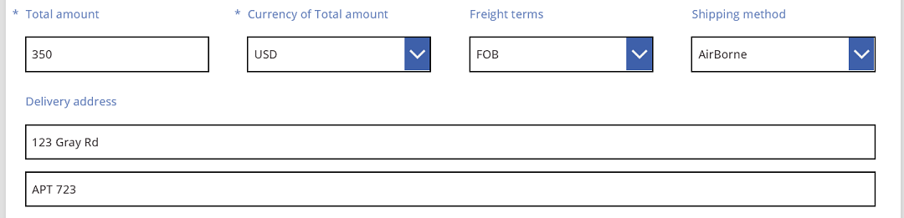

现在，我们将重点处理第三行地址。 与刚才的操作类似，我们将缩短这些数据卡中每个标签的文本，并将文本输入框排列到每个标签的右侧。 下面介绍如何对“州/省/自治区/直辖市”数据卡执行这些操作：

| 步骤 | 描述 | 结果 |
| --- | --- | --- |
| 1 |选中“州/省/自治区/直辖市”数据卡，以使其周围出现握柄。 |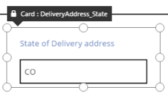 |
| 2 |选中该卡中的标签，以使其周围出现握柄。 | |
| 3 |将光标移到文本右侧，然后删除不需要的部分。 |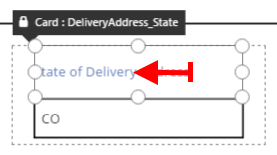 |
| 4 |使用两端的握柄，设定“标签”控件的大小，以适应新的文本大小。 | |
| 5 |选择此数据卡中的“文本输入”控件。 |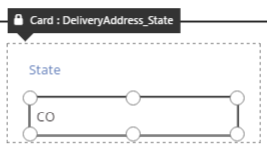 |
| 6 |使用两侧的握柄，根据需要设定“文本输入”控件的大小。 |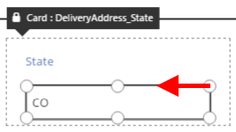 |
| 7 |将文本输入框向上拖到“标签”控件的右侧，然后拖放该文本输入框。 | |
| “州/省/自治区/直辖市”数据卡的修改现已完成。 | | |

生成的完整第三行地址如下所示：

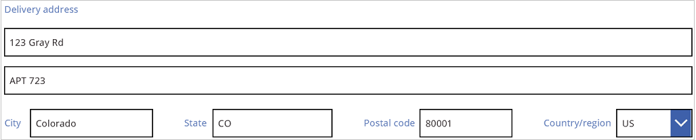

请注意，许多数据卡一开始就对属性使用了动态公式。 例如，我们在上面移动并重新设定大小的“文本输入”控件就包含以父级宽度为依据的 **Width** 属性。 移动控件或重新设定其大小后，这些动态公式将被替换为静态值。 如果需要，可以使用编辑栏还原动态公式。

## 禁用“对齐到列”
有时，可能需要进一步控制，而标准的 12 列无法实现这一点。 在这种情况下，可以禁用“对齐到列”，然后手动设置数据卡的位置。 尽管表单将继续对齐 12 列，但也可以按住 Alt 键，根据需要手动调整数据卡的位置和大小。

在我们的示例中，构成第三行地址的四个组件的宽度完全相同。 不过，这可能并不是最佳布局，因为城市名称长于州/省/自治区/直辖市缩写，并且“国家/地区”的文本输入框较短，这是由于其标签长度所致。

若要优化此空间，请在右窗格中禁用“对齐到列”，然后在设定这些卡大小和位置时按住 Alt 键。 按住 Alt 键后，所有控件均将显示黑色标题。 此行为被设计为显示控件名称。

仔细定位后，每个字段的大小适当，字段水平间距匀称：

综合而言，启用与禁用“对齐到列”后，行为上有哪些不同？

| 行为 | “贴靠列”已启用 | “贴靠列”已禁用 |
| --- | --- | --- |
| 重设大小后贴靠列数 |选择的列数： 1、2、3、4、6 或 12 |12 列 |
| 可以重写重设大小后贴靠列数 |否 |是，使用 Alt 键 |
| 数据卡在各行间自动重新布局（稍后将对此进行详细介绍） |是 |否 |

## 设置宽度和高度
与 PowerApps 中的所有内容一样，表单布局受数据卡控件属性约束。 如前面所述，可以通过将控件拖到不同的位置或拖动握柄来调整控件的大小，从而更改这些属性的值。 不过，有时也会需要更精准地了解并控制这些属性，尤其是在使用公式生成动态表单时。

### 基本布局：X、Y 和 Width
**X** 和 **Y** 属性控制卡的位置。 处理原始画布上的控件时，这些属性生成的是绝对位置。 在表单中，这些属性的含义就不同了：

* **X**：行内顺序。
* **Y**：行号。

与画布上的控件类似，“Width”属性指定的是数据卡的最小宽度（很快将会对下限进行详细介绍）。

让我们来看看表单中数据卡的“X”、“Y”和“Width”属性：

### 溢出行
如果某行上的数据卡过宽而无法适应此行，会怎么样？ 通常情况下，不必担心这种可能性。 如果已启用“对齐到列”，这三个属性会自动进行调整，以便所有内容都能很好地适应行，而不会溢出。

不过，如果已禁用“对齐到列”或公式中的 **Width** 以一张或多张数据卡为依据，则可能会发生行溢出。 在这种情况下，数据卡会自动换行，以便有效地创建其他行。 例如，我们会将“客户采购订单参考”数据卡（第一行中的第三项）的 **Width** 属性手动更改为 **500**：

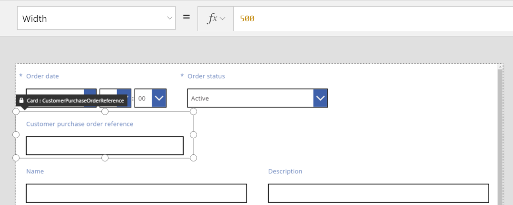

最上面一行中的三张数据卡不再适应水平空间，并且创建了其他行，以将溢出内容自动换行。 所有这些数据卡的 **Y** 坐标仍保持 0 不变，而“名称”和“说明”数据卡的 **Y** 坐标也仍为 1。 具有不同 **Y** 值的卡不会跨行合并。

可以使用此行为创建完全动态的布局，即数据卡根据 Z 顺序进行排列，尽可能填充所在行，然后再移到下一行。 若要达到此效果，请为所有数据卡设置相同的 **Y** 值，再使用 **X** 表示数据卡的顺序。

### 填充空间：WidthFit
上一示例中的溢出导致第一行中第二张“订单状态”数据卡后面有空间。 为了填充此空间，我们可以手动调整两张剩余数据卡的 **Width** 属性，但此方法会很麻烦。

作为备选方法，可以使用“WidthFit”属性。 如果某行中的一张或多张数据卡将此属性设置为 **true**，则此行上的任何剩余空间都会被数据卡均分。 正因为此行为，我们在前面提到，数据卡的 **Width** 属性为*最小宽度*，而实际显示的宽度可能会更大。 此属性不会使卡片缩，只会使其扩大。

如果将“订单状态”卡上的 **WidthFit** 设置为 **true**，其将填充可用空间，而第一张卡将保持不变：

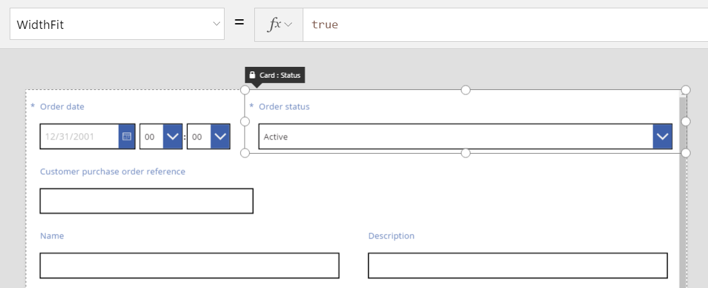

如果我们也将“订单日期”卡上的 **WidthFit** 设置为 **true**，那么这两张数据卡将均分可用空间：

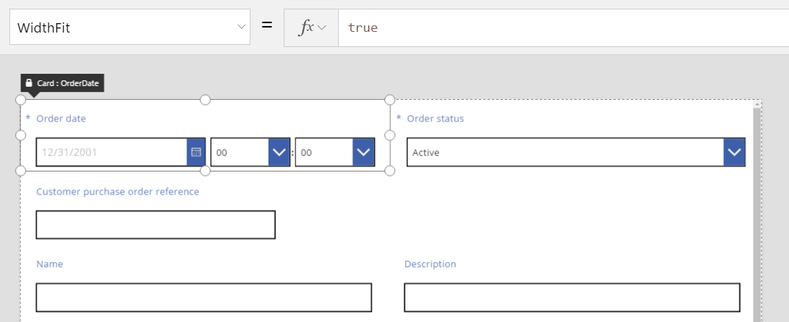

请注意，这些数据卡的握柄将“WidthFit”带来的额外宽度考虑在内，而不考虑“Width”属性规定的最小宽度。 如果已启用“WidthFit”，那么控制“Width”属性可能会引起混淆；建议禁用“WidthFit”，更改“Width”属性，再重新启用“WidthFit”。

“WidthFit”何时有用？ 如果某字段只在特定情况下才使用，则可以将它的 **Visible** 属性设置为 **false**，这样此行上的其他数据卡便会自动填充它周围的空间。 建议使用公式，以便仅在另一个字段包含特定值时显示字段。

此时，我们将“订单状态”字段的 **Visible** 属性设置为静态 **false**：

在有效删除第二张数据卡的情况下，第三张数据卡现在可以恢复与第一张数据卡位于同一行。 第一张数据卡仍将 **WidthFit** 设置为 **true**，因此，只有它会扩展宽度来填充可用空间。

由于“订单状态”不可见，因此，不能像在画布上一样轻松选择它。 但是，可以在屏幕左侧的控件层次列表中选择任何可见或不可见的控件。

### Height
“Height”属性约束每张数据卡的高度。 对于 **Height**，数据卡也有等同于 **WidthFit** 的属性，并且始终设置为 **true**。 假定存在 **HeightFit** 属性，但是请勿在产品中寻找它，因为尚未发布此类属性。

因为无法禁用此行为，所以更改数据卡的高度可能比较棘手。 行中的所有数据卡都与最高数据卡等高。 看到的行可能会如下所示：

哪张数据卡决定了行高？ 在上图中，虽然选择了显得很高的“总金额”数据卡，但它的 **Height** 属性值为 **80**（与第一行的高度相同）。 若要缩减行高，必须缩减该行中高度最大的卡的 **Height** 属性，并且只有查看每个卡片的 **Height** 属性才能识别出高度最大的卡。

### AutoHeight
如果卡包含的控件将 **AutoHeight** 属性设置为 **true**，则该卡也可能高于你所需的高度。 例如，许多卡都包含一个标签，以便在字段值导致验证问题时显示错误消息。

如果没有任何文本要显示（无错误），那么此标签的高度将折叠为零。 如果对此不甚了解，就不会知道此类标签的存在，而此类标签应该如下所示：

在屏幕左侧，控件列表显示 **ErrorMessage1**，这就是我们的“标签”控件。 更新应用时，可以选择此控件，指定其高度并显示握柄来通过它们设置控件的位置和大小。 蓝色框中的“A”指明控件已将 **AutoHeight** 设置为 **true**：

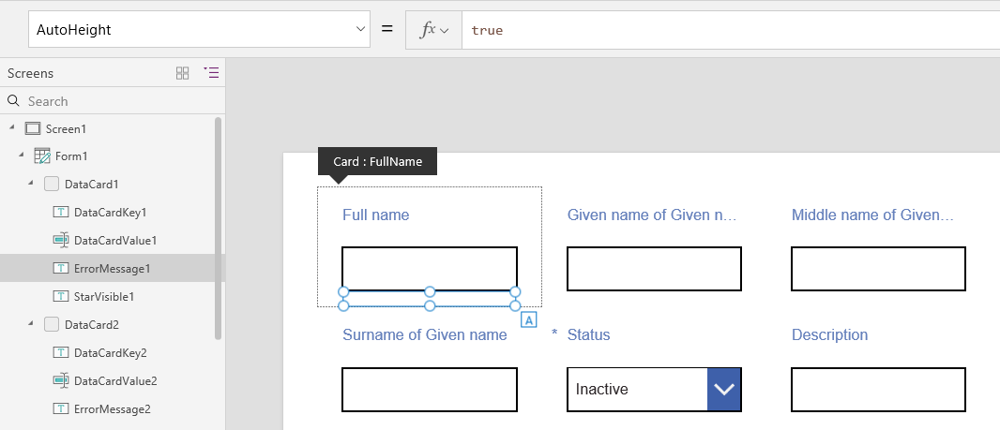

此控件的 **Text** 属性设置为 **Parent.Error**，用于获取基于验证规则的动态错误消息。 为了便于说明，我们将以静态方式设置此控件的 **Text** 属性，这会令其变高（进而令数据卡变高）来适应文本长度：

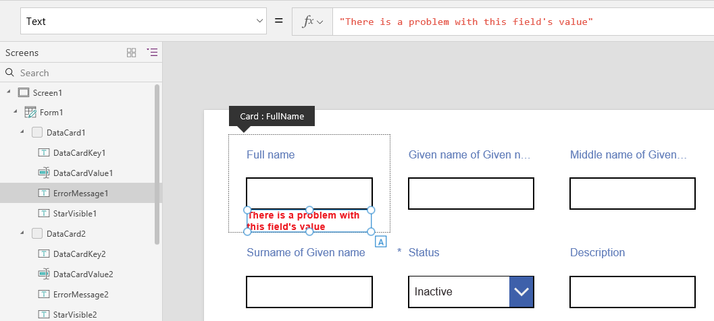

我们将加长一点错误消息，此控件和数据卡会再次变高以适应文本长度。 请注意，行整体变高，但仍保留数据卡之间的垂直对齐方式：

