# <a name="understand-canvas-app-forms-in-microsoft-powerapps"></a>了解 Microsoft PowerApps 中的画布应用窗体

向画布应用添加三种类型的控件，这样用户可以浏览记录、显示记录的详细信息，以及编辑或创建记录：

| 活动 | 控件 | 描述 |
| --- | --- | --- |
| **浏览记录** |**[库](controls/control-gallery.md)** 控件 |筛选、排序、搜索和滚动浏览数据源中的记录，以及选择特定的记录。 显示每条记录中的几个字段，以便一次性显示多条记录，即使是在小屏幕上显示。 |
| **显示记录的详细信息** |**[显示窗体](controls/control-form-detail.md)** 控件 |显示单条记录中的多个或所有字段。 |
| **编辑或创建记录** |**[编辑窗体](controls/control-form-detail.md)** 控件 |更新单条记录中的一个或多个字段（或创建以默认值开始的记录），并将这些更改保存回到基础数据源。 |

将每个控件放在不同的屏幕上，以方便区分：

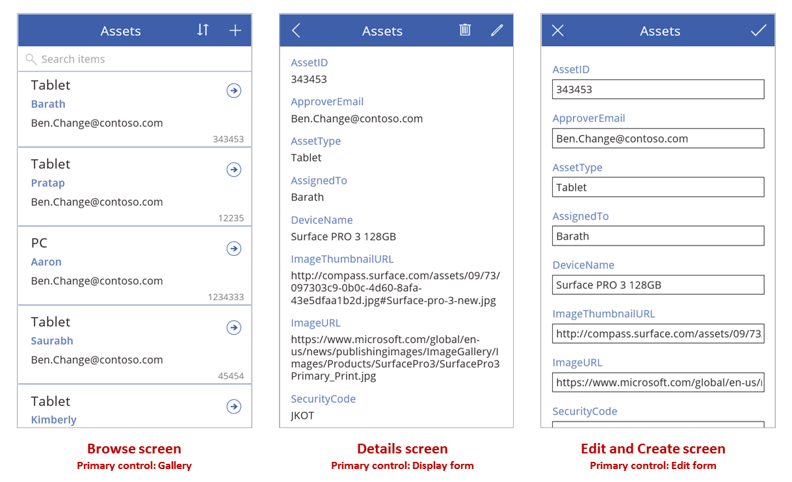

根据本主题中所述，使用公式组合这些控件，以创建整体用户体验。

## <a name="prerequisites"></a>先决条件

* [注册](../signup-for-powerapps.md) PowerApps，然后使用注册所用的同一凭据[登录](https://web.powerapps.com?utm_source=padocs&utm_medium=linkinadoc&utm_campaign=referralsfromdoc)。
* 了解如何在 PowerApps 中 [配置控件](add-configure-controls.md)。

## <a name="explore-a-generated-app"></a>浏览生成的应用
PowerApps 可以根据指定的数据源自动生成应用。 每个应用包含三个屏幕，其中显示前面所述的控件，以及用于连接控件的公式。 “现成地”运行这些应用，根据具体的目标自定义这些应用，或者探索其工作原理，以了解适用于你自己的应用的有用概念。 以下部分介绍驱动生成的应用的屏幕、控件和公式。  

### <a name="browse-screen"></a>浏览屏幕


此屏幕包括以下重要公式：

| 控件 | 支持的行为 | 公式 |
| --- | --- | --- |
| **BrowseGallery1** |显示“资产”数据源中的记录。  |库的 **[Items](controls/properties-core.md)** 属性设置为基于“资产”数据源的公式。  |
| **ImageNewItem1** |显示“编辑和创建”屏幕，其中的每个字段设置为默认值，使用户能够轻松创建记录。  |图像的 **[OnSelect](controls/properties-core.md)** 属性设置为此公式：<br> **NewForm( EditForm1 );<br>Navigate( EditScreen1, None )** |
| **NextArrow1**（在库中） |显示“详细信息”屏幕，用于查看当前所选记录的多个或所有字段。  |箭头的 **[OnSelect](controls/properties-core.md)** 属性设置为此公式：<br>**Navigate( DetailScreen1, None )** |

此屏幕上的主要控件 **BrowseGallery1** 覆盖大部分屏幕区域。 用户可以滚动浏览库来找到特定的记录，显示更多字段或更新字段。

将库的 **[Items](controls/properties-core.md)** 属性设置为显示库中数据源的记录。 例如，将该属性设置为 **Assets** 可显示使用该名称的数据源中的记录。

> [!NOTE]
> 在生成的应用中，[Items](controls/properties-core.md)  默认设置为更复杂的公式，以便用户能够排序和搜索记录。 本主题稍后将介绍如何构建该公式；暂时使用更简单的版本便已足够。

用户可以选择库上面的“+”符号创建记录，而无需查找要显示或编辑的记录。 添加一个 **[Image](controls/control-image.md)** 控件，在其中显示“+”符号，然后将其 **[OnSelect](controls/properties-core.md)** 属性设置为以下公式，即可创建这种效果：
<br>**NewForm( EditForm1 ); Navigate( EditScreen1, None )**

此公式打开“编辑和创建”屏幕，其中包含名为 **EditForm1** 的 **[编辑窗体](controls/control-form-detail.md)** 控件。  该公式还会将该窗体切换到“新建”模式，在此模式下，窗体将显示数据源中的默认值，使用户能够轻松从头开始创建记录窗体。 

若要了解 **BrowseGallery1** 中显示的任何控件，请在该库的第一个部分（充当其他所有部分的模板）中选择该控件。 例如，选择左边缘中间的“[标签](controls/control-text-box.md)”  控件：


在此示例中，控件的 **[Text](controls/properties-core.md)** 属性设置为 **ThisItem.AssignedTo**，这是“资产”数据源中的一个字段。  库中其他三个“[标签](controls/control-text-box.md)”  控件的“[Text](controls/properties-core.md)”  属性设置为类似的公式，每个控件显示数据源中的不同字段。  

选择 **[形状](controls/control-shapes-icons.md)** 控件（箭头），确认其 **[OnSelect](controls/properties-core.md)** 属性是否设置为此公式：
<br>**Navigate( DetailScreen1, None )**

如果用户在 **BrowseGallery1** 中找到记录，可以选择该记录的箭头，在 **DetailScreen1** 中显示有关该记录的更多信息。 用户可以通过选择箭头来更改 **BrowseGallery1** 的 **Selected** 属性值。 在此应用中，该属性确定哪个记录不仅要显示在 **DetailScreen1** 中，而且当用户确定要更新该记录时，该记录还要显示在“编辑和创建”屏幕中。 

### <a name="detail-screen"></a>详细信息屏幕
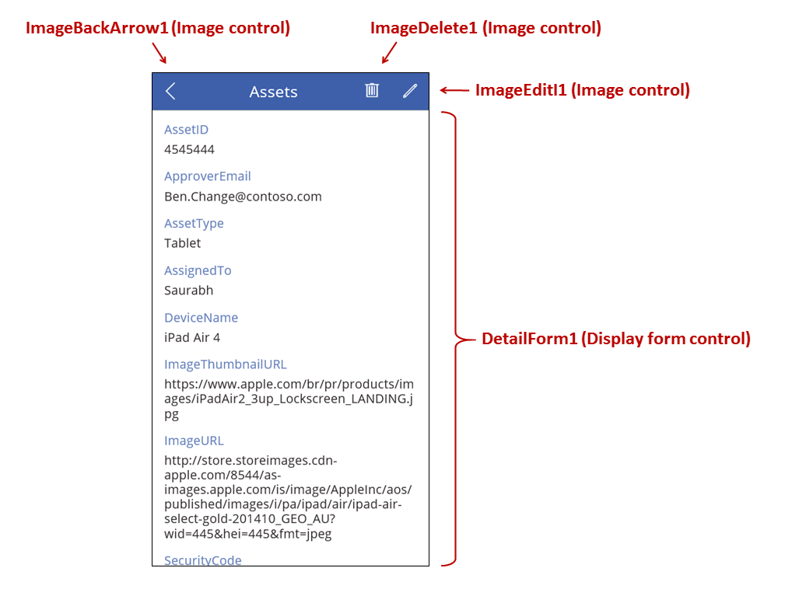

此屏幕包括以下重要公式：

| 控件 | 支持的行为 | 公式 |
| --- | --- | --- |
| **DetailForm1** |显示“资产”数据源中的记录  |将 **[DataSource](controls/control-form-detail.md)** 属性设置为 **Assets**。 |
| **DetailForm1** |确定要显示哪条记录。 在生成的应用中，显示用户在库中选择的记录。 |将此控件的 **[Item](controls/control-form-detail.md)** 属性设置为此值：<br>**BrowseGallery1.Selected** |
| **[卡片](controls/control-card.md)** 控件 |在 **[显示窗体](controls/control-form-detail.md)** 控件中，显示记录中的单个字段。 |将 **[DataField](controls/control-card.md)** 属性设置为字段的名称，并将值括在双引号中（例如 **"Name"** ）。 |
| **ImageBackArrow1** |当用户选择此控件时，将打开 **BrowseScreen1**。 |将 **[OnSelect](controls/properties-core.md)** 属性设置为以下公式：<br>**Back()** |
| **ImageDelete1** |当用户选择此控件时，将删除记录。 |将 **[OnSelect](controls/properties-core.md)** 属性设置为以下公式：<br>**Remove( Assets, BrowseGallery1.Selected )** |
| **ImageEdit1** |当用户选择此控件时，将打开当前记录的“编辑和创建”屏幕。  |将 **[OnSelect](controls/properties-core.md)** 属性设置为以下公式：<br>**Navigate( EditScreen1, None )** |

在屏幕顶部，**DetailForm1** 的外部有三个图像，它们充当按钮，在应用的三个屏幕之间协调操作。

**DetailForm1** 控制此屏幕，显示用户在库中选择的记录（因为窗体的 **[Item](controls/control-form-detail.md)** 属性设置为 **BrowseGallery1.Selected**）。 窗体的 **[DataSource](controls/control-form-detail.md)** 属性还提供有关数据源的元数据，例如每个字段的用户友好显示名称。

**DetailForm1** 包含多个 **[卡片](controls/control-card.md)** 控件。 可以选择 **[卡片](controls/control-card.md)** 控制本身或它包含的控件来查看更多信息。

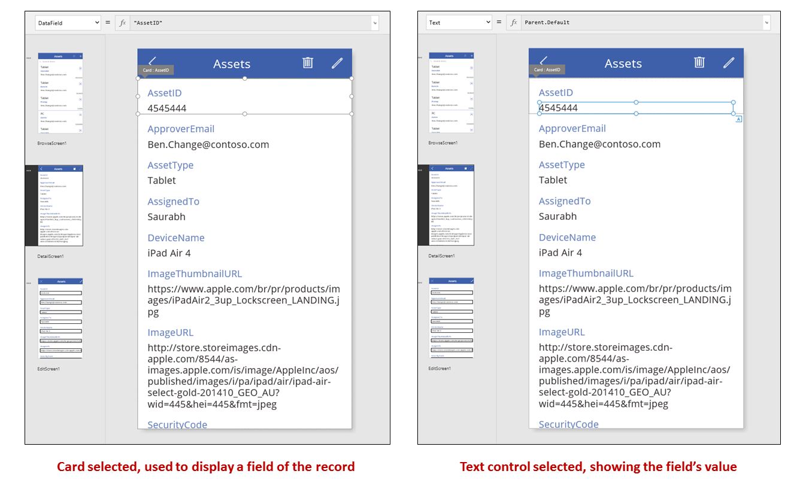

**[卡片](controls/control-card.md)** 控件的 **[DataField](controls/control-card.md)** 属性确定卡片显示哪个字段。 在本例中，该属性设置为 **AssetID**。 卡片包含“[标签](controls/control-text-box.md)”  控件，此控件的“[Text](controls/properties-core.md)”  属性设置为“Parent.Default”  。 此控件显示卡片的**默认**值，此值是通过 **[DataField](controls/control-card.md)** 属性设置的。

在生成的应用中， **[卡片](controls/control-card.md)** 控件默认已锁定。 锁定卡片后，无法修改某些属性（例如 **[DataField](controls/control-card.md)** ），并且不会为这些属性提供公式栏。 这种限制有助于确保自定义设置不会破坏生成的应用的基本功能。 但是，可以在右窗格中更改卡片及其控件的某些属性：

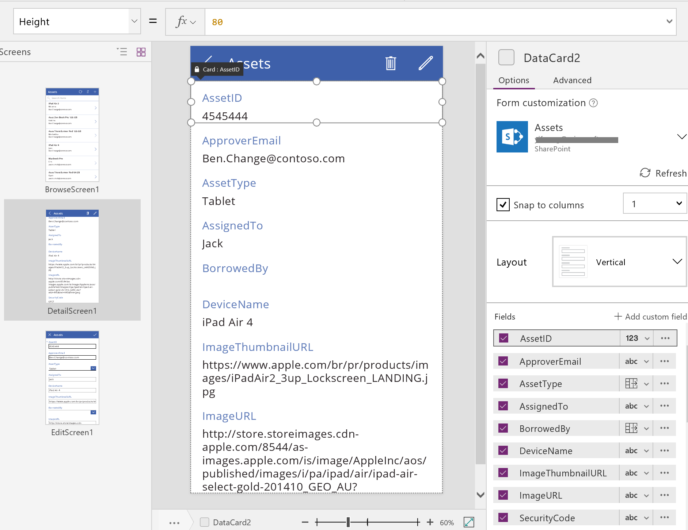

在右窗格中，可以选择要显示的字段，以及每个字段显示的控件类型。

### <a name="editcreate-screen"></a>编辑/创建屏幕


此屏幕包括以下重要公式：

| 控件 | 支持的行为 | 公式 |
| --- | --- | --- |
| **EditForm1** |显示“资产”数据源中的记录。  |将 **[DataSource](controls/control-form-detail.md)** 属性设置为 **Assets**。 |
| **EditForm1** |确定要显示哪条记录。 在生成的应用中，显示用户在 **BrowseScreen1** 中选择的记录。 |将 **[Item](controls/control-form-detail.md)** 属性设置为此值：<br>**BrowseGallery1.Selected** |
| **[卡片](controls/control-card.md)** 控件 |在 **[编辑窗体](controls/control-form-detail.md)** 控制中提供控件，使用户能够编辑记录中的一个或多个字段。 |将 **[DataField](controls/control-card.md)** 属性设置为字段的名称，并将值括在双引号中（例如 **"Name"** ）。 |
| **ImageCancel1** |当用户选择此控件时，将丢弃正在进行的任何更改并打开“详细信息”屏幕。  |将 **[OnSelect](controls/properties-core.md)** 属性设置为以下公式：<br>**ResetForm( EditForm1 ); Back()** |
| **ImageAccept1** |当用户选择此控件时，会将更改提交到数据源。 |将 **[OnSelect](controls/properties-core.md)** 属性设置为以下公式：<br>**SubmitForm( EditForm1 )** |
| **EditForm1** |如果已接受更改，则返回上一屏幕。 |将 **[OnSuccess](controls/control-form-detail.md)** 属性设置为以下公式：<br>**Back()** |
| **EditForm1** |如果未接受更改，则保留在当前屏幕上，使用户能够修复任何问题并尝试重新提交。 |将 **[OnFailure](controls/control-form-detail.md)** 属性保留空白。 |
| **LblFormError1** |如果未接受更改，则显示错误消息。 |将 **[Text](controls/properties-core.md)** 属性设置为此值：<br>**EditForm1.Error** |

与在“详细信息”屏幕中一样，一个名为 **EditForm1** 的窗体控件将控制“编辑和创建”屏幕。   此外，**EditForm1** 的 **[Item](controls/control-form-detail.md)** 属性设置为 **BrowseGallery1.Selected**，使窗体显示用户在 **BrowseScreen1** 中选择的记录。 尽管“详细信息”屏幕将每个字段显示为只读，但用户可以使用 **EditForm1** 中的控件更新一个或多个字段的值。  用户还可以使用 **[DataSource](controls/control-form-detail.md)** 属性来访问有关此数据源的元数据，例如每个字段的用户友好显示名称，以及应该将更改保存到的位置。

如果用户选择“X”图标取消更新， **[ResetForm](functions/function-form.md)** 函数将放弃所有未保存的更改， **[Back](functions/function-navigate.md)** 函数将打开“详细信息”屏幕。  “详细信息”屏幕与“编辑和创建”屏幕将一直显示同一条记录，直到用户在 **BrowseScreen1** 中选择不同的记录。   该记录中的字段将保留设置为最近保存的值而不是用户所做的任何更改，然后被丢弃。

如果用户在窗体中更改一个或多个值，然后选择“复选标记”图标， **[SubmitForm](functions/function-form.md)** 函数会将用户的更改发送到数据源。

* 如果成功保存更改，窗体的 **[OnSuccess](controls/control-form-detail.md)** 公式将会运行，**Back()** 函数将打开详细信息屏幕以显示更新的记录。
* 如果未成功保存更改，窗体的 **[OnFailure](controls/control-form-detail.md)** 公式将会运行，但不更改任何内容，因为它是*空白的*。 “编辑和创建”屏幕将保持打开状态，使用户能够取消更改或修复错误。  **LblFormError1** 显示用户友好的错误消息，窗体的 **Error** 属性即设置为该消息的内容。

与 **[显示窗体](controls/control-form-detail.md)** 控件一样， **[编辑窗体](controls/control-form-detail.md)** 控件包含 **[卡片](controls/control-card.md)** 控件，而卡片控件又包含显示记录中不同字段的其他控件：


在上图中，选定的卡片显示了 **AssetID** 字段并包含 **[文本输入](controls/control-text-input.md)** 控制，使用户能够编辑该字段的值。 （相比之下，详细信息屏幕在“[标签](controls/control-text-box.md)”  控件中显示相同字段，但字段是只读的。） **[文本输入](controls/control-text-input.md)** 控件具有一个设置为 **Parent.Default** 的 **[Default](controls/properties-core.md)** 属性。 如果用户创建而不是编辑记录，该控件将显示一个初始值，用户可以更改新记录的该值。

在右窗格中，可以显示或隐藏每个卡片、重新排列卡片，或者将它们配置为显示不同类型的控件中的字段。


## <a name="build-an-app-from-scratch"></a>从头开始构建应用
了解 PowerApps 如何生成应用后，你可以自行构建一个使用本主题前面所述的相同构建基块和公式的应用。

## <a name="identify-test-data"></a>确定测试数据
为了让本主题发挥最大的参考价值，可以从一个可以试验的数据源着手。 该数据源应该包含可以任意读取和更新的测试数据。

> [!NOTE]
> 如果使用列名称带空格的 SharePoint 列表或 Excel 表作为数据源，PowerApps 会将空格替换为“\_x0020\_”  。 例如，如果 SharePoint 或 Excel 中的“Column Name”  在数据布局中显示或用于公式，它将在 PowerApps 中显示为“Column_x0020_Name”  。

若要完全根据原文参考本主题的余下部分，请创建名为“Ice Cream”的 SharePoint 列表，其中包含以下数据：

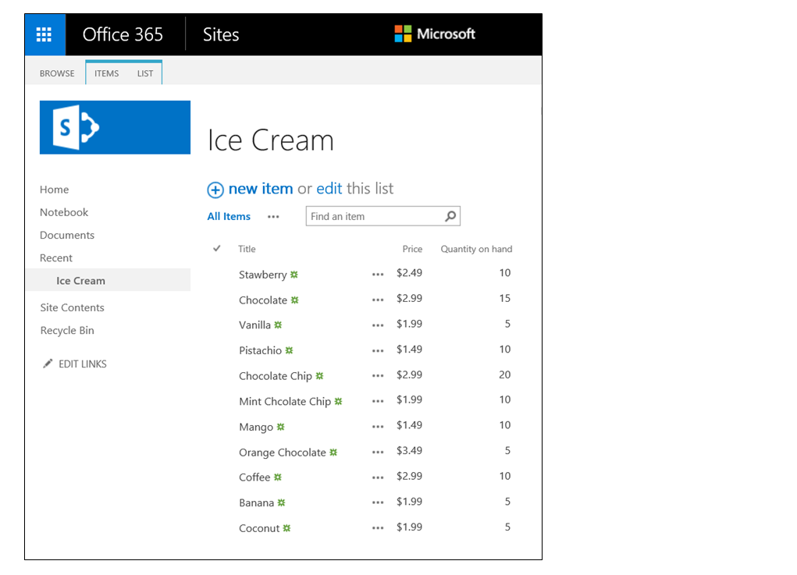

* 从头开始创建一个手机应用，并[将其连接到数据源](add-data-connection.md)。
  
    > [!NOTE]
  > 虽然平板电脑应用非常相似，但不妨使用不同的[屏幕布局](#screen-design)，以充分利用多余的屏幕空间。
  
    本主题余下部分中的示例基于名为 **Ice Cream** 的数据源。

## <a name="browse-records"></a>浏览记录
通过在浏览屏幕上的库中查找某条记录，可获取该记录中的简要信息片段。

1. 添加“垂直”  库，并将库布局更改为仅“标题”  。
   
    
2. 将库的“[Items](controls/properties-core.md)”  属性设置为“Ice Cream”  。
3. 如果设置为其他任何值，请将库中第一个标签的“[Text](controls/properties-core.md)”  属性设置为“ThisItem.Title”  。
   
    现在，标签将显示每个记录的“标题”  字段值。
   
    
4. 重设库大小以适应屏幕，再将“[TemplateSize](controls/control-gallery.md)”  属性设置为“60”  。
   
    该屏幕应类似于下面的示例，其中显示了数据源中的所有记录：
   
    

## <a name="view-details"></a>查看详细信息
如果库未显示所需的信息，请选择记录对应的箭头打开详细信息屏幕。 该屏幕上的 **[显示窗体](controls/control-form-detail.md)** 控件将显示所选记录的更多（也许是全部）字段。

**[显示窗体](controls/control-form-detail.md)** 控件使用两个属性来显示记录：

* **[DataSource](controls/control-form-detail.md)** 属性。  保存记录的数据源的名称。 此属性填充右面板中的字段，确定每个字段的显示名称和数据类型（字符串、数字、日期等）。  
* **[Item](controls/control-form-detail.md)** 属性。  要显示的记录。  此属性通常连接到 **[库](controls/control-gallery.md)** 控件的 **Selected** 属性，使用户能够在 **[库](controls/control-gallery.md)** 控件中选择记录，然后深入到该记录。

设置 **[DataSource](controls/control-form-detail.md)** 属性后，可以通过右窗格添加和删除字段，以及更改字段的显示方式。

在此屏幕上，用户不能有意或无意更改记录的任何值。 **[显示窗体](controls/control-form-detail.md)** 控件是只读的控件，因此不会修改记录。

若要添加 **[显示窗体](controls/control-form-detail.md)** 控件，请执行以下操作：

1. 添加一个屏幕，然后在其中添加 **[显示窗体](controls/control-form-detail.md)** 控件
2. 将窗体控件的 **[DataSource](controls/control-form-detail.md)** 属性设置为 **'Ice Cream'** 。

在右窗格中，可以选择要在屏幕上显示的字段，以及要为每个字段显示的卡片类型。 在右窗格中进行更改时，每个 **[卡片](controls/control-card.md)** 控件的 **[DataField](controls/control-card.md)** 属性将设置为用户交互的字段。 屏幕应类似于下面的示例：

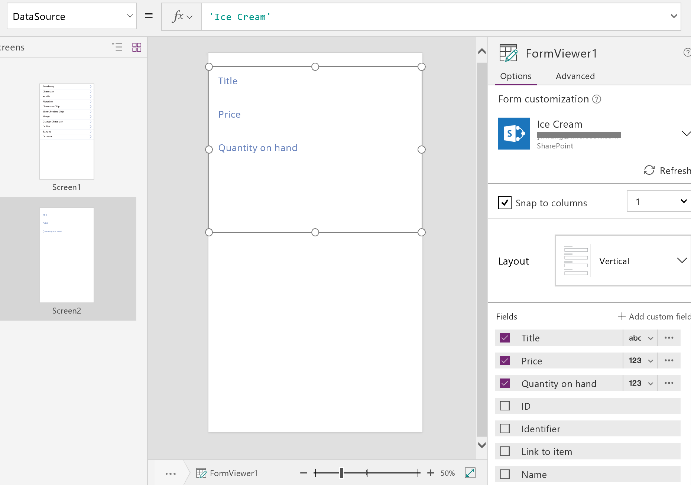

最后，需要将 **[显示窗体](controls/control-form-detail.md)** 控制连接到 **[库](controls/control-gallery.md)** 控制，以便查看特定记录的详细信息。  完成设置 **[Item](controls/control-form-detail.md)** 属性后，窗体中将显示库中的第一条记录。

* 将 **[显示窗体](controls/control-form-detail.md)** 控制的 **[Item](controls/control-form-detail.md)** 属性设置为 **Gallery1.Selected**。
   
    所选项的详细信息将显示在窗体中。
   
    

很好！  接下来，我们了解导航：用户如何从库屏幕打开详细信息屏幕，以及从详细信息屏幕打开库屏幕。

* 在屏幕中添加一个 **[按钮](controls/control-button.md)** 控件，将其 **[Text](controls/properties-core.md)** 属性设置为显示 **[后退](functions/function-navigate.md)** ， 然后将其 **[OnSelect](controls/properties-core.md)** 属性设置为 **Back()** 。
   
    在用户查看完详细信息后，此公式会将用户返回到库。

    

现在，我们返回到 **[库](controls/control-gallery.md)** 控件，并在详细信息屏幕中添加一些导航控件。

1. 切换到托管“[库](controls/control-gallery.md)”  控件的第一屏，再选择库中第一项内的箭头。

2. 将该形状的 **[OnSelect](controls/properties-core.md)** 属性设置为以下公式：
   <br>**Navigate( Screen2, None )**
   
    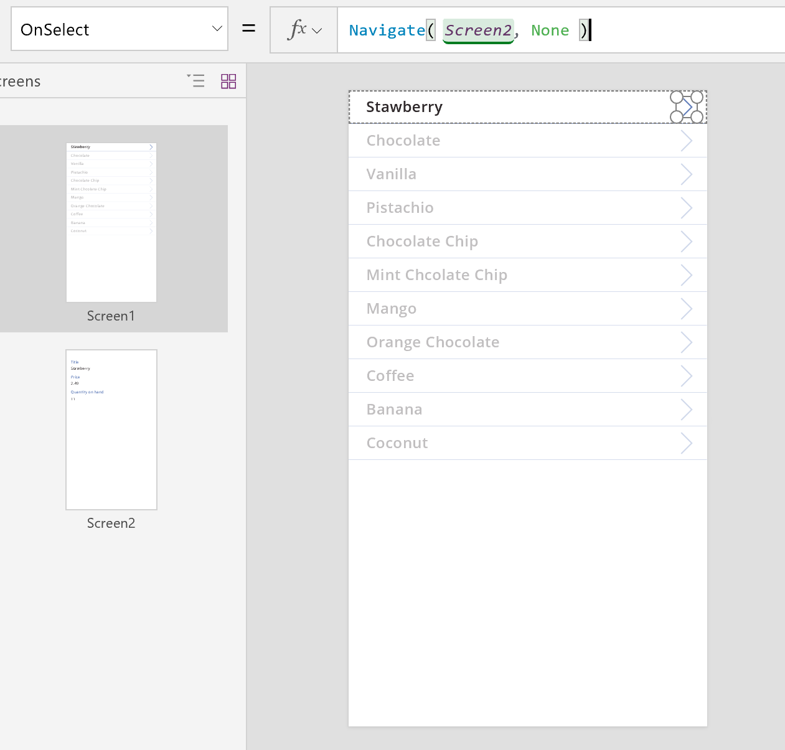

3. 按 F5，再在库中选择箭头，以显示项的详细信息。

4. 选择 **[后退](functions/function-navigate.md)** 按钮返回到产品的库，然后按 Esc。

## <a name="editing-details"></a>编辑详细信息
最后，我们的最后一项核心活动就是更改记录的内容，用户可在 **[编辑窗体](controls/control-form-detail.md)** 控件中完成此操作。

**[编辑窗体](controls/control-form-detail.md)** 控件使用两个属性来显示和编辑记录：

* **[DataSource](controls/control-form-detail.md)** 属性。  保存记录的数据源的名称。  与在 **[显示窗体](controls/control-form-detail.md)** 控件中一样，此属性填充右面板中的字段，确定每个字段的显示名称和数据类型（字符串、数字、日期等）。 在将每个字段的值提交到基础数据源之前，此属性还可确定该值是否有效。
* **[Item](controls/control-form-detail.md)** 属性。  编辑的记录，通常是连接到 **[库](controls/control-gallery.md)** 控件的 **Selected** 属性的记录。 这样，你便可以在 **[库](controls/control-gallery.md)** 控件中选择记录，在详细信息屏幕中显示该记录，并“编辑和创建”屏幕中对其进行编辑。 

若要添加 **[编辑窗体](controls/control-form-detail.md)** 控件，请执行以下操作：

1. 添加一个屏幕，添加一个 **[编辑窗体](controls/control-form-detail.md)** 控制，然后将该窗体的 **[DataSource](controls/control-form-detail.md)** 属性设置为 **'Ice Cream'** 。
2. 将 **[Item](controls/control-form-detail.md)** 属性设置为 **Gallery1.Selected**。

现在，可以选择要在屏幕上显示的字段。 还可以选择要为每个字段显示哪种类型的卡片。 在右窗格中进行更改时，每个 **[卡片](controls/control-card.md)** 控件的 **[DataField](controls/control-card.md)** 属性将设置为用户交互的字段。  屏幕应类似于下面的示例：


这两个属性与 **[显示窗体](controls/control-form-detail.md)** 控件中的属性相同。  只需使用这两个属性，即可显示记录的详细信息。  

**[编辑窗体](controls/control-form-detail.md)** 控件还有其他功能，它提供 **[SubmitForm](functions/function-form.md)** 函数用于将更改写回到数据源。 在按钮或图像控件中使用此函数可保存用户的更改。

* 添加一个 **[按钮](controls/control-button.md)** 控件，将其 **[Text](controls/properties-core.md)** 属性设置为显示“保存”，然后将其 **[OnSelect](controls/properties-core.md)** 属性设置为以下公式： <br>
  **SubmitForm( Form1 )**

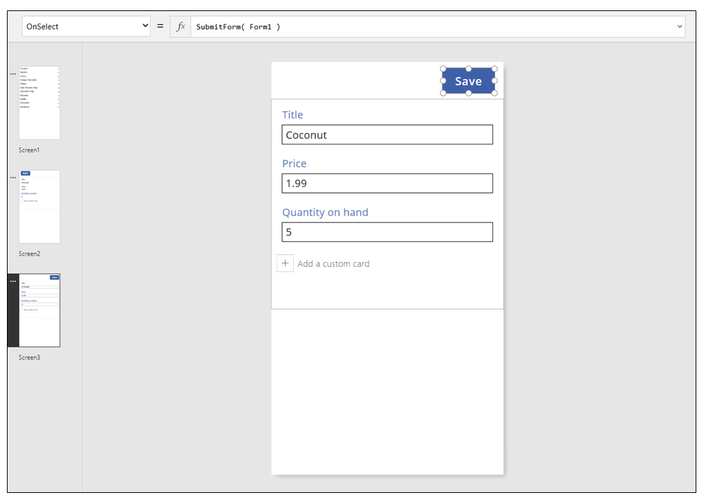

若要在此屏幕中添加导航控件，请执行以下操作：

1. 添加另一个 **[按钮](controls/control-button.md)** 控件，将其 **[Text](controls/properties-core.md)** 属性设置为显示“取消”，然后将其 **[OnSelect](controls/properties-core.md)** 属性设置为以下公式：  <br>**ResetForm( Form1 ); Back()**
   
    此公式将丢弃所有未保存的编辑并打开上一屏幕。
   
    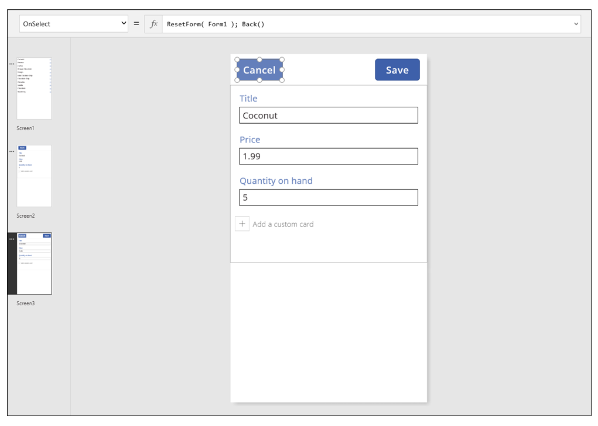
2. 将窗体的 **[OnSuccess](controls/control-form-detail.md)** 属性设置为 **Back()** 。
   
    成功保存更新后，上一屏幕（在本例中为详细信息屏幕）将自动打开。
   
    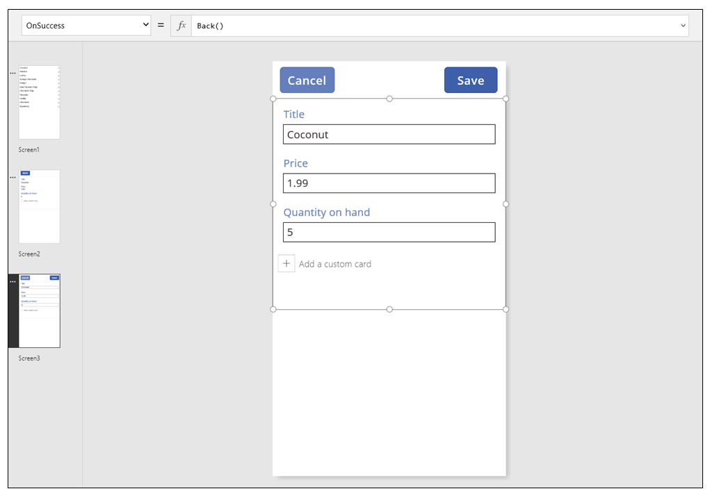
3. 在“显示”屏幕中添加一个按钮，将其 **[Text](controls/properties-core.md)** 属性设置为显示“编辑”，然后将其 **[OnSelect](controls/properties-core.md)** 属性设置为以下公式：  <br> **Navigate( Screen3, None )**
   
    

现已构建一个包含三个屏幕、用于查看和输入数据的基本应用。  若要试用该应用，请显示库屏幕，然后按 F5（或选择屏幕左上角附近的右箭头“预览”按钮）。 粉红色的点表示执行每个步骤时，用户在屏幕上的哪个位置单击或点击。


## <a name="create-a-record"></a>创建记录
用户可以通过与同一个“编辑”窗体交互来更新和创建记录。  当用户创建记录时， **[NewForm](functions/function-form.md)** 函数会将窗体切换到“新建”模式。 

窗体处于“新建”模式时，每个字段的值设置为数据源的默认值。  提供给窗体的 **[Item](controls/control-form-detail.md)** 属性的记录将被忽略。  

当用户准备好保存新记录时， **[SubmitForm](functions/function-form.md)** 将会运行。 成功提交窗体后，窗体将切换回到 **EditMode**。  

在第一个屏幕中添加“新建”按钮： 

1. 在包含库的屏幕中添加 **[按钮](controls/control-button.md)** 控件。
2. 将该按钮的 **[Text](controls/properties-core.md)** 属性设置为 **New**，将其 **[OnSelect](controls/properties-core.md)** 属性设置为以下公式：<br>
   **NewForm( Form1 ); Navigate( Screen3, None )**
   
    此公式将 **Screen3** 上的 **[编辑窗体](controls/control-form-detail.md)** 控件切换为“新建”模式并打开该屏幕，使用户能够在其中填充信息。 


“编辑和创建”屏幕打开时，该窗体为空，让用户添加项。 当用户选择“保存”按钮时， **[SubmitForm](functions/function-form.md)** 函数将确保创建而不是更新记录。  如果用户选择“取消”按钮， **[ResetForm](functions/function-form.md)** 函数会将窗体切换回到“编辑”模式， **[Back](functions/function-navigate.md)** 函数将打开用于浏览库的屏幕。  

## <a name="delete-a-record"></a>删除记录
1. 在“显示”屏幕中添加一个按钮，并将其 **[Text](controls/properties-core.md)** 属性设置为显示“删除”。  
2. 将该按钮的 **[OnSelect](controls/properties-core.md)** 属性设置为以下公式：
   <br>**Remove( 'Ice Cream', Gallery1.Selected ); Back()**
   
    

## <a name="handling-errors"></a>处理错误
在此应用中，如果某个字段的值无效、必填的字段为空、已断开网络连接，或者出现任意数量的其他问题，则会发生错误。  

如果 **[SubmitForm](functions/function-form.md)** 出于任何原因而失败 **[编辑窗体](controls/control-form-detail.md)** 控件的 **Error** 属性将包含一条向用户显示的错误消息。 用户应该可以参考此信息纠正问题，然后重新提交更改或取消更新。

1. 在“编辑和创建”屏幕中，添加“[标签](controls/control-text-box.md)”  控件，然后将它移到“保存”  按钮的正下方。 用户选择此控件保存更改后，任何错误将显而易见。

2. 将“[标签](controls/control-text-box.md)”  控件的“[Text](controls/properties-core.md)”  属性设置为显示“Form1.Error”  。

    

在 PowerApps 基于数据生成的应用中，此控件的 **[AutoHeight](controls/control-text-box.md)** 属性设置为 *true*，以便在未出错时不会占用空间。 考虑到出错时此控件会扩大， **[编辑窗体](controls/control-form-detail.md)** 控件的 **[Height](controls/properties-size-location.md)** 和 **[Y](controls/properties-size-location.md)** 属性也会动态调整。 若要了解其他详细信息，可基于现有数据生成一个应用并查看这些属性。 未发生错误时，用于显示错误的文本框控件很短，可能需要打开“高级”视图（位于“视图”选项卡上）才能选择此控制。  


## <a name="refresh-data"></a>刷新数据
每当用户打开应用时，数据源将会刷新，但用户可能想要在不关闭应用的情况刷新库中的记录。 可以添加一个“刷新”按钮，让用户选择它来手动刷新数据： 

1. 在包含 **[库](controls/control-gallery.md)** 控件的屏幕中添加 **[按钮](controls/control-button.md)** 控件，并将其 **[Text](controls/properties-core.md)** 属性设置为显示“刷新”。 

2. 将此控件的 **[OnSelect](controls/properties-core.md)** 属性设置为以下公式：<br> **Refresh( 'Ice Cream' )**

    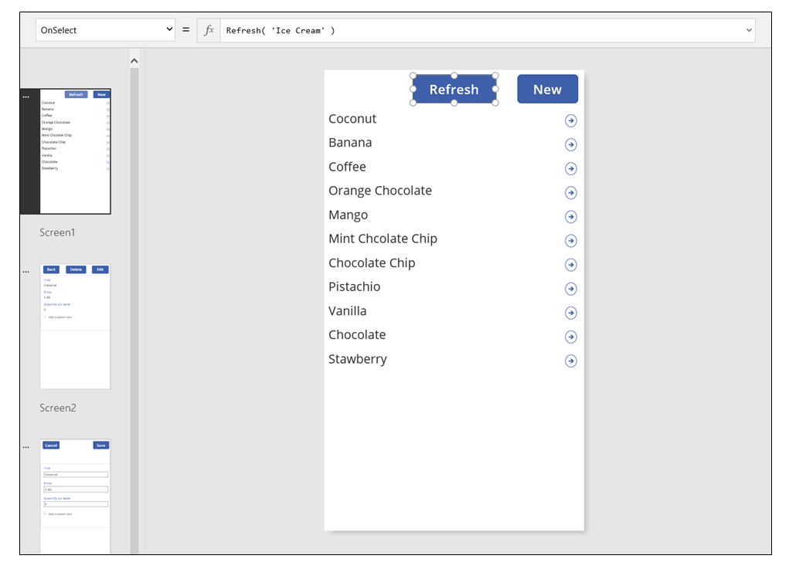

## <a name="search-and-sort-the-gallery"></a>搜索和排序库
在 PowerApps 基于数据生成的应用中，我们忘记了讨论“浏览”屏幕顶部显示的两个控件。 用户可以使用这些控件搜索一个或多个记录，以及按升序和/或降序为记录列表排序。


当用户选择排序按钮时，库的排序顺序将会反转。 若要创建此行为，可使用*上下文变量*跟踪库的排序方向。 当用户选择该按钮时，变量将会更新，方向将会反转。 按钮返回到产品的库 **[OnSelect](controls/properties-core.md)** 排序按钮的属性设置为以下公式：**UpdateContext( {SortDescending1: !SortDescending1} )**

**[UpdateContext](functions/function-updatecontext.md)** 函数创建 **SortDescending1** 上下文变量（如果不存在）。 该函数将读取该变量的值并使用 **!** 运算符将它设置为逻辑求反 。 *true* 值将变成 *false*。 *false* 值将变成 *true*。

**[库](controls/control-gallery.md)** 控件的 **[Items](controls/properties-core.md)** 属性公式使用此上下文变量以及 **TextSearchBox1** 控件中的文本：

```powerapps-dot
Sort( 
    If( IsBlank(TextSearchBox1.Text),
        Assets,
        Filter( Assets, TextSearchBox1.Text in Text(ApproverEmail) ) 
    ),
    ApproverEmail,
    If(SortDescending1, Descending, Ascending) 
)
```

让我们剖析整个公式：

* 外部的 **[Sort](functions/function-sort.md)** 函数采用三个参数：一个表、一个作为排序依据的字段，以及排序的方向。  
  
  * 排序方向取自用户选择 **ImageSortUpDown1** 控件时切换的上下文变量。 *true*/*false* 值将转换为常量 **Descending** 和 **Ascending**。
  * 作为排序依据的字段固定为 **ApproverEmail**。 如果更改库中显示的字段，则也需要更改此参数。
* 内部的 **[Filter](functions/function-filter-lookup.md)** 函数采用表作为参数，并使用一个表达式来为每条记录求值。
  
  * 表是原始的“资产”数据源，即筛选或排序之前的起点。 
  * 该表达式在 **ApproverEmail** 字段中的 **TextSearchBox1** 内搜索字符串的实体。  同样，如果更改库中显示的字段，则也需要更新此参数。
  * 如果 **TextSearchBox1** 为空，而用户想要显示所有记录，则会绕过 **[Filter](functions/function-filter-lookup.md)** 函数。

这只是其中的一个示例；你可以根据应用的需求，通过将 **[Filter](functions/function-filter-lookup.md)** 、 **[Sort](functions/function-sort.md)** 和其他函数与运算符组合在一起，为 **[Items](controls/properties-core.md)** 属性编写自己的公式。    

## <a name="screen-design"></a>屏幕设计
到目前为止，我们尚未讨论跨屏幕分布控件的其他方法。 这是因为，可用的选项有很多，而最佳的选择取决于具体的应用需求。

由于手机屏幕上的实际空间非常有限，我们也许需要在不同的屏幕上浏览、显示和编辑/创建控件。 本主题中所述的 **[Navigate](functions/function-navigate.md)** 和 **[Back](functions/function-navigate.md)** 函数可打开每个屏幕。  

在平板电脑上，可通过两个甚至一个屏幕浏览、显示和编辑/创建控件。 对于后者，不需要使用 **[Navigate](functions/function-navigate.md)** 或 **[Back](functions/function-navigate.md)** 函数。

如果用户在同一屏幕上操作，则你需要注意，用户不能更改在 **[库](controls/control-gallery.md)** 中所做的选择，并且有可能会丢失 **[编辑窗体](controls/control-form-detail.md)** 控件中所做的编辑。  为了防止在对一条记录所做的更改尚未保存的情况下用户选择另一条记录，请将库的 **[Disabled](controls/properties-core.md)** 属性设置为以下公式：<br>
**EditForm.Unsaved**

