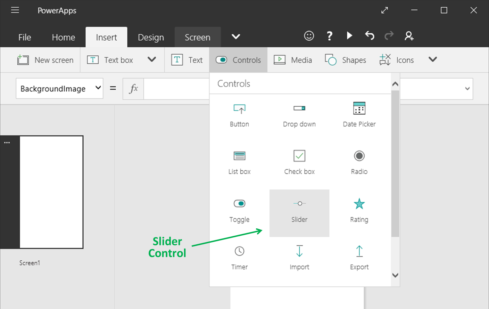
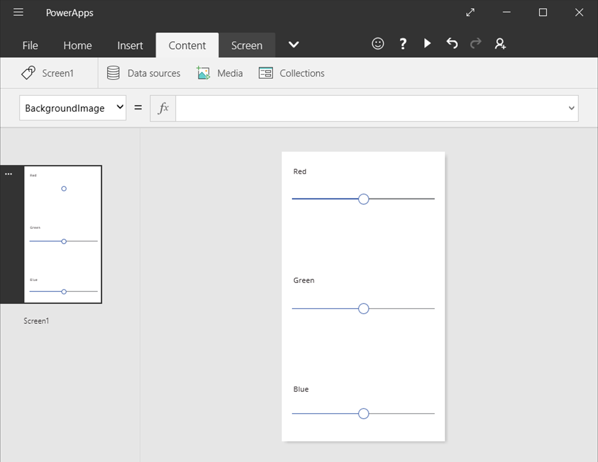
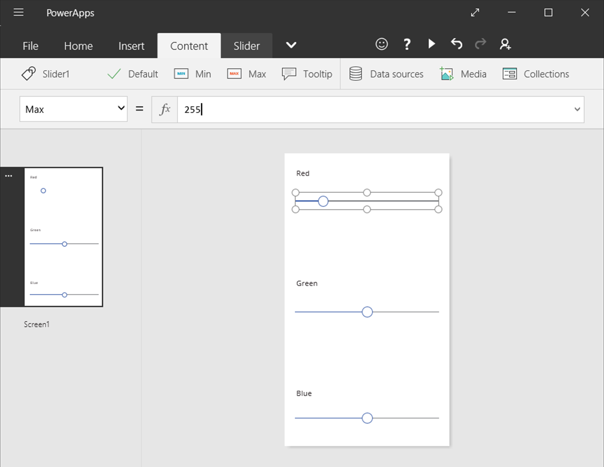
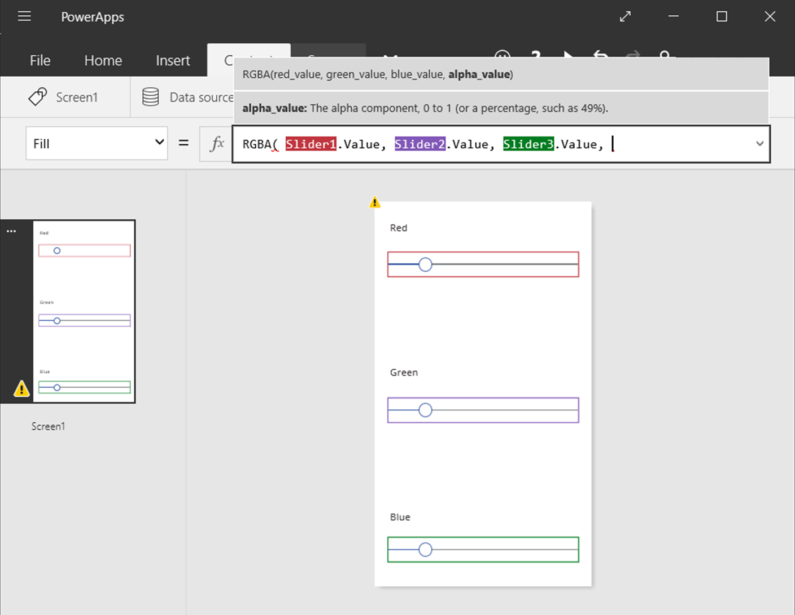

# PowerApps 中的画布应用公式入门

为画布应用配置公式，不仅用于计算值和执行其他任务（与在 Excel 中的操作一样），还能（根据应用需求）响应用户输入。

* 在 Excel 中生成公式，例如，填充单元格并创建表格和图表。
* 在 PowerApps 中，生成与配置控件（而不是单元格）时类似的公式。 此外，生成专门适用于应用（而非电子表格）的公式。

例如，生成公式以确定当用户选择按钮、调整滑块或提供其他输入时应用的响应方式。 这些公式可能会显示不同的屏幕、更新应用外部的数据源、或创建包含现有表格中数据子集的表格。

可将公式用于各种方案。 例如，可以使用设备的 GPS、地图控件以及使用 **Location.Latitude** 和 **Location.Longitude** 的公式，从而显示当前位置。 移动时，地图会自动跟踪你的位置。

本主题仅提供使用公式的概述。 浏览 [公式引用](formula-reference.md) 了解详细信息以及可以使用的函数、运算符和其他构建基块的完整列表。

## 先决条件

* [注册](../signup-for-powerapps.md) PowerApps，然后使用注册所用的同一凭据[登录](https://web.powerapps.com?utm_source=padocs&utm_medium=linkinadoc&utm_campaign=referralsfromdoc)。
* 了解如何在 PowerApps 中 [配置控件](add-configure-controls.md)。

## 显示简单值

在 Excel 中，可以输入数据的特定片段，例如编号 **42** 或短语 **Hello World**，方法是将这些内容键入到单元格。 该单元格将始终显示所键入的片段所属的数据。 同样，在 PowerApps 中，只需将标签的 **[Text](controls/properties-core.md)** 属性设置为想要使用的字符的精确序列（由双引号括住），即可指定数据的某个片段。

1. 选择“**文件**”菜单上的“**新建**”（屏幕左边缘附近）。
2. 在“**创建应用**”下，选择“**空白应用**”磁贴上的“**电话布局**”。

    编辑栏位于屏幕顶部。

    

    此栏包括两个部分：

   * *属性列表*:每个控件和屏幕均有[的属性集](reference-properties.md)。  使用此列表选择特定属性。  
   * *公式*:要为此属性计算的公式的组成[值、 运算符和函数](formula-reference.md)。

     在编辑栏中，可以查看并编辑所选控件的属性或屏幕的属性（若未选择任何控件）。  可以在“**内容**”选项卡上查看所选控件的名称：

     

     可以通过单击名称更改“**内容**”选项卡中所选控件的名称。
3. 在屏幕中添加“[标签](controls/control-text-box.md)”控件。

    

    添加标签时，属性列表会自动显示用于控制控件显示内容的“[Text](controls/properties-core.md)”属性。 默认情况下，该属性的值是 **"Text"**。  
4. 将 **[Text](controls/properties-core.md)** 属性的值设置为 **"Hello World"**，方法是将双引号括住的字符串键入编辑栏：

    

    在键入过程中，标签会反映此新值。  键入时，屏幕可能会显示黄色感叹号图标。 这些图标表示存在错误，但在输入有效值后，这些图标将消失。 例如，如果字符串首尾没有双引号，则无效。

    在 Excel 中，可以显示一个数字，如 **42**，方法是将其键入一个单元格或键入用于解析到该数字的公式，如 **=SUM(30,12)**。 在 PowerApps 中，可以将标签等控件的“Text”属性设置为“42”或“Sum(30,12)”，从而达到同样的效果。 无论在工作表或应用中进行了其他何种更改，单元格和标签始终都会显示此数字。

    > [!NOTE]
   > 在 PowerApps 中，并不在公式前使用等号或加号，这一点与在 Excel 中不同。 默认情况下，编辑栏将在该处键入的任何内容均视为一个公式。 此外，也不使用双引号 (") 将公式括起来（在之前的操作中使用它指定文本的字符串）。
5. 在标签的“[Text](controls/properties-core.md)”属性中，将“"Hello World"”替换成“Sum(1,2,3)”。

    

    键入时，编辑栏会显示此函数的描述和预期参数，为你提供帮助。  对于 **"Hello World"** 中的右双引号，屏幕显示黄色感叹号表示出现错误，直至键入了此公式的最后一个括号：

    

## 基于输入更改值

在 Excel 中，键入 **= A1 + A2**的单元格中显示的任何值的单元格的总和**A1**并**A2**包含。 如果任一值或全部值发生更改，则包含公式的单元格将自动显示更新结果。

在 PowerApps 中，可以通过向屏幕添加控件并设置其属性来获得类似结果。 此示例演示一个名为的标签控件**Label1**并将两个**[文本输入](controls/control-text-input.md)** 控件，分别命名为**TextInput1**和**TextInput2**。

无论在文本输入控件中键入什么数字，标签始终都会显示这些数字的总和，因为它的“[Text](controls/properties-core.md)”属性设置为以下公式：

`TextInput1 + TextInput2`

在 Excel 中，可用于条件格式设置的公式，例如，将负值显示为红色。 在 PowerApps 中，使用公式不仅可以确定控件的主值，还可以确定属性（例如格式设置）。 在下一步的示例中，公式**[颜色](controls/properties-color-border.md)** 标签的属性自动以红色显示负值。 **[If](functions/function-if.md)** 函数看起来应该与 Excel 中的很相似：

`If( Value(Label1.Text) < 0, Red, Black )`

## 基于用户输入更改颜色

可以通过公式配置应用，使用户能够更改应用的外观或行为。 例如，可以创建一个筛选器，仅显示包含用户指定的文本字符串的数据，或让用户基于数据集中的某列对一组数据进行排序。 在此过程中，将通过调整一个或多个滑块让用户更改屏幕颜色。

1. 删除之前步骤中的控件，或创建空白应用（与之前步骤中的操作相同），并向其添加三个滑块控件：

    
2. 排列滑块以避免重叠，添加三个标签，然后将它们配置为显示“Red”、“Green”和“Blue”：

    
3. 将每个滑块的 **Max** 属性设置为 255，该值是 **[RGBA](functions/function-colors.md)** 函数颜色组件的最大值。

    可通过在“**内容**”选项卡进行选择以指定 **Max** 属性，或在属性列表中：

    
4. 通过从任何控件外单击选择屏幕，然后将屏幕的 **[Fill](controls/properties-color-border.md)** 属性设置为以下公式： **RGBA( Slider1.Value, Slider2.Value, Slider3.Value, 1 )**

    如上所述，可以使用   运算符访问控件属性 。  **Slider1.Value** 表示滑块的 **[Value](controls/properties-core.md)** 属性，该属性反映了用户在 **Min** 和 **Max** 值间放置滑块的位置。 键入此公式时，其包含的每个控件均在屏幕和编辑栏间使用颜色编码：

    

    键入右括号时，屏幕的背景将基于每个滑块的默认值更改为深灰色，默认值为 **50**。 键入公式完成后，将对其进行计算并用作背景填充颜色的值。 可以在默认工作区中与应用交互，无需打开预览：

    
5. 调整滑块，并查看所做的更改如何影响背景颜色。

    更改每个滑块时，包含 **[RGBA](functions/function-colors.md)** 函数的公式将重新计算，并立即更改屏幕显示的效果。

    

## 管理应用行为

使用公式不仅可以执行计算和更改外观，还可以执行操作。 例如，可以将某个按钮的 **[OnSelect](controls/properties-core.md)** 属性设置为包含 **[Navigate](functions/function-navigate.md)** 函数的公式。 当用户选择该按钮时，将显示在该公式中指定的屏幕。

可以仅在行为公式中使用某些函数，例如 **[Navigate](functions/function-navigate.md)** 和 **[Collect](functions/function-clear-collect-clearcollect.md)**。  如果只能在此上下文中使用某个函数，则公式引用将进行调用。  

如果使用分号 (;) 分隔函数，则可以在一个行为公式中执行多个操作。 例如，你可能想要更新上下文变量、将数据推送到数据源，并最终导航到其他屏幕。

## 按类别查看属性列表

属性列表按字母顺序显示属性，但如果选择“**视图**”选项卡上的“**高级**”选项，则还可以查看按类别安排的控件的所有属性：

可以在此视图内直接编辑公式。  通过窗格顶部的控件选择器可以快速查找要使用的控件。  此外，借助属性搜索可以快速查找该控件的属性。

此视图默认显示最重要的属性。  若要显示所有属性，请单击窗格底部的向下箭头。  每个控件均具有属性的长列表，该列表控制控件的行为和外观涵盖的所有方面。 可以滚动列表进行浏览，也可以在窗格顶部的框中键入内容以搜索某个属性。

## 公式语法

在公示栏中键入公式时，不同的语法元素以不同的颜色显示，让用户更加轻松地进行查看并帮助理解长公式。 下面是 PowerApps 中的颜色代码列表。

