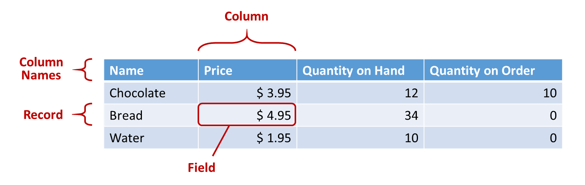
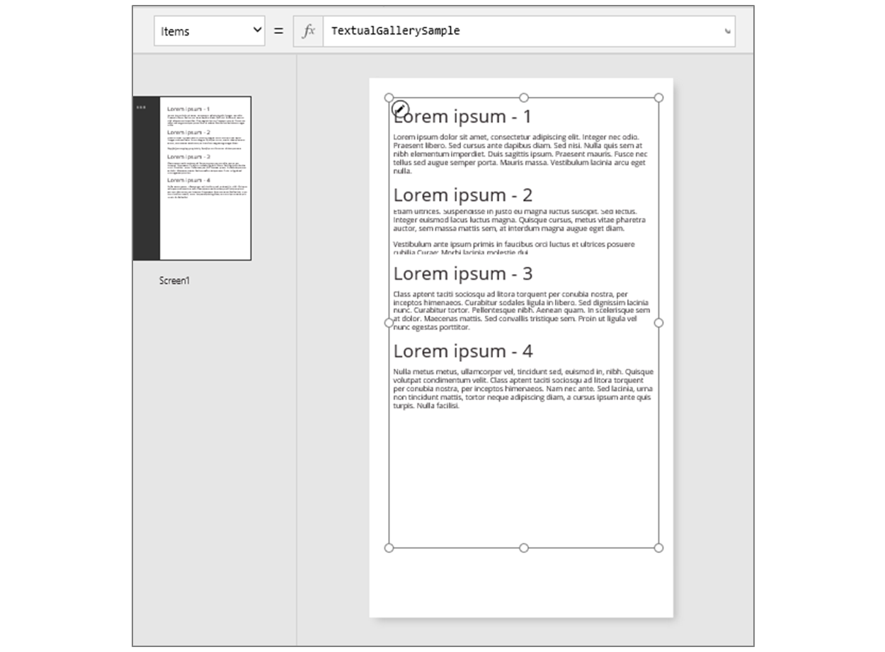
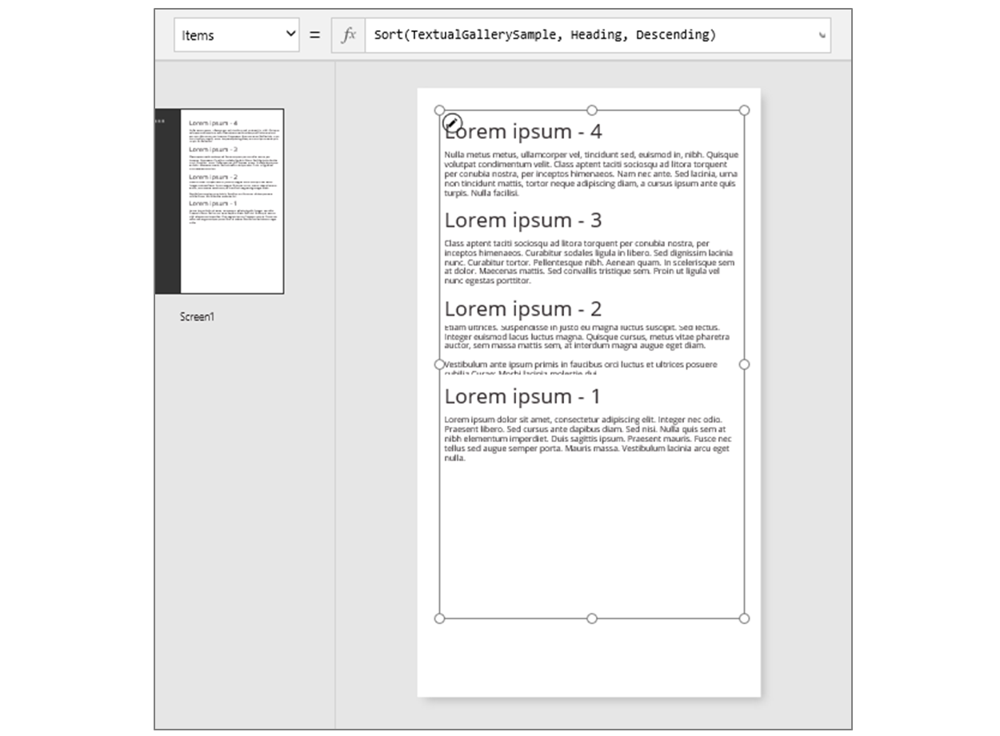
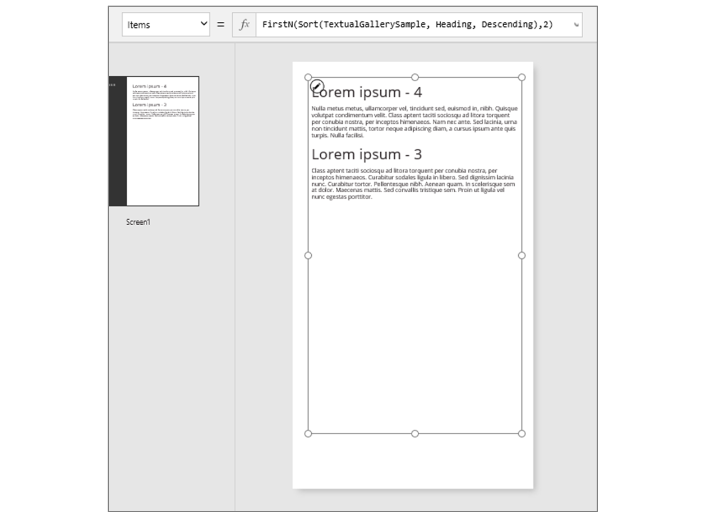
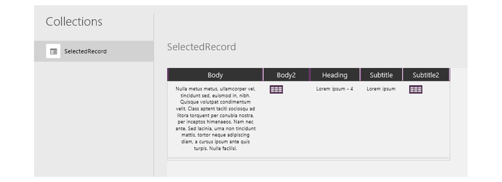
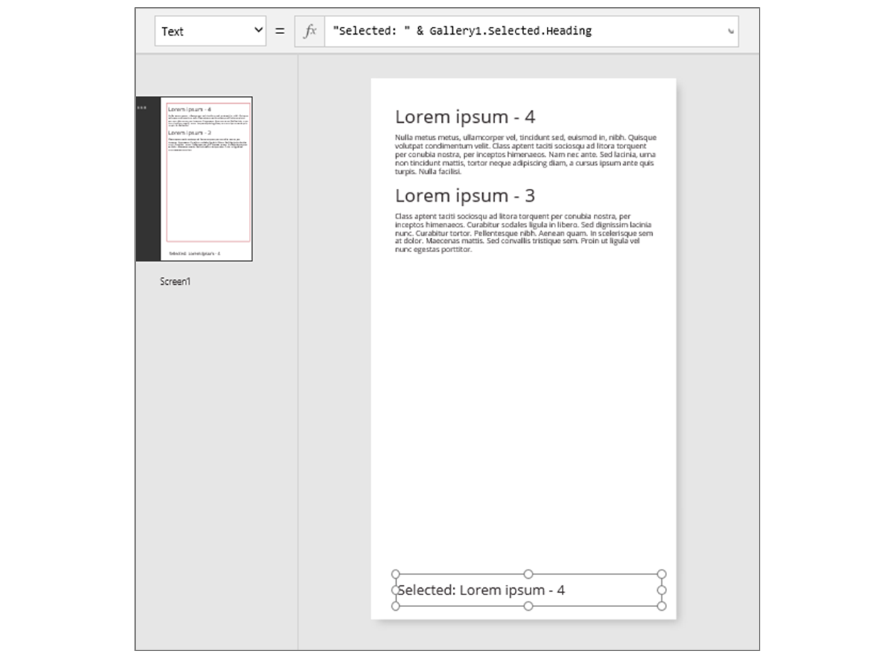
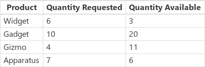

# <a name="understand-canvas-app-tables-and-records-in-powerapps"></a>了解 PowerApps 中的画布应用表和记录

在 PowerApps 中，可以创建一个画布应用，用于访问 Microsoft Excel、SharePoint、SQL Server 以及在记录和表中存储数据的其他多个源中的信息。 若要最有效地处理此类数据，请查看这些结构的基本概念。

* 记录包含有关个人、地点或事物的一个或多个类别的信息。 例如，记录可能包含单个客户的姓名、电子邮件地址和电话号码。 其他工具将记录称作“行”或“项”。
* 表保存一个或多个记录，这些记录包含相同类别的信息。 例如，表可以包含 50 个客户的姓名、电子邮件地址和电话号码。

在应用中，可以使用[公式](working-with-formulas.md)来创建、更新和处理记录与表。 可能需要将数据读取和写入到外部[数据源](working-with-data-sources.md)，这是一个扩展的表。 此外，可以创建一个或多个内部表，称为[集合](working-with-data-sources.md#collections)。

可以构建采用表名称作为参数的各种公式，就像 Excel 中的公式采用一个或多个单元格引用作为参数。 PowerApps 中的某些公式返回一个反映所指定的其他参数的表。 例如，可以创建以下公式：

* 通过将某个表指定为 **[Patch](functions/function-patch.md)** 函数的多个参数之一，来更新该表中的记录
* 通过将某个表指定为 **[AddColumns](functions/function-table-shaping.md)** 、 **[DropColumns](functions/function-table-shaping.md)** 或 **[RenameColumns](functions/function-table-shaping.md)** 函数的参数，在该表中添加、删除和重命名列。 其中的任何函数都不会修改原始表。 函数根据指定的其他参数返回另一个表。

## <a name="elements-of-a-table"></a>表中的元素


### <a name="records"></a>记录
每条记录包含个人、地点或事物的至少一个类别的信息。 上面的示例针对每种产品（“巧克力”、“面包”和“水”）显示一条记录，针对每个类别的信息（“价格”、“现有数量”和“订购量”）显示一列。      

在公式中，可以使用大括号在表的上下文外部引用记录本身。 例如，此记录 **{名称："Strawberries"，价格：7.99}** 未与表相关联。 请注意，如该示例中的“名称”  和“价格”  等字段名称未括在双引号中。

### <a name="fields"></a>字段
字段是记录中的单个信息片段。 可在特定记录的列中将此类字段可视化为值。

就像使用控件一样，可在记录中使用 **.** [运算符](functions/operators.md)引用记录的字段。  例如，**First(Products).Name** 返回 **Products** 表中第一条记录的 **Name** 字段。

字段可以包含另一个记录或表，如 **[GroupBy](functions/function-groupby.md)** 函数的示例中所示。 可以嵌套任意数量的记录和表级别。

### <a name="columns"></a>列
列引用表中一个或多个记录的同一字段。 在上面的示例中，每种产品包含一个价格字段，该价格在所有产品的同一列中。  上面的表从前到后显示四列：

* **名称**
* **价格**
* **现有数量**
* **订购量**

列的名称反映该列中的字段。

列中的所有值具有相同的数据类型。 在上面的示例中，“现有数量”列始终包含一条记录的数字，而不能包含诸如“12 件”之类的字符串。  任何字段的值也可以保留 *空白*。  

在其他工具中，列可能称为“字段”。

> [!NOTE]
> 对于列名称带空格的 SharePoint 和 Excel 数据源，PowerApps 会将空格替换为“\_x0020\_”  。 例如，如果 SharePoint 或 Excel 中的“Column Name”  在数据布局中显示或用于公式，它将在 PowerApps 中显示为“Column_x0020_Name”  。

### <a name="table"></a>表
表由一条或多条记录组成，每条记录包含多个字段，字段包含记录中的一致名称。

数据源或集合中存储的任何表都有一个名称，可以使用该名称来引用该表，并将它传递给采用表作为参数的函数。  表也可以是函数或公式的结果。

在下面的示例中，可以通过将 **[Table](functions/function-table.md)** 函数与在大括号中表示的一组记录结合使用，在公式中表示表：

`Table( { Value: "Strawberry" }, { Value: "Vanilla" } )`

还可以使用方括号定义单列表。  上述公式的同等编写方式为：

`[ "Strawberry", "Vanilla" ]`

## <a name="table-formulas"></a>表公式
在 Excel 和 PowerApps 中，可以使用公式以类似的方式来处理数字和文本字符串：

* 在 Excel 的单元格 **A1** 中键入一个值（例如 **42**），然后在另一个单元格中键入公式（例如 **A1 + 2**）即可显示值 **44**。
* 在 PowerApps 中，将“Slider1”  的“[Default](controls/properties-core.md)”  属性设置为“42”  ，将标签的“[Text](controls/properties-core.md)”  属性设置为“Slider1.Value + 2”  ，即可显示值“44”  。

在这两种情况下，如果更改参数的值（例如，更改单元格 **A1** 中的数字或 **Slider1** 的值），计算出的值将自动更改。

同样，可以使用公式来访问和处理表与记录中的数据。 在某些公式中可以使用表的名称作为参数，例如，**Min(Catalog, Price)** 显示 **Catalog** 表的 **Price** 列中的最小值。 其他公式提供整个表作为返回值，例如，**RenameColumns(Catalog, "Price", "Cost")** 返回 **Catalog** 表中的所有记录，但会将 **Price** 列的名称更改为 **Cost**。

与使用数字时一样，涉及到表和记录的公式会在基础表或记录更改时自动重新计算。 如果 **Catalog** 表中产品的成本低于前一个最小值， **[Min](functions/function-aggregates.md)** 公式的返回值将自动更改以匹配该成本。

让我们演练一些简单的示例。

1. 创建适用于手机的空白应用，并添加含有其他控件的垂直[图库](controls/control-gallery.md)  控件。

    默认情况下，屏幕显示名为 CustomGallerySample  的表中的占位符文本。 屏幕 **[图库](controls/control-gallery.md)** 控件的 **[Items](controls/properties-core.md)** 属性将自动设置为该表。

    

    > [!NOTE]
    > 为方便演示，已重新排列并放大一些控件。

2. 以下示例未将 **[Items](controls/properties-core.md)** 属性设置为表的名称，而是设置为将表名称包含为参数的公式：

    `Sort(CustomGallerySample, SampleHeading, Descending)`

    此公式融入了 **[Sort](functions/function-sort.md)** 函数，该函数将表的名称用作第一个参数，将该表中某个列的名称用作第二个参数。 该函数还支持可选的第三个参数，该参数规定要按降序对数据排序。

    

3. 以下示例将 **[Items](controls/properties-core.md)** 属性设置为一个公式，该公式使用上一步骤中的公式作为参数并返回一个表：

    `FirstN(Sort(CustomGallerySample, SampleHeading, Descending), 2)`

    此公式使用 **[FirstN](functions/function-first-last.md)** 函数显示表中特定数量的记录。 使用 **[Sort](functions/function-sort.md)** 函数作为 **[FirstN](functions/function-first-last.md)** 的第一个参数，使用一个数字（在本例中为 **2**）作为第二个参数，该数字指定要显示的记录数。

    整个公式返回一个表，其中包含 CustomGallerySample 表的前两条记录，这些记录已按 SampleHeading 列的降序排序。  

    

## <a name="table-functions-and-control-properties"></a>表函数和控件属性

请考虑**较低**函数。 如果将变量**欢迎**包含文本字符串 **"Hello，World"** ，该公式**降低 （欢迎）** 返回 **"你好，world"** 。  此函数以任何方式，不会更改该变量中的值。 **较低**是纯函数，它便只处理输入并生成输出。 这是所有;它没有任何副作用。 在 Excel 中的所有函数和 PowerApps 中的大多数函数是纯函数，允许在工作簿或应用程序以自动重新计算。

PowerApps 提供了一组相同的方式在表运行的函数。 这些函数采用表，如输入和筛选器，排序、 转换、 减少，和汇总数据的整个表。 事实上，**较低**和许多通常采用单个值的其他函数也可以采用单列的表作为输入。

* **[Sort](functions/function-sort.md)** 、 **[Filter](functions/function-filter-lookup.md)** – 排序和筛选记录。
* **[FirstN](functions/function-first-last.md)** 、 **[LastN](functions/function-first-last.md)** – 返回表的前 N 条或最后 N 条记录。
* **[Abs](functions/function-numericals.md)** 、 **[Sqrt](functions/function-numericals.md)** 、 **[Round](functions/function-round.md)** 、 **[RoundUp](functions/function-round.md)** 、 **[RoundDown](functions/function-round.md)** – 针对单列表的每条记录执行的算术运算，生成单列结果表。
* **[Left](functions/function-left-mid-right.md)** 、 **[Mid](functions/function-left-mid-right.md)** 、 **[Right](functions/function-left-mid-right.md)** 、 **[Replace](functions/function-replace-substitute.md)** 、 **[Substitute](functions/function-replace-substitute.md)** 、 **[Trim](functions/function-trim.md)** 、 **[Lower](functions/function-lower-upper-proper.md)** 、 **[Upper](functions/function-lower-upper-proper.md)** 、 **[Proper](functions/function-lower-upper-proper.md)** – 针对单列表的每条记录执行的字符串操作，生成单列字符串表。
* **[Len](functions/function-len.md)** – 针对字符串列返回包含每个字符串的长度的单列表。
* **[Concatenate](functions/function-concatenate.md)** – 串联多个字符串列，生成单列字符串表。
* **[AddColumns](functions/function-table-shaping.md)** 、 **[DropColumns](functions/function-table-shaping.md)** 、 **[RenameColumns](functions/function-table-shaping.md)** 、 **[ShowColumns](functions/function-table-shaping.md)** – 表的列操作，生成包含不同列的新表。
* **[Distinct](functions/function-distinct.md)** – 删除重复的记录。
* **[Shuffle](functions/function-shuffle.md)** – 按随机顺序排列记录。
* **[HashTags](functions/function-hashtags.md)** – 搜索字符串中的哈希标记。
* **[Errors](functions/function-errors.md)** – 提供处理数据源时出现的错误信息。

许多这些函数将单列的表作为其输入。 如果整个表只有一个列，可以按名称进行指定。 如果表具有多个列，您可以通过使用指定这些列之一*Table.Column*语法。 例如， **Products.Name**返回的单列的表的唯一**名称**中的值**产品**表。

不过你想通过使用可以全面重新表 **[AddColumns](functions/function-table-shaping.md)** ，  **[RenameColumns](functions/function-table-shaping.md)** ，  **[ShowColumns](functions/function-table-shaping.md)** ，或 **[DropColumns](functions/function-table-shaping.md)** 函数。 同样，这些函数将更改仅其输出，不是其源。

控件的属性还可以将表：

* **项**-适用于库、 列表框和组合框。 此属性定义的库或列表显示的表。
* **SelectedItems** -适用于列表框和组合框。 此属性定义的用户如果选定的项表**SelectMultiple**已启用。

## <a name="behavioral-formulas"></a>行为公式

其他功能专门用于修改数据，具有负面影响。 因为这些函数不是纯，必须谨慎，生成和它们不能参与自动重新计算的应用中的值。 您可以使用这些函数只能在[行为公式](working-with-formulas-in-depth.md)。

* **[收集](functions/function-clear-collect-clearcollect.md)** ， **[清除](functions/function-clear-collect-clearcollect.md)** ， **[ClearCollect](functions/function-clear-collect-clearcollect.md)** -创建集合、 清除它们，并将添加到数据它们。
* **[修补程序](functions/function-patch.md)** -修改记录中的一个或多个字段。
* **[Update](functions/function-update-updateif.md)** 、 **[UpdateIf](functions/function-update-updateif.md)** – 更新与指定的一个或多个条件匹配的记录。
* **[Remove](functions/function-remove-removeif.md)** 、 **[RemoveIf](functions/function-remove-removeif.md)** – 删除与指定的一个或多个条件匹配的记录。

## <a name="record-formulas"></a>记录公式

还可以构建一个公式来计算单个记录的数据，采用单个记录作为参数，并提供单个记录作为返回值。 返回到上面的库示例，我们使用 **Gallery1.Selected** 属性来显示用户在该库中选择的任何记录中的信息。

1. 添加[ **按钮** ](controls/control-button.md)，并设置其 **[OnSelect](controls/properties-core.md)** 属性设为此公式：<br>
    Collect( SelectedRecord, Gallery1.Selected ) 

2. 按住 Alt 键，并选择按钮。

3. 在“文件”菜单中选择“集合”。  

    

此公式返回的一条记录不仅包含当前在该库中选择的记录中的数据，而且还包含该库中的每个控件。 例如，记录中包含与原始表中 SampleText  列匹配的 SampleText  列，以及表示用于显示此列中数据的标签的 Subtitle1  列。 在 Subtitle1  列中选择表图标可深入到该数据。

> [!NOTE]
> 如果已添加本主题所指定以外的元素，Subtitle1 列可能名为 Subtitle2 等。  

选择记录后，可以使用 **.** 运算符从中提取单个字段 。

1. 添加 **[标签](controls/control-text-box.md)** 控件，并将其移动到库和按钮下。

1. 将标签的 **[Text](controls/properties-core.md)** 属性设置为以下表达式：<br>
    **"Selected: " & Gallery1.Selected.SampleHeading**

    

采用了 **Selected** 属性（它是一个记录），并从中提取了 **SampleHeading** 属性。

可以使用记录作为相关命名值的通用容器。

* 如果围绕 **[UpdateContext](functions/function-updatecontext.md)** 和 **[Navigate](functions/function-navigate.md)** 函数构建公式，请使用记录来收集想要更新的[上下文变量](working-with-variables.md#use-a-context-variable)。
* 在 **[编辑窗体](controls/control-form-detail.md)** 控件中使用 **[Updates](controls/control-form-detail.md)** 属性可收集用户在窗体中所做的更改。
* 使用 **[Patch](functions/function-patch.md)** 函数不仅可以更新数据源，而且还能合并记录。

在这些情况下，记录永远不能是表的一部分。

## <a name="record-functions-and-control-properties"></a>记录函数和控件属性
返回记录的函数：

* **[FirstN](functions/function-first-last.md)** 、 **[LastN](functions/function-first-last.md)** – 返回表的最前面或最后面的一条或多条记录。
* **[Lookup](functions/function-filter-lookup.md)** – 返回表中与一个或多个条件匹配的第一条记录。
* **[Patch](functions/function-patch.md)** – 更新数据源或合并记录。
* **[Defaults](functions/function-defaults.md)** – 返回数据源的默认值。

返回记录的属性：

* **Selected** – 适用于库和列表框。 返回当前选择的记录。
* **Updates** – 适用于库。  同时提取用户在数据输入窗体中所做的全部更改。
* **[Update](functions/function-update-updateif.md)** – 适用于文本输入控件和滑块等输入控件。 设置库的、要同时提取的各个属性。

## <a name="record-scope"></a>记录范围

某些函数可针对表的所有记录单独计算一个公式。 可通过多种方式使用该公式的结果：

* **Filter**、**Lookup** – 公式确定是否应将该记录包含在输出中。
* **Sort** – 公式提供作为记录排序依据的值。
* **Concat** – 公式确定要串联在起来的字符串。
* **ForAll** – 公式可返回任何值，这可能会产生副作用。
* **Distinct** – 公式返回一个值，用于识别重复的记录。
* **AddColumns** – 公式提供所添加字段的值。
* **Average**、**Max**、**Min**、**Sum**、**StdevP**、**VarP** – 公式提供要聚合的值。

在这些公式中，可以引用所要处理的记录的字段。 其中的每个函数创建一个“记录范围”，将在该范围中计算公式，记录的字段可用作顶级标识符。 也可以引用整个应用中的控件属性和其他值。

例如，以 **Products** 表为例：



若要在应用中创建此示例表，插入一个按钮，将其**OnSelect**到此公式，然后选择按钮 （单击它时按住 Alt 键在 PowerApps Studio 中） 的属性：

```powerapps-dot
Set( Products,
    Table(
        { Product: "Widget",    'Quantity Requested': 6,  'Quantity Available': 3 },
        { Product: "Gadget",    'Quantity Requested': 10, 'Quantity Available': 20 },
        { Product: "Gizmo",     'Quantity Requested': 4,  'Quantity Available': 11 },
        { Product: "Apparatus", 'Quantity Requested': 7,  'Quantity Available': 6 }
    )
)
```

若要确定是否任何这些产品的任何请求数大于可用：

`Filter( Products, 'Quantity Requested' > 'Quantity Available' )`

**Filter** 的第一个参数是要处理的记录表，第二个参数是公式。  **Filter** 将创建一个记录范围用于计算此公式（其中提供了每个记录的字段，在本例中为 **Product**、**Quantity Requested** 和 **Quantity Available**）。  比较结果确定是否应在函数的结果中包含每条记录：


作为此示例的延伸，我们可以计算要订购的每种产品的数量：

```powerapps-dot
AddColumns( 
    Filter( Products, 'Quantity Requested' > 'Quantity Available' ), 
    "Quantity To Order", 'Quantity Requested' - 'Quantity Available'
)
```

此处，我们将在结果中添加一个计算列。 **AddColumns** 具有自身的记录范围，它使用该范围来计算请求数量与可供数量之差。


最后，我们可以缩减结果表，只是我们想要的列：

```powerapps-dot
ShowColumns(
    AddColumns(
        Filter( Products, 'Quantity Requested' > 'Quantity Available' ),
        "Quantity To Order", 'Quantity Requested' - 'Quantity Available'
    ),
    "Product",
    "Quantity To Order"
)
```


请注意，在上面的公式中，有些位置使用了双引号 (")，有些位置使用了单引号 (')。  引用名称中包含空格的对象（例如字段或表）的值时，需要使用单引号。  不是引用对象的值而是讨论该对象时，需要使用双引号，尤其是该对象尚不存在的情况下（例如 **AddColumns**）。

## <a name="disambiguation"></a>消除歧义

使用记录范围添加的字段名称将替代应用中来自其他位置的同一名称。  在此情况下，仍可使用 [ **@** 消除歧义](functions/operators.md)运算符访问来自记录范围外部的值：

* 若要访问来自嵌套记录作用域的值，请使用 **@** 运算符，其中所操作的表名称使用该模式：<br>_Table_ **[@** _FieldName_ **]**
* 若要访问全局值，如数据源、集合和上下文变量，请使用模式 **[@** _ObjectName_ **]** （无需指派表）。

如果所操作的表是一个表达式，例如 **Filter(** _Table_ **,** ... **)** ，则不能使用消除歧义运算符。  只有最里面的记录范围可以在不使用消除歧义运算符的情况下从此表表达式访问字段。

例如，假设有一个集合 **X**：


可以使用 **ClearCollect( X, \[1, 2\] )** 创建此集合。

和另一个集合 **Y**：


可以使用 **ClearCollect( Y, ["A", "B"] )** 创建此集合。

此外，定义一个名为的上下文变量**值**通过此公式：**UpdateContext( {Value: "!"} )**

我们将这些公式组合在一起。 在此上下文中，以下公式：

```powerapps-dot
Ungroup(
    ForAll( X,
        ForAll( Y,
            Y[@Value] & Text( X[@Value] ) & [@Value]
        )
    ),
    "Value"
)
```

生成此表：


公式中的每个组成部分有什么作用？  最外面的 **ForAll** 函数定义 **X** 的记录范围，以便访问它所处理的每条记录的 **Value** 字段。  只需使用单词 **Value** 或使用 **X[@Value]** 即可访问该字段。

最里面的 **ForAll** 函数定义 **Y** 的另一个记录范围。由于此表还包含定义的 **Value** 字段，因此此处使用了 **Value** 来引用 **Y** 记录中的字段，而不再引用 **X** 中的字段。此处，为了访问 **X** 的 **Value** 值，我们必须结合消除歧义运算符使用更长的版本。

由于 **Y** 是最里面的记录范围，因此访问此表的字段不需要消除歧义，可以使用以下公式实现相同的结果：

```powerapps-dot
Ungroup(
    ForAll( X,
        ForAll( Y,
            Value & Text( X[@Value] ) & [@Value]
        )
    ),
    "Value"
)
```

所有 **ForAll** 记录范围将替代全局范围。 **值**我们定义的上下文变量不是可以按名称而无需消除歧义运算符。 若要访问此值，请使用 **[@Value]** 。

**取消分组**平展结果，因为嵌套**ForAll**函数导致嵌套的结果表。

## <a name="single-column-tables"></a>单列表

若要在表中的单个列上执行，使用**ShowColumns**函数如本例所示：

```powerapps-dot
ShowColumns( Products, "Product" )
```

此公式将生成此单列的表：


对于较短的替代方法，指定*Table.Column*，这只是提取的单*列*从*表*。 例如，此公式将生成与使用相同的结果**ShowColumns**。

```powerapps-dot
Products.Product
```

## <a name="inline-records"></a>内联记录

可以使用包含命名字段值的大括号来表示记录。  例如，可以使用以下公式来表示本主题开头所示的表中的第一条记录：

`{ Name: "Chocolate", Price: 3.95, 'Quantity on Hand': 12, 'Quantity on Order': 10 }`

还可以在其他公式中嵌入公式，如下面的示例所示：

`{ Name: First(Products).Name, Price: First(Products).Price * 1.095 }`

可以通过嵌套大括号来嵌套记录，如以下示例所示：

`{ 'Quantity': { 'OnHand': ThisItem.QuantOnHand, 'OnOrder': ThisItem.QuantOnOrder } }`

将包含特殊字符（例如空格或冒号）的每个列名称括在单引号中。  若要在列名称中使用单引号，请双击该名称。

请注意，**Price** 列中的值不包含货币符号，如美元符号。 显示值时，将应用该格式。  

## <a name="inline-tables"></a>内联表
可以使用 **[Table](functions/function-table.md)** 函数和一组记录创建表。 可以使用以下公式来表示本主题开头所示的表：

```powerapps-dot
Table( 
    { Name: "Chocolate", Price: 3.95, 'Quantity on Hand': 12, 'Quantity on Order': 10 },
    { Name: "Bread", Price: 4.95, 'Quantity on Hand': 34, 'Quantity on Order': 0 },
    { Name: "Water", Price: 4.95, 'Quantity on Hand': 10, 'Quantity on Order': 0 } 
)
```

还可以嵌套表：

```powerapps-dot
Table( 
    { Name: "Chocolate", 
      'Quantity History': Table( { Quarter: "Q1", OnHand: 10, OnOrder: 10 },
                                 { Quarter: "Q2", OnHand: 18, OnOrder: 0 } ) 
    }
)
```

## <a name="inline-value-tables"></a>内联值表
可以通过在方括号中指定值来创建单列表。 生成的表包含名为 **Value** 的单个列。

例如，`[ 1, 2, 3, 4 ]`等效于`Table( { Value: 1 }, { Value: 2 }, { Value: 3 }, { Value: 4 } )`并返回以下表：


