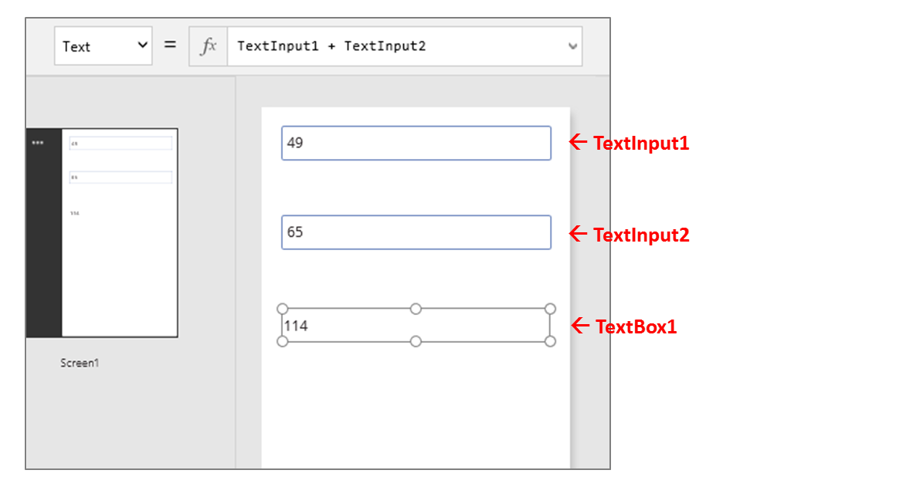
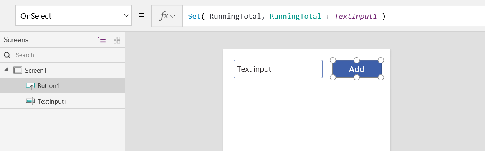
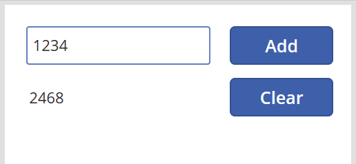
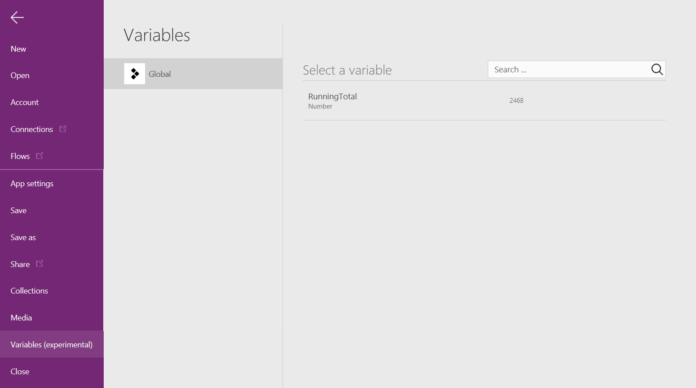
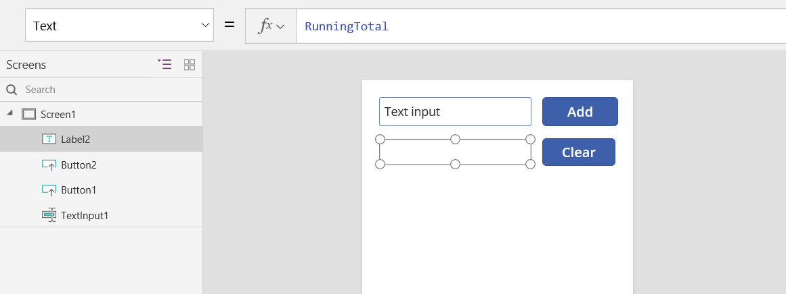
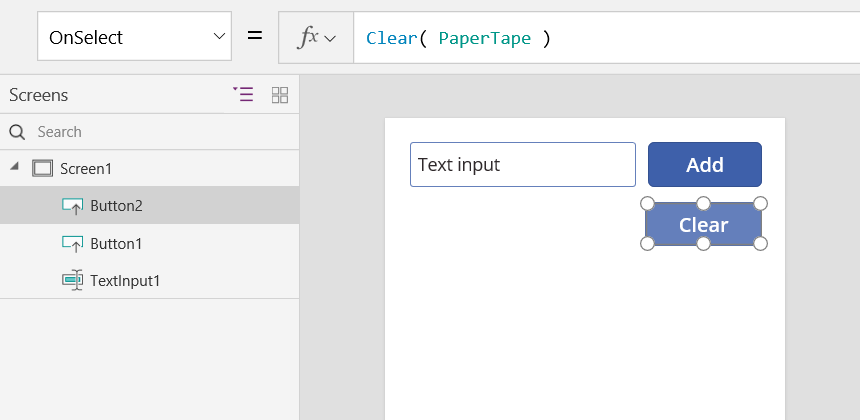
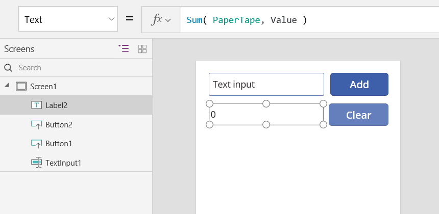

# 了解 Power Apps 中的画布应用变量

如果使用了其他编程工具，如 Visual Basic 或 JavaScript，则可能会询问：**变量在何处？** Power Apps 略有不同，需要不同的方法。 构建画布应用程序时，请询问自己：**我将在 Excel 中执行哪些操作？**

在其他工具中，你可能会显式执行某个计算，然后将结果存储在变量中。 但是，当输入数据发生更改时，Power Apps 和 Excel 都将自动重新计算公式，因此你通常不需要创建和更新变量。 尽可能使用这种方法，你就可以更轻松地创建、了解和维护应用。

在某些情况下，需要使用 Power Apps 中的变量，这些变量通过添加[行为公式](working-with-formulas-in-depth.md)来扩展 Excel 的模型。 这些公式在特定情况下（例如，用户选择某个按钮）运行。 在行为公式中，设置一个可在其他公式中使用的变量通常很有用。

一般情况下，应避免使用变量。 但有时候，只有使用变量才能获得所需的体验。 当变量出现在设置其值的函数中时，它们将被隐式创建和键入。 

## 将 Excel 转换为 Power Apps

### Excel

让我们回顾一下 Excel 的工作原理。 单元格可以包含值（例如数字或字符串），也可以包含公式（基于其他单元格的值）。 用户向单元格输入其他值以后，Excel 会自动根据新的值重新计算任何公式。 不需编程即可启用此行为。

在下面的示例中，单元格**A3**设置为公式**A1 + A2**。 如果**A1**或**A2**更改，则**A3**会自动重新计算以反映所做的更改。 此行为不需要在公式本身之外进行编码。

Excel 没有变量。 包含公式的单元格的值随输入而更改，但无法记住公式的结果，也无法将结果存储在单元格或任何其他地方。 如果更改某个单元格的值，则整个电子表格都会更改，以前计算出来的值就会丢失。 Excel 用户可以复制和粘贴单元格，但那是在用户的手动控制之下完成的，不可能通过公式来完成。

### PowerApps

在 Power Apps 中创建的应用的行为与 Excel 非常类似。 可以将控件添加到屏幕的任意位置，并根据其在公式中的用途为其命名，不需更新单元格。

例如，可以通过添加 **[标签](controls/control-text-box.md)** 控件（名为**Label1**）和两个 **[文本输入](controls/control-text-input.md)** 控件（名为**TextInput1**和**TextInput2**），在应用中复制 Excel 行为。 如果随后将**Label1**的 **[Text](controls/properties-core.md)** 属性设置为**TextInput1 + TextInput2**，则它将始终显示**TextInput1**和**TextInput2**中的任何数字的总和。

请注意，选择了**Label1**控件，并在屏幕顶部的编辑栏中显示其 **[文本](controls/properties-core.md)** 公式。 在这里，我们可以找到公式 **TextInput1 + TextInput2**。 该公式在这些控件之间创建了一个依赖关系，就像在 Excel 工作簿中的单元格之间创建依赖关系一样。  让我们更改**TextInput1**的值：

用于**Label1**的公式已自动重新计算，并显示新值。

在 Power Apps 中，你可以使用公式来确定控件的主值，还可以确定属性（如格式设置）。 在下一示例中，标签的“[Color](controls/properties-color-border.md)”属性的公式会自动将负值显示为红色。 **[If](functions/function-if.md)** 函数看起来应该与 Excel 中的很相似：

`If( Value(Label1.Text) < 0, Red, Black )`

很多情况下都可以使用公式：

* 启用设备的 GPS 后，地图控件就可以使用公式通过 **Location.Latitude** 和 **Location.Longitude** 来显示当前位置。  移动时，地图会自动跟踪你的位置。
* 其他用户可能会更新[数据源](working-with-data-sources.md)。  例如，团队中的其他人可能会更新 SharePoint 列表中的项。  刷新数据源时，相关公式会根据更新的数据自动重新计算。 就此示例来说，你可以进一步将库的 **[Items](controls/properties-core.md)** 属性设置为公式 **Filter( SharePointList )** ，以便自动显示新筛选的[记录](working-with-tables.md#records)集。

### 权益

使用公式生成应用具有很多优点：

* 如果你知道 Excel，则会知道 Power Apps。 二者的模型和公式语言是相同的。
* 如果你使用过其他编程工具，可以试想一下，完成这些示例需要多少代码。  在 Visual Basic 中，需要为每个文本输入控件上发生的更改事件编写事件处理程序。  在每个这样的处理程序中，用于执行计算的代码很冗长，并且可能会出现不同步的情况，或者需要你编写通用子例程。  在 Power Apps 中，你已使用单行公式完成了所有操作。
* 若要理解**Label1**的文本来自何处，你确切知道在何处查找： **[text](controls/properties-core.md)** 属性中的公式。  其他方式不会影响该控件的文本。  在传统编程工具中，可以从程序的任何位置通过任何事件处理程序或子例程更改该标签的值。  这就难以跟踪变量的更改时间和位置。
* 如果用户更改了滑块控件，然后又改变了主意，则可将滑块改回其原始值。  这样一来，就好像没有做过任何更改一样：应用所显示的控件值与以前显示的一样。  不需进行分支试验并询问假设性的问题，就像在 Excel 中一样。  

如果可以使用公式达到某种效果，则通常会选择使用公式。 让 Power Apps 中的公式引擎适合你。  

## 了解何时使用变量

让我们将简单的加法器更改一下，使之操作起来就像一台老式的带汇总功能的加法机。 如果选择“加”按钮，则会将一个数字加到汇总中。 如果选择“清除”按钮，则会将汇总重置为零。

| 显示 | 说明 |
|----|----|
| 带有文本输入控件、标签和两个按钮的  | 当应用程序启动时，运行总计为0。  红点在文本输入框中表示用户的手指，其中用户输入**77**。 |
|  | 用户选择 "**添加**" 按钮。 |
|  | 将77添加到运行总计。  用户再次选择 "**添加**" 按钮。 |
|  | 77再次添加到运行总计，结果为154。  用户选择 "**清除**" 按钮。 |
|  | 运行总计将重置为0。 |

我们的加法机使用了某个 Excel 中不存在的东西：按钮。 在该应用中，不能仅使用公式来计算汇总，因为其值取决于用户采取的一系列操作。 必须手动记录和更新汇总。 大多数编程工具将该信息存储在“变量”中。

有时候，需要使用变量才能让应用的表现符合预期。  但该方法需注意以下事项：

* 必须手动更新汇总。 自动重新计算在此方面不会为你代劳。
* 不能再根据其他控件的值计算汇总。 汇总结果取决于用户选择“加”按钮的次数，以及每次操作时文本输入控件中的具体值。 在执行加法计算时，到底是用户输入了 77 并选择“加”两次，还是用户指定了 24 和 130？ 你只知道总和为 154，但无法分辨上述两种过程。
* 可以通过不同的方式来改变总和。 在此示例中，“加”按钮和“清除”按钮都可以更新总和。 如果应用表现异常，则到底是哪个按钮引发的问题？

## 使用全局变量

创建加法机需要一个变量来存储汇总。 在 Power Apps 中使用的最简单的变量是*全局变量*。  

全局变量的工作方式：

* 使用 [Set](functions/function-set.md) 函数设置全局变量的值。  Set( MyVar, 1 ) 可将全局变量 MyVar 的值设置为 1。
* 可以通过引用 Set函数使用的名称来使用全局变量。  在这种情况下， MyVar将返回 1。
* 全局变量可以存储包括字符串、数字、记录和[表](working-with-tables.md)在内的任何值。

让我们使用全局变量重新生成加法机：

1. 添加一个文本输入控件，将其命名为 **TextInput1**，同时添加两个按钮，分别命名为 **Button1** 和 **Button2**。

2. 将 **Button1** 的 **[Text](controls/properties-core.md)** 属性设置为“加”，将 **Button2** 的“Text”属性设置为“清除”。

3. 若要在用户选择“加”按钮时更新汇总，请将 **[OnSelect](controls/properties-core.md)** 属性设置为以下公式：

    **Set （RunningTotal，RunningTotal + TextInput1）**

    此公式的现有存在将**RunningTotal**作为全局变量建立，因为它是 **+** 运算符。 可以在应用中的任何位置引用**RunningTotal** 。 每当用户打开此应用时， **RunningTotal**的初始值为*空白*。

    用户首次选择 "**添加**" 按钮并 **[设置](functions/function-set.md)** "运行" 时， **RunningTotal**设置为值**RunningTotal + TextInput1**。

    

4. 若要在用户选择“清除”按钮时将汇总设置为 **0**，请将 **[OnSelect](controls/properties-core.md)** 属性设置为以下公式：

    Set( RunningTotal, 0 )

    

5. 添加一个“[标签](controls/control-text-box.md)”控件，然后将“[Text](controls/properties-core.md)”属性设置为“RunningTotal”。

    此公式将自动重新计算，为用户显示的 **RunningTotal** 值随用户选择的按钮而变化。

    

6. 预览该应用，我们创建的加法机完全符合上述说明。 在文本框中输入数字，然后按几次“添加”按钮。 准备就绪时，使用 Esc 键返回到创作体验。

    

7. 若要显示全局变量的值，请选择 "**文件**" 菜单，然后在左侧窗格中选择 "**变量**"。

    

8. 若要显示定义并使用变量的所有位置，请选择它。

    

## 变量类型

Power Apps 具有三种类型的变量：

| 变量类型 | 范围 | 说明 | 建立的函数 |
| --- | --- | --- | --- |
| 全局变量 |应用 |用法最为简单。 包含可从应用程序的任何位置进行引用的数字、文本字符串、布尔值、记录、表等。 |[Set](functions/function-set.md) |
| 上下文变量 |屏幕 |非常适合将值传递到屏幕，与其他语言中的过程的参数非常类似。 只能从一个屏幕中引用。 |[UpdateContext](functions/function-updatecontext.md) [Navigate](functions/function-navigate.md) |
| 集合 |应用 |包含可从应用程序中的任何位置引用的表。 允许修改表的内容，而不是作为一个整体进行设置。 可以保存到本地设备，以供将来使用。 |[Collect](functions/function-clear-collect-clearcollect.md) [ClearCollect](functions/function-clear-collect-clearcollect.md) |

## 创建和删除变量

在**Set**、 **UpdateContext**、**导航**、**收集**或**ClearCollect**函数中出现时，将隐式创建所有变量。 若要声明变量及其类型，只需将其包含在应用中任何位置的任何函数中。 这些函数都不会创建变量;它们仅用值填充变量。 永远不会在其他编程工具中显式声明变量，并且所有类型都是隐式的。

例如，可能有一个按钮控件的**OnSelect**公式等于**Set （X，1）** 。 此公式将**X**建立为具有数字类型的变量。 您可以在公式中使用**X**作为数字，并且在您打开应用之后但在选择按钮之前，该变量的值为*空*。 选择该按钮时，会将**X**值指定为**1**。

如果添加了另一个按钮，并将其**OnSelect**属性设置为 **（X，"Hello"）** ，则会发生错误，因为类型（文本字符串）与上一**组**（number）中的类型不匹配。 变量的所有隐式定义必须在类型上达成一致。 同样，出现这种情况的原因在于，您在公式中提到了**X** ，而不是这些公式中的任何一种确实运行过。

通过删除隐式建立变量的所有**Set**、 **UpdateContext**、**导航**、**收集**或**ClearCollect**函数，可以删除变量。 如果没有这些函数，则该变量不存在。 还必须删除对变量的任何引用，因为它们会导致错误。

## 变量生存期和初始值

应用运行时，所有变量都保存在内存中。 应用关闭后，所保留的值将丢失。

您可以使用**Patch**或**Collect**函数将变量的内容存储在数据源中。 还可以通过使用[**SaveData**](functions/function-savedata-loaddata.md)函数，将值存储在本地设备上的集合中。

当用户打开应用时，所有变量的初始值均为*空白*。

## 读取变量

使用变量的名称读取其值。 例如，可以使用以下公式定义变量：

`Set( Radius, 12 )`

然后，只需在可使用数字的任意位置使用**Radius** ，就会将其替换为**12**：

`Pi() * Power( Radius, 2 )`

如果为上下文变量指定的名称与全局变量或集合的名称相同，则上下文变量优先。 但是，如果使用[消除歧义运算符](functions/operators.md#disambiguation-operator) **[@Radius]** ，则仍可引用全局变量或集合。

## 使用上下文变量

我们来看看如何使用上下文变量而不是全局变量创建加法机。

上下文变量的工作原理：

* 使用 **[UpdateContext](functions/function-updatecontext.md)** 或 **[定位](functions/function-navigate.md)** 函数隐式创建和设置上下文变量。 当应用启动时，所有上下文变量的初始值均为*空白*。
* 您可以用记录更新上下文变量。 在其他编程工具中，通常使用“=”来赋值，例如“x = 1”。 对于上下文变量，请使用 **{x：1}** 。 使用上下文变量时，请在不使用 record 语法的情况下直接使用其名称。
* 您还可以在使用 " **[定位](functions/function-navigate.md)** 函数" 显示屏幕时设置上下文变量。 如果您将屏幕视为一种过程或子例程，此方法类似于在其他编程工具中传递参数。
* 上下文变量的作用范围仅限于单个屏幕的上下文（ **[Navigate](functions/function-navigate.md)** 除外），这也是其得名的原因。 不能超出相应的上下文使用或设置上下文变量。
* 上下文变量可以存储包括字符串、数字、记录和[表](working-with-tables.md)在内的任何值。

让我们使用一个上下文变量重新生成加法机：

1. 添加一个文本输入控件，将其命名为 **TextInput1**，同时添加两个按钮，分别命名为 **Button1** 和 **Button2**。

2. 将 **Button1** 的 **[Text](controls/properties-core.md)** 属性设置为“加”，将 **Button2** 的“Text”属性设置为“清除”。

3. 若要在用户选择“加”按钮时更新汇总，请将 **[OnSelect](controls/properties-core.md)** 属性设置为以下公式：

    **UpdateContext （{RunningTotal：RunningTotal + TextInput1}）**

    此公式的现有存在将**RunningTotal**作为上下文变量建立，因为存在 **+** 运算符。 可以在此屏幕的任何位置引用**RunningTotal** 。 每当用户打开此应用时， **RunningTotal**的初始值为*空白*。

    用户首次选择 "**添加**" 按钮和 " **[UpdateContext](functions/function-updatecontext.md)** " 时， **RunningTotal**将设置为值 " **RunningTotal + TextInput1**"。

    

4. 若要在用户选择“清除”按钮时将汇总设置为 **0**，请将 **[OnSelect](controls/properties-core.md)** 属性设置为以下公式：

    **UpdateContext （{RunningTotal：0}）**

    同样， **[UpdateContext](functions/function-updatecontext.md)** 与公式一起使用 **UpdateContext （{RunningTotal：0}）** 。

    

5. 添加一个“[标签](controls/control-text-box.md)”控件，然后将“[Text](controls/properties-core.md)”属性设置为“RunningTotal”。

    此公式将自动重新计算，为用户显示的 **RunningTotal** 值随用户选择的按钮而变化。

    

6. 预览该应用，我们创建的加法机完全符合上述说明。 在文本框中输入数字，然后按几次“添加”按钮。 准备就绪时，使用 Esc 键返回到创作体验。

    

7. 导航到屏幕时，可以设置上下文变量的值。 这对于将“上下文”或“参数”从一个屏幕传递到另一个屏幕很有用。 若要演示此方法，请插入一个屏幕，插入一个按钮，然后将其**OnSelect**属性设置为以下公式：

    Navigate( Screen1, None, { RunningTotal: -1000 } )

    

    按住 Alt 键的同时选择此按钮可显示**Screen1** ，并将上下文变量**RunningTotal**设置为-1000。

    

8. 若要显示上下文变量的值，请选择 "**文件**" 菜单，然后在左侧窗格中选择 "**变量**"。

    

9. 若要显示定义和使用上下文变量的位置，请选择它。

    

## 使用集合

最后，我们来看一下如何使用集合创建加法机。  由于集合包含一个易于修改的表，我们将使此加法机保留每个值输入时的“纸带”。

集合工作原理：

* 通过 **[ClearCollect](functions/function-clear-collect-clearcollect.md)** 函数创建和设置集合。  可以改用 **[Collect](functions/function-clear-collect-clearcollect.md)** 函数，但该函数实际上需要另一个变量，而不能替换旧的变量。  
* 集合是一种类型的数据源，因此也是表。 若要访问集合中的单个值，请使用 **[First](functions/function-first-last.md)** 函数，并从生成的记录中提取一个字段。 如果使用了单个值和 **[ClearCollect](functions/function-clear-collect-clearcollect.md)** ，则该字段为“Value”字段，如以下示例所示： 
**First （** *VariableName* **）。值**

让我们使用集合重新创建加法机：

1. 添加一个 **[文本输入](controls/control-text-input.md)** 控件，将其命名为 **TextInput1**，同时添加两个按钮，分别命名为 **Button1** 和 **Button2**。

2. 将 **Button1** 的 **[Text](controls/properties-core.md)** 属性设置为“加”，将 **Button2** 的“Text”属性设置为“清除”。

3. 若要在用户选择“加”按钮时更新汇总，请将 **[OnSelect](controls/properties-core.md)** 属性设置为以下公式：

    Collect( PaperTape, TextInput1.Text )

    此公式的唯一存在方式将**PaperTape**建立为包含单列表文本字符串的集合。 可以在此应用的任何位置引用**PaperTape** 。 用户打开此应用时， **PaperTape**为空表。

    此公式运行时，会将新值添加到集合的末尾。 由于我们要添加单个值，因此会将其自动放置在一个单列表**中，列**的名称是**值**，稍后将用到它。

    

4. 若要在用户选择 "**清除**" 按钮时清除纸张磁带，请将其 **[OnSelect](controls/properties-core.md)** 属性设置为以下公式：

    Clear( PaperTape )

    

5. 若要显示汇总，请添加一个标签，然后将“[Text](controls/properties-core.md)”属性设置为以下公式：

    Sum( PaperTape, Value )

    

6. 若要运行加法机，请按 F5 打开“预览”，在文本输入控件中输入数字，然后选择相应的按钮。

    

7. 若要返回到默认工作区，请按 Esc 键。

8. 要显示纸带，请插入“数据表”控件，并将其 [Items](controls/properties-core.md) 属性设置为此公式：

    PaperTape

    在右侧窗格中，选择 "**值**" 列进行显示。

    

9. 若要查看集合中的值，请在“文件”菜单上选择“集合”。

    

10. 若要存储和检索集合，请添加另外两个按钮控件，并将其**文本**属性设置为**Load** and **Save**。 将 "**加载**" 按钮的 " **OnSelect** " 属性设置为以下公式：

     Clear( PaperTape ); LoadData( PaperTape, "StoredPaperTape", true )

     需要首先清除集合，因为**LoadData**会将存储的值追加到集合的末尾。

     

11. 将 "**保存**" 按钮的 " **OnSelect** " 属性设置为以下公式：

     SaveData( PaperTape, "StoredPaperTape" )

     

12. 按 F5 键再次预览，在文本输入控件中输入数字，然后选择按钮。 选择“保存”按钮。 关闭并重新加载应用，然后选择 "**加载**" 按钮以重新加载集合。

> [!NOTE]
> Power apps Mobile 中的**SaveData**和**LoadData**函数，但不支持 power apps Studio 或 Web player for power apps。