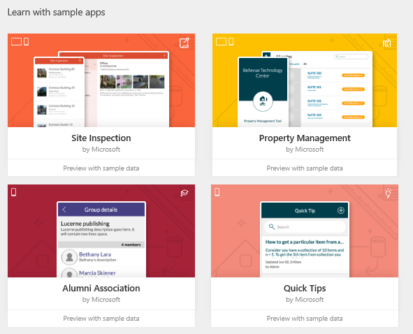
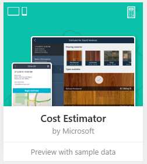
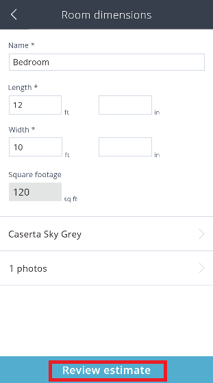
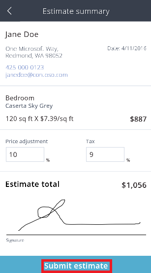
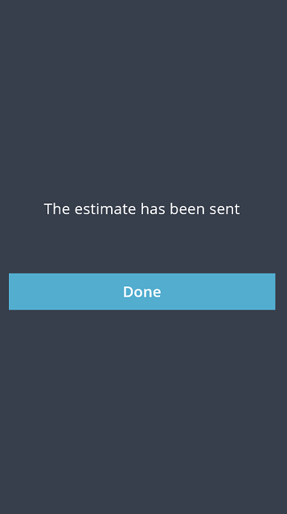
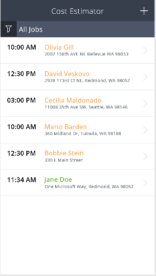

# 使用示例应用
在 [powerapps.com](http://web.powerapps.com) 中，使用示例应用探究设计的可能性，并发现在开发自己的应用时可以应用的概念。 每个示例应用均使用虚拟数据展示实际场景。

例如，在“**成本估算器**”中，可以创建一个约会，用于估算在一个特定大小的室内安装地板产品的成本。 捕获地址和使用面积等详细信息，并基于折扣和税率计算价格。 筛选约会列表可显示已为其创建估算值的约会、尚未为其创建估算值的约会或所有约会。

## 打开应用
1. 登录到 [powerapps.com](https://web.powerapps.com)，然后在示例应用列表中单击或点击“**成本估算器**”。

    
2. 单击或点击“打开手机版”显示手机上的应用，然后单击或点击“允许”，以同意使用设备上的照相机。

    应用包含用于创建约会和估算在一个特定大小的室内安装指定地板产品的成本的示例数据。

    

## 创建并查看约会
1. 单击或点击“**+**估算约会。

    
2. 提供详细信息，然后单击或点击“**保存作业**”。

    

    创建的约会即会出现在约会列表中。

    
3. 单击或点击某个约会（例如创建的一个约会），查看其详细信息，包括位置地图。 若要删除约会，可以单击或点击右上角的回收站图标。

    

## 创建估算值
1. 在约会的详细信息页上，单击或点击“**开始估算**。

    
2. 提供有关房间的必要信息，例如房间的**名称**、**长度**和**宽度**，然后单击或点击“**选择地板样式**”。

    

    地板产品的类别列表即会出现。

    
3. 单击或点击“**地毯**”，然后单击或点击“**卡塞塔天空灰**”。

    
4. 如果你在带有摄像头的设备上使用应用，请单击或点击“**添加照片**”。

    
5. 拍摄一张或多张照片，然后单击或点击“**完成**”。

    

## 完成并提交一个估算值
1. 单击或点击“**查看估算值**”。

    
2. （可选）指定**价格调整**和**税**率。
3. 添加一个签名，然后单击或点击“**提交估算值**”。

    

    如果允许浏览器设置，默认邮件客户端将会打开一条包含估算信息的消息。

    

    在 PowerApps 中，屏幕指示已发送估算值。

    
4. 单击或点击“**完成**”，返回到约会列表。

    刚刚完成的估算约会显示为绿色，这表明已将其关闭。

    
5. （可选）单击或点击左上角的筛选图标，然后按状态（打开或关闭）筛选列表或显示所有约会。
